# VSD Hardware Design Program

## Introduction to Verilog RTL design and Synthesis

## 📚 Contents
- [Introduction to RTL Design and Simulation](#day-1--introduction-to-verilog-rtl-design-and-synthesis)
- [iverilog-Based Simulation Flow](#iverilog-based-simulation-flow)  
- [Yosys-Synthesis Flow](#yosys-synthesis-flow-for-good_mux)

### Simulator
RTL design is validated by simulating its behavior to ensure it adheres to the specifications.

The simulator used for this course is Icarus Verilog (iverilog).

### Design
The design consists of Verilog code implementing the intended hardware logic.

It should meet functional specifications and can be composed of one or more Verilog modules.

### Testbench
A testbench is used to apply test vectors (stimuli) to the design.

It mimics input signals and observes the response to verify design correctness.

<strong>Note:</strong> The testbench does not have primary inputs or outputs.

### How the Simulator Works
The simulator continuously checks for changes in input signals.

If there is a change, it evaluates the corresponding output.

If no change occurs in inputs → no change in outputs.

The simulator focuses solely on detecting and reacting to signal changes.

### `iverilog-Based Simulation Flow`

The iverilog-based simulation flow begins with writing the Design (RTL Verilog module) and a corresponding Testbench that applies input vectors to the design and observes the outputs. Both files are compiled using the iverilog tool to generate a simulation executable. When this executable is run, it produces a Value Change Dump (VCD) file that records signal transitions over time. This VCD file is then viewed using gtkwave, a waveform viewer that allows designers to analyze and debug signal behavior visually, ensuring the design meets the expected functionality.

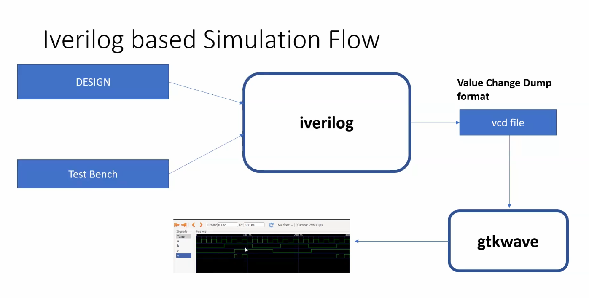

### `Process`

**Step 1**: Passing RTL design and corresponding testbench to Iverilog simulator  


**Step 2**: Generating VCD (Value Change Dump) file  
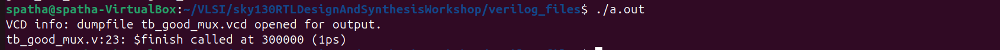

**Step 3**: Visualizing the dumped variables using gtkwave
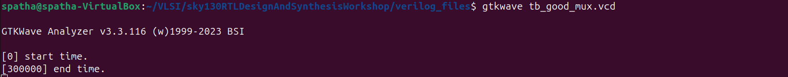

**Step 4**: Viewing the simulation waveform  
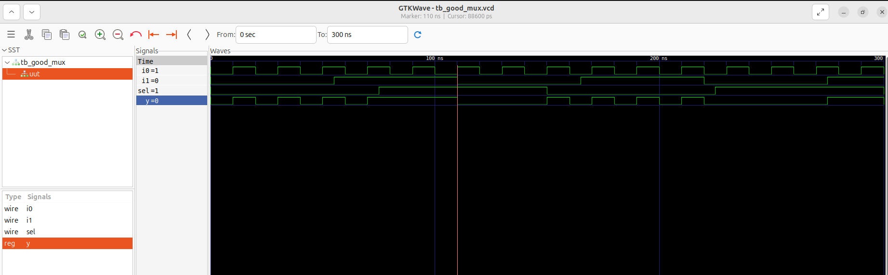


### `File Structure: MUX 2:1 Design and Testbench`

To simulate and verify a 2:1 multiplexer, we use two main Verilog files: the design file and the testbench file.

### Design (`good_mux.v`)
- Implements a 2:1 multiplexer using behavioral Verilog with inputs `i0`, `i1`, `sel` and output `y`.
- Uses an `always @(*)` block with an `if-else` construct to select between `i0` and `i1` based on the value of `sel`.
  
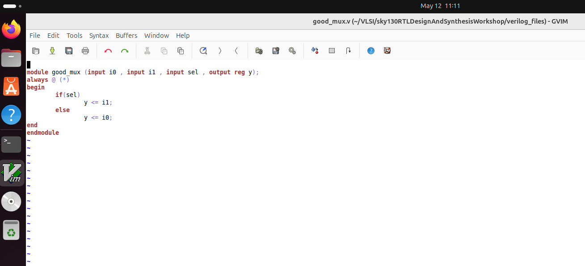

### Testbench (`tb_good_mux.v`)
- Instantiates the `good_mux` module and applies stimulus through internal registers `i0`, `i1`, and `sel`.
- Generates a VCD waveform file using `$dumpfile` and `$dumpvars` for output signal observation via gtkwave.

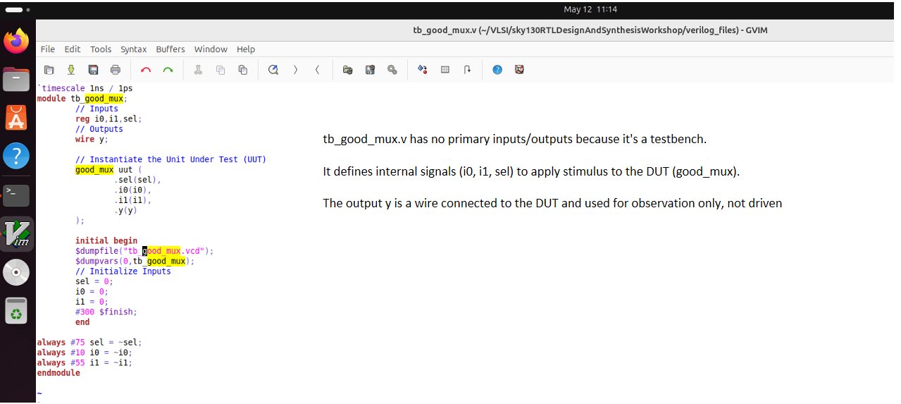


### Yosys Synthesis Flow for `good_mux`

This flow demonstrates how to perform RTL-to-gate-level synthesis using the [Yosys](https://github.com/YosysHQ/yosys) open synthesis suite and the `sky130_fd_sc_hd` standard cell library.


#### Yosys Commands:
## Yosys Synthesis Steps for `good_mux`

Follow the steps below to perform RTL to gate-level synthesis using Yosys and the Sky130 standard cell library.

**Step 0**: Invoke Yosys

```bash
yosys
```

**Step 1**: Read Liberty File - You are reading the Liberty file for the Sky130 standard cells, which is necessary for mapping the synthesized netlist to specific technology cells.

```bash
read_liberty -lib ../lib/sky130_fd_sc_hd__tt_025C_1v80.lib
```

**Step 2**: Read RTL Verilog - You are reading the Verilog file that contains your RTL design. You should see the message "Successfully finished verilog frontend" if the file is read correctly.

```bash
read_verilog good_mux.v
```

**Step 3**: Synthesize the top-level module - You are synthesizing the top-level module, which converts the RTL design into a `technology-independent` netlist.

```bash
synth -top good_mux
```

**Step 4**: Map synthesized RTL to standard cells - You are mapping the synthesized netlist to the standard cells defined in the Liberty file, creating a `technology-dependent` netlist.

```bash
abc -liberty ../lib/sky130_fd_sc_hd__tt_025C_1v80.lib
```

**Step 5**: View synthesized netlist as a schematic - You can view the synthesized netlist as a schematic, which provides a graphical representation of the logic realized by the tool.

```bash
show
```

**Step 6**: Write the synthesized gate-level netlist - You are writing the synthesized gate-level netlist to a Verilog file, excluding attributes to make it simpler and easier to read.

```bash
write_verilog -noattr good_mux_netlist.v
```

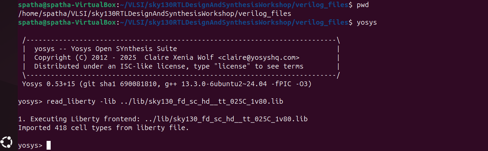
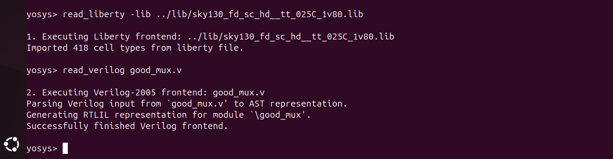
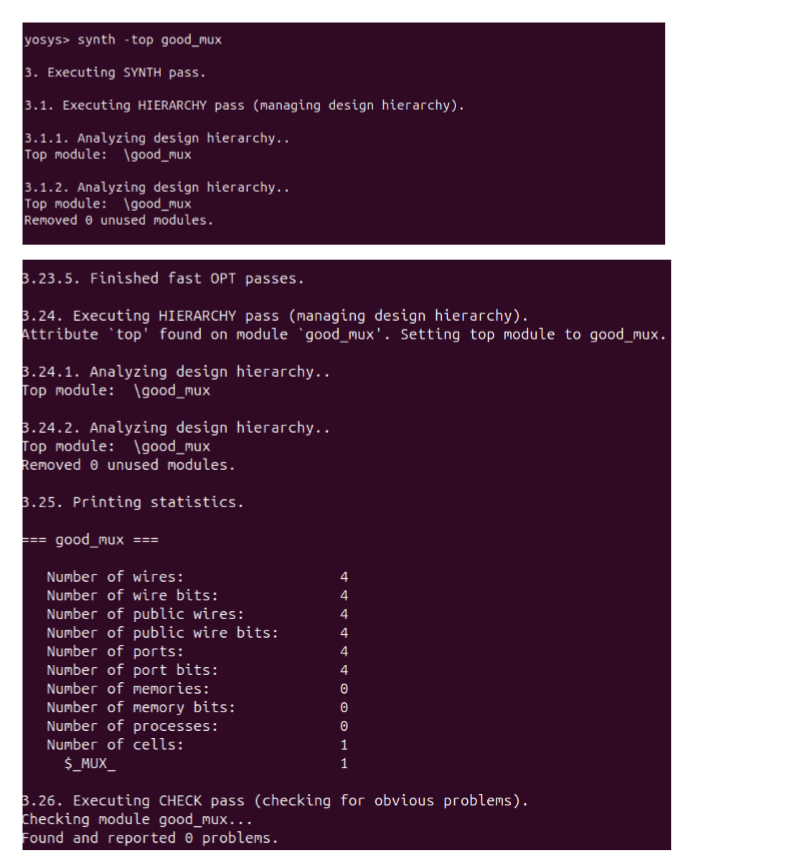
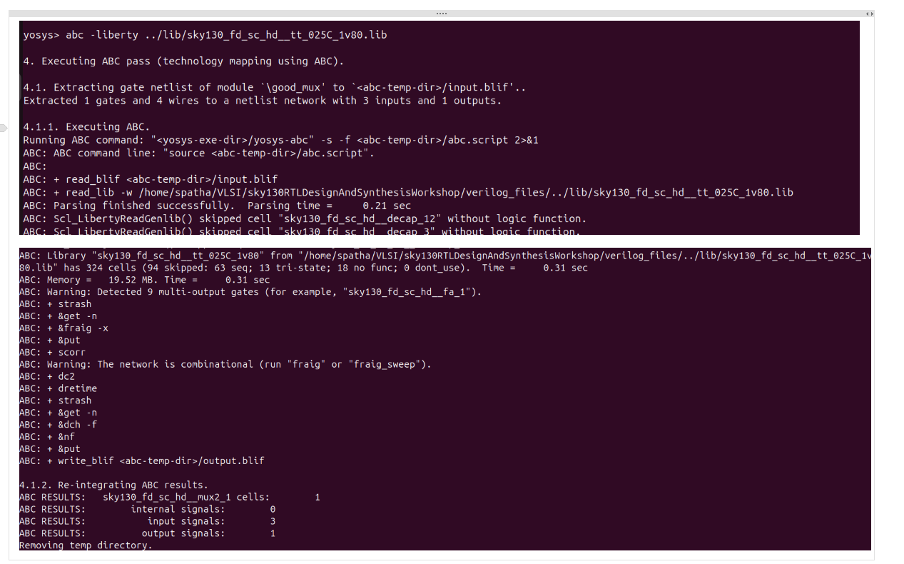
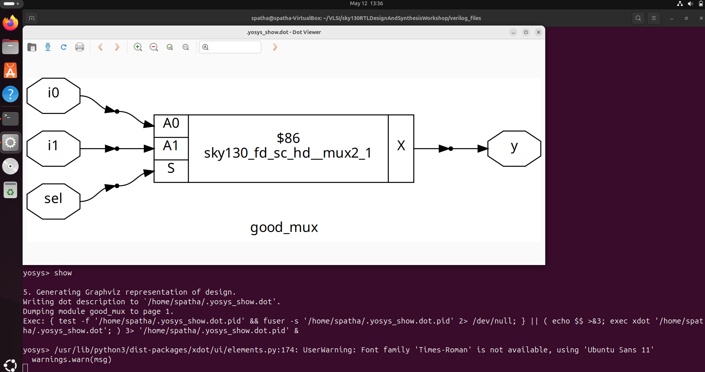
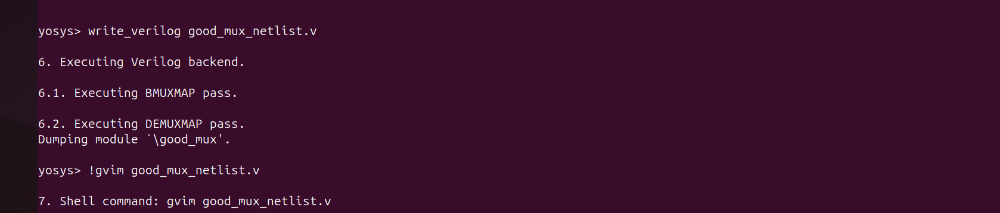
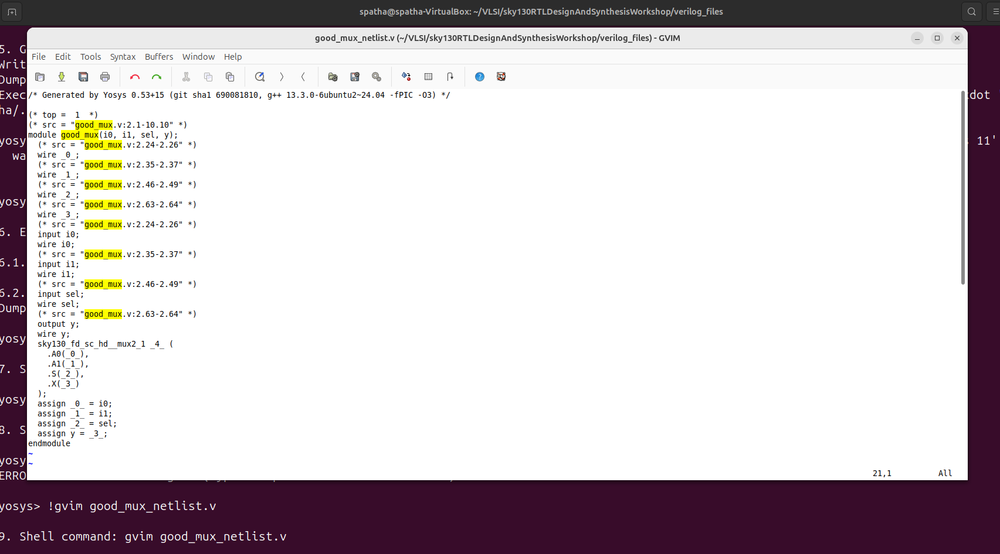
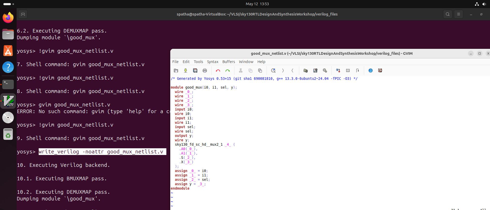


