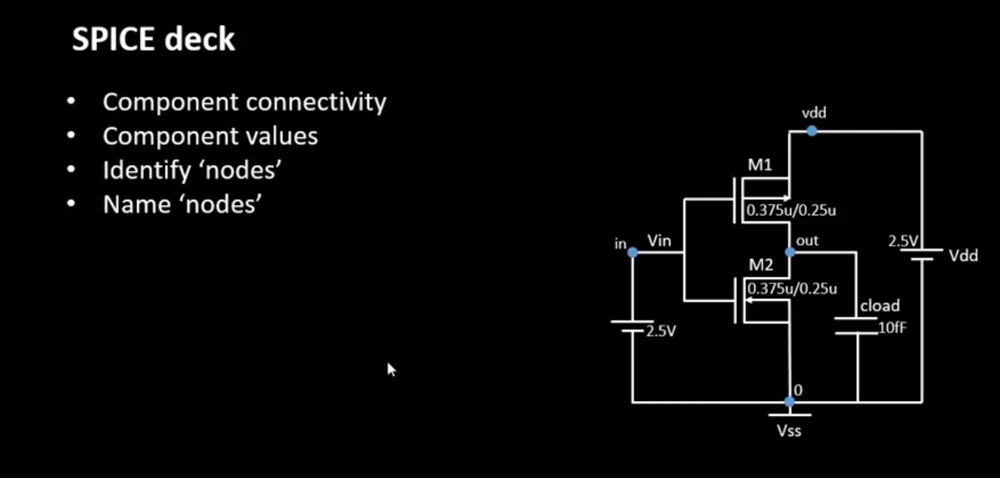
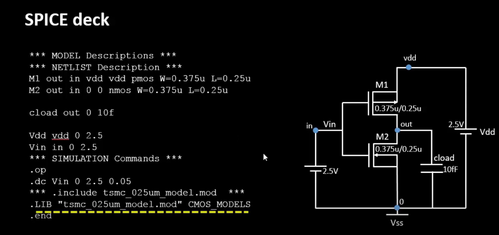

# VSD Hardware Design Program

## CMOS Switching threshold and and dynamic simulations

### 📚 Contents

### Voltage Transfer Characteristics and Spice simulations
------------------------------
#### CMOS Inverter SPICE Deck

This image illustrates how to construct a SPICE deck for a CMOS inverter.

- **Component Connectivity**: Define how PMOS (M1), NMOS (M2), power supply (Vdd), ground (Vss), input (Vin), and output (Vout) are connected.
- **Component Values**: Specify transistor dimensions (W/L), supply voltages (e.g., 2.5V), and load capacitance (Cload = 10fF).
- **Identify Nodes**: Recognize each node in the circuit — such as `in`, `out`, `vdd`, `vss`, and transistor terminals.
- **Name Nodes**: Assign clear names to all nodes for ease of reference during simulation and result interpretation.

This forms the foundation of writing an accurate and functional SPICE netlist for CMOS circuit simulations.

#### CMOS Inverter SPICE Deck Example

This image shows a complete SPICE deck and corresponding CMOS inverter circuit.

**Key Sections of the SPICE Deck:**

1. **Model & Netlist Description:**
    - `M1 out in vdd vdd pmos W=0.375u L=0.25u`: PMOS transistor M1 with width 0.375µm, length 0.25µm. Connected between VDD and output node (`out`), gate connected to input (`in`), bulk tied to VDD.
    - `M2 out in 0 0 nmos W=0.375u L=0.25u`: NMOS transistor M2 with same dimensions, connected between ground and output, gate connected to input, bulk tied to ground.
    - `cload out 0 10f`: Load capacitor (10 fF) connected between output node and ground.

2. **Voltage Sources:**
    - `Vdd vdd 0 2.5`: DC supply voltage of 2.5V between VDD and ground.
    - `Vin in 0 2.5`: DC input voltage, swept during the simulation.

3. **Simulation Commands:**
    - `.op`: Perform operating point analysis (DC bias point).
    - `.dc Vin 0 2.5 0.05`: Perform a DC sweep of `Vin` from 0V to 2.5V in 0.05V steps to generate voltage transfer characteristics (VTC).

4. **Model Inclusion:**
    - `.include tsmc_025um_model.mod`: Include technology model file with parameters for the transistors.
    - `.LIB "tsmc_025um_model.mod" CMOS_MODELS`: Another way to reference the technology model.

5. **End Statement:**
    - `.end`: End of SPICE deck.

