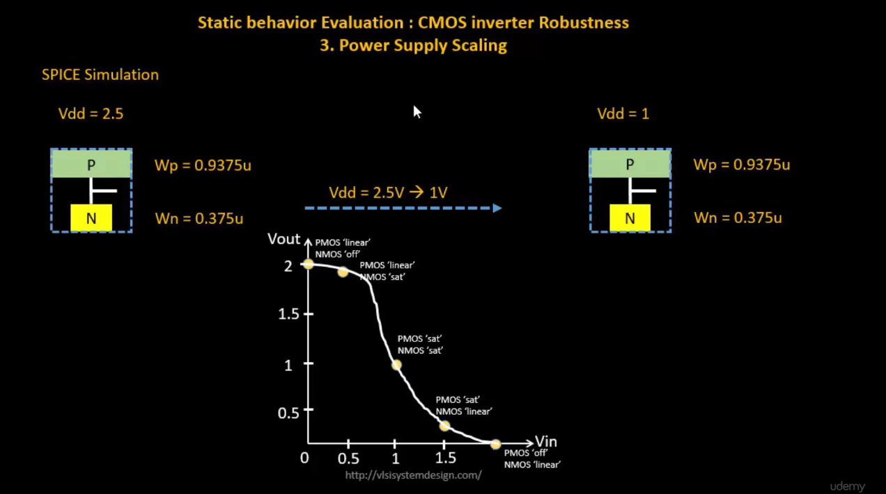
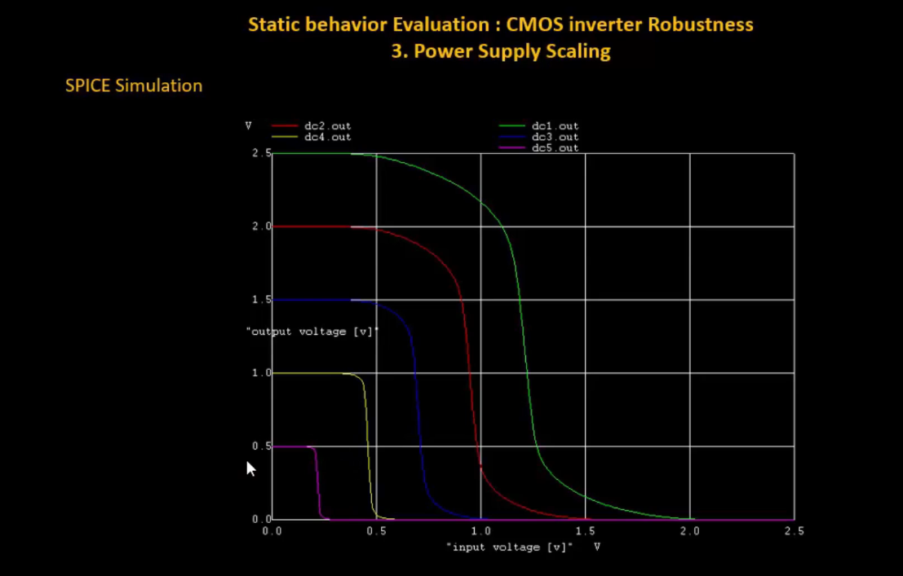

# VSD Hardware Design Program

## CMOS power supply and device variation robustness evaluation

### 📚 Contents

### `Static behaviour evaluation-CMOS inverter robustness-Power supply variation`

**Overview:**

Power supply scaling directly affects the **static behavior** of a CMOS inverter — changing its switching threshold (Vm), noise margins, and overall robustness.

**SPICE Simulation:**

- The CMOS inverter is simulated at two different supply voltages:  
  `Vdd = 2.5V` → scaled down to `Vdd = 1V`
- PMOS and NMOS sizes remain constant:  
  - `Wp = 0.9375 μm`, `Wn = 0.375 μm`

✅ **Switching Threshold (Vm)**:  
As `Vdd` decreases, the inverter's switching threshold **Vm** tends to move toward the center of the supply range — but noise margins shrink.

✅ **Noise Margins**:  
Lower `Vdd` → reduced noise immunity → circuit becomes more sensitive to noise and supply variations.

✅ **Performance Impact**:  
Low `Vdd` operation reduces static and dynamic power — but limits noise robustness.  
High `Vdd` improves noise margin, but increases power dissipation.

While power scaling is essential for low-power design, it introduces trade-offs in noise margin and reliability — requiring careful balancing in circuit design.

This plot illustrates how the **Voltage Transfer Characteristics (VTC)** of a CMOS inverter shift with **different power supply levels (Vdd scaling)** — showing progressive reduction in noise margins as Vdd decreases.

