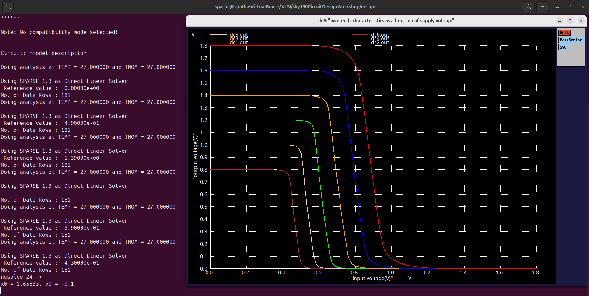

# VSD Hardware Design Program

## CMOS power supply and device variation robustness evaluation

### 📚 Contents

### `Static behaviour evaluation-CMOS inverter robustness-Power supply variation`

**Overview:**

Power supply scaling directly affects the **static behavior** of a CMOS inverter — changing its switching threshold (Vm), noise margins, and overall robustness.

**SPICE Simulation:**

- The CMOS inverter is simulated at two different supply voltages:  
  `Vdd = 2.5V` → scaled down to `Vdd = 1V`
- PMOS and NMOS sizes remain constant:  
  - `Wp = 0.9375 μm`, `Wn = 0.375 μm`


✅ **Switching Threshold (Vm)**:  
As `Vdd` decreases, the inverter's switching threshold **Vm** tends to move toward the center of the supply range — but noise margins shrink.

✅ **Noise Margins**:  
Lower `Vdd` → reduced noise immunity → circuit becomes more sensitive to noise and supply variations.

✅ **Performance Impact**:  
Low `Vdd` operation reduces static and dynamic power — but limits noise robustness.  
High `Vdd` improves noise margin, but increases power dissipation.

While power scaling is essential for low-power design, it introduces trade-offs in noise margin and reliability — requiring careful balancing in circuit design.

This plot illustrates how the **Voltage Transfer Characteristics (VTC)** of a CMOS inverter shift with **different power supply levels (Vdd scaling)** — showing progressive reduction in noise margins as Vdd decreases.


**Advantages of using 0.5V supply:**

Using **lower Vdd (0.5V)** provides benefits like **~50% gain improvement** and **~90% reduction in energy consumption**, demonstrating the efficiency of power supply scaling in CMOS inverters.

**Disadvantage of using 0.5V supply**:

- While lowering Vdd improves gain and energy efficiency, it introduces **performance impact** — circuits may switch slower due to reduced drive strength.

### `Sky130 Supply Variation Labs`

<details> <summary><strong>day5_inv_supplyvariation_Wp1_Wn036.spice</strong></summary>

```
*Model Description
.param temp=27

*Including sky130 library files
.lib "sky130_fd_pr/models/sky130.lib.spice" tt

*Netlist Description

XM1 out in vdd vdd sky130_fd_pr__pfet_01v8 w=1 l=0.15
XM2 out in 0 0 sky130_fd_pr__nfet_01v8 w=0.36 l=0.15

Cload out 0 50fF

Vdd vdd 0 1.8V
Vin in 0 1.8V

.control

let powersupply = 1.8
alter Vdd = powersupply
let voltagesupplyvariation = 0
dowhile voltagesupplyvariation < 6
    dc Vin 0 1.8 0.01
    let powersupply = powersupply - 0.2
    alter Vdd = powersupply
    let voltagesupplyvariation = voltagesupplyvariation + 1
end

plot dc1.out vs in dc2.out vs in dc3.out vs in dc4.out vs in dc5.out vs in dc6.out vs in xlabel "input voltage(V)" ylabel "output voltage(V)" title "Inverter dc characteristics as a function of supply voltage"

.endc

.end
```
</details>

📈**plot the waveforms in ngspice**

```shell
ngspice day5_inv_supplyvariation_Wp1_Wn036.spice
```


🤔**How to Calculate Gain from SPICE VTC Plot??**

To calculate the gain of the CMOS inverter from the Voltage Transfer Characteristics:

1️⃣ **Click on PMOS slope** (left side of transition) — Terminal displays:  
`x0 = Vin`, `y0 = Vout`

2️⃣ **Click on NMOS slope** (right side of transition) — Terminal displays:  
`x1 = Vin`, `y1 = Vout`

3️⃣ **Compute Gain**:

Gain = (y0 − y1) / (x0 − x1)
