# VSD Hardware Design Program

## Inception of open-source EDA, OpenLane and Sky130 PDK

### `How to talk to computers`

### QFN-48 Package Overview

The QFN-48 (Quad Flat No-leads) package is a compact IC package with 48 connection pads, ideal for high-density applications. It offers excellent thermal and electrical performance in a 7mm x 7mm form factor.

#### Features

- **Leadless Design**: Minimizes footprint for high-density PCB layouts.
- **48 Pads**: Provides extensive connectivity options.
- **Compact Size**: 7mm x 7mm dimensions.
- **Thermal Efficiency**: Facilitates effective heat dissipation.
- **Electrical Performance**: Ensures low inductance and resistance.

#### Applications

- Microcontrollers
- Wireless devices
- Power management
- Sensor interfaces
- Data converters

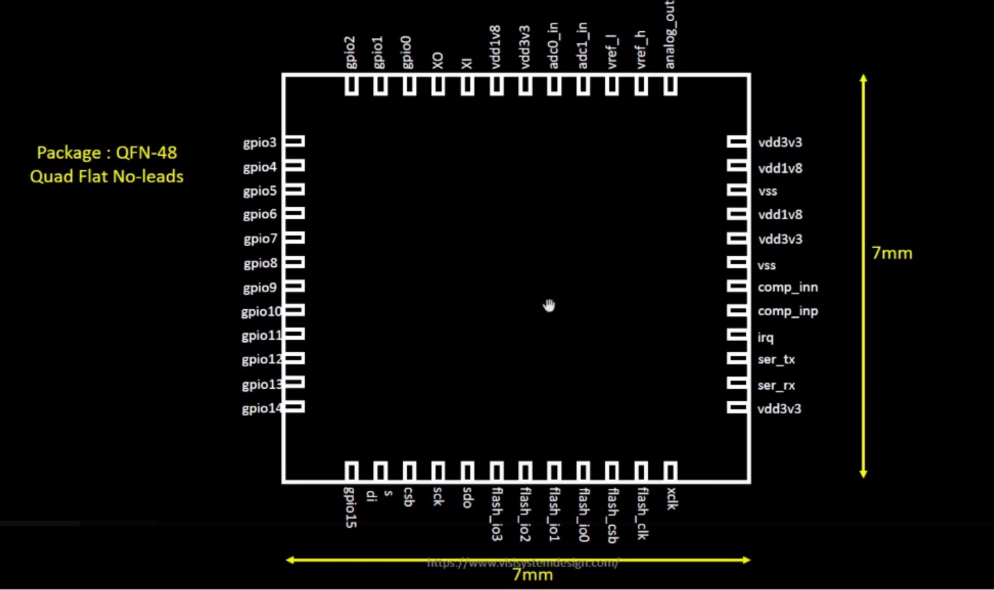

### Chip Overview

The chip is an integrated circuit (IC) that houses various functional blocks such as memory, processing units, and I/O interfaces within a silicon substrate. It is designed for specific applications in electronics, providing essential functionalities in a compact form.

#### Key Components

- **Memory**: Stores data and instructions for processing tasks.
- **Processing Units**: Execute computations and control operations.
- **I/O Interfaces**: Facilitate communication with external devices.

#### Applications

Chips are used in a wide range of electronic devices, including:

- Computers and smartphones
- Embedded systems
- IoT devices
- Automotive electronics
- Consumer electronics

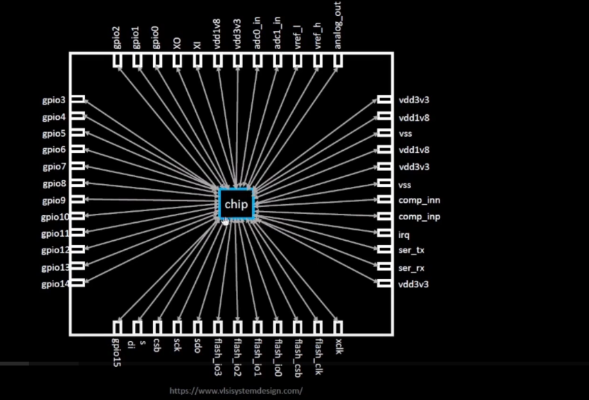

### Chip Components Overview

**Pads**

Pads are small metallic areas on a chip or package that serve as connection points between the internal circuitry and external connections. They enable the transfer of signals to and from the integrated circuit (IC), facilitating communication with other components and systems.

**Core**

The core is the central part of a chip, containing the main processing unit and functional logic. It is often optimized for power efficiency and performance, executing the primary tasks and operations required by the chip's application.

**Die**

The die is the section of a silicon wafer that contains an individual IC before it is packaged. It houses all active circuits and elements necessary for the chip's functions, serving as the foundational structure for the IC's capabilities.

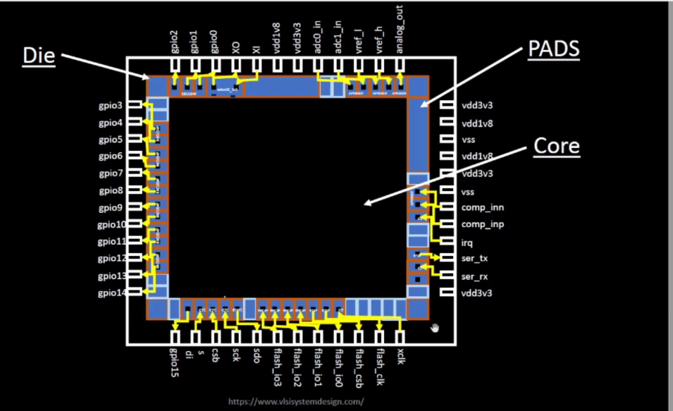

### Foundry IPs Overview

Foundry IPs (Intellectual Properties) are pre-designed and verified circuit blocks provided by semiconductor foundries. These IPs are essential components in the design and manufacturing of integrated circuits (ICs), offering standardized functionalities that can be integrated into custom chip designs.

#### Key Features

- **Pre-verified Designs**: Foundry IPs come with pre-verified designs, reducing development time and ensuring reliability.
- **Standardized Functionality**: They provide standardized functionalities such as analog-to-digital converters (ADC), digital-to-analog converters (DAC), memory blocks, and interface protocols.
- **Customization**: Foundry IPs can be customized to meet specific design requirements, allowing for flexibility in chip design.
- **Cost Efficiency**: Utilizing foundry IPs can significantly reduce development costs by leveraging existing designs and expertise.

#### Applications

Foundry IPs are used in various applications, including:

- System-on-Chip (SoC) designs
- Microcontrollers and processors
- Communication interfaces
- Memory management
- Power management

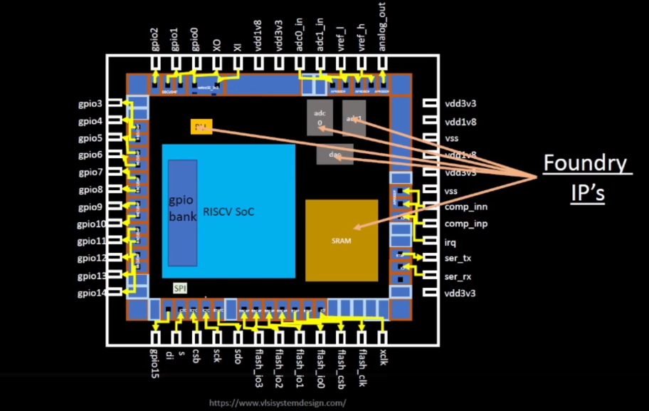

### Macros Overview

Macros are pre-designed functional blocks within an integrated circuit (IC) that perform specific tasks. They are typically larger than standard cells and can include complex functionalities such as memory blocks, processors, or interface controllers. Macros are essential for building complex systems-on-chip (SoCs) efficiently.

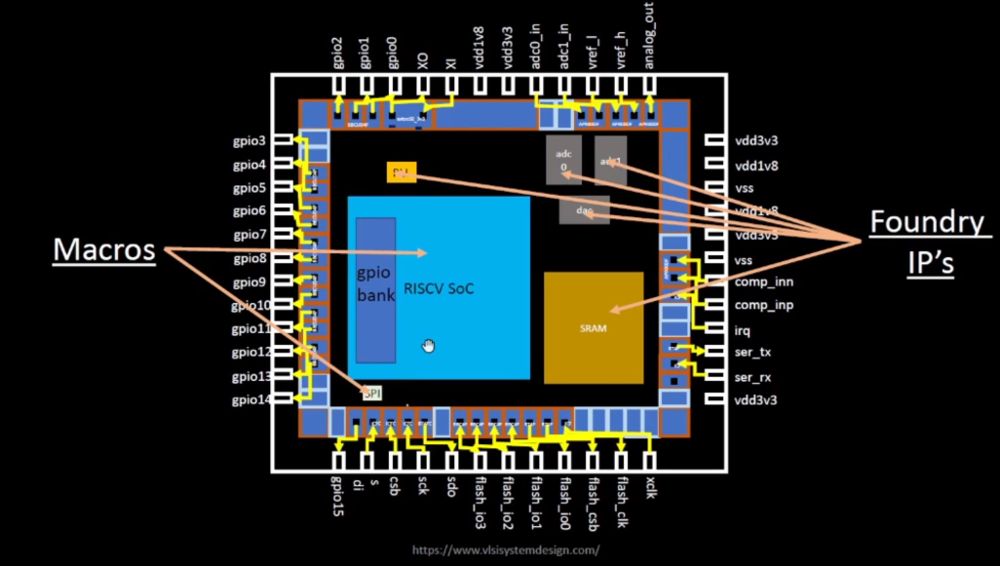

### 📌 Differences Between Macros and Foundry IPs

| **Feature**           | **Macros**                                                                                         | **Foundry IPs**                                                                                        |
| --------------------- | -------------------------------------------------------------------------------------------------- | ------------------------------------------------------------------------------------------------------ |
| **Definition**        | Pre-implemented functional blocks (e.g., memory, PLL, SerDes) integrated into larger ASICs or SoCs | Silicon-proven, pre-characterized Intellectual Property blocks delivered by the foundry                |
| **Source**            | Designed in-house or by third-party IP vendors                                                     | Developed, validated, and licensed directly by semiconductor foundries (e.g., TSMC, GF)                |
| **Complexity**        | Medium to high complexity (e.g., SRAM, FIFO, custom logic)                                         | Can range from basic I/O cells to complex analog/digital subsystems (e.g., USB, DDR PHY)               |
| **Customization**     | Can be modified or parameterized by SoC integrators to meet PPA or functional goals                | Limited customization; parameters like voltage range, process corner, or bit-width may be configurable |
| **Integration Scope** | Typically integrated at the block or subsystem level                                               | Integrated at the device level, often as black-box models with GDSII and Liberty views                 |
| **Verification**      | Requires integration-level validation, DRC/LVS, STA within SoC context                             | Pre-verified for DRC, LVS, timing, and reliability at the foundry across multiple PVT corners          |
| **Purpose**           | Optimized for specific design goals like low power, high speed, or area efficiency                 | Intended to accelerate time-to-market by using validated and reusable components                       |

Macros and Foundry IPs both play crucial roles in IC design, offering standardized functionalities that streamline the development process and enhance performance.

### From Software Applications to Hardware Flow

Running an application on hardware involves a series of processes that translate high-level software instructions into machine-readable binary code. This transformation is facilitated by system software components, including the Operating System (OS), Compiler, and Assembler.

#### Process Overview

1. **Application Software**: Applications, such as web browsers, document editors, and virtual machines, are written in high-level programming languages like C++, Java, or Visual Basic. These applications are designed to perform specific tasks for users.

2. **System Software**: The system software acts as an intermediary between application software and hardware. It includes:
   - **Operating System (OS)**: Manages application functions and allocates resources, handling I/O operations and memory allocation.
   - **Compiler**: Translates high-level language instructions into low-level instructions tailored to the hardware architecture.
   - **Assembler**: Converts low-level instructions into binary format, known as machine language, which the hardware can execute.

3. **Hardware Execution**: The binary code produced by the assembler is fed into the hardware. This code directs the hardware to perform specific tasks, enabling the application to function as intended.

#### Key Functions of System Software

- **Handle I/O Operations**: Manages input and output operations between the application and hardware.
- **Allocate Memory**: Ensures efficient memory usage and allocation for running applications.
- **Low-Level System Functions**: Executes essential system functions to support application operations.

This flow from application software to hardware ensures that complex user applications can be executed efficiently on physical devices, leveraging the capabilities of system software to bridge the gap between human-readable code and machine operations.

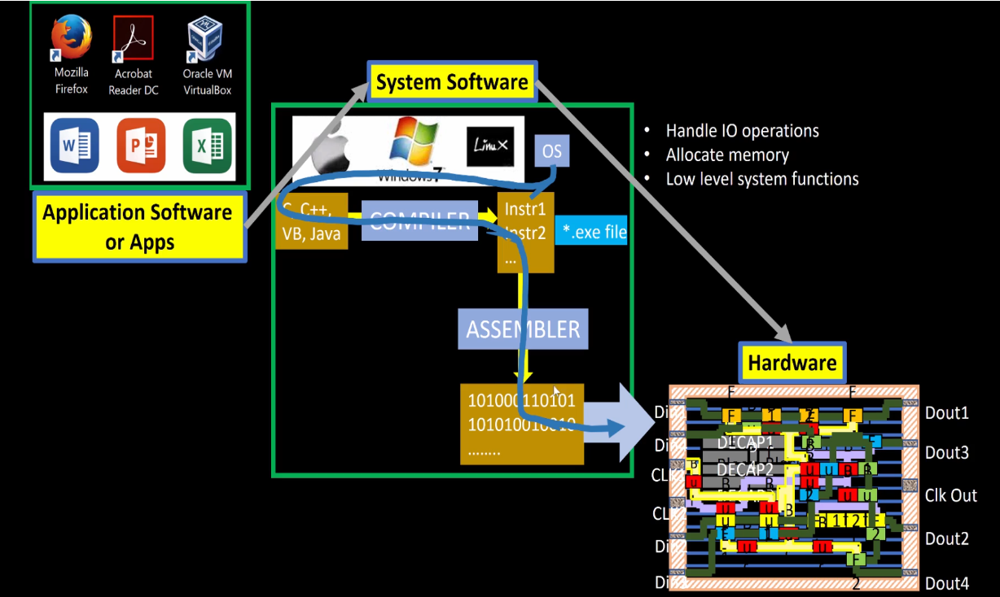

#### 🔁 From Software to Silicon – Stopwatch App on RISC-V

For example, consider a **stopwatch app** running on a **RISC-V core**. The user writes a simple function in C to implement timekeeping logic (hours, minutes, seconds). This high-level application code is first handled by the **system software**, including:

- **Operating System (OS)**:  
  Manages low-level operations like memory allocation, I/O handling, and system calls (e.g., `sleep()` and `clear()` in the C code).

- **Compiler**:  
  Translates the high-level C code into **RISC-V-specific assembly instructions** tailored to the target architecture.

- **Assembler**:  
  Converts the human-readable assembly code into **binary machine instructions**.

- **Linker**:  
  Combines all object files and dependencies into the final **`.exe` or binary executable**.

This **machine-level binary** is then fed to the **hardware layer**, where it is executed by the RISC-V processor. In physical design workflows, these binary instructions are synthesized and mapped into a **chip layout** using tools like:

- **OpenLane** – For RTL-to-GDSII flow
- **Sky130 PDK** – A 130nm open-source process design kit

Finally, the generated **layout is fabricated into silicon**, producing a chip that can independently execute the stopwatch functionality at the hardware level.

This demonstrates the full-stack hardware design flow:  
**from software → to compiler → to silicon.**

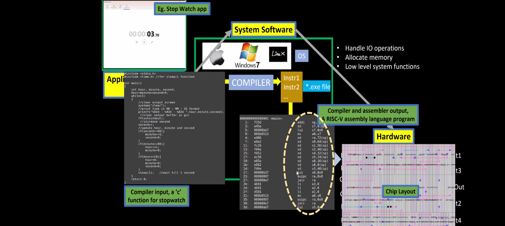

For the above stopwatch the below figure shows the input and output of the compiler and assembler.

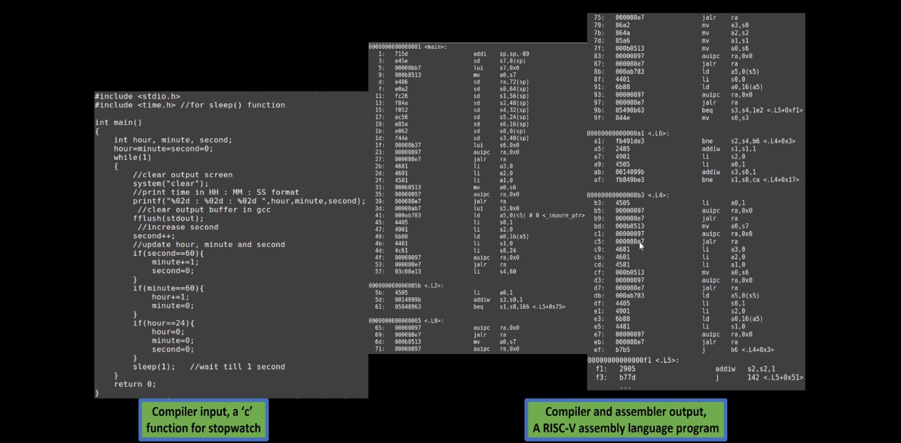

This image demonstrates the complete transformation of a machine instruction (e.g., add x6, x10, x6) into real, executable hardware logic. At the top, the instruction is part of a RISC-V program defined by the Instruction Set Architecture (ISA) — the abstract interface between software and hardware. The assembler converts these instructions into binary machine code (e.g., 010001101...), which is then interpreted by the RTL (Register Transfer Level) hardware description written in Verilog. This RTL is synthesized into a gate-level netlist, comprising logic gates like NAND, NOR, and flip-flops. Finally, the logic is placed and routed into a physical layout on silicon — shown at the bottom right — where real transistors switch to implement the behavior defined by the instruction. This showcases how a single line of code flows from abstract software into concrete hardware functionality.

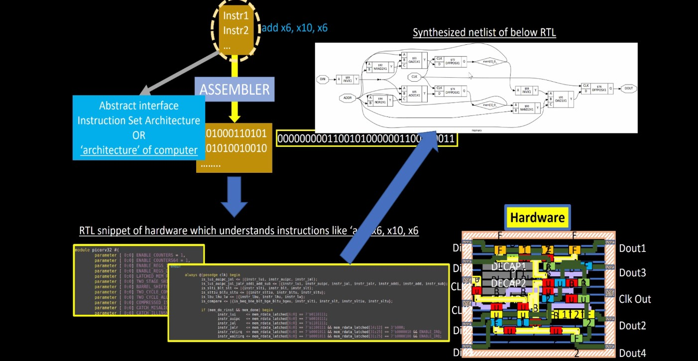

### `SoC design and OpenLANE`

### Introduction to all components of open-source digital asic design

#### Components of opensource digital ASIC design

In digital ASIC design, three essential components must come together to produce a successful chip: RTL IPs, EDA tools, and PDK data.

RTL IPs (Register Transfer Level Intellectual Property) define the functional behavior of the design and serve as reusable logic blocks.

EDA Tools (Electronic Design Automation) enable the complete design flow—from logic synthesis to placement, routing, verification, and signoff.

PDK (Process Design Kit) Data provides foundry-specific information such as layer definitions, design rules, and transistor models.

When these inputs are integrated, the result is a fully functional, fabricated ASIC (Application-Specific Integrated Circuit) tailored to meet specific application requirements.

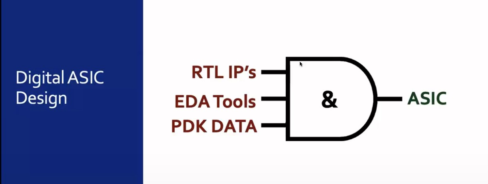

### Simplified RTL2GDS flow

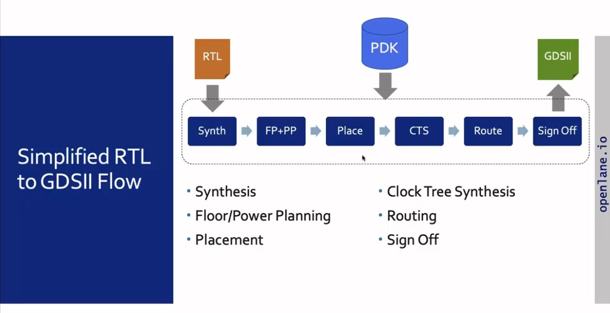

**RTL Design**  
  Describes the circuit's functional behavior using HDLs like **Verilog** or **VHDL**, defining its logic, data paths, and control flow at the register-transfer level.

- **RTL Synthesis**  
  Converts RTL code into a **gate-level netlist**, mapping the design to standard cells (e.g., AND gates, flip-flops, multiplexers), while optimizing for **area**, **power**, and **timing**.

- **Floor and Power Planning**  
  Partitions the chip area, places key components (macros/IPs), and defines the power grid and I/O pad placement. This step aims to reduce power consumption and improve **signal integrity** by optimizing physical layout.

- **Placement**  
  Assigns physical locations to standard cells, targeting **minimal wirelength**, low signal delay, and better area utilization. A well-placed design improves performance, reduces congestion, and eases routing complexity.

- **Clock Tree Synthesis (CTS)**  
  Builds a clock distribution network to deliver the clock signal uniformly to all sequential elements like flip-flops and registers. CTS ensures **minimal skew**, balanced paths, and robust clock propagation.

- **Routing**  
  Connects all placed components based on netlist connectivity. The router optimizes wire paths for **signal integrity**, avoids **congestion**, and satisfies **design rule constraints** set by the foundry.

- **Sign-off**  
  The final validation stage:
  - **Timing analysis** checks setup and hold violations.
  - **Power analysis** verifies the design stays within power budgets.
  - **Physical verification (DRC/LVS)** ensures layout complies with PDK rules.  
  This stage ensures the design is **fabrication-ready**.

- **GDSII File Generation**  
  Produces the **GDSII** file containing all physical layout data. This file is used by foundries to generate photomasks and manufacture the silicon chip. The GDSII is essentially the **final blueprint** for chip fabrication.

