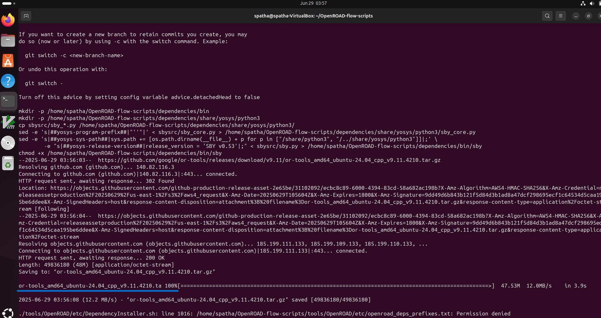
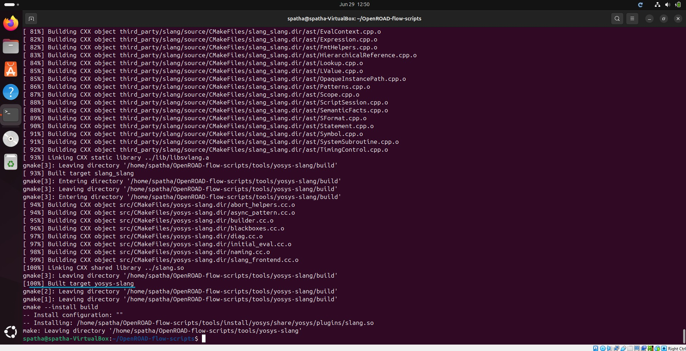
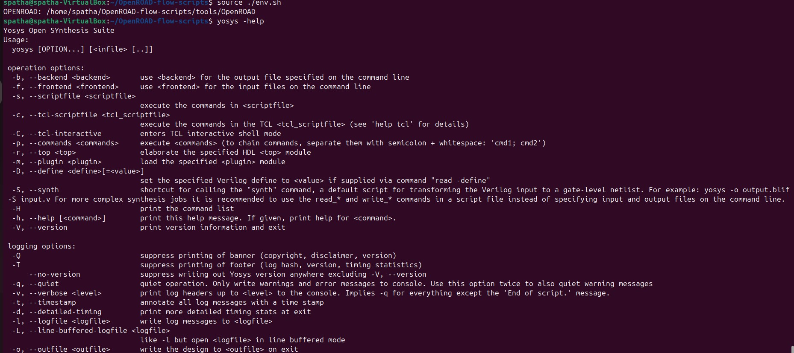
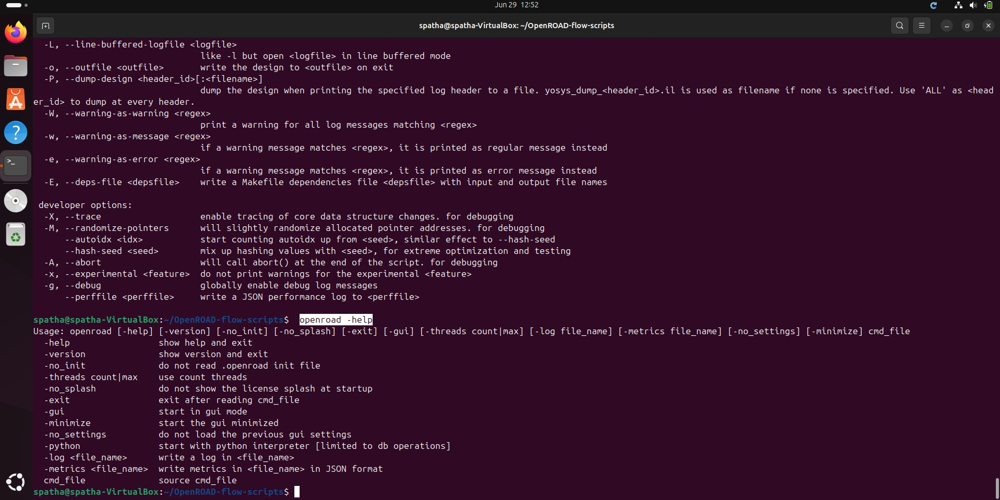
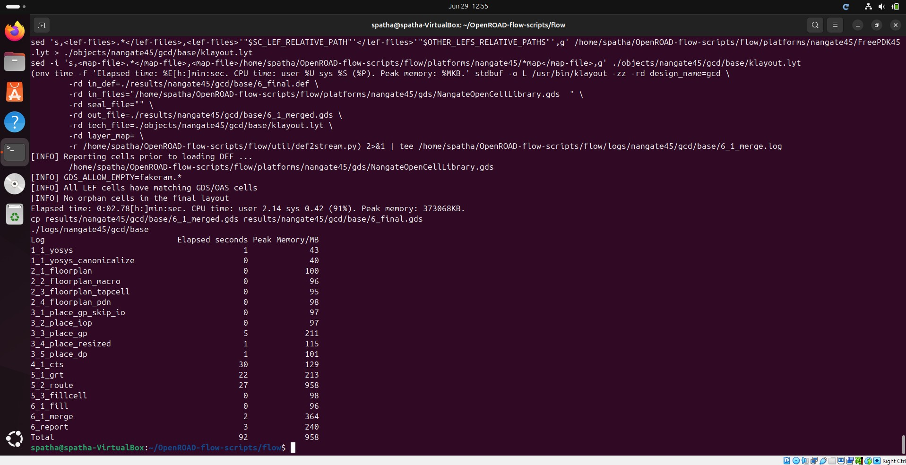
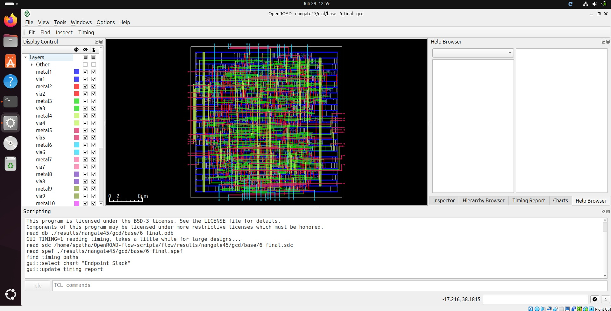
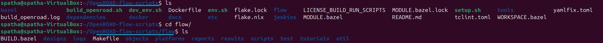

# VSD Hardware Design Program

## OpenROAD installation guide

**OpenROAD** is an open-source, fully automated RTL-to-GDSII flow for digital integrated circuit (IC) design. It supports synthesis, floorplanning, placement, clock tree synthesis, routing, and final layout generation. OpenROAD enables rapid design iterations, making it ideal for academic research and industry prototyping.

### `Steps to Install OpenROAD and Run GUI`

### 1. Clone the OpenROAD Repository

```bash
git clone --recursive https://github.com/The-OpenROAD-Project/OpenROAD-flow-scripts
cd OpenROAD-flow-scripts
```

### 2. Run the Setup Script

```bash
sudo ./setup.sh
```



### 3. Build OpenROAD

```bash
./build_openroad.sh --local
```




### 4. Verify Installation

```bash
source ./env.sh
yosys -help  
openroad -help
```




### 5. Run the OpenROAD Flow

```bash
cd flow
make
```



### 6. Launch the graphical user interface (GUI) to visualize the final layout

```bash
 make gui_final
```



✅ Installation Complete! You can now explore the full RTL-to-GDSII flow using OpenROAD.

### ORFS Directory Structure and File formats

OpenROAD-flow-scripts/

├── docker/ → Docker-based installation and run scripts.
├── docs/ → Documentation for OpenROAD tools and flow usage.
├── flow/ → Core directory to run the RTL-to-GDSII flow.
├── jenkins/ → Regression tests for validating build updates.
├── tools/ → Required tools for synthesis, placement, routing, etc.
├── etc/ → Dependency installers and helper scripts.
├── setup_env.sh → Shell script to source environment variables for the flow.

Inside the `flow/` Directory

flow/

├── design/ → Contains example designs and configs across tech nodes.
├── makefile → Automates RTL-to-GDS flow using GNU Make.
├── platform/ → Technology libraries, LEF files, GDS, and PDK assets.
├── tutorials/ → Tutorial examples and flow walkthroughs.
├── util/ → Utility scripts for report generation and management.
├── scripts/ → TCL, Python, and helper scripts used across flow steps.         


