# VSD Hardware Design Program

## Floorplan and Placement of VSDBabySoC

### 📚 Contents
 - [RTL2GDS Flow for VSDBabySoC: Initial Steps](#rtl2gds-flow-for-vsdbabysoc-initial-steps)
    - [1. Create Directories](#1-create-directories)
    - [2. Copy Folders](#2-copy-folders)
    - [3. Copy Constraint and Configuration Files](#3-copy-constraint-and-configuration-files)
    - [4. Create Config File](#4-create-config-file)
  - [Directory Structure After Setup](#directory-structure-after-setup)
  - [Run Synthesis](#run-synthesis)
    - [Synthesis Netlist](#synthesis-netlist)
    - [Synthesis Log](#synthesis-log)
    - [Synthesis Check](#synthesis-check)
    - [Synthesis Stats](#synthesis-stats)
  - [Run Floorplan](#run-floorplan)
    - [Floorplan Error and Fix](#floorplan-error-and-fix)
    - [Floorplan Result (GUI)](#floorplan-result-gui)
 -  [Run Placement](#run-placement)
    - [Placement Result (GUI)](#placement-result-gui)

###  `RTL2GDS Flow for VSDBabySoC: Initial Steps`

1. **Create Directories:**
   - Inside `OpenROAD-flow-scripts/flow/designs/sky130hd/`, create a folder named `vsdbabysoc`.
   - Create another folder named `vsdbabysoc` in `OpenROAD-flow-scripts/flow/designs/src/` and place all Verilog files here.

2. **Copy Folders:**
   - From your `VSDBabySoC` folder, copy the following folders into `sky130hd/vsdbabysoc`:
     - **gds:** Contains `avsddac.gds`, `avsdpll.gds`.
     - **include:** Contains `sandpiper.vh`, `sandpiper_gen.vh`, `sp_default.vh`, `sp_verilog.vh`.
     - **lef:** Contains `avsddac.lef`, `avsdpll.lef`.
     - **lib:** Contains `avsddac.lib`, `avsdpll.lib`.

3. **Copy Constraint and Configuration Files:**
   - Copy `vsdbabysoc_synthesis.sdc` into `sky130hd/vsdbabysoc`.
   - Copy `macro.cfg` and `pin_order.cfg` into `sky130hd/vsdbabysoc`.

4. **Create Config File:**
   - Create a `config.mk` file in `sky130hd/vsdbabysoc` with the required configuration details. 

 ##### The file details are given below:
 ```shell
  # Design and Platform Configuration
   export DESIGN_NICKNAME = vsdbabysoc
   export DESIGN_NAME = vsdbabysoc
   export PLATFORM    = sky130hd

  # Design Paths
  export vsdbabysoc_DIR = /home/spatha/OpenROAD-flow-scripts/flow/designs/sky130hd/$(DESIGN_NICKNAME)

  # Explicitly list Verilog files for synthesis
   export VERILOG_FILES = /home/spatha/OpenROAD-flow-scripts/flow/designs/src/vsdbabysoc/vsdbabysoc.v \
                         /home/spatha/OpenROAD-flow-scripts/flow/designs/src/vsdbabysoc/rvmyth.v \
                         /home/spatha/OpenROAD-flow-scripts/flow/designs/src/vsdbabysoc/clk_gate.v


  # Include Directory for Verilog Header Files
   export VERILOG_INCLUDE_DIRS = $(vsdbabysoc_DIR)/include

  # Constraints File
    export SDC_FILE = $(vsdbabysoc_DIR)/vsdbabysoc_synthesis.sdc

  # Additional GDS Files
    export ADDITIONAL_GDS = $(vsdbabysoc_DIR)/gds/avsddac.gds \
                            $(vsdbabysoc_DIR)/gds/avsdpll.gds

  # Additional LEF Files
   export ADDITIONAL_LEFS = $(vsdbabysoc_DIR)/lef/avsddac.lef \
                            $(vsdbabysoc_DIR)/lef/avsdpll.lef

  # Additional LIB Files
   export ADDITIONAL_LIBS = $(vsdbabysoc_DIR)/lib/avsddac.lib \
                            $(vsdbabysoc_DIR)/lib/avsdpll.lib

 # Pin Order and Macro Placement Configurations
   export FP_PIN_ORDER_CFG = $(vsdbabysoc_DIR)/pin_order.cfg
   export MACRO_PLACEMENT_CFG = $(vsdbabysoc_DIR)/macro.cfg

 # Clock Configuration
   export CLOCK_PORT = CLK
   export CLOCK_NET  = $(CLOCK_PORT)
   export CLOCK_PERIOD = 20.0

# Floorplanning Configuration
  export DIE_AREA   = 0 0 1600 1600
  export CORE_AREA  = 20 20 1590 1590

# Placement Configuration
  export PLACE_PINS_ARGS = -exclude left:0-600 -exclude left:1000-1600 -exclude right:* -exclude top:* -exclude bottom:*

# Tuning for Timing and Buffers
  export TNS_END_PERCENT     = 100
  export REMOVE_ABC_BUFFERS  = 1
  export CTS_BUF_DISTANCE    = 600
  export SKIP_GATE_CLONING   = 1

 # Magic Tool Configuration
   export MAGIC_ZEROIZE_ORIGIN = 0
   export MAGIC_EXT_USE_GDS    = 1
```
 

**Below is a sample view of the file structure after setup:**

```shell
spatha@spatha-VirtualBox:~/OpenROAD-flow-scripts/flow$ ls -ltrh designs/src/vsdbabysoc/
total 3.1M
-rw-rw-r-- 1 spatha spatha 1.1K Jun 29 15:50 avsddac.v
-rw-rw-r-- 1 spatha spatha  947 Jun 29 15:50 avsdpll.v
lrwxrwxrwx 1 spatha spatha   87 Jun 29 15:50 primitives.v -> /home/spatha/VLSI/sky130RTLDesignAndSynthesisWorkshop/my_lib/verilog_model/primitives.v
-rw-rw-r-- 1 spatha spatha 1.7K Jun 29 15:50 clk_gate.v
-rw-rw-r-- 1 spatha spatha  17K Jun 29 15:50 rvmyth.v
-rw-rw-r-- 1 spatha spatha  19K Jun 29 15:50 rvmyth_gen.v
-rw-rw-r-- 1 spatha spatha 2.3M Jun 29 15:50 sky130_fd_sc_hd.v
-rwxrwxr-x 1 spatha spatha 1.3K Jun 29 15:50 testbench.v
-rw-rw-r-- 1 spatha spatha  603 Jun 29 15:50 testbench.rvmyth.post-routing.v
-rw-rw-r-- 1 spatha spatha  590 Jun 29 15:50 vsdbabysoc.v
-rw-rw-r-- 1 spatha spatha 743K Jun 29 15:50 vsdbabysoc.synth.v
```

```shell
spatha@spatha-VirtualBox:~/OpenROAD-flow-scripts/flow$ ls -ltrh designs/sky130hd/vsdbabysoc/
total 32K
drwxrwxr-x 2 spatha spatha 4.0K Jun 29 15:52 gds
drwxrwxr-x 2 spatha spatha 4.0K Jun 29 15:52 include
drwxrwxr-x 2 spatha spatha 4.0K Jun 29 15:53 lef
-rw-rw-r-- 1 spatha spatha   73 Jun 29 15:54 vsdbabysoc_synthesis.sdc
lrwxrwxrwx 1 spatha spatha   65 Jun 29 15:55 macro.cfg -> /home/spatha/VLSI/VSDBabySoC/src/layout_conf/vsdbabysoc/macro.cfg
lrwxrwxrwx 1 spatha spatha   69 Jun 29 15:55 pin_order.cfg -> /home/spatha/VLSI/VSDBabySoC/src/layout_conf/vsdbabysoc/pin_order.cfg
-rw-rw-r-- 1 spatha spatha 2.1K Jun 29 15:59 config.mk
drwxrwxr-x 2 spatha spatha 4.0K Jun 29 16:06 lib
```

#### Now go to terminal and run the following commands:
cd OpenROAD-flow-scripts
source env.sh
cd flow
   
#### Run Synthesis
make DESIGN_CONFIG=./designs/sky130hd/vsdbabysoc/config.mk synth

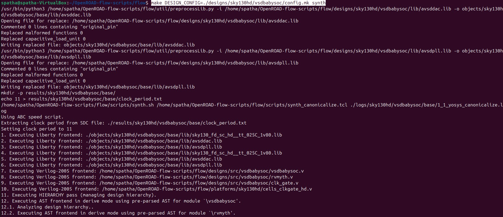

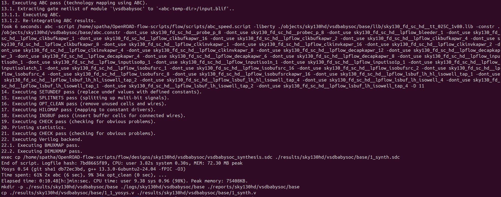

#### Synthesis netlist

```shell
patha@spatha-VirtualBox:~/OpenROAD-flow-scripts/flow$ gvim results/sky130hd/vsdbabysoc/base/1_1_yosys.v
```
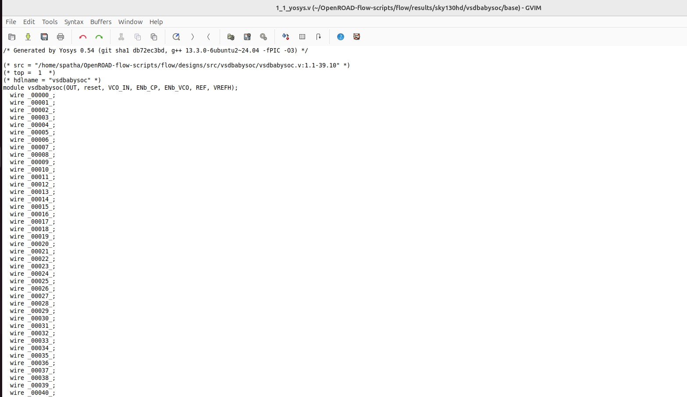

#### Synthesis log

```shell
spatha@spatha-VirtualBox:~/OpenROAD-flow-scripts/flow$ gvim logs/sky130hd/vsdbabysoc/base/1_1_yosys.log
```
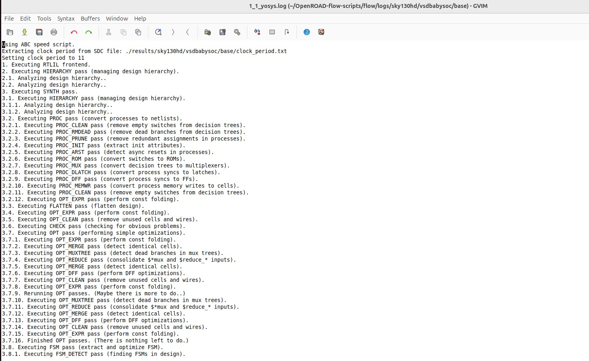

#### Synthesis Check

```shell
spatha@spatha-VirtualBox:~/OpenROAD-flow-scripts/flow$ gvim reports/sky130hd/vsdbabysoc/base/synth_check.txt
```
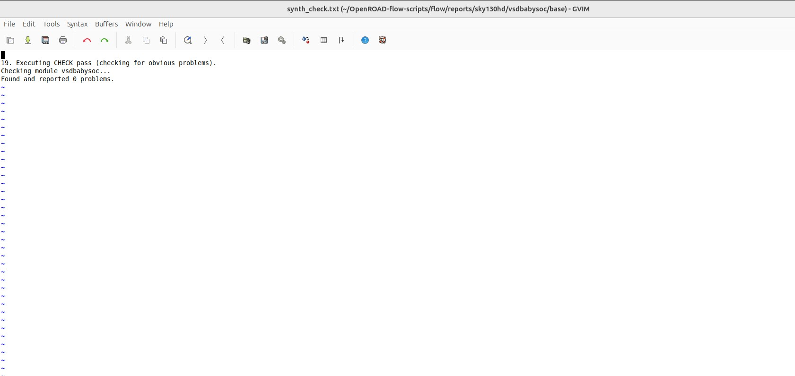


#### Synthesis Stats

```shell
spatha@spatha-VirtualBox:~/OpenROAD-flow-scripts/flow$ gvim reports/sky130hd/vsdbabysoc/base/synth_stat.txt
```

**synth_stat.txt**
```
20. Printing statistics.

=== vsdbabysoc ===

   Number of wires:               6551
   Number of wire bits:           6551
   Number of public wires:        1285
   Number of public wire bits:    1285
   Number of ports:                  7
   Number of port bits:              7
   Number of memories:               0
   Number of memory bits:            0
   Number of processes:              0
   Number of cells:               6440
     avsddac                         1
     avsdpll                         1
     sky130_fd_sc_hd__a2111o_1       1
     sky130_fd_sc_hd__a2111oi_0      3
     sky130_fd_sc_hd__a2111oi_2      1
     sky130_fd_sc_hd__a211o_1        9
     sky130_fd_sc_hd__a211o_2        1
     sky130_fd_sc_hd__a211oi_1      47
     sky130_fd_sc_hd__a21bo_2        1
     sky130_fd_sc_hd__a21boi_1       1
     sky130_fd_sc_hd__a21o_1        29
     sky130_fd_sc_hd__a21oi_1      816
     sky130_fd_sc_hd__a21oi_2        1
     sky130_fd_sc_hd__a221o_1       10
     sky130_fd_sc_hd__a221oi_1      51
     sky130_fd_sc_hd__a221oi_2       4
     sky130_fd_sc_hd__a22o_1        45
     sky130_fd_sc_hd__a22oi_1      183
     sky130_fd_sc_hd__a22oi_2        1
     sky130_fd_sc_hd__a2bb2oi_1      4
     sky130_fd_sc_hd__a311o_1        3
     sky130_fd_sc_hd__a311o_2        1
     sky130_fd_sc_hd__a311oi_1      37
     sky130_fd_sc_hd__a311oi_2       1
     sky130_fd_sc_hd__a31o_2        16
     sky130_fd_sc_hd__a31oi_1       44
     sky130_fd_sc_hd__a31oi_2        1
     sky130_fd_sc_hd__a32o_1         2
     sky130_fd_sc_hd__a32oi_1        5
     sky130_fd_sc_hd__a41o_1         4
     sky130_fd_sc_hd__a41oi_1        3
     sky130_fd_sc_hd__a41oi_2        2
     sky130_fd_sc_hd__and2_0         2
     sky130_fd_sc_hd__and2_1        22
     sky130_fd_sc_hd__and3_1        38
     sky130_fd_sc_hd__and4_1         3
     sky130_fd_sc_hd__buf_1         38
     sky130_fd_sc_hd__buf_2         35
     sky130_fd_sc_hd__buf_4          8
     sky130_fd_sc_hd__buf_6          7
     sky130_fd_sc_hd__buf_8          2
     sky130_fd_sc_hd__clkbuf_1     502
     sky130_fd_sc_hd__clkbuf_2       7
     sky130_fd_sc_hd__clkbuf_8       1
     sky130_fd_sc_hd__clkinv_1       6
     sky130_fd_sc_hd__conb_1         1
     sky130_fd_sc_hd__dfxtp_1     1144
     sky130_fd_sc_hd__fa_1           4
     sky130_fd_sc_hd__ha_1         101
     sky130_fd_sc_hd__inv_1         94
     sky130_fd_sc_hd__inv_2          1
     sky130_fd_sc_hd__mux2_2        39
     sky130_fd_sc_hd__mux2i_1       76
     sky130_fd_sc_hd__mux2i_2        3
     sky130_fd_sc_hd__mux2i_4        4
     sky130_fd_sc_hd__mux4_1        12
     sky130_fd_sc_hd__mux4_2        79
     sky130_fd_sc_hd__nand2_1     1371
     sky130_fd_sc_hd__nand2b_1      24
     sky130_fd_sc_hd__nand3_1      228
     sky130_fd_sc_hd__nand3b_1      37
     sky130_fd_sc_hd__nand4_1       51
     sky130_fd_sc_hd__nand4b_1       1
     sky130_fd_sc_hd__nor2_1       264
     sky130_fd_sc_hd__nor2b_1       54
     sky130_fd_sc_hd__nor3_1        52
     sky130_fd_sc_hd__nor3b_1        7
     sky130_fd_sc_hd__nor4_1        20
     sky130_fd_sc_hd__o2111ai_1      1
     sky130_fd_sc_hd__o211a_1        1
     sky130_fd_sc_hd__o211ai_1      48
     sky130_fd_sc_hd__o211ai_2       4
     sky130_fd_sc_hd__o21a_1        28
     sky130_fd_sc_hd__o21ai_0      385
     sky130_fd_sc_hd__o21ai_1       22
     sky130_fd_sc_hd__o21ai_2        9
     sky130_fd_sc_hd__o21ba_2        2
     sky130_fd_sc_hd__o21bai_1       8
     sky130_fd_sc_hd__o221a_2        2
     sky130_fd_sc_hd__o221ai_1      19
     sky130_fd_sc_hd__o22a_1        33
     sky130_fd_sc_hd__o22ai_1       17
     sky130_fd_sc_hd__o2bb2ai_1      6
     sky130_fd_sc_hd__o311a_1        3
     sky130_fd_sc_hd__o311ai_0       4
     sky130_fd_sc_hd__o311ai_1       2
     sky130_fd_sc_hd__o31a_1         7
     sky130_fd_sc_hd__o31ai_1       34
     sky130_fd_sc_hd__o31ai_4        1
     sky130_fd_sc_hd__o32a_1         2
     sky130_fd_sc_hd__o32ai_1        3
     sky130_fd_sc_hd__o41ai_1        4
     sky130_fd_sc_hd__o41ai_2        1
     sky130_fd_sc_hd__or2_1          1
     sky130_fd_sc_hd__or2_2          8
     sky130_fd_sc_hd__or3_1         20
     sky130_fd_sc_hd__or3b_1         2
     sky130_fd_sc_hd__or3b_2         2
     sky130_fd_sc_hd__or4_1          9
     sky130_fd_sc_hd__or4b_2         1
     sky130_fd_sc_hd__xnor2_1       57
     sky130_fd_sc_hd__xor2_1        27

   Area for cell type \avsddac is unknown!
   Area for cell type \avsdpll is unknown!

   Chip area for module '\vsdbabysoc': 52933.267200
     of which used for sequential elements: 22901.964800 (43.27%)
```

#### Run Floorplan

```shell
make DESIGN_CONFIG=./designs/sky130hd/vsdbabysoc/config.mk floorplan
```

#### Floorplan Error and Fix

❗**Note:** You may encounter the following error:

```shell
[ERROR STA-0164] .../vsdbabysoc/lib/avsdpll.lib line 54, syntax error
Error: floorplan.tcl, 4 STA-0164
```

**Fix:**
This error is caused by commented block structures in your Liberty file avsdpll.lib. OpenROAD’s parser does not tolerate partially commented blocks like:

```shell
//pin (GND#2) {
//  direction : input;
//  max_transition : 2.5;
//  capacitance : 0.001;
//}
```

✅ To fix it, simply delete the entire commented block starting at line 54:

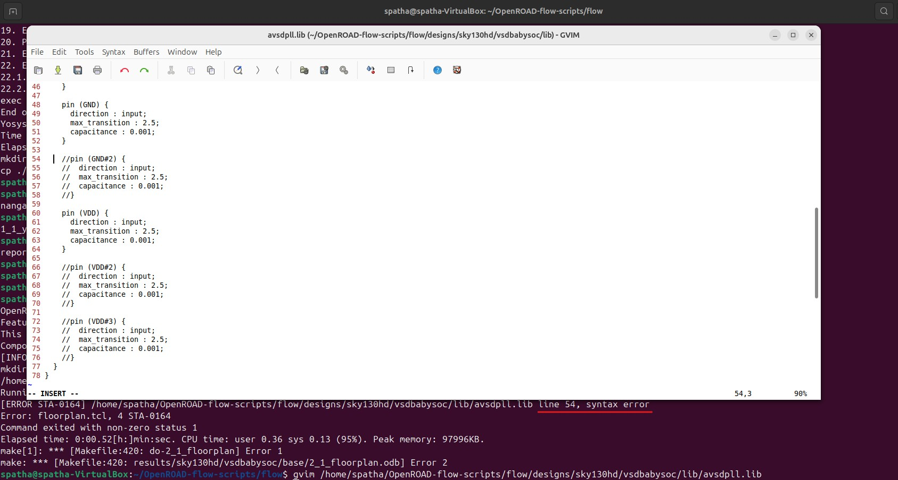

After saving the changes, re-run the floorplan step and the flow should proceed without syntax errors. 

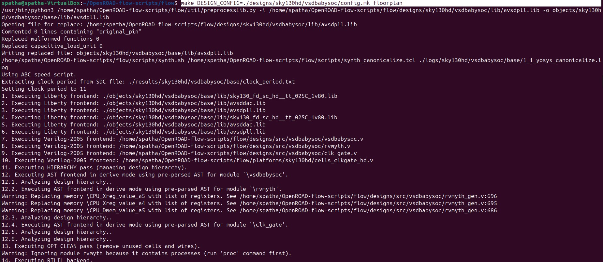

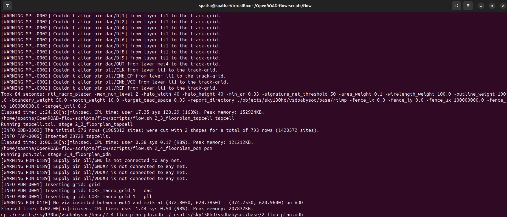

#### Floorplan Result (GUI)

```shell
spatha@spatha-VirtualBox:~/OpenROAD-flow-scripts/flow$ make DESIGN_CONFIG=./designs/sky130hd/vsdbabysoc/config.mk gui_floorplan
```

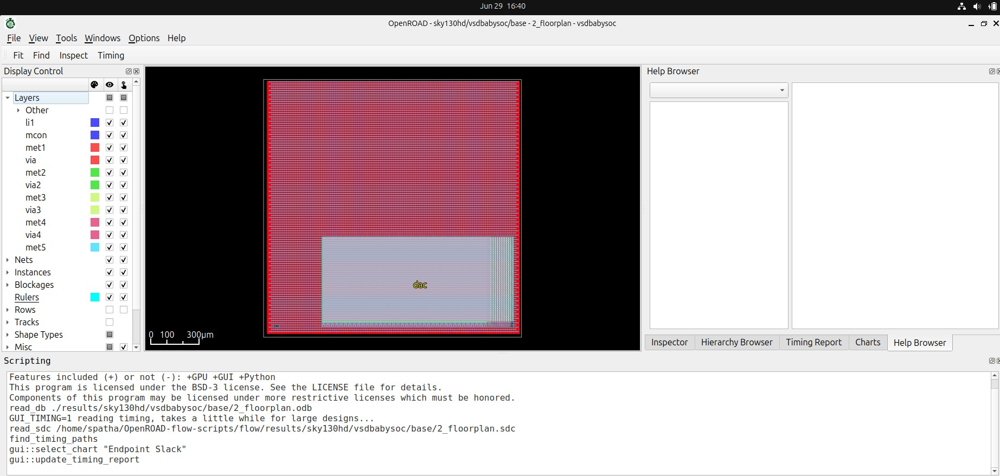

#### Run Placement

```shell
make DESIGN_CONFIG=./designs/sky130hd/vsdbabysoc/config.mk place
```

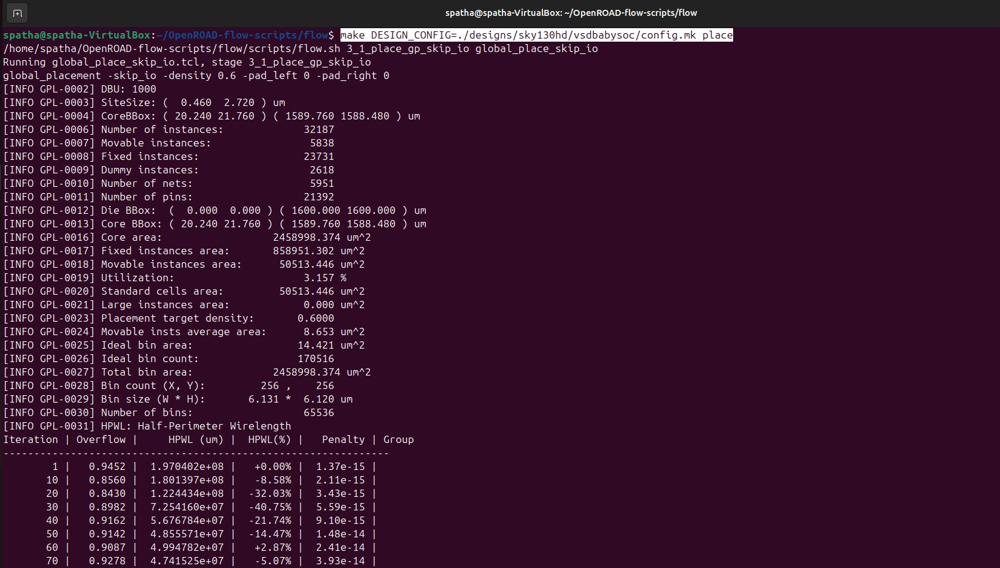

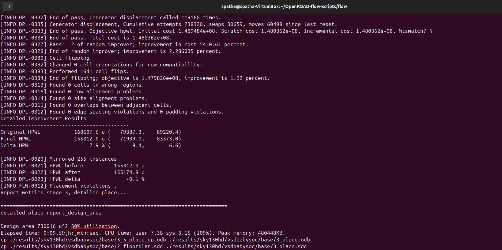

#### Placement Result (GUI)

```shell
make DESIGN_CONFIG=./designs/sky130hd/vsdbabysoc/config.mk gui_place
```

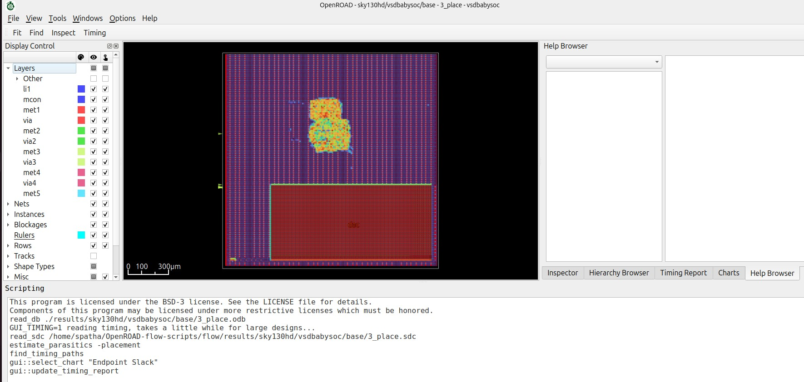

To view the Placement Density heatmap in OpenROAD:

Go to **Tools → Heat maps → Placement Density**

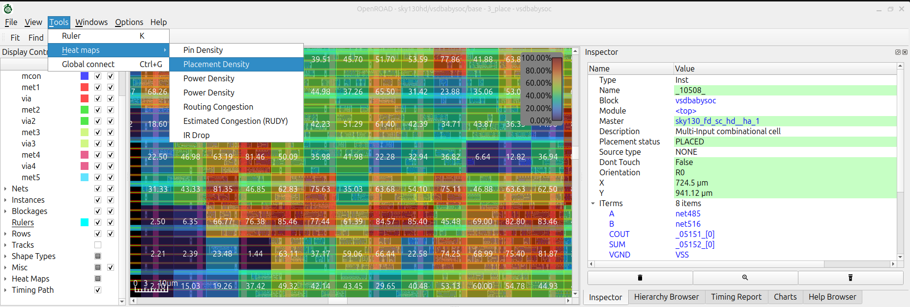

