# VSD Hardware Design Program

##  Advanced Physical Design using OpenLane for `picorv32a` design

### 📚 Contents

- [ASIC Flow](#asic-flow)
- [OpenLane ASIC Flow](#openlane-asic-flow)
- [OpenLane Flow Toolchain Overview](#openlane-flow-toolchain-overview)
- [Familiarize with OpenLANE flow](#familiarize-with-openlane-flow)
- [OpenLANE Directory Structure](#openlane-directory-structure)
- [Getting started](#getting-started)
- [Building PDKs from Source](#building-pdks-from-source)
- [Step-by-Step OpenLANE Synthesis Flow Commands for picorv32a design](#step-by-step-openlane-synthesis-flow-commands-for-picorv32a-design)
- [Calculation of Flop Ratio and DFF %](#calculation-of-flop-ratio-and-dff-)
- [Floorplanning and library cells](#floorplanning-and-library-cells)
- [Files of importance in increasing priority order](#files-of-importance-in-increasing-priority-order)
- [Floorplaning using OpenLANE & view in Magic](#step-8-floorplaning-using-openlane--view-in-magic)
- [Viewing the Floorplan DEF in Magic](#step-9-viewing-the-floorplan-def-in-magic)
- [Calculate the die area in microns from the values in floorplan def](#step-10-calculate-the-die-area-in-microns-from-the-values-in-floorplan-def)
- [Run Placement using OpenLANE](#step-11-run-placement-using-openlane)  
- [Viewing the Placement DEF in Magic](#step-12-viewing-the-placement-def-in-magic)
- [Viewing the Placement PNG Output](#viewing-the-placement-png-output)
- [Error: common_pdn.tcl not found](#error-common_pdntcl-not-found)
- [🔽 Steps to fix common_pdn.tcl missing using correct OpenLane clone](#steps-to-fix-common_pdntcl-missing-using-correct-openlane-clone)
  - [Run Synthesis](#run-synthesis)
  - [Run Floorplan](#run-floorplan)
  - [Run Placement](#run-placement)
  - [Run CTS](#run-cts)
  - [Run Routing](#run-routing)
  - [📌Flow Stage Cheatsheet](#flow-stage-cheatsheet)

### `ASIC Flow`

VLSI, or Very Large-Scale Integration, is a cornerstone technology driving the modern world, silently powering the devices we rely on daily. Its importance stems from its profound impact on various aspects of our lives, making it ubiquitous. VLSI facilitated the fabrication of chips. A chip is a small piece of semiconductor material (usually silicon) containing integrated circuits. These circuits consist of millions or even billions of tiny switches called transistors and other electronic components that process information and perform various functions. These chips are the brains behind countless electronic devices, from smartphones and computers to cars and medical equipment.

One class of chips is called ASIC. ASIC is a type of chip custom-designed for a specific purpose, unlike general-purpose chips like microprocessors that can be used for various tasks. One of the most prominent examples of ASIC is smartphone processors. These chips are custom-designed for mobile devices, focusing on low power consumption and high performance for running apps, gaming, and streaming media. They often incorporate specialized cores for graphics processing, artificial intelligence, and image signal processing.

Designing an ASIC is a complex and fascinating process that entails various steps, from idea to the fabrication data. This process is filled with engineering challenges that require expertise and attention to detail. The entire process requires significant expertise and experience in chip design and can take several months to complete. The ASIC design flow is crucial to ensure successful ASIC design. It is based on a comprehensive understanding of ASIC specifications, requirements, low-power design, and performance. Engineers can streamline the process and meet crucial time-to-market goals by following a proven ASIC design flow. Each stage of the ASIC design cycle is supported by powerful EDA (Electronic Design Automation) tools that facilitate the implementation of the design. The following are examples of steps needed to realize an ASIC.

**Design Entry:** In this step, the logic design is described using a Hardware Description Language (HDL) like System Verilog. Typically, the description is done at the data flow (Register Transfer) or behavioral levels.

**Functional Verification:** It is essential to catch design errors early on. The description must be checked against the requirements, which can be done through simulation or formal methods. Functional verification is performed on the RTL description as well as the netlists generated by the following steps.

**Synthesis:** In this step, the HDL description is converted into a circuit of the logic cells called the Netlist.

**Layout/Physical Synthesis:** Also called Physical Implementation. In this step, the logic circuit is converted into a layout of the photo masks used for fabrication. This complex step involves several sub-steps typically automated using its flow. These steps include Floorplanning, Placement, Clock-tree synthesis and Routing. Because Placement and Routing are the most time-consuming operations, sometimes we refer to this step as “Placement and Routing”, or PnR.

**Signoff:** marks the final stage in the rigorous journey of an ASIC’s design; it ensures your creation functions flawlessly, operates efficiently, and ultimately delivers on its promise before sending your chip blueprint off to be carved in silicon.

Please note that the `five mentioned steps` are the major ones. There are several other design steps that are not mentioned here such as scan chain insertion and test pattern generations that are essential to testing the fabricated chip against fabrication defects.


### `OpenLane ASIC Flow`

The OpenLane flow is an automated, open-source framework designed to convert RTL designs into manufacturable layouts, integrating multiple stages of the digital IC design process. Starting with RTL synthesis using Yosys and ABC, the flow performs static timing analysis (STA) with OpenSTA and incorporates Design for Testability (DFT) to ensure fault coverage. The OpenROAD App facilitates floorplanning, placement, clock tree synthesis (CTS), optimization, and global routing, streamlining the physical design process. Custom scripts handle antenna diode insertion, while Yosys performs Logic Equivalence Checking (LEC) to verify design integrity. TritonRoute manages detailed routing, ensuring signal integrity and minimizing congestion. RC extraction is conducted using DEF2SPEF, followed by STA to confirm timing compliance. Magic and Netgen are employed for physical verification, including Design Rule Checking (DRC) and Layout vs. Schematic (LVS) checks, ensuring the design adheres to manufacturing constraints. The final output is a GDSII/LEF file, ready for fabrication, supported by the SW PDK which provides technology-specific data and libraries. This comprehensive flow enables efficient design exploration and optimization, leveraging open-source tools to deliver high-quality, manufacturable designs.


### `OpenLane Flow Toolchain Overview`

The OpenLane flow utilizes a suite of open-source tools to efficiently transform RTL designs into manufacturable layouts. Each stage of the design process is supported by specialized tools, ensuring optimal performance and compliance with design rules.

#### RTL Synthesis, Technology Mapping, and Formal Verification
- **Tools Used**: 
  - **Yosys**: For RTL synthesis, converting high-level design into a gate-level netlist.
  - **ABC**: For technology mapping and formal verification, optimizing logic for specific technology nodes.

#### Static Timing Analysis
- **Tools Used**: 
  - **OpenSTA**: For static timing analysis, ensuring the design meets timing constraints.

#### Floor Planning
- **Tools Used**: 
  - **init_fp**: For initial floorplanning, defining the physical layout of the chip.
  - **ioPlacer**: For I/O placement, organizing input/output pins efficiently.
  - **pdn**: For power distribution network planning, ensuring robust power delivery.
  - **tapcell**: For tap cell insertion, maintaining well connections across the design.

#### Placement
- **Tools Used**: 
  - **RePLace**: For global placement, arranging standard cells within the floorplan.
  - **Resizer**: Optional tool for resizing cells to optimize area and performance.
  - **OpenPhySyn**: Formerly used for placement optimization.
  - **OpenDP**: For detailed placement, finalizing cell positions.

#### Clock Tree Synthesis
- **Tools Used**: 
  - **TritonCTS**: For clock tree synthesis, distributing clock signals uniformly.

#### Fill Insertion
- **Tools Used**: 
  - **OpenDP**: For filler placement, ensuring density requirements are met.

#### Routing
- **Tools Used**: 
  - **FastRoute or CU-GR**: Formerly used for global routing.
  - **TritonRoute**: For detailed routing, ensuring signal integrity and minimizing congestion.
  - **DR-CU**: Formerly used for detailed routing.

#### SPEF Extraction
- **Tools Used**: 
  - **OpenRCX**: For Standard Parasitic Exchange Format (SPEF) extraction, capturing parasitic effects.
  - **SPEF-Extractor**: Formerly used for SPEF extraction.

#### GDSII Streaming Out
- **Tools Used**: 
  - **Magic and KLayout**: For viewing and editing GDSII files, preparing for fabrication.

#### Design Rule Checking (DRC) Checks
- **Tools Used**: 
  - **Magic and KLayout**: For DRC checks, ensuring compliance with manufacturing rules.

#### Layout vs. Schematic (LVS) Check
- **Tools Used**: 
  - **Netgen**: For LVS checks, verifying the layout matches the schematic.

#### Antenna Checks
- **Tools Used**: 
  - **Magic**: For antenna checks, preventing damage during fabrication.

This toolchain provides a robust framework for digital IC design, leveraging open-source tools to deliver high-quality, manufacturable designs efficiently.

### Familiarize with OpenLANE flow

**Objectives**:  
Using an existing design provided in the OpenLANE package to:
  * Familiarize with the OpenLANE directory structure and different input files
  * Familiarize with the OpenLANE flow
  * Analyse the intermediate step results
  * Learn about the different control knobs and switches available for design space exploration  
    The OpenLANE flow can be configured using the following available variables for design
    * **Flow Configuration variables**: [https://openlane.readthedocs.io/en/latest/reference/configuration.html](https://openlane.readthedocs.io/en/latest/reference/configuration.html)
    * **PDK Configuration variables**: [https://openlane.readthedocs.io/en/latest/reference/pdk_configuration.html](https://openlane.readthedocs.io/en/latest/reference/pdk_configuration.html)  

### OpenLANE Directory structure:

```text
├── OOpenLane             -> directory where the tool can be invoked (run docker first)
│   ├── designs          -> All designs must be extracted from this folder
│   │   │   ├── picorv32a -> Design used as case study for this workshop
│   |   |   ├── ...
|   |   ├── ...
├── pdks                 -> contains pdk related files 
│   ├── skywater-pdk     -> all Skywater 130nm PDKs
│   ├── open-pdks        -> contains scripts that makes the commerical PDK (which is normally just compatible to commercial tools) to also be compatible with the open-source EDA tool
│   ├── sky130A          -> pdk variant made especially compatible for open-source tools
│   │   │  ├── libs.ref  -> files specific to node process (timing lib, cell lef, tech lef) for example is `sky130_fd_sc_hd` (Sky130nm Foundry Standard Cell High Density)  
│   │   │  ├── libs.tech -> files specific for the tool (klayout,netgen,magic...) 
```

### `Getting started`

To get started, clone the required files and project setup from the below GitHub repository:
```shell
git clone https://github.com/fayizferosh/soc-design-and-planning-nasscom-vsd
```
This repository contains all the necessary resources, scripts, and design files to follow along with the OpenLANE-based Advanced Physical Design flow, including the picorv32a case study.

### `Building PDKs from Source`

To build and install the OpenPDKs (Process Design Kits) for the Sky130 process node, follow these steps:

```bash
git clone https://github.com/RTimothyEdwards/open_pdks.git
cd open_pdks
./configure --enable-sky130-pdk
make
sudo make install
```

❗**Note:** Before building open_pdks, please ensure you have `Magic 8.3.530` installed and available in your path, as earlier versions may lack the required CIF interfaces.

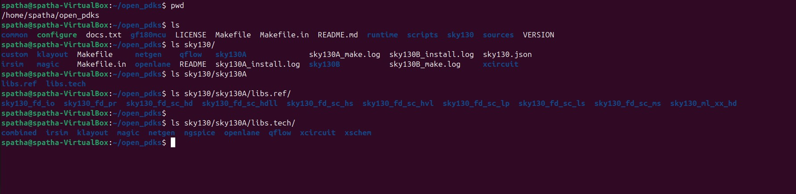

### `Step-by-Step OpenLANE Synthesis Flow Commands for picorv32a design`

#### Step 1: Export the PDK_ROOT variable to point to your sky130A PDK
```shell
export PDK_ROOT=/home/spatha/soc-design-and-planning-nasscom-vsd/Desktop/work/tools/openlane_working_dir/pdks
```

#### Step 2: Change directory to the OpenLANE flow working directory
```shell
cd ~/soc-design-and-planning-nasscom-vsd/Desktop/work/tools/openlane_working_dir/openlane
```

#### Step 3: (Optional) Alias the docker command to simplify OpenLANE invocation
```shell
alias docker='docker run -it -v $(pwd):/openLANE_flow -v $PDK_ROOT:$PDK_ROOT -e PDK_ROOT=$PDK_ROOT -u $(id -u $USER):$(id -g $USER) efabless/openlane:v0.21'
```

#### Step 4: Launch the Docker container (OpenLANE interactive shell)
```shell
docker
```

#### Step 5: Once inside the Docker container, launch the OpenLANE interactive shell using:
```shell
./flow.tcl -interactive
```
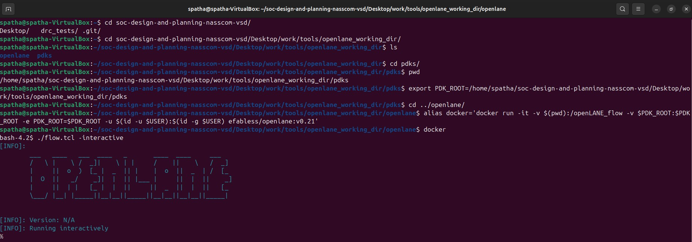

#### Step 6: Run the OpenLANE Flow Commands from the Interactive Shell
```shell
# Load the required OpenLANE package for proper functionality
package require openlane 0.9

# Prep the design (creates necessary directory structure, config files, and copies RTL files)
prep -design picorv32a
```
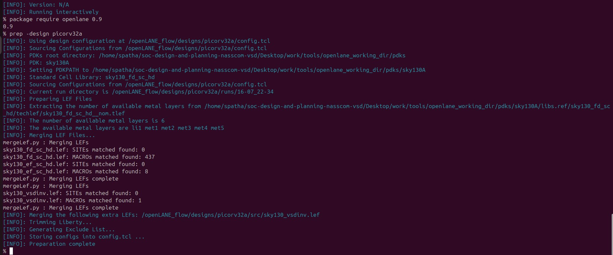

```shell
# Run synthesis step
run_synthesis
```

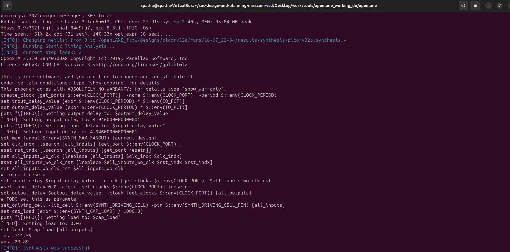

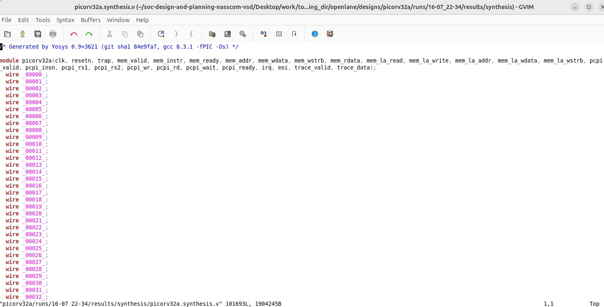

#### Step 7: View the Yosys Synthesis Report

After synthesis, navigate to the report directory to view synthesis results:

```shell
cd ~/soc-design-and-planning-nasscom-vsd/Desktop/work/tools/openlane_working_dir/openlane/designs/picorv32a/runs/
ls -ltrh  # Choose the latest run directory (e.g., 16-07_22-34)
cd 16-07_22-34/reports/synthesis
```

```shell
patha@spatha-VirtualBox:~/soc-design-and-planning-nasscom-vsd/Desktop/work/tools/openlane_working_dir/openlane/designs/picorv32a/runs/16-07_22-34/reports/synthesis$ ls
1-yosys_4.chk.rpt   1-yosys_dff.stat  2-opensta.min_max.rpt  2-opensta.slew.rpt    2-opensta_tns.rpt
1-yosys_4.stat.rpt  1-yosys_pre.stat  2-opensta.rpt          2-opensta.timing.rpt  2-opensta_wns.rpt
```

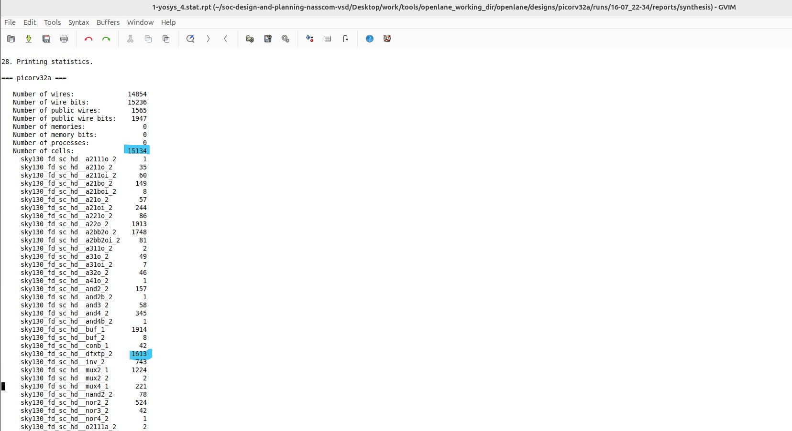

<details> <summary><strong>1-yosys_4.stat.rpt</strong></summary>
  
```shell

28. Printing statistics.

=== picorv32a ===

   Number of wires:              14854
   Number of wire bits:          15236
   Number of public wires:        1565
   Number of public wire bits:    1947
   Number of memories:               0
   Number of memory bits:            0
   Number of processes:              0
   Number of cells:              15134
     sky130_fd_sc_hd__a2111o_2       1
     sky130_fd_sc_hd__a211o_2       35
     sky130_fd_sc_hd__a211oi_2      60
     sky130_fd_sc_hd__a21bo_2      149
     sky130_fd_sc_hd__a21boi_2       8
     sky130_fd_sc_hd__a21o_2        57
     sky130_fd_sc_hd__a21oi_2      244
     sky130_fd_sc_hd__a221o_2       86
     sky130_fd_sc_hd__a22o_2      1013
     sky130_fd_sc_hd__a2bb2o_2    1748
     sky130_fd_sc_hd__a2bb2oi_2     81
     sky130_fd_sc_hd__a311o_2        2
     sky130_fd_sc_hd__a31o_2        49
     sky130_fd_sc_hd__a31oi_2        7
     sky130_fd_sc_hd__a32o_2        46
     sky130_fd_sc_hd__a41o_2         1
     sky130_fd_sc_hd__and2_2       157
     sky130_fd_sc_hd__and2b_2        1
     sky130_fd_sc_hd__and3_2        58
     sky130_fd_sc_hd__and4_2       345
     sky130_fd_sc_hd__and4b_2        1
     sky130_fd_sc_hd__buf_1       1914
     sky130_fd_sc_hd__buf_2          8
     sky130_fd_sc_hd__conb_1        42
     sky130_fd_sc_hd__dfxtp_2     1613
     sky130_fd_sc_hd__inv_2        743
     sky130_fd_sc_hd__mux2_1      1224
     sky130_fd_sc_hd__mux2_2         2
     sky130_fd_sc_hd__mux4_1       221
     sky130_fd_sc_hd__nand2_2       78
     sky130_fd_sc_hd__nor2_2       524
     sky130_fd_sc_hd__nor3_2        42
     sky130_fd_sc_hd__nor4_2         1
     sky130_fd_sc_hd__o2111a_2       2
     sky130_fd_sc_hd__o211a_2       69
     sky130_fd_sc_hd__o211ai_2       6
     sky130_fd_sc_hd__o21a_2        54
     sky130_fd_sc_hd__o21ai_2      141
     sky130_fd_sc_hd__o21ba_2      209
     sky130_fd_sc_hd__o21bai_2       1
     sky130_fd_sc_hd__o221a_2      204
     sky130_fd_sc_hd__o221ai_2       7
     sky130_fd_sc_hd__o22a_2      1312
     sky130_fd_sc_hd__o22ai_2       59
     sky130_fd_sc_hd__o2bb2a_2     119
     sky130_fd_sc_hd__o2bb2ai_2     92
     sky130_fd_sc_hd__o311a_2        8
     sky130_fd_sc_hd__o31a_2        19
     sky130_fd_sc_hd__o31ai_2        1
     sky130_fd_sc_hd__o32a_2       109
     sky130_fd_sc_hd__o41a_2         2
     sky130_fd_sc_hd__or2_2       1088
     sky130_fd_sc_hd__or2b_2        25
     sky130_fd_sc_hd__or3_2         68
     sky130_fd_sc_hd__or3b_2         5
     sky130_fd_sc_hd__or4_2         93
     sky130_fd_sc_hd__or4b_2         6
     sky130_fd_sc_hd__or4bb_2        2
     sky130_vsdinv                 872

   Chip area for module '\picorv32a': 148681.347200

```
</details>


### `Calculation of Flop Ratio and DFF %`

To evaluate the sequential logic content in the synthesized design:

- **Total Cells** = 15134  
- **DFF Cells** = 1613 (from `sky130_fd_sc_hd__dfxtp_2`)

#### ➤ Flop Ratio:

Flop Ratio = DFFs / Total Cells = 1613 / 15134 ≈ 0.1065

#### ➤ DFF Percentage:

DFF % = (DFFs / Total Cells) × 100 = (1613 / 15134) × 100 ≈ 10.65%

### `Floorplanning and library cells`

Utilization Factor and Aspect Ratio: In IC floor planning, utilization factor and aspect ratio are key parameters. The utilization factor is the ratio of the area occupied by the netlist to the total core area. While a perfect utilization of 1 (100%) is ideal, practical designs target a factor of 0.5 to 0.6 to allow space for buffer zones, routing channels, and future adjustments. The aspect ratio, defined as height divided by width, indicates the chip’s shape; an aspect ratio of 1 denotes a square, while other values result in a rectangular layout. The aspect ratio is chosen based on functional, packaging, and manufacturing needs.

```shell
Utilisation Factor =  Area occupied by netlist
                     __________________________
                         Total area of core
                         

Aspect Ratio =  Height
               ________
                Width
```

**Pre-placed cells :** Pre-placed cells are essential functional blocks, such as memory, custom processors, and analog circuits, positioned manually in fixed locations. These blocks are crucial for the chip’s performance and remain fixed during placement and routing to preserve their functionality and layout integrity.

**Decoupling Capacitors :** Decoupling capacitors are placed near logic circuits to stabilize power supply voltages during transient events. Acting as local energy reserves, they help reduce voltage fluctuations, crosstalk, and electromagnetic interference (EMI), ensuring reliable power delivery to sensitive circuits.

**Power Planning:** A robust power planning strategy includes creating a power and ground mesh to distribute VDD and VSS evenly across the chip. This setup ensures stable power delivery, minimizes voltage drops, and improves overall efficiency. Multiple power and ground points reduce the risk of instability and voltage drop issues, supporting the design’s power needs effectively.

**Pin Placement:** Pin placement (I/O planning) is crucial for functionality and reliability. Strategic pin assignment minimizes signal degradation, preserves data integrity, and helps manage heat dissipation. Proper positioning of power and ground pins supports thermal management and enhances signal strength, contributing to overall system stability and manufacturability.

**Files of importance in increasing priority order:**
---------------

**1. floorplan.tcl - System default environment variables**

**2. config.tcl**

**3. sky130A_sky130_fd_sc_hd_config.tcl**

> Floorplan Defaults (floorplan.tcl)

The following configuration sets the default parameters used during the floorplanning stage of the ASIC design in the OpenLane flow. These environment variables control core sizing, utilization, power grid, IO placement, and margins.

<details> <summary><strong>floorplan.tcl</strong></summary>

```shell
# Copyright 2020 Efabless Corporation
#
# Licensed under the Apache License, Version 2.0 (the "License");
# you may not use this file except in compliance with the License.
# You may obtain a copy of the License at
#
#      http://www.apache.org/licenses/LICENSE-2.0
#
# Unless required by applicable law or agreed to in writing, software
# distributed under the License is distributed on an "AS IS" BASIS,
# WITHOUT WARRANTIES OR CONDITIONS OF ANY KIND, either express or implied.
# See the License for the specific language governing permissions and
# limitations under the License.

# Floorplan defaults
set ::env(FP_IO_VMETAL) 3
set ::env(FP_IO_HMETAL) 4

set ::env(FP_SIZING) relative
set ::env(FP_CORE_UTIL) 50
set ::env(FP_CORE_MARGIN) 0
set ::env(FP_ASPECT_RATIO) 1

set ::env(FP_PDN_VOFFSET) 16.32
set ::env(FP_PDN_VPITCH) 153.6
set ::env(FP_PDN_HOFFSET) 16.65
set ::env(FP_PDN_HPITCH) 153.18

set ::env(FP_PDN_AUTO_ADJUST) 1

set ::env(FP_PDN_CORE_RING) 0
set ::env(FP_PDN_ENABLE_RAILS) 1

set ::env(FP_PDN_CHECK_NODES) 1

set ::env(FP_IO_MODE) 1; # 0 matching mode - 1 random equidistant mode
set ::env(FP_IO_HLENGTH) 4
set ::env(FP_IO_VLENGTH) 4
set ::env(FP_IO_VEXTEND) -1
set ::env(FP_IO_HEXTEND) -1
set ::env(FP_IO_VTHICKNESS_MULT) 2
set ::env(FP_IO_HTHICKNESS_MULT) 2

set ::env(BOTTOM_MARGIN_MULT) 4
set ::env(TOP_MARGIN_MULT) 4
set ::env(LEFT_MARGIN_MULT) 12
set ::env(RIGHT_MARGIN_MULT) 12

set ::env(FP_HORIZONTAL_HALO) 10
set ::env(FP_VERTICAL_HALO) $::env(FP_HORIZONTAL_HALO)

set ::env(DESIGN_IS_CORE) 1
```
</details>

**Explanation of Key Parameters**

- **Core Utilization (`FP_CORE_UTIL`)**:  
  Controls how densely the core area is filled with standard cells. A 50% utilization provides routing space and reduces congestion.

- **Aspect Ratio (`FP_ASPECT_RATIO`)**:  
  Defines the shape of the core. A ratio of 1 means a square core.

- **Power Distribution Network (PDN)**:  
  Offsets and pitches define spacing and placement of power/ground rings and rails to ensure stable power delivery.

- **IO Placement Mode (`FP_IO_MODE`)**:  
  Mode 1 evenly spaces IO pins randomly; mode 0 aligns them to match a template.

- **Margins (`BOTTOM_MARGIN_MULT`, etc.)**:  
  Define spacing around the core for IO pads, routing, and design rules. Larger left/right margins accommodate more IO pins or pads.

- **Halo (`FP_HORIZONTAL_HALO`)**:  
  Additional guardband space around the core to isolate it from block boundaries and ensure timing and routing integrity.

- **`DESIGN_IS_CORE`**:  
  Signals the flow to treat this design as a core block for appropriate floorplanning behavior.

> config.tcl — Design Configuration File

The config.tcl file is the primary user-editable configuration file in an OpenLane ASIC design flow. It defines design-specific parameters that control various aspects of the flow, including design name, clock settings, technology libraries, floorplan overrides, power planning, and tool options.

This file allows users to customize the flow behavior without modifying the underlying scripts

<details> <summary><strong>config.tcl</strong></summary>

```shell
# Design
set ::env(DESIGN_NAME) "picorv32a"

set ::env(VERILOG_FILES) "./designs/picorv32a/src/picorv32a.v"
set ::env(SDC_FILE) "./designs/picorv32a/src/picorv32a.sdc"

set ::env(CLOCK_PERIOD) "5.000"
set ::env(CLOCK_PORT) "clk"


set ::env(CLOCK_NET) $::env(CLOCK_PORT)

set ::env(FP_CORE_UTIL) 65
set ::env(FP_IO_VMETAL) 4
set ::env(FP_IO_HMETAL) 3

set ::env(LIB_SYNTH) "$::env(OPENLANE_ROOT)/designs/picorv32a/src/sky130_fd_sc_hd__typical.lib"
set ::env(LIB_FASTEST) "$::env(OPENLANE_ROOT)/designs/picorv32a/src/sky130_fd_sc_hd__fast.lib"
set ::env(LIB_SLOWEST) "$::env(OPENLANE_ROOT)/designs/picorv32a/src/sky130_fd_sc_hd__slow.lib"
set ::env(LIB_TYPICAL) "$::env(OPENLANE_ROOT)/designs/picorv32a/src/sky130_fd_sc_hd__typical.lib"

set ::env(EXTRA_LEFS) [glob $::env(OPENLANE_ROOT)/designs/$::env(DESIGN_NAME)/src/*.lef]

set filename $::env(OPENLANE_ROOT)/designs/$::env(DESIGN_NAME)/$::env(PDK)_$::env(STD_CELL_LIBRARY)_config.tcl
if { [file exists $filename] == 1} {
	source $filename
}
```
</details>

> sky130A_sky130_fd_sc_hd_config.tcl — Standard Cell Library Specific Configuration

This configuration file contains parameters tailored for the SkyWater 130nm technology node using the sky130_fd_sc_hd standard cell library. These parameters fine-tune synthesis and floorplanning steps, ensuring better alignment with the technology’s characteristics and design goals.

<details> <summary><strong>sky130A_sky130_fd_sc_hd_config.tcl</strong></summary>

```shell
# SCL Configs
set ::env(GLB_RT_ADJUSTMENT) 0.1
set ::env(SYNTH_CAP_LOAD) 30
set ::env(SYNTH_MAX_FANOUT) 6
set ::env(CLOCK_PERIOD) "24.73"

# Floorplan utilization and density
set ::env(FP_CORE_UTIL) 35
set ::env(PL_TARGET_DENSITY) [expr {($::env(FP_CORE_UTIL) + 5) / 100.0}]

set ::env(RUN_BASIC_MP) 0
```
</details>

#### Step 8: Floorplaning using OpenLANE & view in Magic

```shell
run_floorplan
```

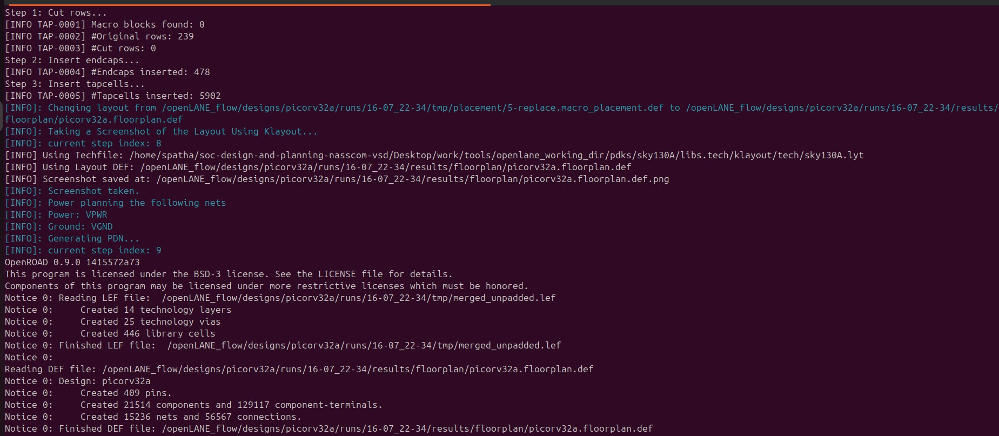

⚠️ **Potential Errors During Floorplanning**

When running:

```shell
run_floorplan
```
you may encounter errors, especially for macro-less designs like picorv32a. These errors are typically due to macro_placement steps within the OpenROAD flow that expect macros to be present in the design.

🧩 **Why the Error Occurs?**
The script or_basic_mp.tcl, which handles macro placement, assumes that the design contains macros (like SRAMs or IPs). If no such macros are present, OpenROAD may crash or throw errors during this step:
```shell
macro_placement -global_config glb.cfg
```
For designs without any macros, this command should be skipped to avoid unnecessary failures.

🛠️ **How to Fix It?**
You need to modify the or_basic_mp.tcl script to check whether the design contains macros, and only run macro_placement if macros are found.

✅ This change ensures macro placement is only performed when necessary.

Replace the contents of:
```shell
/openLANE_flow/scripts/openroad/or_basic_mp.tcl
```

#### Step 9: Viewing the Floorplan DEF in Magic

To visually inspect the floorplan (DEF) file in the Magic layout editor, use the following command in your terminal from the floorplan results directory:

```shell
magic -T ~/soc-design-and-planning-nasscom-vsd/Desktop/work/tools/openlane_working_dir/pdks/sky130A/libs.tech/magic/sky130A.tech lef read ../../tmp/merged.lef def read picorv32a.floorplan.def &
```

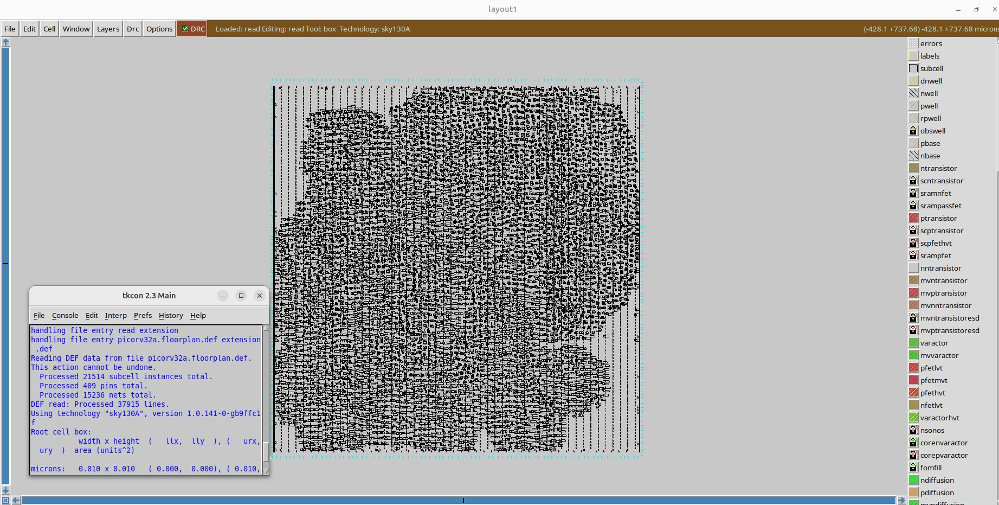

- Press s and v to fit the layout properly on the screen.

- Move the cursor onto a particular object and then press s.

- Go to the tkcon main window.

- Type the command shown in the screenshot (or observe the details displayed).

- The tkcon window will show the details of the selected object.

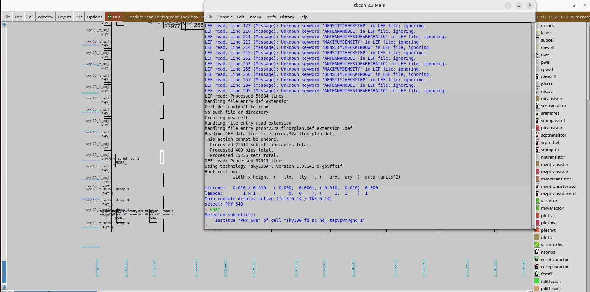

#### Step 10: Calculate the die area in microns from the values in floorplan def

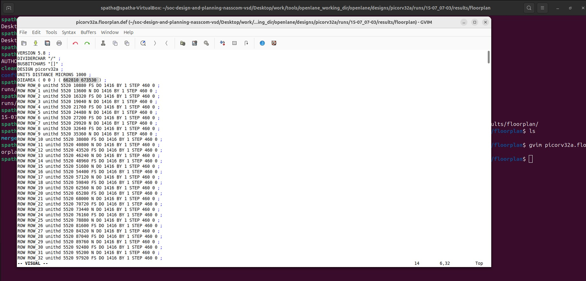

According to floorplan def

```math
1000\ Unit\ Distance = 1\ Micron
```
```math
Die\ width\ in\ unit\ distance = 662810 - 0 = 662810
```
```math
Die\ height\ in\ unit\ distance = 673530 - 0 = 673530
```
```math
Distance\ in\ microns = \frac{Value\ in\ Unit\ Distance}{1000}
```
```math
Die\ width\ in\ microns = \frac{662810}{1000} = 662.810\ Microns
```
```math
Die\ height\ in\ microns = \frac{673530}{1000} = 673.530\ Microns
```
```math
Area\ of\ die\ in\ microns = 662.81 * 673.53 = 446422.4193\ Square\ Microns
```

#### Step 11: Run Placement using OpenLANE

After successful floorplanning, the next major step in the digital backend flow is cell placement. This stage involves arranging the standard cells within the defined core area while minimizing congestion, wire length, and optimizing performance metrics like timing and power.

To initiate placement:
```shell
run_placement
```
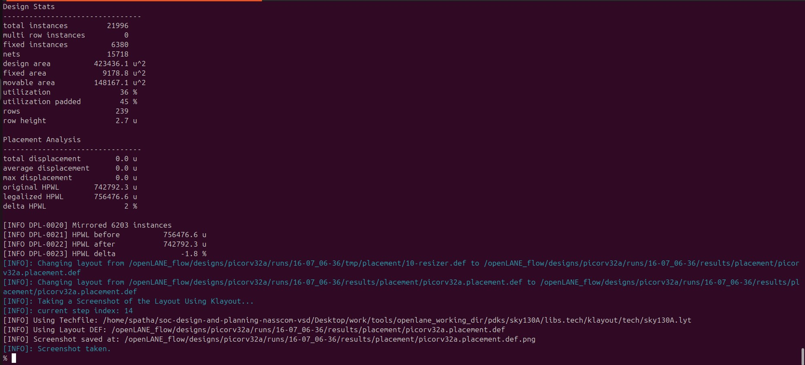


#### Step 12: Viewing the Placement DEF in Magic

```shell
magic -T ~/soc-design-and-planning-nasscom-vsd/Desktop/work/tools/openlane_working_dir/pdks/sky130A/libs.tech/magic/sky130A.tech lef read ../../tmp/merged.lef def read picorv32a.placement.def &
```

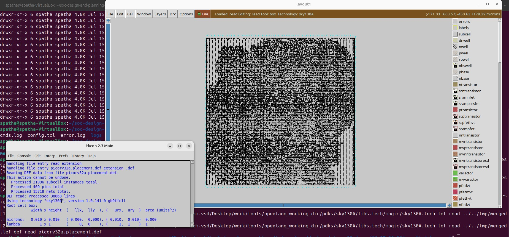

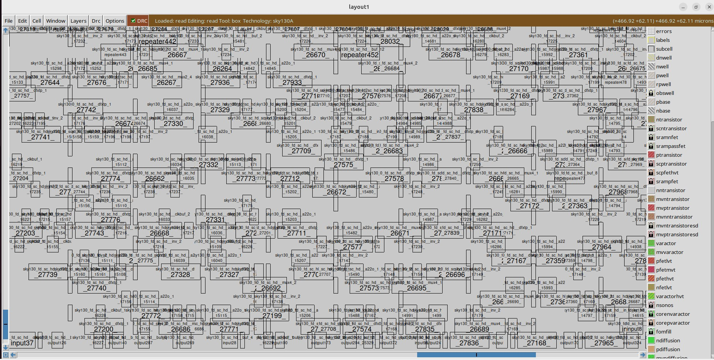

### Viewing the Placement PNG Output

After running the placement step (`run_placement`), a visualization of the placed standard cells is automatically generated.

📁 You can find this file in the placement results directory:

To open this PNG file from the terminal (inside the appropriate directory), use:

```bash
xdg-open picorv32a.placement.def.png
```


#### ❗Error: common_pdn.tcl not found?

During PDN generation, you might encounter this error:

```shell
could not read ".../libs.tech/openlane/common_pdn.tcl": no such file or directory
```

This indicates that the PDN configuration script is missing from your sky130A/libs.tech/openlane/ directory.

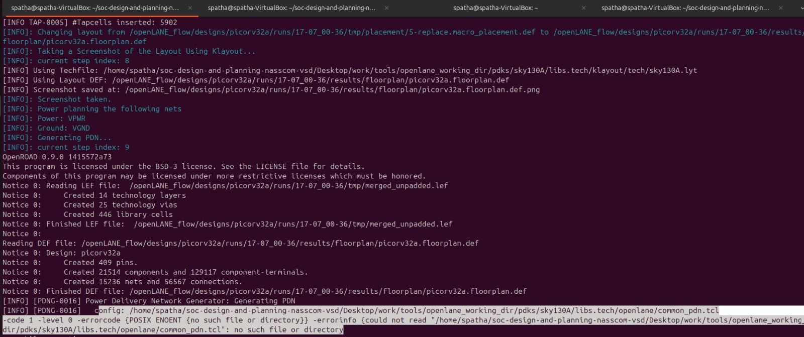

To resolve this, follow these steps to properly set up OpenLane with all required files (including common_pdn.tcl):

### `Steps to fix common_pdn.tcl missing using correct OpenLane clone`
------------

- By following these steps, you should resolve any issues related to PDN generation and ensure that OpenLane is set up correctly with all necessary configuration files.

- This setup includes the **pdn.tcl** file, which is crucial for PDN configuration.

**Steps to install OpenLane, PDKs and Tools:**

```shell
cd $HOME
git clone https://github.com/The-OpenROAD-Project/OpenLane --recurse-submodules 
cd OpenLane
make
make test
cd /home/spatha/OpenLane/designs/ci
cp -r * ../
```

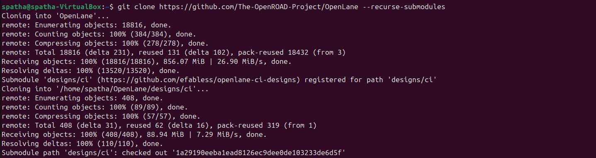

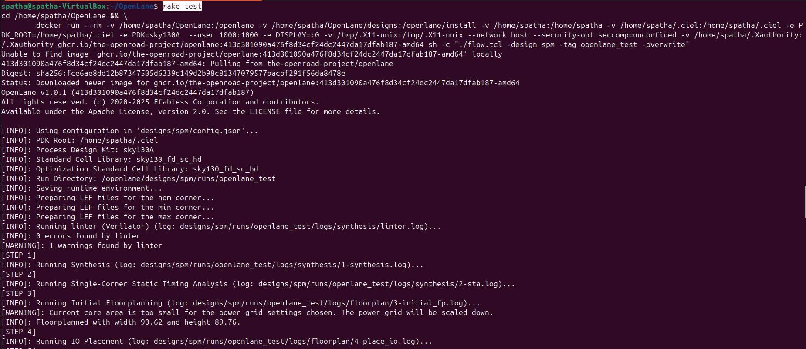

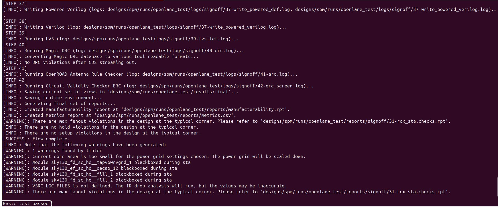


After a successful make when you run `make test` you will have a `Basic test passed` on your terminal. At this step when openlane is running, include the [**picorv32a**](https://github.com/spatha0011/spatha_vsd-hdp/tree/main/Day16/picorv32a).   In order to start open lane and run synthesis we would follow the next steps.

### `run synthesis`

The `run_synthesis` command initiates the synthesis process, where the high-level RTL (Register Transfer Level) design is converted into a gate-level netlist. This step involves mapping the design to standard cells from the technology library, optimizing for area, speed, and power. Synthesis is crucial for ensuring that the design meets its functional and performance requirements before proceeding to physical implementation stages.

```shell
cd ~/OpenLane
make mount
./flow.tcl -interactive
package require openlane 0.9
prep -design picorv32a
run_synthesis
```

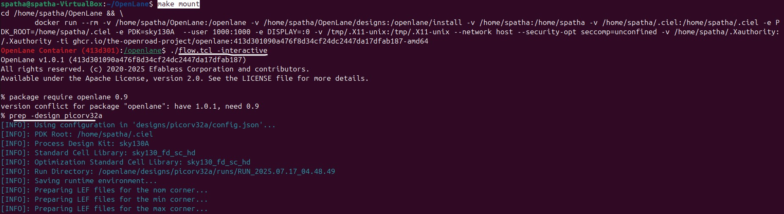

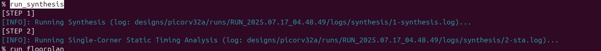

**To view nelist:**

```shell
cd ~/OpenLane/designs/picorv32a/runs/RUN_2025.07.17_04.48.49/results/synthesis/
gvim picorv32a.v
```

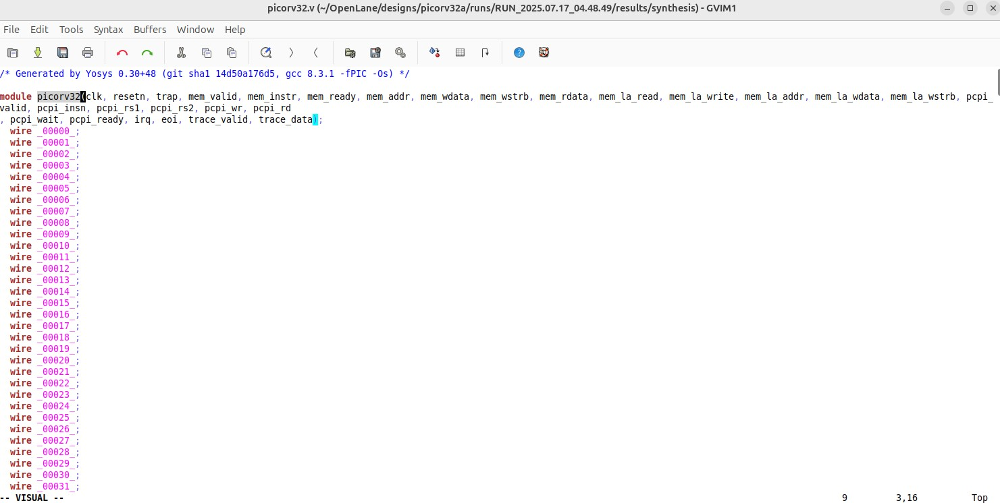

**To view the report:**

```shell
cd ~/OpenLane/designs/picorv32a/runs/RUN_2025.07.17_04.48.49/reports/synthesis
gvim 1-synthesis.AREA_0.stat.rpt
```

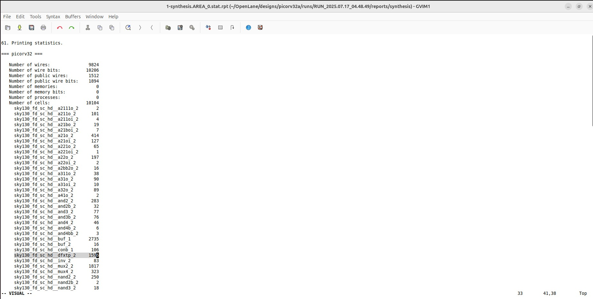


```text
Flop ratio = Number of D Flip flops = 1596  = 0.15795 or 15.79%
             ______________________   _____
             Total Number of cells    10104

```

### `run floorplan`

The `run_floorplan` command initiates the floorplanning stage of the ASIC design flow. This step involves defining the physical layout of the chip, including the arrangement of the core area, placement of macros, and setup of the power distribution network. Floorplanning is essential for optimizing the design's area, performance, and power consumption, as it lays the groundwork for efficient placement and routing.

```shell
run_floorplan
```

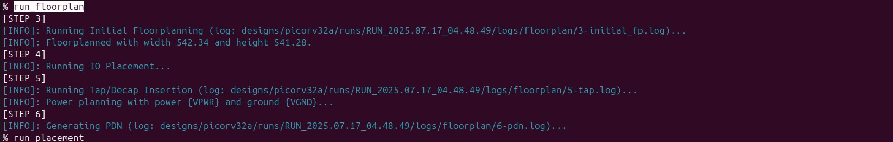

**To view the floorplan def in magic:**

Once the floorplan is complete, you can visualize the DEF (Design Exchange Format) file using Magic, a layout editor. Navigate to the floorplan results directory and execute the following command:

```shell
cd ~/OpenLane/designs/picorv32a/runs/RUN_2025.07.17_04.48.49/results/floorplan
magic -T ~/soc-design-and-planning-nasscom-vsd/Desktop/work/tools/openlane_working_dir/pdks/sky130A/libs.tech/magic/sky130A.tech lef read ../../tmp/merged.nom.lef def read picorv32.def &
```

❗**Note:** Make sure to use the correct Magic technology file (sky130A.tech) corresponding to your installed PDK version and path. An incorrect tech file may cause display issues or loading errors.

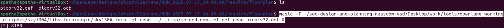

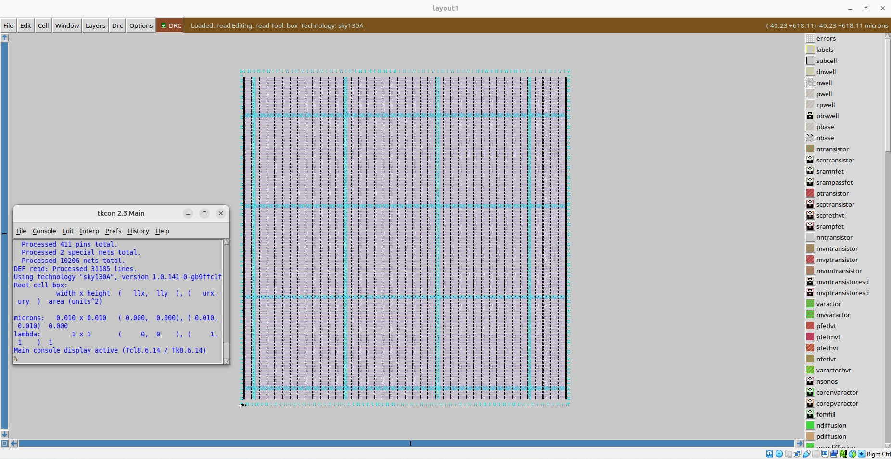

Once you are in the magic layout, we can zoom in and zoom out and select the layers. The view of that would be like this following:


### `run placement`

The `run_placement` command starts the placement process, where standard cells are arranged within the defined core area. This step aims to minimize wire length, reduce congestion, and optimize timing and power metrics. Proper placement is crucial for ensuring that the design meets its performance targets and is ready for routing.

```shell
run_placement
```

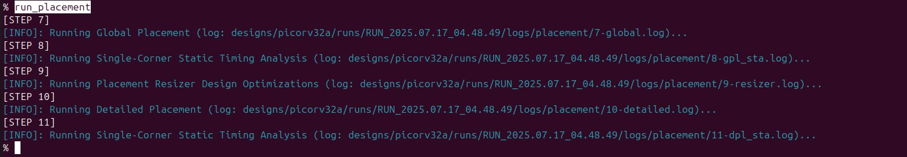

**To view the placement def in magic:**

```shell
cd ~/OpenLane/designs/picorv32a/runs/RUN_2025.07.17_04.48.49/results/placement
magic -T ~/soc-design-and-planning-nasscom-vsd/Desktop/work/tools/openlane_working_dir/pdks/sky130A/libs.tech/magic/sky130A.tech lef read ../../tmp/merged.nom.lef def read picorv32.def &
```

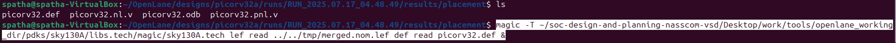

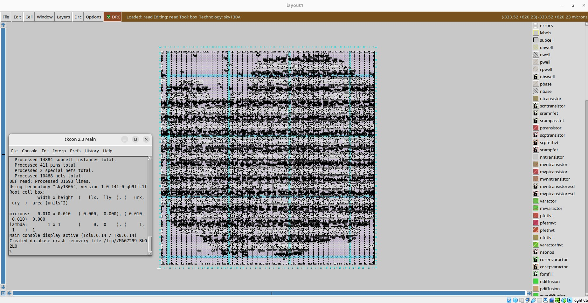

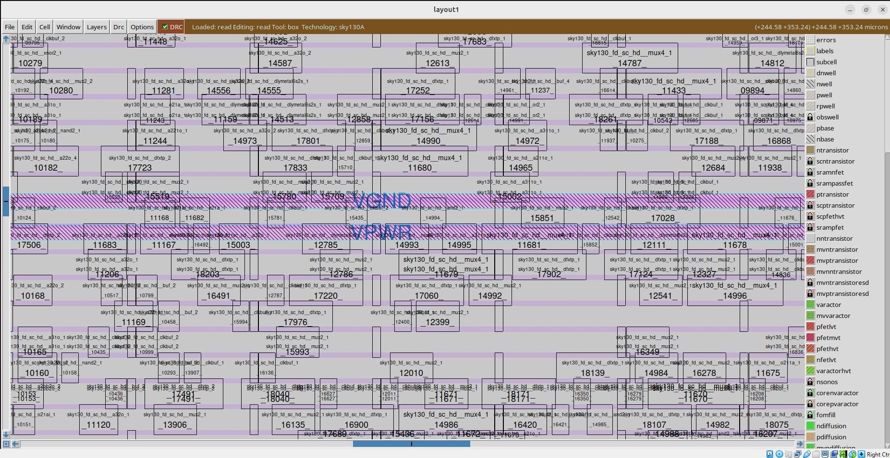

### `run cts`

The `run_cts` command performs Clock Tree Synthesis (CTS), a critical step in the design flow. CTS involves inserting clock buffers and routing the clock net to balance skew and ensure proper timing across all sequential elements. This process is vital for maintaining synchronization throughout the design and achieving reliable operation.

```shell
run_cts
```

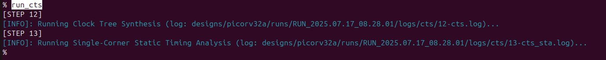


```shell
cd ~/OpenLane/designs/picorv32a/runs/RUN_2025.07.17_08.28.01/results/cts
magic -T ~/soc-design-and-planning-nasscom-vsd/Desktop/work/tools/openlane_working_dir/pdks/sky130A/libs.tech/magic/sky130A.tech lef read ../../tmp/merged.nom.lef def read picorv32.def &
```

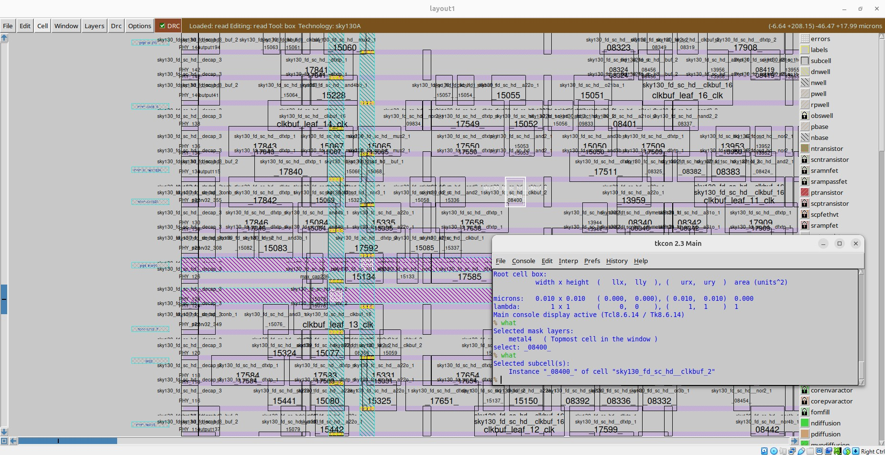

**To view STA log:**

After CTS, STA is run to verify timing. The log file `cts/13-cts_sta.log` reports hold checks (min delay paths) between flip-flops.  

For example, in the path from `_17638_` to `_17735_`, the inserted clock buffers distribute the clock with proper delays, and the final reported **hold slack of 0.15ns** indicates the path meets hold timing.

```shell
gvim designs/picorv32a/runs/RUN_2025.07.17_08.28.01/logs/cts/13-cts_sta.log
```

```text
===========================================================================
report_checks -path_delay min (Hold)
============================================================================
======================= Typical Corner ===================================

Startpoint: _17638_ (rising edge-triggered flip-flop clocked by clk)
Endpoint: _17735_ (rising edge-triggered flip-flop clocked by clk)
Path Group: clk
Path Type: min

Fanout     Cap    Slew   Delay    Time   Description
-----------------------------------------------------------------------------
                          0.00    0.00   clock clk (rise edge)
                          0.00    0.00   clock source latency
                  0.25    0.16    0.16 ^ clk (in)
     1    0.05                           clk (net)
                  0.25    0.00    0.16 ^ clkbuf_0_clk/A (sky130_fd_sc_hd__clkbuf_16)
                  0.10    0.23    0.39 ^ clkbuf_0_clk/X (sky130_fd_sc_hd__clkbuf_16)
     4    0.08                           clknet_0_clk (net)
                  0.10    0.00    0.39 ^ clkbuf_2_1_0_clk/A (sky130_fd_sc_hd__clkbuf_8)
                  0.19    0.24    0.63 ^ clkbuf_2_1_0_clk/X (sky130_fd_sc_hd__clkbuf_8)
     8    0.10                           clknet_2_1_0_clk (net)
                  0.19    0.00    0.63 ^ clkbuf_5_14__f_clk/A (sky130_fd_sc_hd__clkbuf_16)
                  0.08    0.20    0.83 ^ clkbuf_5_14__f_clk/X (sky130_fd_sc_hd__clkbuf_16)
     7    0.06                           clknet_5_14__leaf_clk (net)
                  0.08    0.00    0.83 ^ clkbuf_leaf_69_clk/A (sky130_fd_sc_hd__clkbuf_16)
                  0.03    0.12    0.95 ^ clkbuf_leaf_69_clk/X (sky130_fd_sc_hd__clkbuf_16)
     3    0.01                           clknet_leaf_69_clk (net)
                  0.03    0.00    0.95 ^ _17638_/CLK (sky130_fd_sc_hd__dfxtp_1)
                  0.09    0.32    1.27 ^ _17638_/Q (sky130_fd_sc_hd__dfxtp_1)
     2    0.01                           decoded_rd[2] (net)
                  0.09    0.00    1.27 ^ _15545_/B2 (sky130_fd_sc_hd__a22o_1)
                  0.04    0.12    1.38 ^ _15545_/X (sky130_fd_sc_hd__a22o_1)
     1    0.00                           _00993_ (net)
                  0.04    0.00    1.38 ^ _17735_/D (sky130_fd_sc_hd__dfxtp_1)
                                  1.38   data arrival time

                          0.00    0.00   clock clk (rise edge)
                          0.00    0.00   clock source latency
                  0.25    0.18    0.18 ^ clk (in)
     1    0.05                           clk (net)
                  0.25    0.00    0.18 ^ clkbuf_0_clk/A (sky130_fd_sc_hd__clkbuf_16)
                  0.10    0.25    0.43 ^ clkbuf_0_clk/X (sky130_fd_sc_hd__clkbuf_16)
     4    0.08                           clknet_0_clk (net)
                  0.10    0.00    0.43 ^ clkbuf_2_1_0_clk/A (sky130_fd_sc_hd__clkbuf_8)
                  0.19    0.27    0.70 ^ clkbuf_2_1_0_clk/X (sky130_fd_sc_hd__clkbuf_8)
     8    0.10                           clknet_2_1_0_clk (net)
                  0.19    0.00    0.70 ^ clkbuf_5_15__f_clk/A (sky130_fd_sc_hd__clkbuf_16)
                  0.10    0.23    0.93 ^ clkbuf_5_15__f_clk/X (sky130_fd_sc_hd__clkbuf_16)
     8    0.08                           clknet_5_15__leaf_clk (net)
                  0.10    0.00    0.93 ^ clkbuf_leaf_80_clk/A (sky130_fd_sc_hd__clkbuf_16)
                  0.04    0.15    1.08 ^ clkbuf_leaf_80_clk/X (sky130_fd_sc_hd__clkbuf_16)
     7    0.02                           clknet_leaf_80_clk (net)
                  0.04    0.00    1.08 ^ _17735_/CLK (sky130_fd_sc_hd__dfxtp_1)
                          0.25    1.33   clock uncertainty
                         -0.07    1.26   clock reconvergence pessimism
                         -0.03    1.23   library hold time
                                  1.23   data required time
-----------------------------------------------------------------------------
                                  1.23   data required time
                                 -1.38   data arrival time
-----------------------------------------------------------------------------
                                  0.15   slack (MET)
```

### `run routing`

The `run_routing` command executes the detailed routing stage, connecting all placed standard cells and macros with metal tracks to realize the netlist connections physically. Routing ensures signal integrity, minimizes crosstalk, and meets design rules for manufacturability. This step is essential for completing the physical implementation of the design.

```shell
run_routing
```

```shell
cd ~/OpenLane/designs/picorv32a/runs/RUN_2025.07.17_08.28.01/results/routing
magic -T ~/soc-design-and-planning-nasscom-vsd/Desktop/work/tools/openlane_working_dir/pdks/sky130A/libs.tech/magic/sky130A.tech lef read ../../tmp/merged.nom.lef def read picorv32.def &
```

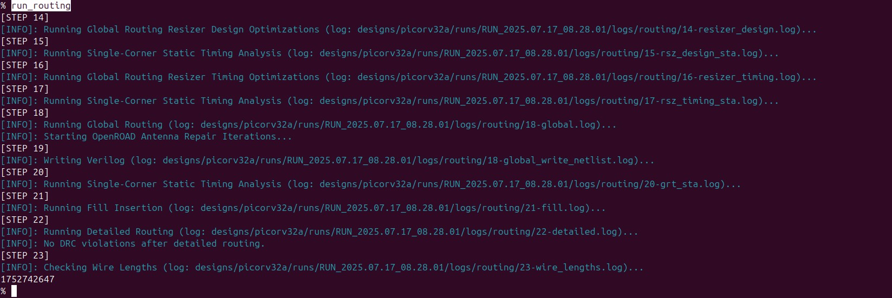

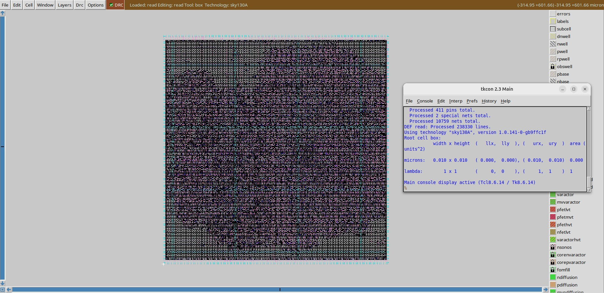

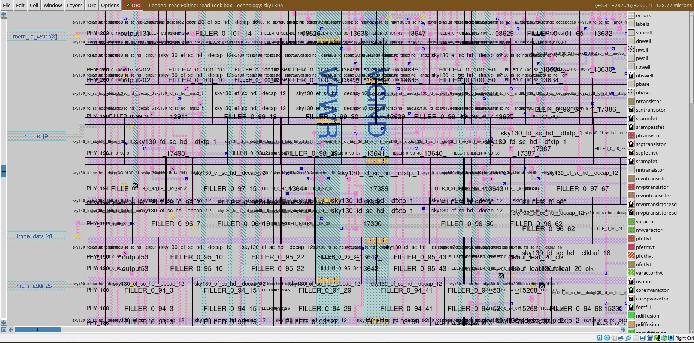


### `Flow Stage Cheatsheet`

| 🔢 Step | 📄 Log File                   | 🧩 Stage Name                               | 🛠️ Description                                                       |
| ------- | ----------------------------- | ------------------------------------------- | --------------------------------------------------------------------- |
| 1       | `1-synthesis.log`             | **Synthesis**                               | Converts RTL (Verilog) to gate-level netlist using Yosys.             |
| 2       | `2-sta.log`                   | **Pre-Floorplan STA**                       | Static Timing Analysis (STA) after synthesis to check for violations. |
| 3       | `3-initial_fp.log`            | **Initial Floorplanning** (`run_floorplan`) | Sets die/core dimensions and macro placement.                         |
| 4       | `4-io.log`                    | **IO Placement**                            | Places I/O pads around the die boundary.                              |
| 5       | `5-tap.log`                   | **Tap & Decap Insertion**                   | Adds well taps and decap cells to ensure power integrity.             |
| 6       | `6-pdn.log`                   | **PDN Generation**                          | Builds the power delivery network (stripes/rings for VPWR/VGND).      |
| 7       | `7-global.log`                | **Global Placement**                        | Places standard cells approximately for optimal routing.              |
| 8       | `8-gpl_sta.log`               | **Post-Global Placement STA**               | Verifies timing after global placement.                               |
| 9       | `9-resizer.log`               | **Resizer Optimization**                    | Buffers or resizes cells to improve timing.                           |
| 10      | `10-detailed.log`             | **Detailed Placement**                      | Legally places all standard cells to the site grid.                   |
| 11      | `11-dpl_sta.log`              | **Post-DPL STA**                            | STA after detailed placement.                                         |
| 12      | `12-cts.log`                  | **Clock Tree Synthesis (CTS)**              | Builds and balances the clock tree.                                   |
| 13      | `13-cts_sta.log`              | **Post-CTS STA**                            | STA including the inserted clock buffers.                             |
| 14      | `14-resizer_design.log`       | **Resizer Design Optimization**             | Placement adjustments to ease routing.                                |
| 15      | `15-rsz_design_sta.log`       | **Post-Design STA**                         | STA after design-aware optimization.                                  |
| 16      | `16-resizer_timing.log`       | **Resizer Timing Optimization**             | Final adjustments to meet timing.                                     |
| 17      | `17-rsz_timing_sta.log`       | **Post-Timing STA**                         | Final STA before routing.                                             |
| 18      | `18-global.log`               | **Global Routing**                          | Performs top-level routing estimation.                                |
| 19      | `18-global_write_netlist.log` | **Netlist Export**                          | Writes post-routing netlist (Verilog/DEF).                            |
| 20      | `20-grt_sta.log`              | **Post-GR STA**                             | Timing check after global routing.                                    |
| 21      | `21-fill.log`                 | **Fill Insertion**                          | Inserts dummy metal fill cells to meet density requirements.          |
| 22      | `22-detailed.log`             | **Detailed Routing**                        | Final detailed routing with DRC checks.                               |
| 23      | `23-wire_lengths.log`         | **Wire Length Report**                      | Reports total wire length after routing.                              |
