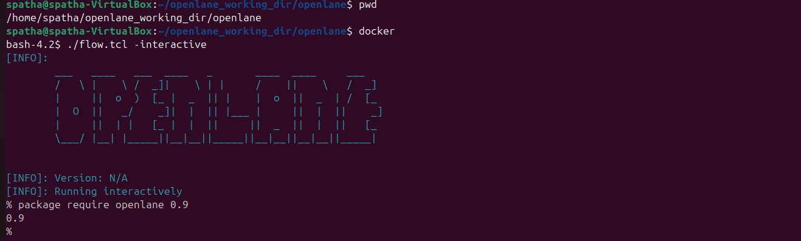
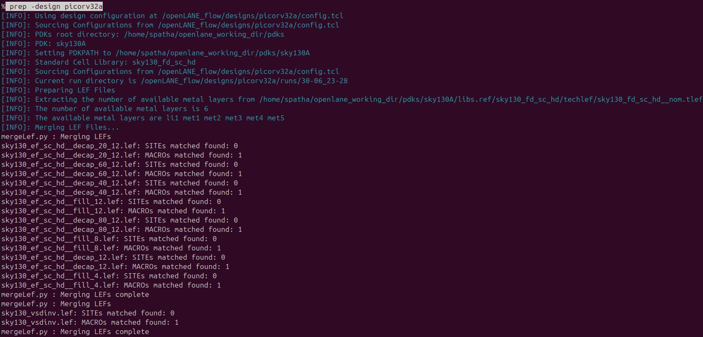
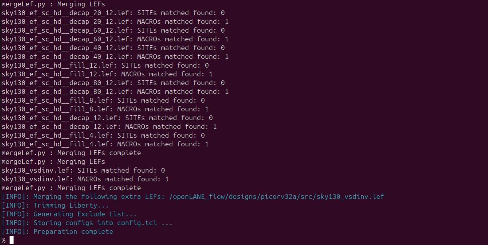

# VSD Hardware Design Program

##  Advanced Physical Design using OpenLane

### OpenLane ASIC Flow

The OpenLane flow is an automated, open-source framework designed to convert RTL designs into manufacturable layouts, integrating multiple stages of the digital IC design process. Starting with RTL synthesis using Yosys and ABC, the flow performs static timing analysis (STA) with OpenSTA and incorporates Design for Testability (DFT) to ensure fault coverage. The OpenROAD App facilitates floorplanning, placement, clock tree synthesis (CTS), optimization, and global routing, streamlining the physical design process. Custom scripts handle antenna diode insertion, while Yosys performs Logic Equivalence Checking (LEC) to verify design integrity. TritonRoute manages detailed routing, ensuring signal integrity and minimizing congestion. RC extraction is conducted using DEF2SPEF, followed by STA to confirm timing compliance. Magic and Netgen are employed for physical verification, including Design Rule Checking (DRC) and Layout vs. Schematic (LVS) checks, ensuring the design adheres to manufacturing constraints. The final output is a GDSII/LEF file, ready for fabrication, supported by the SW PDK which provides technology-specific data and libraries. This comprehensive flow enables efficient design exploration and optimization, leveraging open-source tools to deliver high-quality, manufacturable designs.


###  OpenLane Flow Toolchain Overview

The OpenLane flow utilizes a suite of open-source tools to efficiently transform RTL designs into manufacturable layouts. Each stage of the design process is supported by specialized tools, ensuring optimal performance and compliance with design rules.

#### RTL Synthesis, Technology Mapping, and Formal Verification
- **Tools Used**: 
  - **Yosys**: For RTL synthesis, converting high-level design into a gate-level netlist.
  - **ABC**: For technology mapping and formal verification, optimizing logic for specific technology nodes.

#### Static Timing Analysis
- **Tools Used**: 
  - **OpenSTA**: For static timing analysis, ensuring the design meets timing constraints.

#### Floor Planning
- **Tools Used**: 
  - **init_fp**: For initial floorplanning, defining the physical layout of the chip.
  - **ioPlacer**: For I/O placement, organizing input/output pins efficiently.
  - **pdn**: For power distribution network planning, ensuring robust power delivery.
  - **tapcell**: For tap cell insertion, maintaining well connections across the design.

#### Placement
- **Tools Used**: 
  - **RePLace**: For global placement, arranging standard cells within the floorplan.
  - **Resizer**: Optional tool for resizing cells to optimize area and performance.
  - **OpenPhySyn**: Formerly used for placement optimization.
  - **OpenDP**: For detailed placement, finalizing cell positions.

#### Clock Tree Synthesis
- **Tools Used**: 
  - **TritonCTS**: For clock tree synthesis, distributing clock signals uniformly.

#### Fill Insertion
- **Tools Used**: 
  - **OpenDP**: For filler placement, ensuring density requirements are met.

#### Routing
- **Tools Used**: 
  - **FastRoute or CU-GR**: Formerly used for global routing.
  - **TritonRoute**: For detailed routing, ensuring signal integrity and minimizing congestion.
  - **DR-CU**: Formerly used for detailed routing.

#### SPEF Extraction
- **Tools Used**: 
  - **OpenRCX**: For Standard Parasitic Exchange Format (SPEF) extraction, capturing parasitic effects.
  - **SPEF-Extractor**: Formerly used for SPEF extraction.

#### GDSII Streaming Out
- **Tools Used**: 
  - **Magic and KLayout**: For viewing and editing GDSII files, preparing for fabrication.

#### Design Rule Checking (DRC) Checks
- **Tools Used**: 
  - **Magic and KLayout**: For DRC checks, ensuring compliance with manufacturing rules.

#### Layout vs. Schematic (LVS) Check
- **Tools Used**: 
  - **Netgen**: For LVS checks, verifying the layout matches the schematic.

#### Antenna Checks
- **Tools Used**: 
  - **Magic**: For antenna checks, preventing damage during fabrication.

This toolchain provides a robust framework for digital IC design, leveraging open-source tools to deliver high-quality, manufacturable designs efficiently.

###  OpenLANE Directory Structure

The OpenLANE directory structure is organized to facilitate efficient design and process management for digital IC design using open-source tools. Below is an overview of the directory structure and its contents:

```text
├── OOpenLane             -> directory where the tool can be invoked (run docker first)
│   ├── designs          -> All designs must be extracted from this folder
│   │   │   ├── picorv32a -> Design used as case study for this workshop
│   |   |   ├── ...
|   |   ├── ...
├── pdks                 -> contains pdk related files 
│   ├── skywater-pdk     -> all Skywater 130nm PDKs
│   ├── open-pdks        -> contains scripts that makes the commerical PDK (which is normally just compatible to commercial tools) to also be compatible with the open-source EDA tool
│   ├── sky130A          -> pdk variant made especially compatible for open-source tools
│   │   │  ├── libs.ref  -> files specific to node process (timing lib, cell lef, tech lef) for example is `sky130_fd_sc_hd` (Sky130nm Foundry Standard Cell High Density)  
│   │   │  ├── libs.tech -> files specific for the tool (klayout,netgen,magic...) 
```

### Synthesis in Openlane for 'picorv32a' design :

First, clone the necessary files from the GitHub repository to your local machine:

```shell
git clone https://github.com/fayizferosh/soc-design-and-planning-nasscom-vsd.git
```

Commands to invoke the OpenLANE flow and perform synthesis

```shell
# Change directory to openlane flow directory
cd ~/openlane_working_dir/openlane

# alias docker='docker run -it -v $(pwd):/openLANE_flow -v $PDK_ROOT:$PDK_ROOT -e PDK_ROOT=$PDK_ROOT -u $(id -u $USER):$(id -g $USER) efabless/openlane:v0.21'
# Since we have aliased the long command to 'docker' we can invoke the OpenLANE flow docker sub-system by just running this command
docker
```

```shell
# Now that we have entered the OpenLANE flow contained docker sub-system we can invoke the OpenLANE flow in the Interactive mode using the following command
./flow.tcl -interactive

# Now that OpenLANE flow is open we have to input the required packages for proper functionality of the OpenLANE flow
package require openlane 0.9

# Now the OpenLANE flow is ready to run any design and initially we have to prep the design creating some necessary files and directories for running a specific design which in our case is 'picorv32a'
prep -design picorv32a

# Now that the design is prepped and ready, we can run synthesis using following command
run_synthesis

# Exit from OpenLANE flow
exit

# Exit from OpenLANE flow docker sub-system
exit
```



<p float="left">
  
  
</p>
