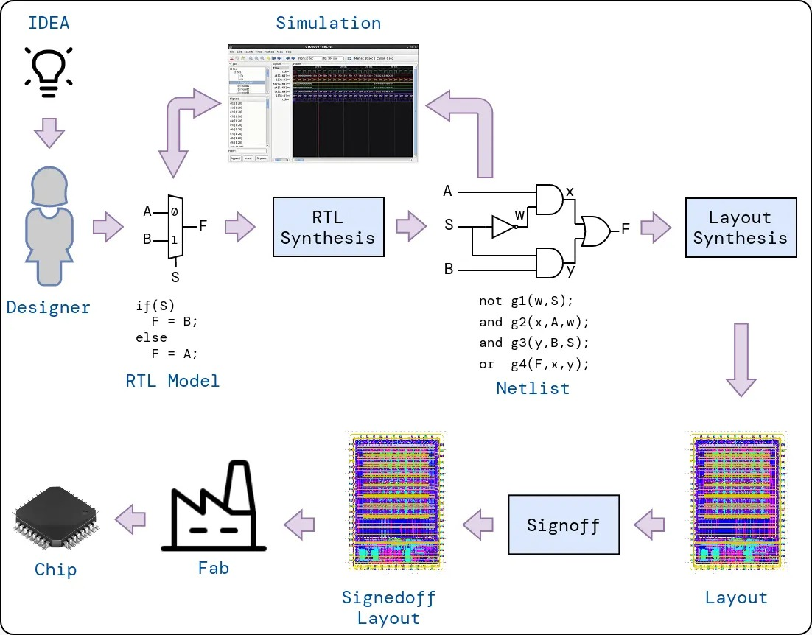
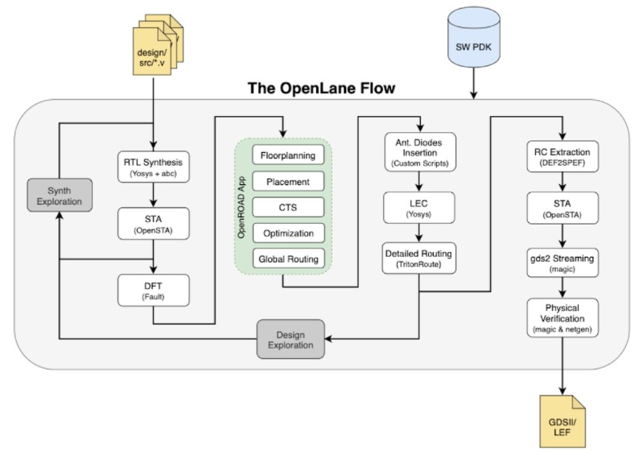
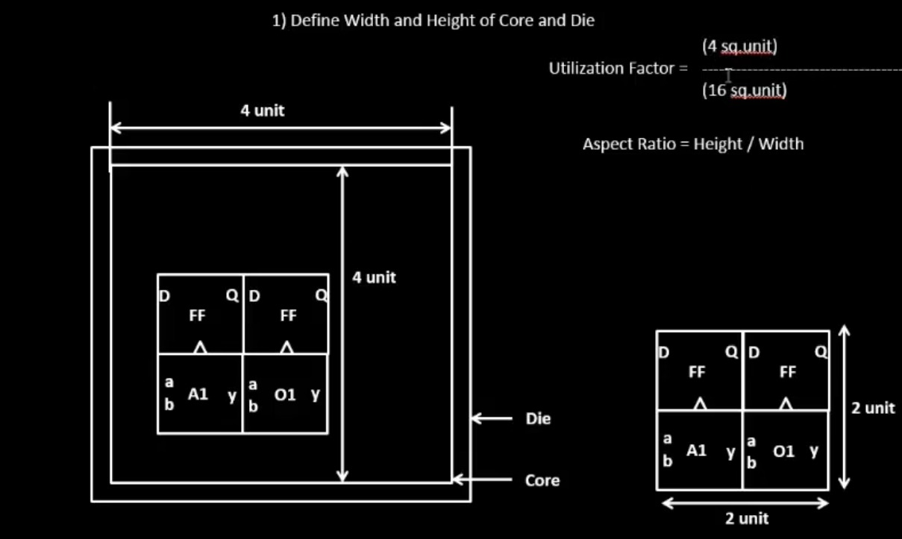

# VSD Hardware Design Program

##  Advanced Physical Design using OpenLane

### 📚 Contents
  - [ASIC flow](#asic-flow)
  - [OpenLane ASIC Flow](#openlane-asic-flow)
  - [OpenLane Flow Toolchain Overview](#openlane-flow-toolchain-overview)
  - [OpenLANE Directory Structure](#openlane-directory-structure)


### `ASIC Flow`

VLSI, or Very Large-Scale Integration, is a cornerstone technology driving the modern world, silently powering the devices we rely on daily. Its importance stems from its profound impact on various aspects of our lives, making it ubiquitous. VLSI facilitated the fabrication of chips. A chip is a small piece of semiconductor material (usually silicon) containing integrated circuits. These circuits consist of millions or even billions of tiny switches called transistors and other electronic components that process information and perform various functions. These chips are the brains behind countless electronic devices, from smartphones and computers to cars and medical equipment.

One class of chips is called ASIC. ASIC is a type of chip custom-designed for a specific purpose, unlike general-purpose chips like microprocessors that can be used for various tasks. One of the most prominent examples of ASIC is smartphone processors. These chips are custom-designed for mobile devices, focusing on low power consumption and high performance for running apps, gaming, and streaming media. They often incorporate specialized cores for graphics processing, artificial intelligence, and image signal processing.

Designing an ASIC is a complex and fascinating process that entails various steps, from idea to the fabrication data. This process is filled with engineering challenges that require expertise and attention to detail. The entire process requires significant expertise and experience in chip design and can take several months to complete. The ASIC design flow is crucial to ensure successful ASIC design. It is based on a comprehensive understanding of ASIC specifications, requirements, low-power design, and performance. Engineers can streamline the process and meet crucial time-to-market goals by following a proven ASIC design flow. Each stage of the ASIC design cycle is supported by powerful EDA (Electronic Design Automation) tools that facilitate the implementation of the design. The following are examples of steps needed to realize an ASIC.

**Design Entry:** In this step, the logic design is described using a Hardware Description Language (HDL) like System Verilog. Typically, the description is done at the data flow (Register Transfer) or behavioral levels.

**Functional Verification:** It is essential to catch design errors early on. The description must be checked against the requirements, which can be done through simulation or formal methods. Functional verification is performed on the RTL description as well as the netlists generated by the following steps.

**Synthesis:** In this step, the HDL description is converted into a circuit of the logic cells called the Netlist.

**Layout/Physical Synthesis:** Also called Physical Implementation. In this step, the logic circuit is converted into a layout of the photo masks used for fabrication. This complex step involves several sub-steps typically automated using its flow. These steps include Floorplanning, Placement, Clock-tree synthesis and Routing. Because Placement and Routing are the most time-consuming operations, sometimes we refer to this step as “Placement and Routing”, or PnR.

**Signoff:** marks the final stage in the rigorous journey of an ASIC’s design; it ensures your creation functions flawlessly, operates efficiently, and ultimately delivers on its promise before sending your chip blueprint off to be carved in silicon.

Please note that the `five mentioned steps` are the major ones. There are several other design steps that are not mentioned here such as scan chain insertion and test pattern generations that are essential to testing the fabricated chip against fabrication defects.



### `OpenLane ASIC Flow`

The OpenLane flow is an automated, open-source framework designed to convert RTL designs into manufacturable layouts, integrating multiple stages of the digital IC design process. Starting with RTL synthesis using Yosys and ABC, the flow performs static timing analysis (STA) with OpenSTA and incorporates Design for Testability (DFT) to ensure fault coverage. The OpenROAD App facilitates floorplanning, placement, clock tree synthesis (CTS), optimization, and global routing, streamlining the physical design process. Custom scripts handle antenna diode insertion, while Yosys performs Logic Equivalence Checking (LEC) to verify design integrity. TritonRoute manages detailed routing, ensuring signal integrity and minimizing congestion. RC extraction is conducted using DEF2SPEF, followed by STA to confirm timing compliance. Magic and Netgen are employed for physical verification, including Design Rule Checking (DRC) and Layout vs. Schematic (LVS) checks, ensuring the design adheres to manufacturing constraints. The final output is a GDSII/LEF file, ready for fabrication, supported by the SW PDK which provides technology-specific data and libraries. This comprehensive flow enables efficient design exploration and optimization, leveraging open-source tools to deliver high-quality, manufacturable designs.



### `OpenLane Flow Toolchain Overview`

The OpenLane flow utilizes a suite of open-source tools to efficiently transform RTL designs into manufacturable layouts. Each stage of the design process is supported by specialized tools, ensuring optimal performance and compliance with design rules.

#### RTL Synthesis, Technology Mapping, and Formal Verification
- **Tools Used**: 
  - **Yosys**: For RTL synthesis, converting high-level design into a gate-level netlist.
  - **ABC**: For technology mapping and formal verification, optimizing logic for specific technology nodes.

#### Static Timing Analysis
- **Tools Used**: 
  - **OpenSTA**: For static timing analysis, ensuring the design meets timing constraints.

#### Floor Planning
- **Tools Used**: 
  - **init_fp**: For initial floorplanning, defining the physical layout of the chip.
  - **ioPlacer**: For I/O placement, organizing input/output pins efficiently.
  - **pdn**: For power distribution network planning, ensuring robust power delivery.
  - **tapcell**: For tap cell insertion, maintaining well connections across the design.

#### Placement
- **Tools Used**: 
  - **RePLace**: For global placement, arranging standard cells within the floorplan.
  - **Resizer**: Optional tool for resizing cells to optimize area and performance.
  - **OpenPhySyn**: Formerly used for placement optimization.
  - **OpenDP**: For detailed placement, finalizing cell positions.

#### Clock Tree Synthesis
- **Tools Used**: 
  - **TritonCTS**: For clock tree synthesis, distributing clock signals uniformly.

#### Fill Insertion
- **Tools Used**: 
  - **OpenDP**: For filler placement, ensuring density requirements are met.

#### Routing
- **Tools Used**: 
  - **FastRoute or CU-GR**: Formerly used for global routing.
  - **TritonRoute**: For detailed routing, ensuring signal integrity and minimizing congestion.
  - **DR-CU**: Formerly used for detailed routing.

#### SPEF Extraction
- **Tools Used**: 
  - **OpenRCX**: For Standard Parasitic Exchange Format (SPEF) extraction, capturing parasitic effects.
  - **SPEF-Extractor**: Formerly used for SPEF extraction.

#### GDSII Streaming Out
- **Tools Used**: 
  - **Magic and KLayout**: For viewing and editing GDSII files, preparing for fabrication.

#### Design Rule Checking (DRC) Checks
- **Tools Used**: 
  - **Magic and KLayout**: For DRC checks, ensuring compliance with manufacturing rules.

#### Layout vs. Schematic (LVS) Check
- **Tools Used**: 
  - **Netgen**: For LVS checks, verifying the layout matches the schematic.

#### Antenna Checks
- **Tools Used**: 
  - **Magic**: For antenna checks, preventing damage during fabrication.

This toolchain provides a robust framework for digital IC design, leveraging open-source tools to deliver high-quality, manufacturable designs efficiently.

### `OpenLANE Directory Structure`

The OpenLANE directory structure is organized to facilitate efficient design and process management for digital IC design using open-source tools. Below is an overview of the directory structure and its contents:

```text
├── OpenLane             -> directory where the tool can be invoked (run docker first)
│   ├── designs          -> All designs must be extracted from this folder
│   │   │   ├── picorv32a -> Design used as case study for this workshop
│   |   |   ├── ...
|   |   ├── ...
├── pdks                 -> contains pdk related files 
│   ├── skywater-pdk     -> all Skywater 130nm PDKs
│   ├── open-pdks        -> contains scripts that makes the commerical PDK (which is normally just compatible to commercial tools) to also be compatible with the open-source EDA tool
│   ├── sky130A          -> pdk variant made especially compatible for open-source tools
│   │   │  ├── libs.ref  -> files specific to node process (timing lib, cell lef, tech lef) for example is `sky130_fd_sc_hd` (Sky130nm Foundry Standard Cell High Density)  
│   │   │  ├── libs.tech -> files specific for the tool (klayout,netgen,magic...) 
```

### `Good floorplan vs bad floorplan and introduction to library cells`

#### Floorplan considerations

  1) Utilization factor and aspect ratio
       * Define W, H of core and die
           * Utilization Factor = (Area occupied by netlist)/(Total area of the core)
           * Usually we aim for 50-60 % Utilization Factor
        * Aspect Ratio = Height/ Width

      
     
  3) Define locations of pre-placed cells (macros and IPs ?)
       * IPs/ blocks have user-defined locations and hence placed before automated PnR and are called as pre-placed cells
       * Automated PnR tools places the remaining logical cells in the design onto the chip
        
  4) Decaps
       * Decouples the circuit from the VDD rail
       * Reduce Zpdn for the required frequencies of operation
       * Serve as a charge reservoir for the switching current demands that the VDD rail cannot satisfy.
       * Surround pre-placed cells with Decaps to compensate for the switching current demands (di/dt)
        
  5) Power Planning
     * SSN
       * L*di/dt
         * Discharging : Ground bounce
         * Charging    : Voltage Droop
       * **Solution:** Reduce the Vdd/ Vss parasitics ->
         * Power grid
         * Multiple VDD, VSS pins/ balls 
    
  6) Pin Placement
     * Usually: East -> West, North -> South, {East, North} -> {West, South}
     * Pin ordering is random (unless we specify explicitly ?)
     * Front-End to Back-End team communication/ handshaking needed for optimal pin placement
     * CLK ports/ pins are usually bigger to reduce the clk net resistance
        
  7) Logical Cell placement blockage - so that no cells are placed by the PnR tool inside the IP blocks/ macro area.

