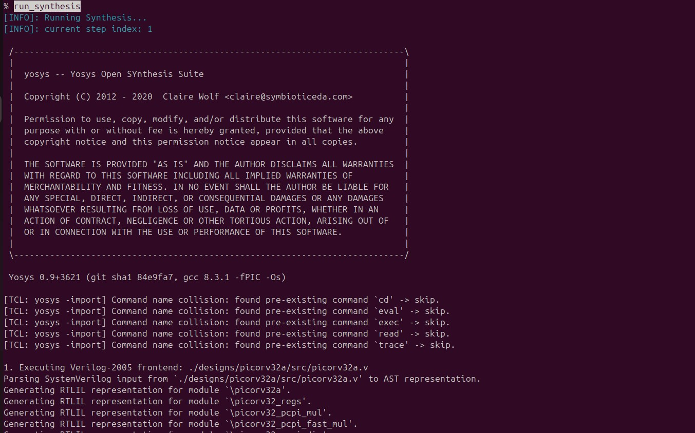
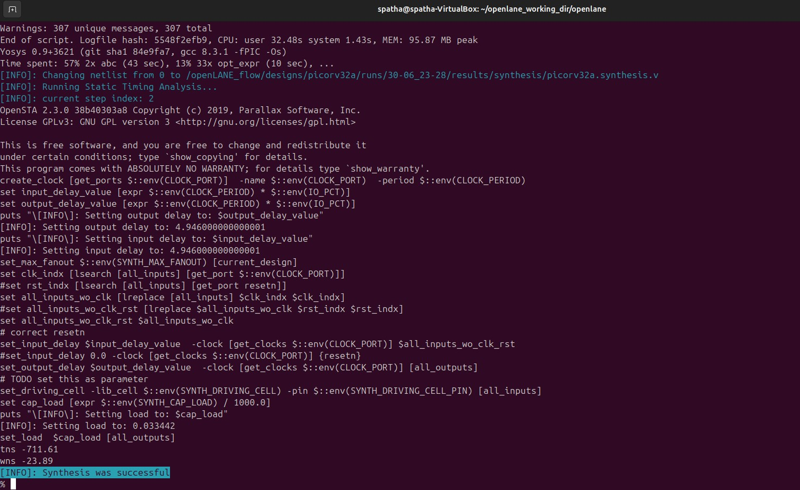
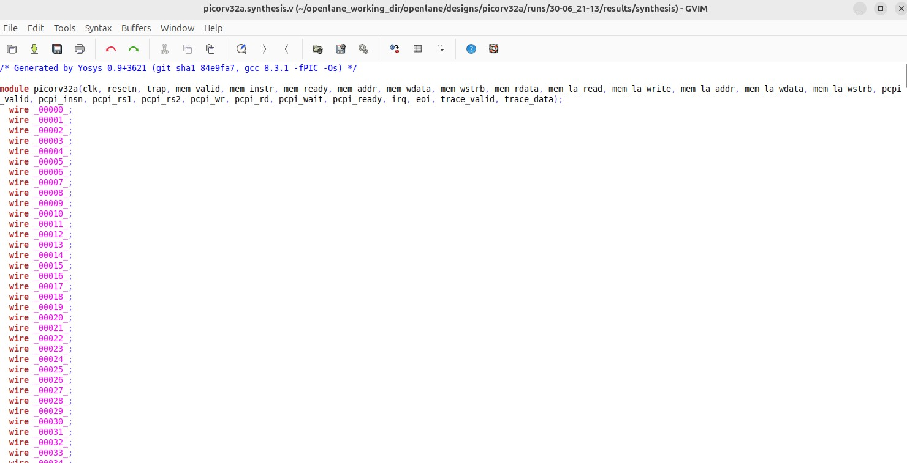

# VSD Hardware Design Program

##  Advanced Physical Design using OpenLane

### 📚 Contents
  - [ASIC flow](#asic-flow)
  - [OpenLane ASIC Flow](#openlane-asic-flow)
  - [OpenLane Flow Toolchain Overview](#openlane-flow-toolchain-overview)
  - [OpenLANE Directory Structure](#openlane-directory-structure)


### `ASIC Flow`

VLSI, or Very Large-Scale Integration, is a cornerstone technology driving the modern world, silently powering the devices we rely on daily. Its importance stems from its profound impact on various aspects of our lives, making it ubiquitous. VLSI facilitated the fabrication of chips. A chip is a small piece of semiconductor material (usually silicon) containing integrated circuits. These circuits consist of millions or even billions of tiny switches called transistors and other electronic components that process information and perform various functions. These chips are the brains behind countless electronic devices, from smartphones and computers to cars and medical equipment.

One class of chips is called ASIC. ASIC is a type of chip custom-designed for a specific purpose, unlike general-purpose chips like microprocessors that can be used for various tasks. One of the most prominent examples of ASIC is smartphone processors. These chips are custom-designed for mobile devices, focusing on low power consumption and high performance for running apps, gaming, and streaming media. They often incorporate specialized cores for graphics processing, artificial intelligence, and image signal processing.

Designing an ASIC is a complex and fascinating process that entails various steps, from idea to the fabrication data. This process is filled with engineering challenges that require expertise and attention to detail. The entire process requires significant expertise and experience in chip design and can take several months to complete. The ASIC design flow is crucial to ensure successful ASIC design. It is based on a comprehensive understanding of ASIC specifications, requirements, low-power design, and performance. Engineers can streamline the process and meet crucial time-to-market goals by following a proven ASIC design flow. Each stage of the ASIC design cycle is supported by powerful EDA (Electronic Design Automation) tools that facilitate the implementation of the design. The following are examples of steps needed to realize an ASIC.

**Design Entry:** In this step, the logic design is described using a Hardware Description Language (HDL) like System Verilog. Typically, the description is done at the data flow (Register Transfer) or behavioral levels.

**Functional Verification:** It is essential to catch design errors early on. The description must be checked against the requirements, which can be done through simulation or formal methods. Functional verification is performed on the RTL description as well as the netlists generated by the following steps.

**Synthesis:** In this step, the HDL description is converted into a circuit of the logic cells called the Netlist.

**Layout/Physical Synthesis:** Also called Physical Implementation. In this step, the logic circuit is converted into a layout of the photo masks used for fabrication. This complex step involves several sub-steps typically automated using its flow. These steps include Floorplanning, Placement, Clock-tree synthesis and Routing. Because Placement and Routing are the most time-consuming operations, sometimes we refer to this step as “Placement and Routing”, or PnR.

**Signoff:** marks the final stage in the rigorous journey of an ASIC’s design; it ensures your creation functions flawlessly, operates efficiently, and ultimately delivers on its promise before sending your chip blueprint off to be carved in silicon.

Please note that the `five mentioned steps` are the major ones. There are several other design steps that are not mentioned here such as scan chain insertion and test pattern generations that are essential to testing the fabricated chip against fabrication defects.


### `OpenLane ASIC Flow`

The OpenLane flow is an automated, open-source framework designed to convert RTL designs into manufacturable layouts, integrating multiple stages of the digital IC design process. Starting with RTL synthesis using Yosys and ABC, the flow performs static timing analysis (STA) with OpenSTA and incorporates Design for Testability (DFT) to ensure fault coverage. The OpenROAD App facilitates floorplanning, placement, clock tree synthesis (CTS), optimization, and global routing, streamlining the physical design process. Custom scripts handle antenna diode insertion, while Yosys performs Logic Equivalence Checking (LEC) to verify design integrity. TritonRoute manages detailed routing, ensuring signal integrity and minimizing congestion. RC extraction is conducted using DEF2SPEF, followed by STA to confirm timing compliance. Magic and Netgen are employed for physical verification, including Design Rule Checking (DRC) and Layout vs. Schematic (LVS) checks, ensuring the design adheres to manufacturing constraints. The final output is a GDSII/LEF file, ready for fabrication, supported by the SW PDK which provides technology-specific data and libraries. This comprehensive flow enables efficient design exploration and optimization, leveraging open-source tools to deliver high-quality, manufacturable designs.


### `OpenLane Flow Toolchain Overview`

The OpenLane flow utilizes a suite of open-source tools to efficiently transform RTL designs into manufacturable layouts. Each stage of the design process is supported by specialized tools, ensuring optimal performance and compliance with design rules.

#### RTL Synthesis, Technology Mapping, and Formal Verification
- **Tools Used**: 
  - **Yosys**: For RTL synthesis, converting high-level design into a gate-level netlist.
  - **ABC**: For technology mapping and formal verification, optimizing logic for specific technology nodes.

#### Static Timing Analysis
- **Tools Used**: 
  - **OpenSTA**: For static timing analysis, ensuring the design meets timing constraints.

#### Floor Planning
- **Tools Used**: 
  - **init_fp**: For initial floorplanning, defining the physical layout of the chip.
  - **ioPlacer**: For I/O placement, organizing input/output pins efficiently.
  - **pdn**: For power distribution network planning, ensuring robust power delivery.
  - **tapcell**: For tap cell insertion, maintaining well connections across the design.

#### Placement
- **Tools Used**: 
  - **RePLace**: For global placement, arranging standard cells within the floorplan.
  - **Resizer**: Optional tool for resizing cells to optimize area and performance.
  - **OpenPhySyn**: Formerly used for placement optimization.
  - **OpenDP**: For detailed placement, finalizing cell positions.

#### Clock Tree Synthesis
- **Tools Used**: 
  - **TritonCTS**: For clock tree synthesis, distributing clock signals uniformly.

#### Fill Insertion
- **Tools Used**: 
  - **OpenDP**: For filler placement, ensuring density requirements are met.

#### Routing
- **Tools Used**: 
  - **FastRoute or CU-GR**: Formerly used for global routing.
  - **TritonRoute**: For detailed routing, ensuring signal integrity and minimizing congestion.
  - **DR-CU**: Formerly used for detailed routing.

#### SPEF Extraction
- **Tools Used**: 
  - **OpenRCX**: For Standard Parasitic Exchange Format (SPEF) extraction, capturing parasitic effects.
  - **SPEF-Extractor**: Formerly used for SPEF extraction.

#### GDSII Streaming Out
- **Tools Used**: 
  - **Magic and KLayout**: For viewing and editing GDSII files, preparing for fabrication.

#### Design Rule Checking (DRC) Checks
- **Tools Used**: 
  - **Magic and KLayout**: For DRC checks, ensuring compliance with manufacturing rules.

#### Layout vs. Schematic (LVS) Check
- **Tools Used**: 
  - **Netgen**: For LVS checks, verifying the layout matches the schematic.

#### Antenna Checks
- **Tools Used**: 
  - **Magic**: For antenna checks, preventing damage during fabrication.

This toolchain provides a robust framework for digital IC design, leveraging open-source tools to deliver high-quality, manufacturable designs efficiently.

### `OpenLANE Directory Structure`

The OpenLANE directory structure is organized to facilitate efficient design and process management for digital IC design using open-source tools. Below is an overview of the directory structure and its contents:

```text
├── OpenLane             -> directory where the tool can be invoked (run docker first)
│   ├── designs          -> All designs must be extracted from this folder
│   │   │   ├── picorv32a -> Design used as case study for this workshop
│   |   |   ├── ...
|   |   ├── ...
├── pdks                 -> contains pdk related files 
│   ├── skywater-pdk     -> all Skywater 130nm PDKs
│   ├── open-pdks        -> contains scripts that makes the commerical PDK (which is normally just compatible to commercial tools) to also be compatible with the open-source EDA tool
│   ├── sky130A          -> pdk variant made especially compatible for open-source tools
│   │   │  ├── libs.ref  -> files specific to node process (timing lib, cell lef, tech lef) for example is `sky130_fd_sc_hd` (Sky130nm Foundry Standard Cell High Density)  
│   │   │  ├── libs.tech -> files specific for the tool (klayout,netgen,magic...) 
```

📍**NOTE:** The order of precedence of the config files in the OpenLANE flow is as follows, with the settings in the highest priority config overriding the values set in the previous config files:

**_From lowest to highest:_**

- Default OpenLANE config values
- openlane/designs/config.tcl
- openlane/designs/sky130A_sky130_fd_sc_hd_config.tcl

### `Synthesis in Openlane for 'picorv32a' design`

First, clone the necessary files from the GitHub repository to your local machine:

```shell
git clone https://github.com/fayizferosh/soc-design-and-planning-nasscom-vsd
```
To obtain the SkyWater PDKs, clone the official open_pdks repository maintained by Tim Edwards:

```shell
git clone https://github.com/RTimothyEdwards/open_pdks.git
```
This repository includes scripts and setup files to install and configure the Sky130 PDK, which is essential for running the OpenLane digital design flow.
Commands to invoke the OpenLANE flow and perform synthesis.

```shell
# Change directory to openlane flow directory
cd ~/openlane_working_dir/openlane

# alias docker='docker run -it -v $(pwd):/openLANE_flow -v $PDK_ROOT:$PDK_ROOT -e PDK_ROOT=$PDK_ROOT -u $(id -u $USER):$(id -g $USER) efabless/openlane:v0.21'

# Since we have aliased the long command to 'docker' we can invoke the OpenLANE flow docker sub-system by just running this command

docker
```

```shell

# Now that we have entered the OpenLANE flow contained docker sub-system we can invoke the OpenLANE flow in the Interactive mode using the following command

./flow.tcl -interactive

# Now that OpenLANE flow is open we have to input the required packages for proper functionality of the OpenLANE flow

package require openlane 0.9

# Now the OpenLANE flow is ready to run any design and initially we have to prep the design creating some necessary files and directories for running a specific design which in our case is 'picorv32a'

prep -design picorv32a

# Now that the design is prepped and ready, we can run synthesis using following command

run_synthesis

# Exit from OpenLANE flow

exit

# Exit from OpenLANE flow docker sub-system

exit

```

 


 


 


 



 



 

#### To view the netlist:

 

```shell

# Navigate to the directory containing synthesis results

cd ~/openlane_working_dir/openlane/designs/picorv32a/runs/30-06_21-13/results/synthesis/

# Open the synthesized netlist file using gvim

gvim picorv32a.synthesis.v

```



 

#### To view the yosys report:

 

```shell

cd ~/openlane_working_dir/openlane/designs/picorv32a/runs/30-06_21-13/reports/synthesis/

gvim 1-yosys_4.stat.rpt

```

 

<details> <summary><strong>yosys_4.stat.rpt</strong></summary>

 

```

 

28. Printing statistics.

 

=== picorv32a ===

 

   Number of wires:              14854

   Number of wire bits:          15236

   Number of public wires:        1565

   Number of public wire bits:    1947

   Number of memories:               0

   Number of memory bits:            0

   Number of processes:              0

   Number of cells:              15134

     sky130_fd_sc_hd__a2111o_2       1

     sky130_fd_sc_hd__a211o_2       35

     sky130_fd_sc_hd__a211oi_2      60

     sky130_fd_sc_hd__a21bo_2      149

     sky130_fd_sc_hd__a21boi_2       8

     sky130_fd_sc_hd__a21o_2        57

     sky130_fd_sc_hd__a21oi_2      244

     sky130_fd_sc_hd__a221o_2       86

     sky130_fd_sc_hd__a22o_2      1013

     sky130_fd_sc_hd__a2bb2o_2    1748

     sky130_fd_sc_hd__a2bb2oi_2     81

     sky130_fd_sc_hd__a311o_2        2

     sky130_fd_sc_hd__a31o_2        49

     sky130_fd_sc_hd__a31oi_2        7

     sky130_fd_sc_hd__a32o_2        46

     sky130_fd_sc_hd__a41o_2         1

     sky130_fd_sc_hd__and2_2       157

     sky130_fd_sc_hd__and2b_2        1

     sky130_fd_sc_hd__and3_2        58

     sky130_fd_sc_hd__and4_2       345

     sky130_fd_sc_hd__and4b_2        1

     sky130_fd_sc_hd__buf_1       1914

     sky130_fd_sc_hd__buf_2          8

     sky130_fd_sc_hd__conb_1        42

     sky130_fd_sc_hd__dfxtp_2     1613

     sky130_fd_sc_hd__inv_2        743

     sky130_fd_sc_hd__mux2_1      1224

     sky130_fd_sc_hd__mux2_2         2

     sky130_fd_sc_hd__mux4_1       221

     sky130_fd_sc_hd__nand2_2       78

     sky130_fd_sc_hd__nor2_2       524

     sky130_fd_sc_hd__nor3_2        42

     sky130_fd_sc_hd__nor4_2         1

     sky130_fd_sc_hd__o2111a_2       2

     sky130_fd_sc_hd__o211a_2       69

     sky130_fd_sc_hd__o211ai_2       6

     sky130_fd_sc_hd__o21a_2        54

     sky130_fd_sc_hd__o21ai_2      141

     sky130_fd_sc_hd__o21ba_2      209

     sky130_fd_sc_hd__o21bai_2       1

     sky130_fd_sc_hd__o221a_2      204

     sky130_fd_sc_hd__o221ai_2       7

     sky130_fd_sc_hd__o22a_2      1312

     sky130_fd_sc_hd__o22ai_2       59

     sky130_fd_sc_hd__o2bb2a_2     119

     sky130_fd_sc_hd__o2bb2ai_2     92

     sky130_fd_sc_hd__o311a_2        8

     sky130_fd_sc_hd__o31a_2        19

     sky130_fd_sc_hd__o31ai_2        1

     sky130_fd_sc_hd__o32a_2       109

     sky130_fd_sc_hd__o41a_2         2

     sky130_fd_sc_hd__or2_2       1088

     sky130_fd_sc_hd__or2b_2        25

     sky130_fd_sc_hd__or3_2         68

     sky130_fd_sc_hd__or3b_2         5

     sky130_fd_sc_hd__or4_2         93

     sky130_fd_sc_hd__or4b_2         6

     sky130_fd_sc_hd__or4bb_2        2

     sky130_vsdinv                 872

 

   Chip area for module '\picorv32a': 148681.347200

 

```

</details>

 

### `Flop Ratio Calculation`

 

The Flop Ratio is an important metric in digital design that indicates the proportion of D Flip-Flops used in a design relative to the total number of standard cells. A higher ratio often suggests a control- or register-heavy design, while a lower ratio may indicate more combinational logic.

 

For this design, the flip-flop used is:

 

```shell

Flop Ratio = Number of D Flip-Flops / Total Number of Cells

           = sky130_fd_sc_hd__dfxtp_2 count / Total cell count

           = 1613 / 15134

           ≈ 0.1065

```
### `Good floorplan vs bad floorplan and introduction to library cells`

#### Floorplan considerations

  1) Utilization factor and aspect ratio
       * Define W, H of core and die
           * Utilization Factor = (Area occupied by netlist)/(Total area of the core)
           * Usually we aim for 50-60 % Utilization Factor
        * Aspect Ratio = Height/ Width

      
     
  3) Define locations of pre-placed cells (macros and IPs ?)
       * IPs/ blocks have user-defined locations and hence placed before automated PnR and are called as pre-placed cells
       * Automated PnR tools places the remaining logical cells in the design onto the chip
        
  4) Decaps
       * Decouples the circuit from the VDD rail
       * Reduce Zpdn for the required frequencies of operation
       * Serve as a charge reservoir for the switching current demands that the VDD rail cannot satisfy.
       * Surround pre-placed cells with Decaps to compensate for the switching current demands (di/dt)
        
  5) Power Planning
     * SSN
       * L*di/dt
         * Discharging : Ground bounce
         * Charging    : Voltage Droop
       * **Solution:** Reduce the Vdd/ Vss parasitics ->
         * Power grid
         * Multiple VDD, VSS pins/ balls 
    
  6) Pin Placement
     * Usually: East -> West, North -> South, {East, North} -> {West, South}
     * Pin ordering is random (unless we specify explicitly ?)
     * Front-End to Back-End team communication/ handshaking needed for optimal pin placement
     * CLK ports/ pins are usually bigger to reduce the clk net resistance
        
  7) Logical Cell placement blockage - so that no cells are placed by the PnR tool inside the IP blocks/ macro area.

