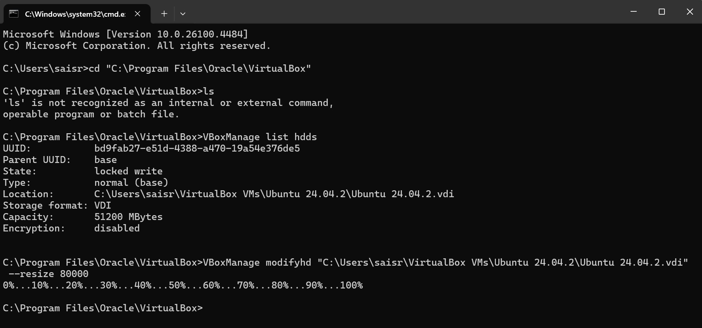
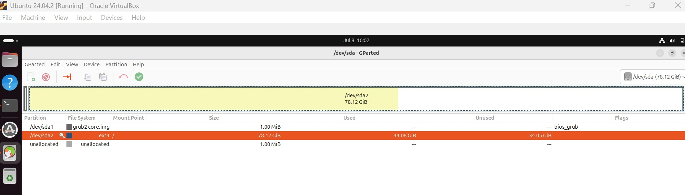

# 🧠 Expand Ubuntu VM Disk Space in VirtualBox

A quick guide to increase disk size for an Ubuntu virtual machine running inside VirtualBox.  
This method resizes the `.vdi` file from the host OS (Windows) and expands the partition inside Ubuntu using GParted.

---

## 🛠️ Prerequisites

- VirtualBox installed on your Windows host
- Ubuntu running inside VirtualBox
- At least 10 GB free space on your host disk

---

## 🔧 Step 1: Resize Virtual Disk (`.vdi`) from Windows Host

1. **Shut down your Ubuntu VM** completely.
2. Open **Command Prompt** (`cmd`) on your **Windows host**.
3. Navigate to VirtualBox installation directory:

    ```cmd
    cd "C:\Program Files\Oracle\VirtualBox"
    ```

4. List all available virtual disks:

    ```cmd
    VBoxManage list hdds
    ```

5. Find your `.vdi` file path. Example output:
    ```
    Location: C:\Users\saisr\VirtualBox VMs\Ubuntu 24.04.2\Ubuntu 24.04.2.vdi
    ```

6. Resize the disk to 80 GB (adjust size as needed):

    ```cmd
    VBoxManage modifyhd "C:\Users\saisr\VirtualBox VMs\Ubuntu 24.04.2\Ubuntu 24.04.2.vdi" --resize 80000
    ```



## 💻 Step 2: Expand Partition Inside Ubuntu Using GParted

1. Boot into your Ubuntu VM.
2. Install GParted:

    ```bash
    sudo apt update
    sudo apt install gparted
    ```

3. Launch GParted:

    ```bash
    sudo gparted
    ```

4. In the GParted GUI:
    - Locate your main partition (usually `/dev/sda2`)
    - Right-click → **Resize/Move**
    - Drag the slider to use all **unallocated space**
    - Click **Apply**




5. Once done, verify the new size:

    ```bash
    df -h
    ```

---

## ✅ Result

Your Ubuntu VM now has expanded disk space available  
(e.g., from 50 GB to 80 GB), and your data remains intact.

---

## Notes

- This method works for **VDI** files only (for VMDK, you must convert first).
- It is **non-destructive** — your data remains safe.
- Always back up your VM before making disk changes.
