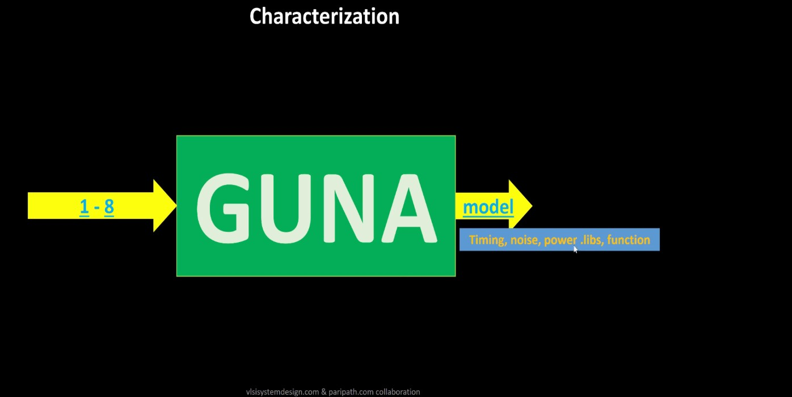
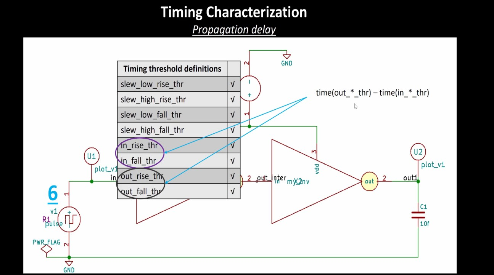
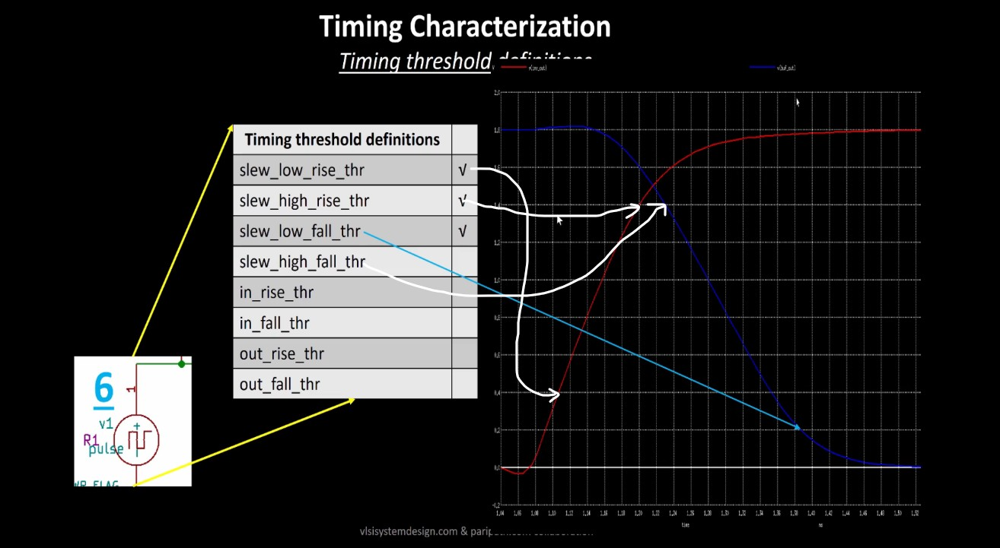

# VSD Hardware Design Program

## `Cell Design and characterization flows`

A **library** is a collection of standard cells, each defined by its size, functionality, threshold voltage, and other electrical/physical properties. These libraries are fundamental to the ASIC flow for synthesis, placement, and timing analysis.

#### Inputs

- **PDKs (Process Design Kits):**
  - DRC & LVS decks
  - SPICE models
- **Library & User-Defined Specifications**

#### Standard Cell Design Flow

1. **Circuit Design**
2. **Layout Design**
   - Involves techniques like Euler paths and stick diagrams
3. **Parasitic Extraction**
4. **Characterization**
   - Timing
   - Power
   - Noise

#### Outputs

- `CDL` – Circuit Description Language file
- `LEF` – Library Exchange Format
- `GDSII` – Final layout database
- Extracted SPICE netlist (`.cir`)
- Characterized `.lib` files:
  - Timing
  - Power
  - Noise

#### Standard Cell Characterization Flow

A typical standard cell characterization process includes:

1. Read in SPICE models and technology files
2. Load the extracted SPICE netlist
3. Recognize cell behavior
4. Identify subcircuits
5. Attach power sources
6. Apply stimulus to the setup
7. Set output capacitance loads
8. Provide necessary simulation commands

All these steps are described in a configuration file and passed to a characterization tool such as **GUNA**. The tool simulates the cells and generates:

- Timing Models  
- Power Models  
- Noise Models

These are exported in `.lib` format and used in synthesis and static timing analysis flows.



### Timing Characterization

In standard cell characterization, one of the key components is **Timing Characterization**, which defines how a cell behaves with respect to input signal changes over time.

#### Timing Threshold Definitions

| **Timing Definition**      | **Value**       |
|---------------------------|-----------------|
| `slew_low_rise_thr`       | 20% of signal   |
| `slew_high_rise_thr`      | 80% of signal   |
| `slew_low_fall_thr`       | 20% of signal   |
| `slew_high_fall_thr`      | 80% of signal   |
| `in_rise_thr`             | 50% of signal   |
| `in_fall_thr`             | 50% of signal   |
| `out_rise_thr`            | 50% of signal   |
| `out_fall_thr`            | 50% of signal   |


#### Propagation Delay & Transition Time

#### Propagation Delay

**Definition**:  
The time difference between the input signal reaching 50% of its final value and the output reaching 50% of its final value.

Poor choice of threshold values lead to negative delay values. Even thought you have taken good threshold values, sometimes depending upon how good or bad the slew, the dealy might be still +ve or -ve.

```text
Propagation Delay = time(out_thr) - time(in_thr)
```

**in_thr (input threshold time):**

The time at which the input signal crosses its defined threshold voltage during a transition.

For delay measurement, this is typically the 50% point of the input voltage swing.

**out_thr (output threshold time):**

The time at which the output signal crosses its threshold voltage during the response to the input transition.

Also typically measured at the 50% point for consistency with in_thr.



#### Transition Time

**Definition**:  
The time it takes for a signal to transition between logic states, typically measured between 10–90% or 20–80% of the voltage levels.

```text
Rise Transition Time = time(slew_high_rise_thr) - time(slew_low_rise_thr)
Fall Transition Time = time(slew_high_fall_thr) - time(slew_low_fall_thr)
```
**slew_low_rise_thr:**
The time when the rising input or output crosses the lower threshold, usually 20% of the voltage swing.

**slew_high_rise_thr:**
The time when the rising input or output crosses the upper threshold, usually 80% of the voltage swing.

**slew_high_fall_thr:**
The time when the falling input or output crosses the upper threshold, typically 80%.

**slew_low_fall_thr:**
The time when the falling input or output crosses the lower threshold, typically 20%.



## `Design Library Cell using magic layout and ngspice charcterization`

