# VSD Hardware Design Program

## `Cell Design and characterization flows`

A **library** is a collection of standard cells, each defined by its size, functionality, threshold voltage, and other electrical/physical properties. These libraries are fundamental to the ASIC flow for synthesis, placement, and timing analysis.

#### <ins>Inputs</ins>

- **PDKs (Process Design Kits):**
  - DRC & LVS decks
  - SPICE models
- **Library & User-Defined Specifications**

#### <ins>Standard Cell Design Flow</ins>

1. **Circuit Design**
2. **Layout Design**
   - Involves techniques like Euler paths and stick diagrams
3. **Parasitic Extraction**
4. **Characterization**
   - Timing
   - Power
   - Noise

#### <ins>Outputs<ins>

- `CDL` – Circuit Description Language file
- `LEF` – Library Exchange Format
- `GDSII` – Final layout database
- Extracted SPICE netlist (`.cir`)
- Characterized `.lib` files:
  - Timing
  - Power
  - Noise

#### <ins>Standard Cell Characterization Flow</ins>

A typical standard cell characterization process includes:

1. Read in SPICE models and technology files
2. Load the extracted SPICE netlist
3. Recognize cell behavior
4. Identify subcircuits
5. Attach power sources
6. Apply stimulus to the setup
7. Set output capacitance loads
8. Provide necessary simulation commands

All these steps are described in a configuration file and passed to a characterization tool such as **GUNA**. The tool simulates the cells and generates:

- Timing Models  
- Power Models  
- Noise Models

These are exported in `.lib` format and used in synthesis and static timing analysis flows.


### <ins>Timing Characterization</ins>

In standard cell characterization, one of the key components is **Timing Characterization**, which defines how a cell behaves with respect to input signal changes over time.

#### Timing Threshold Definitions

| **Timing Definition**      | **Value**       |
|---------------------------|-----------------|
| `slew_low_rise_thr`       | 20% of signal   |
| `slew_high_rise_thr`      | 80% of signal   |
| `slew_low_fall_thr`       | 20% of signal   |
| `slew_high_fall_thr`      | 80% of signal   |
| `in_rise_thr`             | 50% of signal   |
| `in_fall_thr`             | 50% of signal   |
| `out_rise_thr`            | 50% of signal   |
| `out_fall_thr`            | 50% of signal   |


#### <ins>Propagation Delay & Transition Time</ins>

#### <ins>Propagation Delay</ins>

**Definition**:  
The time difference between the input signal reaching 50% of its final value and the output reaching 50% of its final value.

```text
Propagation Delay = time(out_thr) - time(in_thr)
```

**in_thr (input threshold time):**

The time at which the input signal crosses its defined threshold voltage during a transition.

For delay measurement, this is typically the 50% point of the input voltage swing.

**out_thr (output threshold time):**

The time at which the output signal crosses its threshold voltage during the response to the input transition.

Also typically measured at the 50% point for consistency with in_thr.


Poor choice of threshold values lead to negative delay values. Even thought you have taken good threshold values, sometimes depending upon how good or bad the slew, the dealy might be still +ve or -ve.


#### <ins>Transition Time</ins>

**Definition**:  
The time it takes for a signal to transition between logic states, typically measured between 10–90% or 20–80% of the voltage levels.

```text
Rise Transition Time = time(slew_high_rise_thr) - time(slew_low_rise_thr)
Fall Transition Time = time(slew_high_fall_thr) - time(slew_low_fall_thr)
```
**slew_low_rise_thr:**
The time when the rising input or output crosses the lower threshold, usually 20% of the voltage swing.

**slew_high_rise_thr:**
The time when the rising input or output crosses the upper threshold, usually 80% of the voltage swing.

**slew_high_fall_thr:**
The time when the falling input or output crosses the upper threshold, typically 80%.

**slew_low_fall_thr:**
The time when the falling input or output crosses the lower threshold, typically 20%.


## `Design Library Cell using magic layout and ngspice charcterization`

First, clone the required mag files and spicemodels of inverter,pmos and nmos sky130.

```shell
cd ~cd ~/soc-design-and-planning-nasscom-vsd/Desktop/work/tools/openlane_working_dir/openlane/

git clone https://github.com/nickson-jose/vsdstdcelldesign.git
```

To view the layout of the inverter in magic :
```shell
magic -T sky130A.tech sky130_inv.mag &
```

Ampersand at the end makes the next prompt line free, otherwise magic keeps the prompt line busy. Once we run the magic command we get the layout of the inverter in the magic window

Upon running that command we would be able to see the `CMOS Inverter` in magic.


PMOS source connectivity to VDD (here VPWR) verified

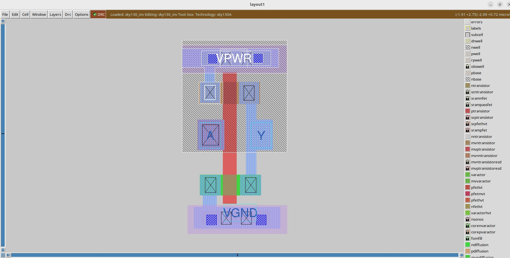

NMOS source connectivity to VSS (here VGND) verified

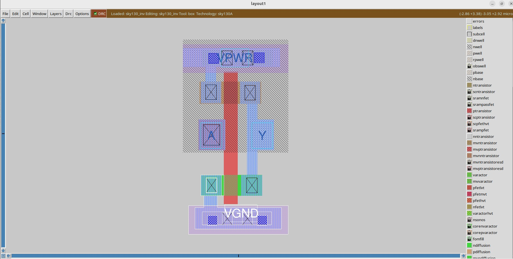

#### 	<ins>16-Mask CMOS N-Well Process – Summary</ins>

The 16-mask CMOS fabrication process is a standard method used in the semiconductor industry to manufacture integrated circuits (ICs). This process involves a series of photolithography, doping, deposition, and etching steps that define the active and passive components of a CMOS circuit. Each mask step is critical in shaping specific layers or features of the chip, ensuring proper device functionality and integration.

**1. Substrate Preparation**  
The process begins with a high-quality silicon wafer. This wafer acts as the base substrate on which all devices are built. It is thoroughly cleaned to remove any impurities that could affect device performance.

**2. N-Well Formation**  
N-well regions are formed by introducing n-type dopants such as phosphorus into specific areas of the substrate using ion implantation or diffusion. These regions serve as the body for PMOS transistors.

**3. P-Well Formation**  
P-well regions are created using ion implantation or diffusion of p-type dopants such as boron. These regions form the body for NMOS transistors. In a twin-well process, both N-well and P-well regions are used to independently optimize NMOS and PMOS performance.

**4. Gate Oxide Deposition**  
A thin insulating layer of silicon dioxide is thermally grown or deposited over the surface of the wafer. This layer electrically isolates the gate electrode from the underlying silicon channel.

**5. Polysilicon Deposition**  
A layer of polysilicon is deposited over the entire wafer surface. This will later be patterned to form the gate electrodes of the transistors.

**6. Polysilicon Masking and Etching**  
A photoresist mask is applied to define the gate regions. The exposed polysilicon is etched away, leaving the gate structures in place over the gate oxide.

**7. N-Well Masking and Implantation**  
A mask is used to expose only the regions where additional N-well doping is needed. Phosphorus or arsenic is implanted to adjust the doping concentration and improve PMOS characteristics.

**8. P-Well Masking and Implantation**  
Similar to N-well masking, a mask is used to define regions for P-well adjustment. Boron is implanted into the exposed regions to enhance NMOS performance.

**9. Source/Drain Implantation**  
Using another photolithography step, openings are created to define the source and drain regions for both NMOS and PMOS transistors. Appropriate dopants (e.g., arsenic or phosphorus for NMOS, boron or BF₂ for PMOS) are implanted.

**10. Gate Formation Finalization**  
The gate electrode pattern is refined, and any alignment steps are performed to ensure that the gate overlaps properly with the channel region between source and drain.

**11. Source/Drain Masking and Etching**  
A photoresist mask is applied again to define the contact regions. Etching is performed to remove the insulating oxide over the source and drain terminals.

**12. Contact/Via Formation**  
Contact holes or vias are etched through the insulating oxide to expose source, drain, and gate terminals. These vias will later be filled with metal to establish electrical connections.

**13. Metal Deposition**  
A metal layer, typically aluminum or copper, is deposited across the wafer. This layer forms the interconnects that connect transistors and other circuit components.

**14. Metal Masking and Etching**  
Photolithography is used to define the desired interconnect patterns. Unwanted metal is etched away, leaving only the functional routing and connections.

**15. Passivation Layer Deposition**  
A passivation layer of silicon dioxide or silicon nitride is deposited over the entire wafer to protect the circuit from mechanical damage, moisture, and contamination.

**16. Final Testing and Packaging**  
The completed wafer is tested to identify functional and defective chips. The functional chips are then diced, packaged into individual components, and prepared for use in electronic systems.

<p align="center">
  
  
</p>

### <ins>Spice extraction of inverter in magic</ins>

Commands for spice extraction of the custom inverter layout to be used in tkcon window of magic

```shell
# Check current directory
pwd

# Extraction command to extract to .ext format
extract all

# Before converting ext to spice this command enable the parasitic extraction also
ext2spice cthresh 0 rthresh 0

# Converting to ext to spice
ext2spice
```

Screenshot of tkcon window after running above commands:

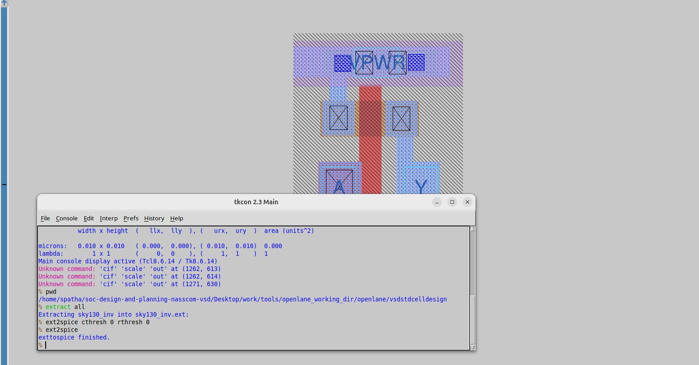

Screenshot of created spice file:

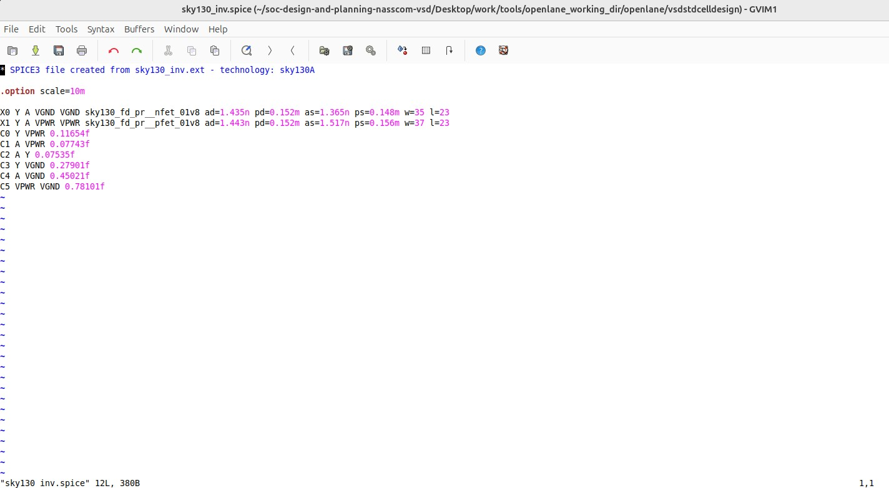

#### <ins>Editing the spice model file for analysis through simulation</ins>

Measuring unit distance in layout grid

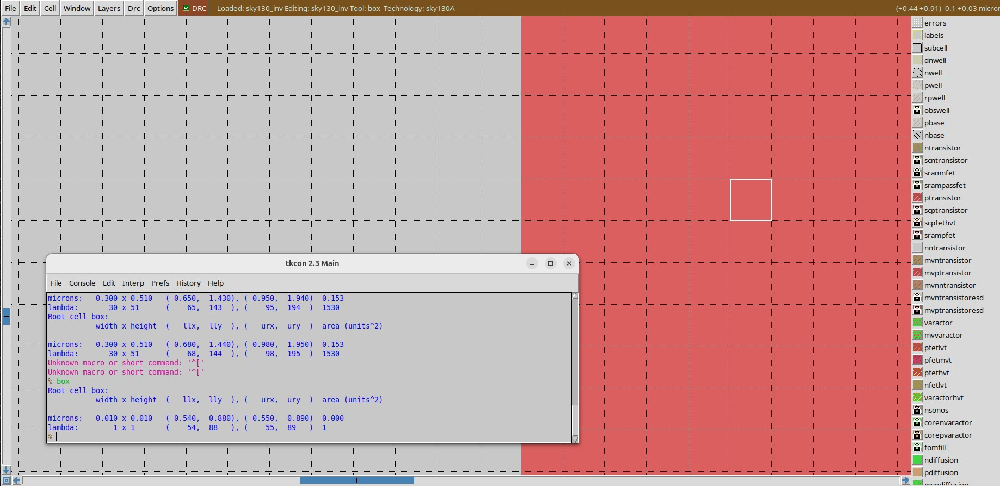

Final edited spice file ready for ngspice simulation

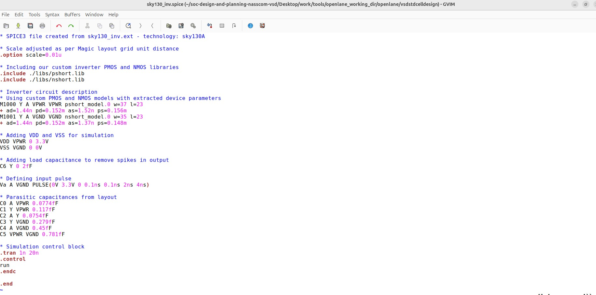

#### <ins>Post-layout ngspice simulations</ins>

Commands for ngspice simulation

```shell
# Command to directly load spice file for simulation to ngspice
ngspice sky130_inv.spice

# Now that we have entered ngspice with the simulation spice file loaded we just have to load the plot
plot y vs time a
```

Screenshots of ngspice run

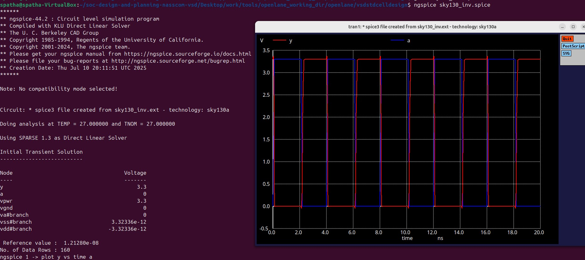

Screenshot of generated plot

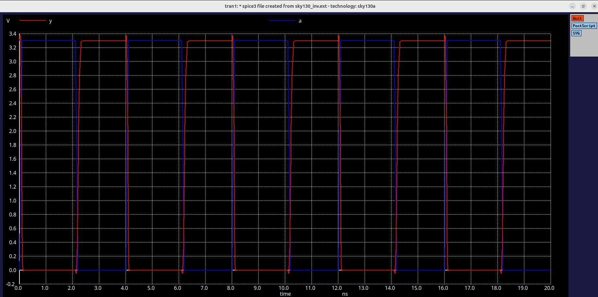

### `Rise Transition Time Calculation`

#### <ins>Formula</ins>

```
Rise transition time = Time taken for output to rise to 80% − Time taken for output to rise to 20%
```

#### <ins>Reference Values (for VDD = 3.3V)</ins>

- **20% of output voltage:**  
  `0.20 × 3.3V = 660 mV`

- **80% of output voltage:**  
  `0.80 × 3.3V = 2.64 V`

The **rise transition time** is the **difference in time between the output reaching 2.64 V and 660 mV** during the rising edge of the signal.

output rising to 20%

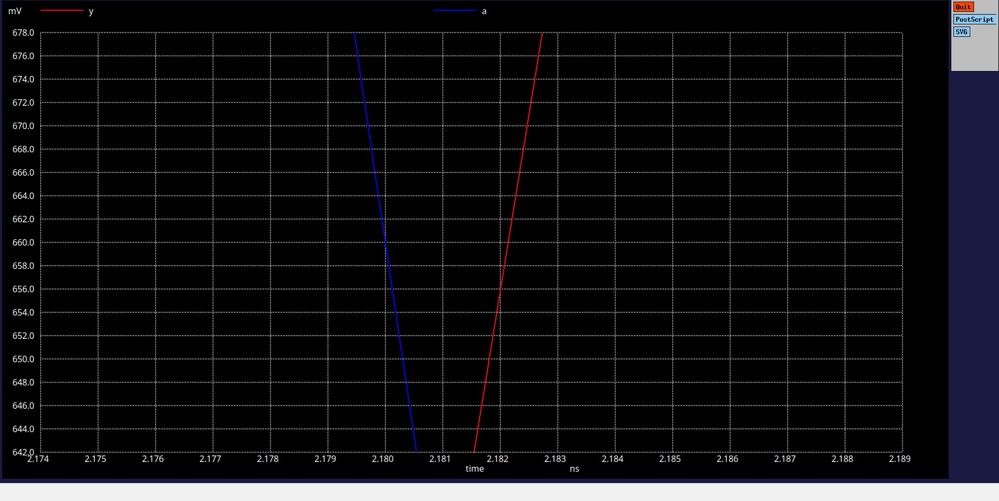

output rising to 80%

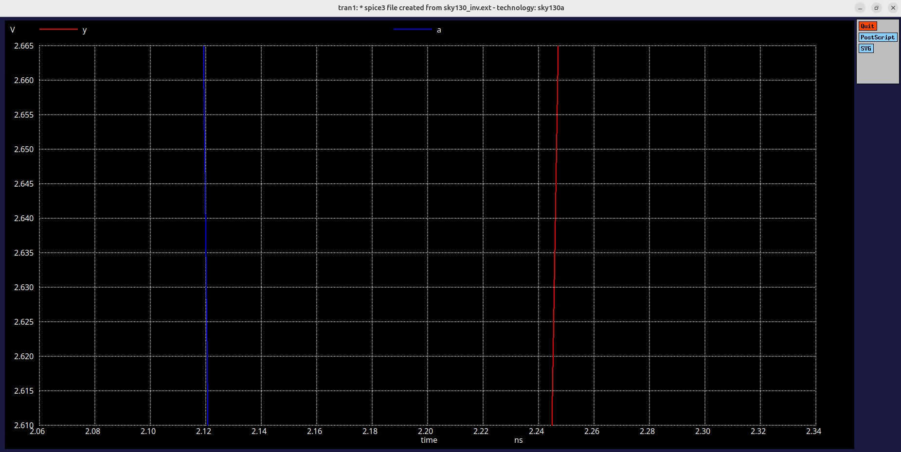

terminal values

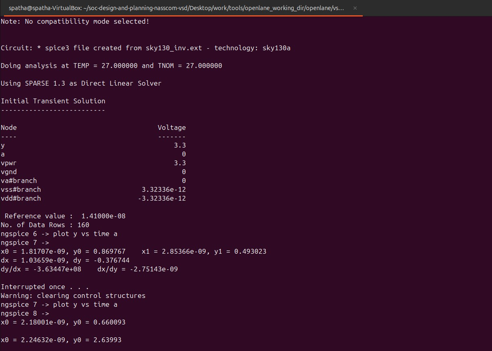

#### <ins>Rise Transition Time Calculation</ins>

**Measured using `ngspice` waveform cursor:**

- Time at **20% of V<sub>out</sub>** (660 mV): `2.1800 ns`
- Time at **80% of V<sub>out</sub>** (2.64 V): `2.2463 ns`

**✅ Rise Transition Time:**

```
Rise Time = 2.2463 ns − 2.1800 ns = 66.3 ps
```

#### `Fall Transition Time Calculation`

```
Fall transition time = Time taken for output to fall to 20% − Time taken for output to fall to 80%
```

#### <ins>Reference Values (for VDD = 3.3V)<ins>

- **20% of output voltage:**  
  `0.20 × 3.3V = 660 mV`

- **80% of output voltage:**  
  `0.80 × 3.3V = 2.64 V`

The **fall transition time** is the **difference in time between the output falling from 2.64 V to 660 mV** during the falling edge of the signal.

output falling to 20%

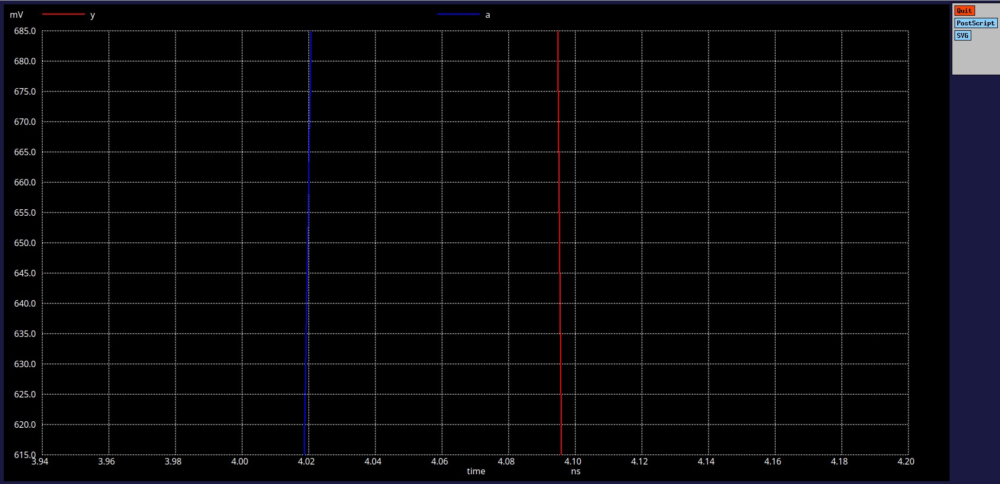

output falling to 80%

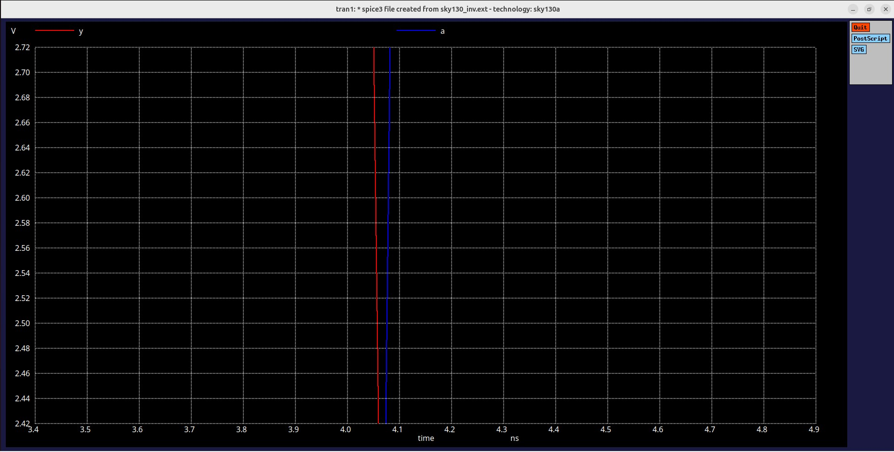

terminal values

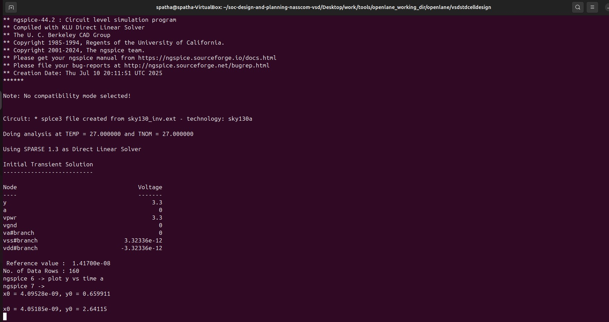

#### <ins>Fall Transition Time Calculation</ins>

**Measured using `ngspice` waveform cursor:**

- Time at **80% of V<sub>out</sub>** (2.64 V): `4.0518 ns`  
- Time at **20% of V<sub>out</sub>** (660 mV): `4.0953 ns`

**✅ Fall Transition Time:**

```
Fall Time = 4.0953 ns − 4.0518 ns = 43.5 ps
```

