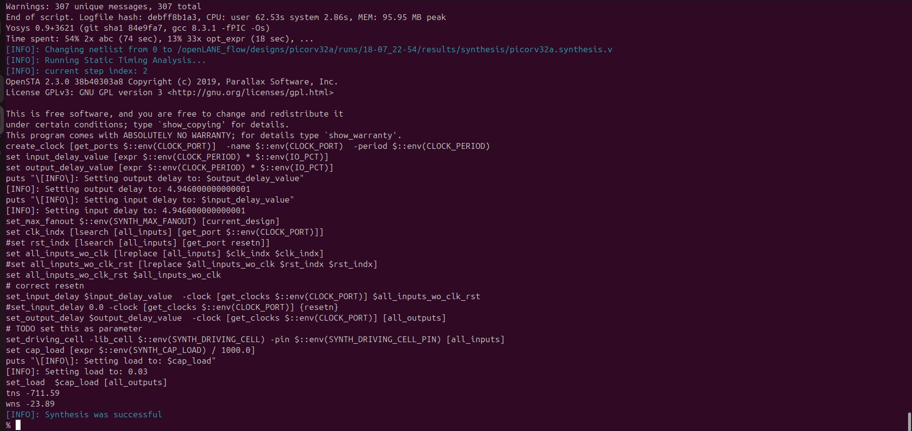
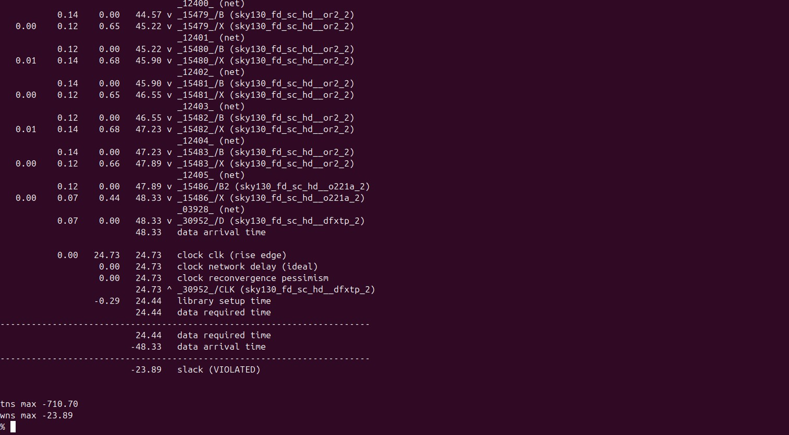

# VSD Hardware Design Program

## Pre-layout timing analysis and importance of good clock tree

### 1.Fix up small DRC errors and verify the design is ready to be inserted into our flow

Conditions to be verified before moving forward with custom designed cell layout:

- Condition 1: The input and output ports of the standard cell should lie on the intersection of the vertical and horizontal tracks.
- Condition 2: **Width** of the standard cell should be **odd multiples** of the **horizontal track pitch**.
- Condition 3: **Height** of the standard cell should be **even multiples** of the **vertical track pitch**.
  
Commands to open the custom inverter layout:

```shell
# Change directory to vsdstdcelldesign
cd Desktop/work/tools/openlane_working_dir/openlane/vsdstdcelldesign
# Command to open custom inverter layout in magic
magic -T sky130A.tech sky130_inv.mag &
```


Screenshot of tracks.info of sky130_fd_sc_hd:


Commands for tkcon window to set grid as tracks of locali layer:

```shell
# Get syntax for grid command
help grid

# Set grid values accordingly
grid 0.46um 0.34um 0.23um 0.17um
```

Screenshot of commands run:


**Condition 1 verified:**


**Condition 2 verified:**

Horizontal track pitch = 0.46 µm


Width of standard cell = 1.38 µm = 0.46 × 3

**Condition 3 verified:**

Vertical track pitch = 0.34 µm


Height of standard cell = 2.72 µm = 0.34 × 8

### 2. Save the finalized layout with custom name and open it.

Command for tkcon window to save the layout with custom name:

```shell
# Command to save as
save sky130_vsdinv.mag
```

Command to open the newly saved layout:

```shell
# Command to open custom inverter layout in magic
magic -T sky130A.tech sky130_vsdinv.mag &
```

Screenshot of newly saved layout:


### 3. Generate lef from the layout.

Command for tkcon window to write lef

```shell
# lef command
lef write
```
Screenshot of command run:


Screenshot of newly created lef file:

```shell
gvim sky130_vsdinv.lef
```


### 4. Copy the newly generated lef and associated required lib files to 'picorv32a' design 'src' directory.

Commands to copy necessary files to 'picorv32a' design 'src' directory

```shell
# Copy lef file
cp sky130_vsdinv.lef ~/soc-design-and-planning-nasscom-vsd/Desktop/work/tools/openlane_working_dir/openlane/designs/picorv32a/src/

# Copy lib files
cp libs/sky130_fd_sc_hd__* ~/soc-design-and-planning-nasscom-vsd/Desktop/work/tools/openlane_working_dir/openlane/designs/picorv32a/src/

# List and check whether it's copied
ls ~/soc-design-and-planning-nasscom-vsd/Desktop/work/tools/openlane_working_dir/openlane/designs/picorv32a/src/

```

### 5. Edit 'config.tcl' to change lib file and add the new extra lef into the openlane flow.

Commands to be added to config.tcl to include our custom cell in the openlane flow

```shell
set ::env(LIB_SYNTH) "$::env(OPENLANE_ROOT)/designs/picorv32a/src/sky130_fd_sc_hd__typical.lib"
set ::env(LIB_FASTEST) "$::env(OPENLANE_ROOT)/designs/picorv32a/src/sky130_fd_sc_hd__fast.lib"
set ::env(LIB_SLOWEST) "$::env(OPENLANE_ROOT)/designs/picorv32a/src/sky130_fd_sc_hd__slow.lib"
set ::env(LIB_TYPICAL) "$::env(OPENLANE_ROOT)/designs/picorv32a/src/sky130_fd_sc_hd__typical.lib"
set ::env(EXTRA_LEFS) [glob $::env(OPENLANE_ROOT)/designs/$::env(DESIGN_NAME)/src/*.lef]
```

Edited config.tcl to include the added lef and change library to ones we added in src directory:


#### 6. Run openlane flow synthesis with newly inserted custom inverter cell.
Commands to invoke the OpenLANE flow include new lef and perform synthesis

```shell
# Change directory to openlane flow directory
cd ~/soc-design-and-planning-nasscom-vsd/Desktop/work/tools/openlane_working_dir/openlane

export PDK_ROOT=/home/spatha/soc-design-and-planning-nasscom-vsd/Desktop/work/tools/openlane_working_dir/pdks

# alias docker='docker run -it -v $(pwd):/openLANE_flow -v $PDK_ROOT:$PDK_ROOT -e PDK_ROOT=$PDK_ROOT -u $(id -u $USER):$(id -g $USER) efabless/openlane:v0.21'
# Since we have aliased the long command to 'docker' we can invoke the OpenLANE flow docker sub-system by just running this command
docker
```

```shell
# Now that we have entered the OpenLANE flow contained docker sub-system we can invoke the OpenLANE flow in the Interactive mode using the following command
./flow.tcl -interactive

# Now that OpenLANE flow is open we have to input the required packages for proper functionality of the OpenLANE flow
package require openlane 0.9

# Now the OpenLANE flow is ready to run any design and initially we have to prep the design creating some necessary files and directories for running a specific design which in our case is 'picorv32a'
prep -design picorv32a

# Adiitional commands to include newly added lef to openlane flow
set lefs [glob $::env(DESIGN_DIR)/src/*.lef]
add_lefs -src $lefs

# Now that the design is prepped and ready, we can run synthesis using following command
run_synthesis
```


### 7. Remove/reduce the newly introduced violations with the introduction of custom inverter cell by modifying design parameters.

Noting down current design values generated before modifying parameters to improve timing.


Commands to view and change parameters to improve timing and run synthesis

```shell
# Now once again we have to prep design so as to update variables
prep -design picorv32a -tag new -overwrite

# Addiitional commands to include newly added lef to openlane flow merged.lef
set lefs [glob $::env(DESIGN_DIR)/src/*.lef]

add_lefs -src $lefs

# Command to display current value of variable SYNTH_STRATEGY
echo $::env(SYNTH_STRATEGY)

# Command to set new value for SYNTH_STRATEGY
set ::env(SYNTH_STRATEGY) "DELAY 3"

# Command to display current value of variable SYNTH_BUFFERING to check whether it's enabled
echo $::env(SYNTH_BUFFERING)

# Command to display current value of variable SYNTH_SIZING
echo $::env(SYNTH_SIZING)

# Command to set new value for SYNTH_SIZING
set ::env(SYNTH_SIZING) 1

# Command to display current value of variable SYNTH_DRIVING_CELL to check whether it's the proper cell or not
echo $::env(SYNTH_DRIVING_CELL)

# Now that the design is prepped and ready, we can run synthesis using following command
run_synthesis
```

Comparing to previously noted run values area has increased and worst negative slack has become 0


### 8. Once synthesis has accepted our custom inverter we can now run floorplan and placement and verify the cell is accepted in PnR flow.

Now that our custom inverter is properly accepted in synthesis we can now run floorplan using following command

```shell
# Now we can run floorplan
run_floorplan
```
Screenshots of command run:


Since we are facing unexpected un-explainable error while using run_floorplan command, we can instead use the following set of commands available based on information from 

/home/spatha/soc-design-and-planning-nasscom-vsd/Desktop/work/tools/openlane_working_dir/openlane/scripts/tcl_commands/floorplan.tcl

and also based on Floorplan Commands section in 

/home/spatha/soc-design-and-planning-nasscom-vsd/Desktop/work/tools/openlane_working_dir/openlane/docs/source/OpenLANE_commands.md

```shell
# Follwing commands are alltogather sourced in "run_floorplan" command
init_floorplan
place_io
tap_decap_or
```

Screenshots of commands run:


Now that floorplan is done we can do placement using following command

```shell
# Now we are ready to run placement
run_placement
```

Screenshots of commands run:


Commands to load placement def in magic in another terminal

```shell
# Change directory to path containing generated placement def
cd ~/soc-design-and-planning-nasscom-vsd/Desktop/work/tools/openlane_working_dir/openlane/designs/picorv32a/runs/new/results/placement/

# Command to load the placement def in magic tool
magic -T ~/soc-design-and-planning-nasscom-vsd/Desktop/work/tools/openlane_working_dir/pdks/sky130A/libs.tech/magic/sky130A.tech lef read ../../tmp/merged.lef def read picorv32a.placement.def &

```

Screenshot of placement def in magic:


Screenshot of custom inverter inserted in placement def with proper abutment:


Command for tkcon window to view internal layers of cells

```shell
# Command to view internal connectivity layers
expand
```


### 9. Do Post-Synthesis timing analysis with OpenSTA tool.

Since we are having 0 wns after improved timing run we are going to do timing analysis on initial run of synthesis which has lots of violations and no parameters were added to improve timing

Commands to invoke the OpenLANE flow include new lef and perform synthesis

```shell
# Change directory to openlane flow directory
cd ~/soc-design-and-planning-nasscom-vsd/Desktop/work/tools/openlane_working_dir/openlane

export PDK_ROOT=/home/spatha/soc-design-and-planning-nasscom-vsd/Desktop/work/tools/openlane_working_dir/pdks

# alias docker='docker run -it -v $(pwd):/openLANE_flow -v $PDK_ROOT:$PDK_ROOT -e PDK_ROOT=$PDK_ROOT -u $(id -u $USER):$(id -g $USER) efabless/openlane:v0.21'
# Since we have aliased the long command to 'docker' we can invoke the OpenLANE flow docker sub-system by just running this command
docker
```
```shell
# Now that we have entered the OpenLANE flow contained docker sub-system we can invoke the OpenLANE flow in the Interactive mode using the following command
./flow.tcl -interactive

# Now that OpenLANE flow is open we have to input the required packages for proper functionality of the OpenLANE flow
package require openlane 0.9

# Now the OpenLANE flow is ready to run any design and initially we have to prep the design creating some necessary files and directories for running a specific design which in our case is 'picorv32a'
prep -design picorv32a

# Adiitional commands to include newly added lef to openlane flow
set lefs [glob $::env(DESIGN_DIR)/src/*.lef]
add_lefs -src $lefs

# Command to set new value for SYNTH_SIZING
set ::env(SYNTH_SIZING) 1

# Now that the design is prepped and ready, we can run synthesis using following command
run_synthesis
```

Screenshot of commands run:



Newly created `pre_sta.conf` for STA analysis in `openlane` directory


Newly created `my_base.sdc` for STA analysis in `openlane/designs/picorv32a/src` directory based on the file `openlane/scripts/base.sdc`


Commands to run STA in another terminal

```
# Change directory to openlane
cd /home/spatha/soc-design-and-planning-nasscom-vsd/Desktop/work/tools/openlane_working_dir/openlane

# Command to invoke OpenSTA tool with script
sta pre_sta.conf
```


Since more fanout is causing more delay we can add parameter to reduce fanout and do synthesis again

Commands to include new lef and perform synthesis

```shell
# Now the OpenLANE flow is ready to run any design and initially we have to prep the design creating some necessary files and directories for running a specific design which in our case is 'picorv32a'
prep -design picorv32a -tag 19-07_00-15 -overwrite

# Adiitional commands to include newly added lef to openlane flow
set lefs [glob $::env(DESIGN_DIR)/src/*.lef]
add_lefs -src $lefs

# Command to set new value for SYNTH_SIZING
set ::env(SYNTH_SIZING) 1

# Command to set new value for SYNTH_MAX_FANOUT
set ::env(SYNTH_MAX_FANOUT) 4

# Command to display current value of variable SYNTH_DRIVING_CELL to check whether it's the proper cell or not
echo $::env(SYNTH_DRIVING_CELL)

# Now that the design is prepped and ready, we can run synthesis using following command
run_synthesis
```

Screenshot of commands run:


Commands to run STA in another terminal

```shell
# Change directory to openlane
cd Desktop/work/tools/openlane_working_dir/openlane

# Command to invoke OpenSTA tool with script
sta pre_sta.conf
```



### 10. Make timing ECO fixes to remove all violations.

OR gate of drive strength 2 is driving 4 fanouts


Commands to perform analysis and optimize timing by replacing with OR gate of drive strength 4

```shell
report_net -connections _11873_
help replace_cell
replace_cell _14770_ sky130_fd_sc_hd__or3_4
report_checks -fields {net cap slew input_pins} -digits 4
```


Result - slack reduced


OR gate of drive strength 2 driving OA gate has more delay


Commands to perform analysis and optimize timing by replacing with OR gate of drive strength 4

```shell
# Reports all the connections to a net
report_net -connections _11844_

# Replacing cell
replace_cell _14741_ sky130_fd_sc_hd__or4_4

# Generating custom timing report
report_checks -fields {net cap slew input_pins fanout} -digits 4
```


Result - slack reduced


OR gate of drive strength 2 driving OA gate has more delay


Commands to perform analysis and optimize timing by replacing with OR gate of drive strength 4

```shell
# Reports all the connections to a net
report_net -connections _11869_

# Replacing cell
replace_cell _14766_ sky130_fd_sc_hd__or4_4

# Generating custom timing report
report_checks -fields {net cap slew input_pins} -digits 4
```


Result - slack reduced


Commands to verify instance _14766_ is replaced with sky130_fd_sc_hd__or4_4

```shell
report_checks -from _29555_ -to _30952_ -through _14766_
```

Screenshot of replaced instance


Commands to perform analysis and optimize timing by replacing with OR gate of drive strength 4

```shell
% report_net -connections _12396_
Warning: pre_sta.conf line 1, report_net -connections is deprecated.
Net _12396_
 Pin capacitance: 0.01-0.01
 Wire capacitance: 0.00
 Total capacitance: 0.01-0.01
 Number of drivers: 1
 Number of loads: 3
 Number of pins: 4

Driver pins
 _15474_/X output (sky130_fd_sc_hd__or2_2)

Load pins
 _15475_/B input (sky130_fd_sc_hd__or2_2) 0.00-0.00
 _15505_/A2 input (sky130_fd_sc_hd__a211oi_2) 0.00-0.00
 _15507_/C1 input (sky130_fd_sc_hd__o211a_2) 0.00-0.00

% replace_cell _15474_ sky130_fd_sc_hd__or2_4
1
```
```shell
 report_checks -fields {net cap slew input_pins} -digits 4
```


_We started ECO fixes at WNS = -23.8900 ns, and have now improved it to WNS = -22.7650 ns, achieving a reduction of approximately 1.1250 ns in worst negative slack._

### 11. Replace the old netlist with the new netlist generated after timing ECO fix and implement the floorplan, placement and cts.

Now to insert this updated netlist to PnR flow and we can use `write_verilog` and overwrite the synthesis netlist but before that we are going to make a copy of the old old netlist

Commands to make copy of netlist

```shell
# Change from home directory to synthesis results directory
cd  /home/spatha/soc-design-and-planning-nasscom-vsd/Desktop/work/tools/openlane_working_dir/openlane/designs/picorv32a/runs/19-07_00-15/results/synthesis
# List contents of the directory
ls
# Copy and rename the netlist
cp picorv32a.synthesis.v picorv32a.synthesis_old.v
# List contents of the directory
ls
```


Commands to write verilog

```shell
# Check syntax
help write_verilog

# Overwriting current synthesis netlist
write_verilog /home/spatha/soc-design-and-planning-nasscom-vsd/Desktop/work/tools/openlane_working_dir/openlane/designs/picorv32a/runs/19-07_00-15/results/synthesis/picorv32a.synthesis.v

# Exit from OpenSTA since timing analysis is done
exit
```


Verified that the netlist is overwritten by checking that instance _14766_ is replaced with sky130_fd_sc_hd__or4_4


Since we confirmed that netlist is replaced and will be loaded in PnR but since we want to follow up on the earlier 0 violation design we are continuing with the clean design to further stages.

❗**Note:** The or_cts.tcl script requires the environment variables CTS_SQR_CAP (square capacitance in pF/µm²) and CTS_SQR_RES (square resistance in kΩ/µm²) for clock tree characterization, but they are not set in your config.tcl or environment.

Add the following two lines to your config.tcl before initiating the runs:

```shell
set ::env(CTS_SQR_CAP) 0.024   ;# Square capacitance in pF/µm²
set ::env(CTS_SQR_RES) 0.075   ;# Square resistance in kΩ/µm²
```

```shell
# Now once again we have to prep design so as to update variables
prep -design picorv32a -tag 19-07_00-15 -overwrite

# Addiitional commands to include newly added lef to openlane flow merged.lef
set lefs [glob $::env(DESIGN_DIR)/src/*.lef]
add_lefs -src $lefs

# Command to set new value for SYNTH_STRATEGY
set ::env(SYNTH_STRATEGY) "DELAY 3"

# Command to set new value for SYNTH_SIZING
set ::env(SYNTH_SIZING) 1

# Now that the design is prepped and ready, we can run synthesis using following command
run_synthesis

# Follwing commands are alltogather sourced in "run_floorplan" command
init_floorplan
place_io
tap_decap_or

# Now we are ready to run placement
run_placement

# Incase getting error
unset ::env(LIB_CTS)

# With placement done we are now ready to run CTS
run_cts
```

Screenshots of commands run


After completing CTS in OpenLane, the following files are generated in the `results/synthesis/` directory:

```shell
spatha@spatha-VirtualBox:~/soc-design-and-planning-nasscom-vsd/Desktop/work/tools/openlane_working_dir/openlane/designs/picorv32a/runs/19-07_00-15/results/synthesis$ ls -ltrh
total 12M
lrwxrwxrwx 1 spatha spatha   29 Jul 18 18:53 merged_unpadded.lef -> ../../tmp/merged_unpadded.lef
-rw-r--r-- 1 spatha spatha 2.1M Jul 18 18:54 picorv32a.synthesis.v
-rw-r--r-- 1 spatha spatha 2.0M Jul 18 18:55 picorv32a.synthesis_optimized.v
-rw-r--r-- 1 spatha spatha 2.1M Jul 18 18:56 picorv32a.synthesis_cts.v
```

- **picorv32a.synthesis.v	:** Gate-level netlist generated after initial synthesis of the RTL
- **picorv32a.synthesis_cts.v	:** Generated after running Clock Tree Synthesis (CTS). This netlist includes inserted clock buffers and CTS-aware hierarchy.

### <ins>Setup timing analysis using real clocks</ins>

Setup timing analysis ensures that data launched from a source flop reaches the destination flop **before the active clock edge**, with enough time to meet the **setup time** requirement.

In practical designs, the clock signal experiences delay and uncertainty due to the following:

- **Clock Skew (Δ₂)**: The difference in clock arrival times at the launch and capture flip-flops. Positive skew can **help setup timing**, but negative skew can **tighten** the timing window.
- **Clock Jitter (S)**: Variability in clock edge arrival due to noise, voltage, and temperature fluctuations. Jitter introduces uncertainty into the timing budget.
- **Setup Time (SU)**: The minimum time before the clock edge by which data must be stable at the capture flop.

#### ✅ Setup Timing Condition:
The following condition must be met to avoid setup violations:

```
θ + Δ₁ < (T + Δ₂) - S - SU
```

Where:
- `θ` is the **data path delay**
- `Δ₁` is the delay in the launch path
- `T` is the clock period
- `Δ₂` is the delay in the capture clock path
- `S` is clock uncertainty (jitter)
- `SU` is setup time of the capture flop

> 📌 **Slack** = `Data Required Time − Data Arrival Time`  
> Slack should be **≥ 0** to meet timing.


### <ins>Hold Timing Analysis using Real Clocks</ins>
Hold timing analysis with real clocks considers practical effects like **clock skew** and **clock jitter**, both of which can critically impact data stability at the receiving flip-flop.

- **Clock Skew**: This is the variation in clock arrival time between the launch and capture flip-flops due to differing clock tree paths. For hold analysis, **negative skew** (capture clock arrives earlier) can lead to **hold violations**, as data might arrive too soon at the capture flop.

- **Clock Jitter**: Random variations in clock edges caused by noise, temperature fluctuations, and power supply instability. Jitter reduces the **minimum delay margin**, making it harder to ensure data holds stable long enough.

In hold analysis, the objective is to make sure that the data launched by the clock **does not reach the capture flop too early**, violating the minimum hold time required for proper latching.

> ✅ **Goal:** Ensure that `Data Arrival Time > Capture Clock Edge + Hold Time`, accounting for skew and jitter.


### 12. Post-CTS OpenROAD timing analysis.

Commands to be run in OpenLANE flow to do OpenROAD timing analysis with integrated OpenSTA in OpenROAD

```shell
# Command to run OpenROAD tool
% openroad
OpenROAD 0.9.0 1415572a73
This program is licensed under the BSD-3 license. See the LICENSE file for details.
Components of this program may be licensed under more restrictive licenses which must be honored.

# Reading lef file
% read_lef /openLANE_flow/designs/picorv32a/runs/19-07_00-15/tmp/merged.lef
Notice 0: Reading LEF file:  /openLANE_flow/designs/picorv32a/runs/19-07_00-15/tmp/merged.lef
Notice 0:     Created 14 technology layers
Notice 0:     Created 25 technology vias
Notice 0:     Created 447 library cells
Notice 0: Finished LEF file:  /openLANE_flow/designs/picorv32a/runs/19-07_00-15/tmp/merged.lef

# Reading def file
% read_def /openLANE_flow/designs/picorv32a/runs/19-07_00-15/results/cts/picorv32a.cts.def
Notice 0: 
Reading DEF file: /openLANE_flow/designs/picorv32a/runs/19-07_00-15/results/cts/picorv32a.cts.def
Notice 0: Design: picorv32a
Notice 0:     Created 409 pins.
Notice 0:     Created 27039 components and 154172 component-terminals.
Notice 0:     Created 19212 nets and 62292 connections.
Notice 0: Finished DEF file: /openLANE_flow/designs/picorv32a/runs/19-07_00-15/results/cts/picorv32a.cts.def

# Creating an OpenROAD database to work with
% write_db pico_cts.db

# Loading the created database in OpenROAD
% read_db pico_cts.db

# Read netlist post CTS
% read_verilog /openLANE_flow/designs/picorv32a/runs/19-07_00-15/results/synthesis/picorv32a.synthesis_cts.v

# Read library for design
read_liberty $::env(LIB_SYNTH_COMPLETE)

# Link design and library
% link_design picorv32a

# Read in the custom sdc we created
% read_sdc /openLANE_flow/designs/picorv32a/src/my_base.sdc

# Setting all cloks as propagated clocks
% set_propagated_clock [all_clocks]

# Check syntax of 'report_checks' command
% help report_checks

# Generating custom timing report
% report_checks -path_delay min_max -fields {slew trans net cap input_pins} -format full_clock_expanded -digits 4

Startpoint: _33189_ (rising edge-triggered flip-flop clocked by clk)
Endpoint: _33154_ (rising edge-triggered flip-flop clocked by clk)
Path Group: clk
Path Type: min

Fanout       Cap      Slew     Delay      Time   Description
-------------------------------------------------------------------------------------
                              0.0000    0.0000   clock clk (rise edge)
                              0.0000    0.0000   clock source latency
                    0.0225    0.0100    0.0100 ^ clk (in)
     1    0.0079                                 clk (net)
                    0.0225    0.0000    0.0100 ^ clkbuf_0_clk/A (sky130_fd_sc_hd__clkbuf_16)
                    0.0322    0.1061    0.1161 ^ clkbuf_0_clk/X (sky130_fd_sc_hd__clkbuf_16)
     2    0.0083                                 clknet_0_clk (net)
                    0.0322    0.0000    0.1161 ^ clkbuf_1_1_0_clk/A (sky130_fd_sc_hd__clkbuf_8)
                    0.0283    0.1027    0.2188 ^ clkbuf_1_1_0_clk/X (sky130_fd_sc_hd__clkbuf_8)
     1    0.0042                                 clknet_1_1_0_clk (net)
                    0.0283    0.0000    0.2188 ^ clkbuf_1_1_1_clk/A (sky130_fd_sc_hd__clkbuf_8)
                    0.0283    0.1012    0.3200 ^ clkbuf_1_1_1_clk/X (sky130_fd_sc_hd__clkbuf_8)
     1    0.0042                                 clknet_1_1_1_clk (net)
                    0.0283    0.0000    0.3200 ^ clkbuf_1_1_2_clk/A (sky130_fd_sc_hd__clkbuf_8)
                    0.0349    0.1083    0.4283 ^ clkbuf_1_1_2_clk/X (sky130_fd_sc_hd__clkbuf_8)
     2    0.0083                                 clknet_1_1_2_clk (net)
                    0.0349    0.0000    0.4283 ^ clkbuf_2_3_0_clk/A (sky130_fd_sc_hd__clkbuf_8)
                    0.0283    0.1036    0.5319 ^ clkbuf_2_3_0_clk/X (sky130_fd_sc_hd__clkbuf_8)
     1    0.0042                                 clknet_2_3_0_clk (net)
                    0.0283    0.0000    0.5319 ^ clkbuf_2_3_1_clk/A (sky130_fd_sc_hd__clkbuf_8)
                    0.0283    0.1012    0.6332 ^ clkbuf_2_3_1_clk/X (sky130_fd_sc_hd__clkbuf_8)
     1    0.0042                                 clknet_2_3_1_clk (net)
                    0.0283    0.0000    0.6332 ^ clkbuf_2_3_2_clk/A (sky130_fd_sc_hd__clkbuf_8)
                    0.0349    0.1083    0.7415 ^ clkbuf_2_3_2_clk/X (sky130_fd_sc_hd__clkbuf_8)
     2    0.0083                                 clknet_2_3_2_clk (net)
                    0.0349    0.0000    0.7415 ^ clkbuf_3_7_0_clk/A (sky130_fd_sc_hd__clkbuf_8)
                    0.0349    0.1107    0.8522 ^ clkbuf_3_7_0_clk/X (sky130_fd_sc_hd__clkbuf_8)
     2    0.0083                                 clknet_3_7_0_clk (net)
                    0.0349    0.0000    0.8522 ^ clkbuf_4_14_0_clk/A (sky130_fd_sc_hd__clkbuf_8)
                    0.0349    0.1107    0.9629 ^ clkbuf_4_14_0_clk/X (sky130_fd_sc_hd__clkbuf_8)
     2    0.0083                                 clknet_4_14_0_clk (net)
                    0.0349    0.0000    0.9629 ^ clkbuf_5_28_0_clk/A (sky130_fd_sc_hd__clkbuf_8)
                    0.1209    0.1816    1.1445 ^ clkbuf_5_28_0_clk/X (sky130_fd_sc_hd__clkbuf_8)
     8    0.0632                                 clknet_5_28_0_clk (net)
                    0.1209    0.0000    1.1445 ^ clkbuf_leaf_148_clk/A (sky130_fd_sc_hd__clkbuf_16)
                    0.0278    0.1371    1.2816 ^ clkbuf_leaf_148_clk/X (sky130_fd_sc_hd__clkbuf_16)
     2    0.0038                                 clknet_leaf_148_clk (net)
                    0.0278    0.0000    1.2816 ^ _33189_/CLK (sky130_fd_sc_hd__dfxtp_1)
                    0.0353    0.2871    1.5686 ^ _33189_/Q (sky130_fd_sc_hd__dfxtp_1)
     1    0.0020                                 alu_add_sub[5] (net)
                    0.0353    0.0000    1.5686 ^ _31698_/A1 (sky130_fd_sc_hd__mux2_1)
                    0.0339    0.1049    1.6735 ^ _31698_/X (sky130_fd_sc_hd__mux2_1)
     1    0.0017                                 alu_out[5] (net)
                    0.0339    0.0000    1.6735 ^ _33154_/D (sky130_fd_sc_hd__dfxtp_2)
                                        1.6735   data arrival time

                              0.0000    0.0000   clock clk (rise edge)
                              0.0000    0.0000   clock source latency
                    0.0225    0.0100    0.0100 ^ clk (in)
     1    0.0079                                 clk (net)
                    0.0225    0.0000    0.0100 ^ clkbuf_0_clk/A (sky130_fd_sc_hd__clkbuf_16)
                    0.0322    0.1061    0.1161 ^ clkbuf_0_clk/X (sky130_fd_sc_hd__clkbuf_16)
     2    0.0083                                 clknet_0_clk (net)
                    0.0322    0.0000    0.1161 ^ clkbuf_1_1_0_clk/A (sky130_fd_sc_hd__clkbuf_8)
                    0.0283    0.1027    0.2188 ^ clkbuf_1_1_0_clk/X (sky130_fd_sc_hd__clkbuf_8)
     1    0.0042                                 clknet_1_1_0_clk (net)
                    0.0283    0.0000    0.2188 ^ clkbuf_1_1_1_clk/A (sky130_fd_sc_hd__clkbuf_8)
                    0.0283    0.1012    0.3200 ^ clkbuf_1_1_1_clk/X (sky130_fd_sc_hd__clkbuf_8)
     1    0.0042                                 clknet_1_1_1_clk (net)
                    0.0283    0.0000    0.3200 ^ clkbuf_1_1_2_clk/A (sky130_fd_sc_hd__clkbuf_8)
                    0.0349    0.1083    0.4283 ^ clkbuf_1_1_2_clk/X (sky130_fd_sc_hd__clkbuf_8)
     2    0.0083                                 clknet_1_1_2_clk (net)
                    0.0349    0.0000    0.4283 ^ clkbuf_2_2_0_clk/A (sky130_fd_sc_hd__clkbuf_8)
                    0.0283    0.1036    0.5319 ^ clkbuf_2_2_0_clk/X (sky130_fd_sc_hd__clkbuf_8)
     1    0.0042                                 clknet_2_2_0_clk (net)
                    0.0283    0.0000    0.5319 ^ clkbuf_2_2_1_clk/A (sky130_fd_sc_hd__clkbuf_8)
                    0.0283    0.1012    0.6332 ^ clkbuf_2_2_1_clk/X (sky130_fd_sc_hd__clkbuf_8)
     1    0.0042                                 clknet_2_2_1_clk (net)
                    0.0283    0.0000    0.6332 ^ clkbuf_2_2_2_clk/A (sky130_fd_sc_hd__clkbuf_8)
                    0.0349    0.1083    0.7415 ^ clkbuf_2_2_2_clk/X (sky130_fd_sc_hd__clkbuf_8)
     2    0.0083                                 clknet_2_2_2_clk (net)
                    0.0349    0.0000    0.7415 ^ clkbuf_3_5_0_clk/A (sky130_fd_sc_hd__clkbuf_8)
                    0.0349    0.1107    0.8522 ^ clkbuf_3_5_0_clk/X (sky130_fd_sc_hd__clkbuf_8)
     2    0.0083                                 clknet_3_5_0_clk (net)
                    0.0349    0.0000    0.8522 ^ clkbuf_4_11_0_clk/A (sky130_fd_sc_hd__clkbuf_8)
                    0.0349    0.1107    0.9629 ^ clkbuf_4_11_0_clk/X (sky130_fd_sc_hd__clkbuf_8)
     2    0.0083                                 clknet_4_11_0_clk (net)
                    0.0349    0.0000    0.9629 ^ clkbuf_5_22_0_clk/A (sky130_fd_sc_hd__clkbuf_8)
                    0.1590    0.2097    1.1726 ^ clkbuf_5_22_0_clk/X (sky130_fd_sc_hd__clkbuf_8)
    11    0.0868                                 clknet_5_22_0_clk (net)
                    0.1590    0.0000    1.1726 ^ clkbuf_leaf_144_clk/A (sky130_fd_sc_hd__clkbuf_16)
                    0.0413    0.1620    1.3346 ^ clkbuf_leaf_144_clk/X (sky130_fd_sc_hd__clkbuf_16)
     9    0.0169                                 clknet_leaf_144_clk (net)
                    0.0413    0.0000    1.3346 ^ _33154_/CLK (sky130_fd_sc_hd__dfxtp_2)
                              0.0000    1.3346   clock reconvergence pessimism
                             -0.0294    1.3052   library hold time
                                        1.3052   data required time
-------------------------------------------------------------------------------------
                                        1.3052   data required time
                                       -1.6735   data arrival time
-------------------------------------------------------------------------------------
                                        0.3683   slack (MET)


Startpoint: resetn (input port clocked by clk)
Endpoint: mem_la_read (output port clocked by clk)
Path Group: clk
Path Type: max

Fanout       Cap      Slew     Delay      Time   Description
-------------------------------------------------------------------------------------
                              0.0000    0.0000   clock clk (rise edge)
                              0.0000    0.0000   clock network delay (propagated)
                              4.9460    4.9460 ^ input external delay
                    0.0172    0.0055    4.9515 ^ resetn (in)
     1    0.0042                                 resetn (net)
                    0.0172    0.0000    4.9515 ^ input101/A (sky130_fd_sc_hd__clkbuf_8)
                    0.0593    0.1273    5.0788 ^ input101/X (sky130_fd_sc_hd__clkbuf_8)
     7    0.0240                                 net101 (net)
                    0.0593    0.0000    5.0788 ^ _18399_/C (sky130_fd_sc_hd__nand3_4)
                    0.1261    0.1187    5.1975 v _18399_/Y (sky130_fd_sc_hd__nand3_4)
     4    0.0273                                 _14568_ (net)
                    0.1261    0.0000    5.1975 v _20942_/B1 (sky130_fd_sc_hd__a21oi_4)
                    0.0766    0.1207    5.3182 ^ _20942_/Y (sky130_fd_sc_hd__a21oi_4)
     1    0.0018                                 net199 (net)
                    0.0766    0.0000    5.3182 ^ output199/A (sky130_fd_sc_hd__buf_2)
                    0.0951    0.1550    5.4732 ^ output199/X (sky130_fd_sc_hd__buf_2)
     1    0.0177                                 mem_la_read (net)
                    0.0951    0.0000    5.4732 ^ mem_la_read (out)
                                        5.4732   data arrival time

                             24.7300   24.7300   clock clk (rise edge)
                              0.0000   24.7300   clock network delay (propagated)
                              0.0000   24.7300   clock reconvergence pessimism
                             -4.9460   19.7840   output external delay
                                       19.7840   data required time
-------------------------------------------------------------------------------------
                                       19.7840   data required time
                                       -5.4732   data arrival time
-------------------------------------------------------------------------------------
                                       14.3108   slack (MET)

# Exit to OpenLANE flow
% exit
```

### 13. Explore post-CTS OpenROAD timing analysis by removing 'sky130_fd_sc_hd__clkbuf_1' cell from clock buffer list variable 'CTS_CLK_BUFFER_LIST'.

Commands to be run in OpenLANE flow to do OpenROAD timing analysis after changing `CTS_CLK_BUFFER_LIST`

```shell
# Checking current value of 'CTS_CLK_BUFFER_LIST'
echo $::env(CTS_CLK_BUFFER_LIST)

# Removing 'sky130_fd_sc_hd__clkbuf_1' from the list
set ::env(CTS_CLK_BUFFER_LIST) [lreplace $::env(CTS_CLK_BUFFER_LIST) 0 0]

# Checking current value of 'CTS_CLK_BUFFER_LIST'
echo $::env(CTS_CLK_BUFFER_LIST)

# Checking current value of 'CURRENT_DEF'
echo $::env(CURRENT_DEF)

# Setting def as placement def
set ::env(CURRENT_DEF) /openLANE_flow/designs/picorv32a/runs/19-07_00-15/results/placement/picorv32a.placement.def

# Run CTS again
run_cts

# Checking current value of 'CTS_CLK_BUFFER_LIST'
echo $::env(CTS_CLK_BUFFER_LIST)

# Command to run OpenROAD tool
openroad

# Reading lef file
read_lef /openLANE_flow/designs/picorv32a/runs/19-07_00-15/tmp/merged.lef

# Reading def file
read_def /openLANE_flow/designs/picorv32a/runs/19-07_00-15/results/cts/picorv32a.cts.def

# Creating an OpenROAD database to work with
write_db pico_cts1.db

# Loading the created database in OpenROAD
read_db pico_cts.db

# Read netlist post CTS
read_verilog /openLANE_flow/designs/picorv32a/runs/19-07_00-15/results/synthesis/picorv32a.synthesis_cts.v

# Read library for design
read_liberty $::env(LIB_SYNTH_COMPLETE)

# Link design and library
link_design picorv32a

# Read in the custom sdc we created
read_sdc /openLANE_flow/designs/picorv32a/src/my_base.sdc

# Setting all cloks as propagated clocks
set_propagated_clock [all_clocks]

# Generating custom timing report
report_checks -path_delay min_max -fields {slew trans net cap input_pins} -format full_clock_expanded -digits 4

# Report hold skew
report_clock_skew -hold

# Report setup skew
report_clock_skew -setup

# Exit to OpenLANE flow
exit

# Checking current value of 'CTS_CLK_BUFFER_LIST'
echo $::env(CTS_CLK_BUFFER_LIST)

# Inserting 'sky130_fd_sc_hd__clkbuf_1' to first index of list
set ::env(CTS_CLK_BUFFER_LIST) [linsert $::env(CTS_CLK_BUFFER_LIST) 0 sky130_fd_sc_hd__clkbuf_1]

# Checking current value of 'CTS_CLK_BUFFER_LIST'
echo $::env(CTS_CLK_BUFFER_LIST)
```


 

```shell
% report_checks -path_delay min_max -fields {slew trans net cap input_pins} -format full_clock_expanded -digits 4
Startpoint: _33189_ (rising edge-triggered flip-flop clocked by clk)
Endpoint: _33154_ (rising edge-triggered flip-flop clocked by clk)
Path Group: clk
Path Type: min

Fanout       Cap      Slew     Delay      Time   Description
-------------------------------------------------------------------------------------
                              0.0000    0.0000   clock clk (rise edge)
                              0.0000    0.0000   clock source latency
                    0.0225    0.0100    0.0100 ^ clk (in)
     1    0.0079                                 clk (net)
                    0.0225    0.0000    0.0100 ^ clkbuf_0_clk/A (sky130_fd_sc_hd__clkbuf_16)
                    0.0285    0.1019    0.1119 ^ clkbuf_0_clk/X (sky130_fd_sc_hd__clkbuf_16)
     2    0.0046                                 clknet_0_clk (net)
                    0.0285    0.0000    0.1119 ^ clkbuf_1_1_0_clk/A (sky130_fd_sc_hd__clkbuf_2)
                    0.0264    0.0817    0.1936 ^ clkbuf_1_1_0_clk/X (sky130_fd_sc_hd__clkbuf_2)
     1    0.0023                                 clknet_1_1_0_clk (net)
                    0.0264    0.0000    0.1936 ^ clkbuf_1_1_1_clk/A (sky130_fd_sc_hd__clkbuf_2)
                    0.0264    0.0810    0.2746 ^ clkbuf_1_1_1_clk/X (sky130_fd_sc_hd__clkbuf_2)
     1    0.0023                                 clknet_1_1_1_clk (net)
                    0.0264    0.0000    0.2746 ^ clkbuf_1_1_2_clk/A (sky130_fd_sc_hd__clkbuf_2)
                    0.0379    0.0913    0.3659 ^ clkbuf_1_1_2_clk/X (sky130_fd_sc_hd__clkbuf_2)
     2    0.0046                                 clknet_1_1_2_clk (net)
                    0.0379    0.0000    0.3659 ^ clkbuf_2_3_0_clk/A (sky130_fd_sc_hd__clkbuf_2)
                    0.0264    0.0851    0.4510 ^ clkbuf_2_3_0_clk/X (sky130_fd_sc_hd__clkbuf_2)
     1    0.0023                                 clknet_2_3_0_clk (net)
                    0.0264    0.0000    0.4510 ^ clkbuf_2_3_1_clk/A (sky130_fd_sc_hd__clkbuf_2)
                    0.0264    0.0810    0.5320 ^ clkbuf_2_3_1_clk/X (sky130_fd_sc_hd__clkbuf_2)
     1    0.0023                                 clknet_2_3_1_clk (net)
                    0.0264    0.0000    0.5320 ^ clkbuf_2_3_2_clk/A (sky130_fd_sc_hd__clkbuf_2)
                    0.0379    0.0913    0.6233 ^ clkbuf_2_3_2_clk/X (sky130_fd_sc_hd__clkbuf_2)
     2    0.0046                                 clknet_2_3_2_clk (net)
                    0.0379    0.0000    0.6233 ^ clkbuf_3_7_0_clk/A (sky130_fd_sc_hd__clkbuf_2)
                    0.0264    0.0851    0.7084 ^ clkbuf_3_7_0_clk/X (sky130_fd_sc_hd__clkbuf_2)
     1    0.0023                                 clknet_3_7_0_clk (net)
                    0.0264    0.0000    0.7084 ^ clkbuf_3_7_1_clk/A (sky130_fd_sc_hd__clkbuf_2)
                    0.0379    0.0913    0.7996 ^ clkbuf_3_7_1_clk/X (sky130_fd_sc_hd__clkbuf_2)
     2    0.0046                                 clknet_3_7_1_clk (net)
                    0.0379    0.0000    0.7996 ^ clkbuf_4_14_0_clk/A (sky130_fd_sc_hd__clkbuf_2)
                    0.0379    0.0953    0.8950 ^ clkbuf_4_14_0_clk/X (sky130_fd_sc_hd__clkbuf_2)
     2    0.0046                                 clknet_4_14_0_clk (net)
                    0.0379    0.0000    0.8950 ^ clkbuf_5_28_0_clk/A (sky130_fd_sc_hd__clkbuf_2)
                    0.0264    0.0851    0.9801 ^ clkbuf_5_28_0_clk/X (sky130_fd_sc_hd__clkbuf_2)
     1    0.0023                                 clknet_5_28_0_clk (net)
                    0.0264    0.0000    0.9801 ^ clkbuf_5_28_1_clk/A (sky130_fd_sc_hd__clkbuf_2)
                    0.3456    0.3044    1.2845 ^ clkbuf_5_28_1_clk/X (sky130_fd_sc_hd__clkbuf_2)
     8    0.0632                                 clknet_5_28_1_clk (net)
                    0.3456    0.0000    1.2845 ^ clkbuf_leaf_148_clk/A (sky130_fd_sc_hd__clkbuf_16)
                    0.0345    0.1954    1.4799 ^ clkbuf_leaf_148_clk/X (sky130_fd_sc_hd__clkbuf_16)
     2    0.0038                                 clknet_leaf_148_clk (net)
                    0.0345    0.0000    1.4799 ^ _33189_/CLK (sky130_fd_sc_hd__dfxtp_1)
                    0.0353    0.2896    1.7695 ^ _33189_/Q (sky130_fd_sc_hd__dfxtp_1)
     1    0.0020                                 alu_add_sub[5] (net)
                    0.0353    0.0000    1.7695 ^ _31698_/A1 (sky130_fd_sc_hd__mux2_1)
                    0.0339    0.1049    1.8744 ^ _31698_/X (sky130_fd_sc_hd__mux2_1)
     1    0.0017                                 alu_out[5] (net)
                    0.0339    0.0000    1.8744 ^ _33154_/D (sky130_fd_sc_hd__dfxtp_2)
                                        1.8744   data arrival time

                              0.0000    0.0000   clock clk (rise edge)
                              0.0000    0.0000   clock source latency
                    0.0225    0.0100    0.0100 ^ clk (in)
     1    0.0079                                 clk (net)
                    0.0225    0.0000    0.0100 ^ clkbuf_0_clk/A (sky130_fd_sc_hd__clkbuf_16)
                    0.0285    0.1019    0.1119 ^ clkbuf_0_clk/X (sky130_fd_sc_hd__clkbuf_16)
     2    0.0046                                 clknet_0_clk (net)
                    0.0285    0.0000    0.1119 ^ clkbuf_1_1_0_clk/A (sky130_fd_sc_hd__clkbuf_2)
                    0.0264    0.0817    0.1936 ^ clkbuf_1_1_0_clk/X (sky130_fd_sc_hd__clkbuf_2)
     1    0.0023                                 clknet_1_1_0_clk (net)
                    0.0264    0.0000    0.1936 ^ clkbuf_1_1_1_clk/A (sky130_fd_sc_hd__clkbuf_2)
                    0.0264    0.0810    0.2746 ^ clkbuf_1_1_1_clk/X (sky130_fd_sc_hd__clkbuf_2)
     1    0.0023                                 clknet_1_1_1_clk (net)
                    0.0264    0.0000    0.2746 ^ clkbuf_1_1_2_clk/A (sky130_fd_sc_hd__clkbuf_2)
                    0.0379    0.0913    0.3659 ^ clkbuf_1_1_2_clk/X (sky130_fd_sc_hd__clkbuf_2)
     2    0.0046                                 clknet_1_1_2_clk (net)
                    0.0379    0.0000    0.3659 ^ clkbuf_2_2_0_clk/A (sky130_fd_sc_hd__clkbuf_2)
                    0.0264    0.0851    0.4510 ^ clkbuf_2_2_0_clk/X (sky130_fd_sc_hd__clkbuf_2)
     1    0.0023                                 clknet_2_2_0_clk (net)
                    0.0264    0.0000    0.4510 ^ clkbuf_2_2_1_clk/A (sky130_fd_sc_hd__clkbuf_2)
                    0.0264    0.0810    0.5320 ^ clkbuf_2_2_1_clk/X (sky130_fd_sc_hd__clkbuf_2)
     1    0.0023                                 clknet_2_2_1_clk (net)
                    0.0264    0.0000    0.5320 ^ clkbuf_2_2_2_clk/A (sky130_fd_sc_hd__clkbuf_2)
                    0.0379    0.0913    0.6233 ^ clkbuf_2_2_2_clk/X (sky130_fd_sc_hd__clkbuf_2)
     2    0.0046                                 clknet_2_2_2_clk (net)
                    0.0379    0.0000    0.6233 ^ clkbuf_3_5_0_clk/A (sky130_fd_sc_hd__clkbuf_2)
                    0.0264    0.0851    0.7084 ^ clkbuf_3_5_0_clk/X (sky130_fd_sc_hd__clkbuf_2)
     1    0.0023                                 clknet_3_5_0_clk (net)
                    0.0264    0.0000    0.7084 ^ clkbuf_3_5_1_clk/A (sky130_fd_sc_hd__clkbuf_2)
                    0.0379    0.0913    0.7996 ^ clkbuf_3_5_1_clk/X (sky130_fd_sc_hd__clkbuf_2)
     2    0.0046                                 clknet_3_5_1_clk (net)
                    0.0379    0.0000    0.7996 ^ clkbuf_4_11_0_clk/A (sky130_fd_sc_hd__clkbuf_2)
                    0.0379    0.0953    0.8950 ^ clkbuf_4_11_0_clk/X (sky130_fd_sc_hd__clkbuf_2)
     2    0.0046                                 clknet_4_11_0_clk (net)
                    0.0379    0.0000    0.8950 ^ clkbuf_5_22_0_clk/A (sky130_fd_sc_hd__clkbuf_2)
                    0.0264    0.0851    0.9801 ^ clkbuf_5_22_0_clk/X (sky130_fd_sc_hd__clkbuf_2)
     1    0.0023                                 clknet_5_22_0_clk (net)
                    0.0264    0.0000    0.9801 ^ clkbuf_5_22_1_clk/A (sky130_fd_sc_hd__clkbuf_2)
                    0.4715    0.3897    1.3697 ^ clkbuf_5_22_1_clk/X (sky130_fd_sc_hd__clkbuf_2)
    11    0.0868                                 clknet_5_22_1_clk (net)
                    0.4715    0.0000    1.3697 ^ clkbuf_leaf_144_clk/A (sky130_fd_sc_hd__clkbuf_16)
                    0.0499    0.2321    1.6018 ^ clkbuf_leaf_144_clk/X (sky130_fd_sc_hd__clkbuf_16)
     9    0.0169                                 clknet_leaf_144_clk (net)
                    0.0499    0.0000    1.6018 ^ _33154_/CLK (sky130_fd_sc_hd__dfxtp_2)
                              0.0000    1.6018   clock reconvergence pessimism
                             -0.0283    1.5736   library hold time
                                        1.5736   data required time
-------------------------------------------------------------------------------------
                                        1.5736   data required time
                                       -1.8744   data arrival time
-------------------------------------------------------------------------------------
                                        0.3008   slack (MET)


Startpoint: resetn (input port clocked by clk)
Endpoint: mem_la_read (output port clocked by clk)
Path Group: clk
Path Type: max

Fanout       Cap      Slew     Delay      Time   Description
-------------------------------------------------------------------------------------
                              0.0000    0.0000   clock clk (rise edge)
                              0.0000    0.0000   clock network delay (propagated)
                              4.9460    4.9460 ^ input external delay
                    0.0172    0.0055    4.9515 ^ resetn (in)
     1    0.0042                                 resetn (net)
                    0.0172    0.0000    4.9515 ^ input101/A (sky130_fd_sc_hd__clkbuf_8)
                    0.0593    0.1273    5.0788 ^ input101/X (sky130_fd_sc_hd__clkbuf_8)
     7    0.0240                                 net101 (net)
                    0.0593    0.0000    5.0788 ^ _18399_/C (sky130_fd_sc_hd__nand3_4)
                    0.1261    0.1187    5.1975 v _18399_/Y (sky130_fd_sc_hd__nand3_4)
     4    0.0273                                 _14568_ (net)
                    0.1261    0.0000    5.1975 v _20942_/B1 (sky130_fd_sc_hd__a21oi_4)
                    0.0766    0.1207    5.3182 ^ _20942_/Y (sky130_fd_sc_hd__a21oi_4)
     1    0.0018                                 net199 (net)
                    0.0766    0.0000    5.3182 ^ output199/A (sky130_fd_sc_hd__buf_2)
                    0.0951    0.1550    5.4732 ^ output199/X (sky130_fd_sc_hd__buf_2)
     1    0.0177                                 mem_la_read (net)
                    0.0951    0.0000    5.4732 ^ mem_la_read (out)
                                        5.4732   data arrival time

                             24.7300   24.7300   clock clk (rise edge)
                              0.0000   24.7300   clock network delay (propagated)
                              0.0000   24.7300   clock reconvergence pessimism
                             -4.9460   19.7840   output external delay
                                       19.7840   data required time
-------------------------------------------------------------------------------------
                                       19.7840   data required time
                                       -5.4732   data arrival time
-------------------------------------------------------------------------------------
                                       14.3108   slack (MET)
```


