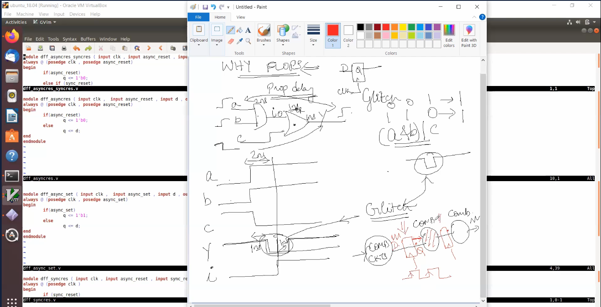
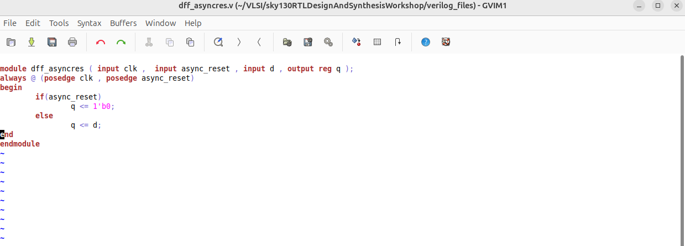
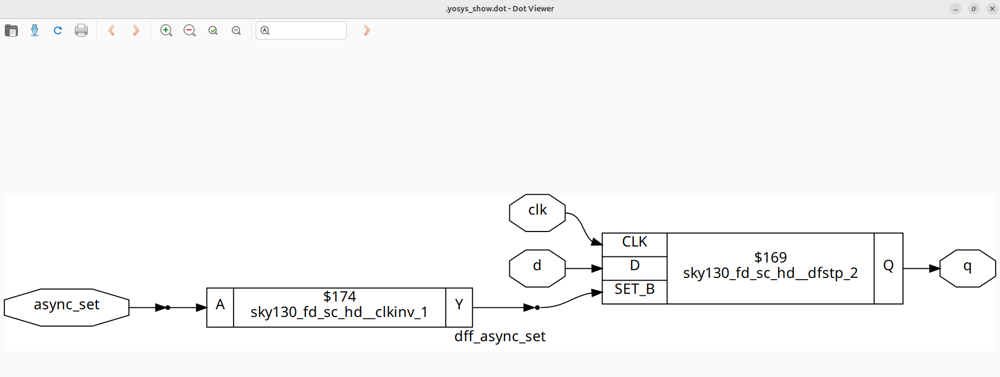

# VSD Hardware Design Program

## Day 2 : Timing libs, hierarchical vs flat synthesis and efficient flop coding styles

## <details> Liberty Format </details>

Liberty format is an industry standard format used to describe library cells of a particular technology. A cell could be a standard cell, IO buffer, complex IP, etc. Library cell description contains a lot of information like timing information, power estimation, and several other attributes like area, functionality, and operating conditions. Speaking more technically, Liberty format is a format to represent timing and power properties of black boxes (which we can't descend into). Liberty is an ASCII format, usually represented in a text file with the extension `.lib`.

The information inside the Lib file can be divided into two main parts, in the first part, it contains some information which is common for all the standard cells. To understand it better have a look in the following snapshot of the Lib file.


The common part of Lib file contains
Library name and technology name
Units (of time, power, voltage, current, resistance and capacitance)
Value of operating condition ( process, voltage and temperature) – Max, Min and Typical 

Based on operating conditions there are three different lib files for Max, Min and Typical corners. 

In the second part of Lib file, it contains cell-specific information for each cell. The part of Lib file which contains cell-specific information is shown below.


## Standard Cell Example: `a2111o_1`

The cell `a2111o_1` from the `sky130_fd_sc_hd__tt_025C_1v80.lib` library implements the following logic:

X = ((A1 & A2) | B1 | C1 | D1)


## Standard Cell Comparison: `and2_1`, `and2_2`, and `and2_4`

This section compares three variants of the 2-input AND gate from the `sky130_fd_sc_hd` library:
- `and2_1`
- `and2_2`
- `and2_4`


## Hierarchical vs Flat Synthesis (Yosys)

###Design : multiple_modules.v


### Hierarchical Flow:
```bash
yosys
read_liberty -lib ../lib/sky130_fd_sc_hd__tt_025C_1v80.lib
read_verilog multiple_modules.v
synth -top multiple_modules
abc -liberty ../lib/sky130_fd_sc_hd__tt_025C_1v80.lib
show multiple_modules
write_verilog -noattr multiple_modules.v
```

It Preserves module hierarchy:

Top: multiple_modules

Submodules: sub_module1, sub_module2


### Flattened Flow:

```bash
flatten
write_verilog -noattr multiple_modules_flat.v
```


### Why Do We Use Flops? (To Avoid Glitches)
Combinational circuits can produce glitches — short, unwanted changes in output — when the inputs change at slightly different times. This happens because the logic takes a little time to settle when multiple signals arrive with different delays.

These glitches can cause problems, especially if they are captured by other parts of the circuit.

To solve this, we insert flip-flops between combinational blocks. Flip-flops are edge-sensitive, which means they only capture data at a specific moment (like the rising edge of a clock). This helps ensure that only stable, correct data is passed forward, and any glitches that happened before the clock edge are ignored.



## D Flip-Flop with Asynchronous Reset

This module defines a D Flip-Flop with an asynchronous reset. It captures the input d on the rising edge of the clock, unless the asynchronous reset is activated.



In the dff_asyncres module, the asynchronous reset has higher priority than the clock.

async_reset is checked first, so if it is high (1), it immediately resets q to 0.

The clock (clk) only matters when async_reset is low (inactive).


## D Flip-Flop with Asynchronous set

This module defines a D Flip-Flop with an asynchronous set. It captures input d on the rising edge of the clock, unless the asynchronous set is active.


The flip-flop responds to either the positive edge of clk or async_set.

If async_set is high, the output q is immediately set to 1, regardless of the clock.

If async_set is low (inactive), then q takes the value of d on the rising edge of the clock.


## D Flip-Flop with Synchronous Reset

This module defines a D Flip-Flop with a synchronous reset. The flip-flop captures the value of d on the rising edge of the clock, unless the synchronous reset is active.


The always block triggers only on the rising edge of the clock.

If sync_reset is high at the time of the clock edge, the output q is set to 0.

If sync_reset is low, the output q is updated with the input d. 


## D Flip-Flop with Both Asynchronous and Synchronous Reset

This design supports both asynchronous and synchronous reset behavior.

Asynchronous reset has higher priority and takes effect immediately, while synchronous reset is evaluated at the clock edge.


## Synthesis of D Flip-Flop with Asynchronous set

```bash
yosys
read_liberty -lib ../lib/sky130_fd_sc_hd__tt_025C_1v80.lib
read_verilog dff_async_set.v
synth -top dff_async_set
dfflibmap -liberty ../lib/sky130_fd_sc_hd__tt_025C_1v80.lib
abc -liberty ../lib/sky130_fd_sc_hd__tt_025C_1v80.lib
show
```



## Synthesis of D Flip-Flop with Asynchronous Reset

```bash
yosys
read_liberty -lib ../lib/sky130_fd_sc_hd__tt_025C_1v80.lib
read_verilog dff_asyncres.v 
synth -top dff_asyncres
dfflibmap -liberty ../lib/sky130_fd_sc_hd__tt_025C_1v80.lib
abc -liberty ../lib/sky130_fd_sc_hd__tt_025C_1v80.lib
show
```


## Synthesis of D Flip-Flop with Synchronous Reset

```bash
yosys
read_liberty -lib ../lib/sky130_fd_sc_hd__tt_025C_1v80.lib
read_verilog dff_syncres.v 
synth -top dff_syncres
dfflibmap -liberty ../lib/sky130_fd_sc_hd__tt_025C_1v80.lib
abc -liberty ../lib/sky130_fd_sc_hd__tt_025C_1v80.lib
show
```


## Synthesis of D Flip-Flop with Both Asynchronous and Synchronous Reset

```bash
yosys
read_liberty -lib ../lib/sky130_fd_sc_hd__tt_025C_1v80.lib
read_verilog dff_asyncres_syncres.v
synth -top dff_asyncres_syncres
dfflibmap -liberty ../lib/sky130_fd_sc_hd__tt_025C_1v80.lib
abc -liberty ../lib/sky130_fd_sc_hd__tt_025C_1v80.lib
show
```


## Interesting optimisations part1

## Synthesis of mul2


```bash
yosys
read_liberty -lib ../lib/sky130_fd_sc_hd__tt_025C_1v80.lib
read_verilog mult_2.v
synth -top mul2
abc -liberty ../lib/sky130_fd_sc_hd__tt_025C_1v80.lib [no need to do this step becoz no cells are used]
show
```


## Interesting optimisations part2

```bash
yosys
read_liberty -lib ../lib/sky130_fd_sc_hd__tt_025C_1v80.lib
read_verilog mul2_net.v
synth -top mul2
abc -liberty ../lib/sky130_fd_sc_hd__tt_025C_1v80.lib [no need to do this step becoz no cells are used]
show
rite_verilog -noattr mul2_net.v 
```


