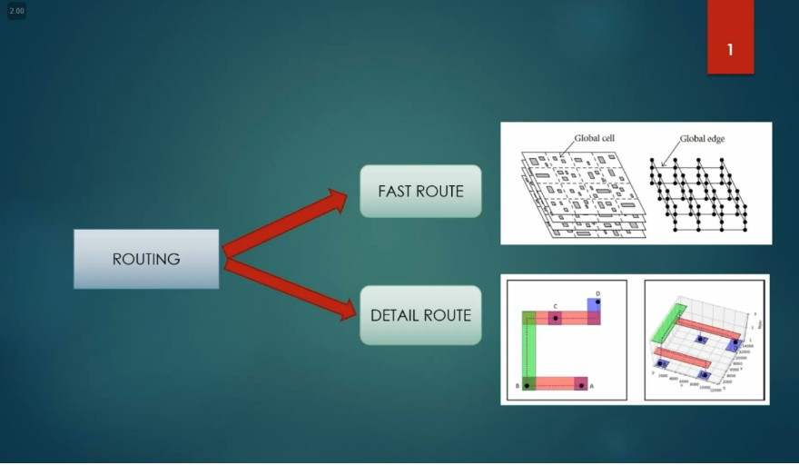
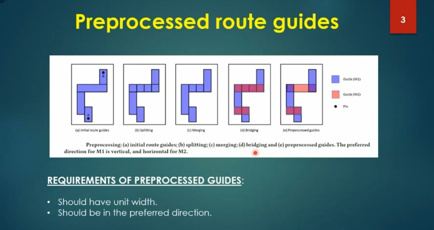

# VSD Hardware Design Program

## Final steps for RTL2GDS using tritonRoute and openSTA

### 📚 Contents

- [14. Perform detailed routing using TritonRoute and explore the routed layout](#14-perform-detailed-routing-using-tritonroute-and-explore-the-routed-layout)
- [15. Post-Route parasitic extraction using SPEF extractor](#15-post-route-parasitic-extraction-using-spef-extractor)
- [16. Post-Route OpenSTA timing analysis with the extracted parasitics of the route](#16-post-route-opensta-timing-analysis-with-the-extracted-parasitics-of-the-route)

### <ins>What is Routing?</ins>

Routing is the process of creating **physical electrical connections** between standard cells, macros, and I/O pins using **metal layers and vias**. It transforms the logical connections (netlist) into actual wires on silicon after placement and Clock Tree Synthesis (CTS). This is a crucial step that directly impacts the chip’s **functionality**, **timing**, **signal integrity**, and **manufacturability**.

### <ins>Goals of Routing</ins>

- Establish all **signal connections** defined in the netlist.
- Avoid **DRC (Design Rule Check)** violations.
- Minimize **routing congestion** and **via count**.
- Improve **timing performance** by optimizing critical paths.
- Ensure **LVS (Layout vs Schematic)** and **Signal Integrity** compliance.
- Maintain clear separation of **signal** and **power/ground** routing.

### <ins>Steps in Routing Flow</ins>

1. **Global Routing**  
   - Divides the layout into coarse grid cells.
   - Assigns rough paths for nets avoiding congestion and blockages.
   - Steers clear of P/G routes and macro blockages.

2. **Track Assignment (TA)**  
   - Maps each net to specific routing tracks.
   - Optimizes for fewer vias and longer straight segments.
   - Physical DRCs are not enforced yet.

3. **Detail Routing**  
   - Finalizes exact wire geometry and vias.
   - Fixes DRC violations (spacing, width, enclosure, etc.).
   - Performs timing-aware optimizations.

> ✅ **Result**: A DRC-clean, fully-connected layout ready for parasitic extraction and timing signoff.

### <ins>TritonRoute</ins>

TritonRoute performs detailed routing by utilizing pre-generated global routing guides and applying a **MILP-based panel routing** strategy. It supports intra-layer parallel routing, where multiple regions within the same metal layer are routed simultaneously, and inter-layer sequential routing, which processes metal layers one after the other from lower to higher levels. TritonRoute adheres to each metal layer’s preferred routing direction as specified in the LEF file (e.g., Metal1: horizontal, Metal2: vertical), helping reduce wire congestion, minimize parasitic capacitance, and enhance overall signal integrity.



#### Features:

TritonRoute uses **pre-processed route guides** generated by the global router. These guides serve as high-level blueprints for the detailed routing stage. By following these predefined paths, TritonRoute enhances routing efficiency and quality.

The preprocessing involves:

- **(a)** Initial route guides based on pin locations (e.g., A to B),
- **(b)** Splitting wide segments into unit-width segments aligned with preferred directions,
- **(c)** Merging overlapping or redundant segments,
- **(d)** Bridging between layers (e.g., from M1 to M2),
- **(e)** Final preprocessed guides optimized for detailed routing.

**Preferred Routing Directions**:
- **M1 (Metal1)**: Vertical
- **M2 (Metal2)**: Horizontal

These guides help TritonRoute:
- Follow preferred routing directions,
- Reduce congestion and via usage,
- Maintain DRC-clean, high-quality routing.

**Requirements of Pre-processed Guides:**
- Must be of **unit width**.
- Must follow the **preferred direction** for each metal layer.



In TritonRoute, **inter-guide connectivity** ensures seamless routing between adjacent or overlapping route guides. This feature is essential for maintaining electrical continuity across guide boundaries, allowing signal paths to flow without interruption.

Two route guides are considered connected if:
- They lie on the **same metal layer** and share **touching edges**, or
- They are on **adjacent metal layers** and have a **non-zero vertical overlap** area.

Additionally:
- Each **unconnected terminal** (i.e., a pin of a standard-cell instance) must be **overlapped by at least one route guide** to ensure proper routing access.

This connectivity mechanism helps:
- Reduce routing discontinuities,
- Eliminate open connections,
- Improve the reliability and routability of the physical design.


The **Routing Topology Algorithm** is crucial for defining the connection structure between pins in an integrated circuit. It determines the most efficient and cost-effective way to route nets by analyzing the relative positions of pins (also known as Access Points for Connections — APCs).

**Key Steps:**
1. **Distance Calculation**:
   - Compute pairwise distances between all pin access points.
   - `cost(i, j) = dist(APC_i, APC_j)` for each pair `(i, j)`.

2. **Minimum Spanning Tree (MST)**:
   - Use the distance cost matrix to generate a **Minimum Spanning Tree** over the pin set.
   - The MST minimizes total routing wirelength while maintaining full connectivity.

3. **Topology Extraction**:
   - Return the set of edges (connections) in the MST as the optimal routing topology.


### `14. Perform detailed routing using TritonRoute and explore the routed layout`

Commands to perform routing:

```shell
# Check value of 'CURRENT_DEF'
echo $::env(CURRENT_DEF)

# Check value of 'ROUTING_STRATEGY'
echo $::env(ROUTING_STRATEGY)

# Command for detailed route using TritonRoute
run_routing
```

Screenshots of routing run:


Commands to load routed def in magic in another terminal:

```shell
# Change directory to path containing routed def
cd ~/soc-design-and-planning-nasscom-vsd/Desktop/work/tools/openlane_working_dir/openlane/designs/picorv32a/runs/19-07_00-15/results/routing

# Command to load the routed def in magic tool
magic -T /home/spatha/soc-design-and-planning-nasscom-vsd/Desktop/work/tools/openlane_working_dir/pdks/sky130A/libs.tech/magic/sky130A.tech lef read ../../tmp/merged.lef def read picorv32a.def &
```

Screenshots of routed def:


Screenshot of fast route guide present in `openlane/designs/picorv32a/runs/19-07_00-15/tmp/routing` directory:


### `15. Post-Route parasitic extraction using SPEF extractor`

Commands for SPEF extraction Post-Route parasitic extraction using SPEF extractor:

```shell
cd ~/soc-design-and-planning-nasscom-vsd/Desktop/work/tools/openlane_working_dir/openlane/scripts/spef_extractor
python3 main.py -l /home/spatha/soc-design-and-planning-nasscom-vsd/Desktop/work/tools/openlane_working_dir/openlane/designs/picorv32a/runs/19-07_00-15/tmp/merged.lef -d /home/spatha/soc-design-and-planning-nasscom-vsd/Desktop/work/tools/openlane_working_dir/openlane/designs/picorv32a/runs/19-07_00-15/results/routing/picorv32a.def
```

Screenshot of commands run:


Screenshot of spef extracted:


### `16. Post-Route OpenSTA timing analysis with the extracted parasitics of the route`

Commands to be run in OpenLANE flow to do OpenROAD timing analysis with integrated OpenSTA in OpenROAD:

```shell
# Launch OpenROAD shell
openroad

# Load technology and cell LEF (used for physical layout)
read_lef /openLANE_flow/designs/picorv32a/runs/19-07_00-15/tmp/merged.lef

# Load routed DEF (final physical layout including routing)
read_def /openLANE_flow/designs/picorv32a/runs/19-07_00-15/results/routing/picorv32a.def

# Save OpenROAD database state (optional, for reuse/debug)
write_db pico_route.db

# Reload the previously saved OpenROAD database (optional)
read_db pico_route.db

# Load pre-route synthesized netlist
read_verilog /openLANE_flow/designs/picorv32a/runs/19-07_00-15/results/synthesis/picorv32a.synthesis_preroute.v

# Load full liberty timing models
read_liberty $::env(LIB_SYNTH_COMPLETE)

# Link design with top module name
link_design picorv32a

# Load custom timing constraints
read_sdc /openLANE_flow/designs/picorv32a/src/my_base.sdc

# Set all clocks as propagated (real clock tree delays will be used)
set_propagated_clock [all_clocks]

# Read in extracted parasitics for post-route timing accuracy
read_spef /openLANE_flow/designs/picorv32a/runs/19-07_00-15/results/routing/picorv32a.spef

# Generate detailed setup/hold timing report (with slew, capacitance, fanout etc.)
report_checks -path_delay min_max -fields {slew trans net cap input_pins} -format full_clock_expanded -digits 4

# Exit OpenROAD
exit
```

Screenshot of commands run:


```shell
% report_checks -path_delay min_max -fields {slew trans net cap input_pins} -format full_clock_expanded -digits 4
Startpoint: _34465_ (rising edge-triggered flip-flop clocked by clk)
Endpoint: _34467_ (rising edge-triggered flip-flop clocked by clk)
Path Group: clk
Path Type: min

Fanout       Cap      Slew     Delay      Time   Description
-------------------------------------------------------------------------------------
                              0.0000    0.0000   clock clk (rise edge)
                              0.0000    0.0000   clock source latency
                    0.0921    0.0728    0.0728 ^ clk (in)
     2    0.0580                                 clk (net)
                    0.0990    0.0000    0.0728 ^ clkbuf_0_clk/A (sky130_fd_sc_hd__clkbuf_16)
                    0.0329    0.1352    0.2080 ^ clkbuf_0_clk/X (sky130_fd_sc_hd__clkbuf_16)
     2    0.0094                                 clknet_0_clk (net)
                    0.0329    0.0001    0.2081 ^ clkbuf_1_1_0_clk/A (sky130_fd_sc_hd__clkbuf_2)
                    0.0603    0.1118    0.3200 ^ clkbuf_1_1_0_clk/X (sky130_fd_sc_hd__clkbuf_2)
     1    0.0094                                 clknet_1_1_0_clk (net)
                    0.0603    0.0005    0.3205 ^ clkbuf_1_1_1_clk/A (sky130_fd_sc_hd__clkbuf_2)
                    0.0546    0.1173    0.4378 ^ clkbuf_1_1_1_clk/X (sky130_fd_sc_hd__clkbuf_2)
     1    0.0082                                 clknet_1_1_1_clk (net)
                    0.0546    0.0004    0.4382 ^ clkbuf_1_1_2_clk/A (sky130_fd_sc_hd__clkbuf_2)
                    0.0503    0.1120    0.5502 ^ clkbuf_1_1_2_clk/X (sky130_fd_sc_hd__clkbuf_2)
     2    0.0074                                 clknet_1_1_2_clk (net)
                    0.0503    0.0002    0.5504 ^ clkbuf_2_2_0_clk/A (sky130_fd_sc_hd__clkbuf_2)
                    0.0562    0.1149    0.6653 ^ clkbuf_2_2_0_clk/X (sky130_fd_sc_hd__clkbuf_2)
     1    0.0085                                 clknet_2_2_0_clk (net)
                    0.0562    0.0005    0.6657 ^ clkbuf_2_2_1_clk/A (sky130_fd_sc_hd__clkbuf_2)
                    0.0566    0.1173    0.7830 ^ clkbuf_2_2_1_clk/X (sky130_fd_sc_hd__clkbuf_2)
     1    0.0086                                 clknet_2_2_1_clk (net)
                    0.0566    0.0004    0.7834 ^ clkbuf_2_2_2_clk/A (sky130_fd_sc_hd__clkbuf_2)
                    0.0604    0.1205    0.9040 ^ clkbuf_2_2_2_clk/X (sky130_fd_sc_hd__clkbuf_2)
     2    0.0094                                 clknet_2_2_2_clk (net)
                    0.0604    0.0001    0.9041 ^ clkbuf_3_5_0_clk/A (sky130_fd_sc_hd__clkbuf_2)
                    0.0464    0.1111    1.0152 ^ clkbuf_3_5_0_clk/X (sky130_fd_sc_hd__clkbuf_2)
     1    0.0066                                 clknet_3_5_0_clk (net)
                    0.0464    0.0002    1.0154 ^ clkbuf_3_5_1_clk/A (sky130_fd_sc_hd__clkbuf_2)
                    0.0241    0.0866    1.1020 ^ clkbuf_3_5_1_clk/X (sky130_fd_sc_hd__clkbuf_2)
     2    0.0019                                 clknet_3_5_1_clk (net)
                    0.0241    0.0000    1.1020 ^ clkbuf_4_11_0_clk/A (sky130_fd_sc_hd__clkbuf_2)
                    0.0605    0.1091    1.2110 ^ clkbuf_4_11_0_clk/X (sky130_fd_sc_hd__clkbuf_2)
     2    0.0094                                 clknet_4_11_0_clk (net)
                    0.0605    0.0001    1.2111 ^ clkbuf_5_23_0_clk/A (sky130_fd_sc_hd__clkbuf_2)
                    0.0358    0.1027    1.3138 ^ clkbuf_5_23_0_clk/X (sky130_fd_sc_hd__clkbuf_2)
     1    0.0044                                 clknet_5_23_0_clk (net)
                    0.0358    0.0001    1.3139 ^ clkbuf_5_23_1_clk/A (sky130_fd_sc_hd__clkbuf_2)
                    0.1298    0.1622    1.4761 ^ clkbuf_5_23_1_clk/X (sky130_fd_sc_hd__clkbuf_2)
    10    0.0229                                 clknet_5_23_1_clk (net)
                    0.1298    0.0000    1.4761 ^ clkbuf_leaf_164_clk/A (sky130_fd_sc_hd__clkbuf_16)
                    0.0299    0.1425    1.6187 ^ clkbuf_leaf_164_clk/X (sky130_fd_sc_hd__clkbuf_16)
    10    0.0060                                 clknet_leaf_164_clk (net)
                    0.0299    0.0000    1.6187 ^ _34465_/CLK (sky130_fd_sc_hd__dfxtp_2)
                    0.0758    0.3516    1.9702 v _34465_/Q (sky130_fd_sc_hd__dfxtp_2)
     5    0.0280                                 count_instr[32] (net)
                    0.0758    0.0006    1.9709 v _17337_/C (sky130_fd_sc_hd__nand3_4)
                    0.0367    0.0903    2.0611 ^ _17337_/Y (sky130_fd_sc_hd__nand3_4)
     2    0.0065                                 _13875_ (net)
                    0.0367    0.0000    2.0611 ^ _17404_/A2 (sky130_fd_sc_hd__a21oi_1)
                    0.0277    0.0538    2.1149 v _17404_/Y (sky130_fd_sc_hd__a21oi_1)
     1    0.0025                                 _03899_ (net)
                    0.0277    0.0000    2.1149 v _34467_/D (sky130_fd_sc_hd__dfxtp_1)
                                        2.1149   data arrival time

                              0.0000    0.0000   clock clk (rise edge)
                              0.0000    0.0000   clock source latency
                    0.0921    0.0728    0.0728 ^ clk (in)
     2    0.0580                                 clk (net)
                    0.0990    0.0000    0.0728 ^ clkbuf_0_clk/A (sky130_fd_sc_hd__clkbuf_16)
                    0.0329    0.1352    0.2080 ^ clkbuf_0_clk/X (sky130_fd_sc_hd__clkbuf_16)
     2    0.0094                                 clknet_0_clk (net)
                    0.0329    0.0001    0.2081 ^ clkbuf_1_1_0_clk/A (sky130_fd_sc_hd__clkbuf_2)
                    0.0603    0.1118    0.3200 ^ clkbuf_1_1_0_clk/X (sky130_fd_sc_hd__clkbuf_2)
     1    0.0094                                 clknet_1_1_0_clk (net)
                    0.0603    0.0005    0.3205 ^ clkbuf_1_1_1_clk/A (sky130_fd_sc_hd__clkbuf_2)
                    0.0546    0.1173    0.4378 ^ clkbuf_1_1_1_clk/X (sky130_fd_sc_hd__clkbuf_2)
     1    0.0082                                 clknet_1_1_1_clk (net)
                    0.0546    0.0004    0.4382 ^ clkbuf_1_1_2_clk/A (sky130_fd_sc_hd__clkbuf_2)
                    0.0503    0.1120    0.5502 ^ clkbuf_1_1_2_clk/X (sky130_fd_sc_hd__clkbuf_2)
     2    0.0074                                 clknet_1_1_2_clk (net)
                    0.0503    0.0002    0.5504 ^ clkbuf_2_2_0_clk/A (sky130_fd_sc_hd__clkbuf_2)
                    0.0562    0.1149    0.6653 ^ clkbuf_2_2_0_clk/X (sky130_fd_sc_hd__clkbuf_2)
     1    0.0085                                 clknet_2_2_0_clk (net)
                    0.0562    0.0005    0.6657 ^ clkbuf_2_2_1_clk/A (sky130_fd_sc_hd__clkbuf_2)
                    0.0566    0.1173    0.7830 ^ clkbuf_2_2_1_clk/X (sky130_fd_sc_hd__clkbuf_2)
     1    0.0086                                 clknet_2_2_1_clk (net)
                    0.0566    0.0004    0.7834 ^ clkbuf_2_2_2_clk/A (sky130_fd_sc_hd__clkbuf_2)
                    0.0604    0.1205    0.9040 ^ clkbuf_2_2_2_clk/X (sky130_fd_sc_hd__clkbuf_2)
     2    0.0094                                 clknet_2_2_2_clk (net)
                    0.0604    0.0001    0.9041 ^ clkbuf_3_5_0_clk/A (sky130_fd_sc_hd__clkbuf_2)
                    0.0464    0.1111    1.0152 ^ clkbuf_3_5_0_clk/X (sky130_fd_sc_hd__clkbuf_2)
     1    0.0066                                 clknet_3_5_0_clk (net)
                    0.0464    0.0002    1.0154 ^ clkbuf_3_5_1_clk/A (sky130_fd_sc_hd__clkbuf_2)
                    0.0241    0.0866    1.1020 ^ clkbuf_3_5_1_clk/X (sky130_fd_sc_hd__clkbuf_2)
     2    0.0019                                 clknet_3_5_1_clk (net)
                    0.0241    0.0000    1.1020 ^ clkbuf_4_10_0_clk/A (sky130_fd_sc_hd__clkbuf_2)
                    0.0594    0.1082    1.2102 ^ clkbuf_4_10_0_clk/X (sky130_fd_sc_hd__clkbuf_2)
     2    0.0092                                 clknet_4_10_0_clk (net)
                    0.0594    0.0001    1.2103 ^ clkbuf_5_21_0_clk/A (sky130_fd_sc_hd__clkbuf_2)
                    0.0373    0.1035    1.3138 ^ clkbuf_5_21_0_clk/X (sky130_fd_sc_hd__clkbuf_2)
     1    0.0047                                 clknet_5_21_0_clk (net)
                    0.0373    0.0001    1.3140 ^ clkbuf_5_21_1_clk/A (sky130_fd_sc_hd__clkbuf_2)
                    0.4424    0.3762    1.6902 ^ clkbuf_5_21_1_clk/X (sky130_fd_sc_hd__clkbuf_2)
    10    0.0825                                 clknet_5_21_1_clk (net)
                    0.4424    0.0024    1.6927 ^ clkbuf_leaf_174_clk/A (sky130_fd_sc_hd__clkbuf_16)
                    0.0475    0.2263    1.9190 ^ clkbuf_leaf_174_clk/X (sky130_fd_sc_hd__clkbuf_16)
     6    0.0163                                 clknet_leaf_174_clk (net)
                    0.0475    0.0003    1.9192 ^ _34467_/CLK (sky130_fd_sc_hd__dfxtp_1)
                              0.0000    1.9192   clock reconvergence pessimism
                             -0.0457    1.8735   library hold time
                                        1.8735   data required time
-------------------------------------------------------------------------------------
                                        1.8735   data required time
                                       -2.1149   data arrival time
-------------------------------------------------------------------------------------
                                        0.2414   slack (MET)


Startpoint: resetn (input port clocked by clk)
Endpoint: mem_la_read (output port clocked by clk)
Path Group: clk
Path Type: max

Fanout       Cap      Slew     Delay      Time   Description
-------------------------------------------------------------------------------------
                              0.0000    0.0000   clock clk (rise edge)
                              0.0000    0.0000   clock network delay (propagated)
                              4.9460    4.9460 ^ input external delay
                    0.0172    0.0055    4.9515 ^ resetn (in)
     1    0.0042                                 resetn (net)
                    0.0172    0.0000    4.9515 ^ input101/A (sky130_fd_sc_hd__clkbuf_8)
                    0.1378    0.1786    5.1301 ^ input101/X (sky130_fd_sc_hd__clkbuf_8)
     8    0.0748                                 net101 (net)
                    0.1422    0.0194    5.1494 ^ _18399_/C (sky130_fd_sc_hd__nand3_4)
                    0.0960    0.1085    5.2579 v _18399_/Y (sky130_fd_sc_hd__nand3_4)
     4    0.0158                                 _14568_ (net)
                    0.0960    0.0005    5.2584 v _20942_/B1 (sky130_fd_sc_hd__a21oi_4)
                    0.3600    0.3218    5.5802 ^ _20942_/Y (sky130_fd_sc_hd__a21oi_4)
     2    0.0485                                 net199 (net)
                    0.3604    0.0090    5.5891 ^ output199/A (sky130_fd_sc_hd__buf_2)
                    0.1009    0.2310    5.8202 ^ output199/X (sky130_fd_sc_hd__buf_2)
    1    0.0177                                 mem_la_read (net)
                    0.1009    0.0003    5.8205 ^ mem_la_read (out)
                                        5.8205   data arrival time

                             24.7300   24.7300   clock clk (rise edge)
                              0.0000   24.7300   clock network delay (propagated)
                              0.0000   24.7300   clock reconvergence pessimism
                             -4.9460   19.7840   output external delay
                                       19.7840   data required time
-------------------------------------------------------------------------------------
                                       19.7840   data required time
                                       -5.8205   data arrival time
-------------------------------------------------------------------------------------
                                       13.9635   slack (MET)


% exit
```
