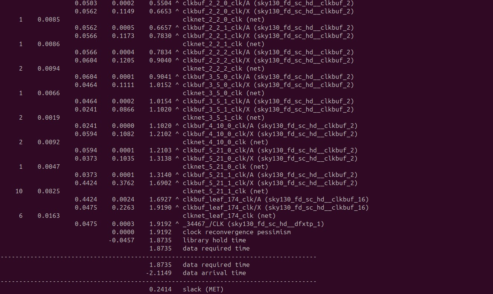

# VSD Hardware Design Program

## Final steps for RTL2GDS using tritonRoute and openSTA

### 📚 Contents

- [14. Perform detailed routing using TritonRoute and explore the routed layout](#14-perform-detailed-routing-using-tritonroute-and-explore-the-routed-layout)
- [15. Post-Route parasitic extraction using SPEF extractor](#15-post-route-parasitic-extraction-using-spef-extractor)
- [16. Post-Route OpenSTA timing analysis with the extracted parasitics of the route](#16-post-route-opensta-timing-analysis-with-the-extracted-parasitics-of-the-route)

### <ins>What is Routing in VLSI Physical Design?</ins>

Routing is the process of creating **physical electrical connections** between standard cells, macros, and I/O pins using **metal layers and vias**. It transforms the logical connections (netlist) into actual wires on silicon after placement and Clock Tree Synthesis (CTS). This is a crucial step that directly impacts the chip’s **functionality**, **timing**, **signal integrity**, and **manufacturability**.

### <ins>Goals of Routing</ins>

- Establish all **signal connections** defined in the netlist.
- Avoid **DRC (Design Rule Check)** violations.
- Minimize **routing congestion** and **via count**.
- Improve **timing performance** by optimizing critical paths.
- Ensure **LVS (Layout vs Schematic)** and **Signal Integrity** compliance.
- Maintain clear separation of **signal** and **power/ground** routing.

### <ins>Steps in Routing Flow</ins>

1. **Global Routing**  
   - Divides the layout into coarse grid cells.
   - Assigns rough paths for nets avoiding congestion and blockages.
   - Steers clear of P/G routes and macro blockages.

2. **Track Assignment (TA)**  
   - Maps each net to specific routing tracks.
   - Optimizes for fewer vias and longer straight segments.
   - Physical DRCs are not enforced yet.

3. **Detail Routing**  
   - Finalizes exact wire geometry and vias.
   - Fixes DRC violations (spacing, width, enclosure, etc.).
   - Performs timing-aware optimizations.

> ✅ **Result**: A DRC-clean, fully-connected layout ready for parasitic extraction and timing signoff.


### 14. Perform detailed routing using TritonRoute and explore the routed layout

Commands to perform routing:

```shell
# Check value of 'CURRENT_DEF'
echo $::env(CURRENT_DEF)

# Check value of 'ROUTING_STRATEGY'
echo $::env(ROUTING_STRATEGY)

# Command for detailed route using TritonRoute
run_routing
```

Screenshots of routing run:


Commands to load routed def in magic in another terminal:

```shell
# Change directory to path containing routed def
cd ~/soc-design-and-planning-nasscom-vsd/Desktop/work/tools/openlane_working_dir/openlane/designs/picorv32a/runs/19-07_00-15/results/routing

# Command to load the routed def in magic tool
magic -T /home/spatha/soc-design-and-planning-nasscom-vsd/Desktop/work/tools/openlane_working_dir/pdks/sky130A/libs.tech/magic/sky130A.tech lef read ../../tmp/merged.lef def read picorv32a.def &
```

Screenshots of routed def:


Screenshot of fast route guide present in `openlane/designs/picorv32a/runs/19-07_00-15/tmp/routing` directory:


### 15. Post-Route parasitic extraction using SPEF extractor

Commands for SPEF extraction Post-Route parasitic extraction using SPEF extractor:

```shell
cd ~/soc-design-and-planning-nasscom-vsd/Desktop/work/tools/openlane_working_dir/openlane/scripts/spef_extractor
python3 main.py -l /home/spatha/soc-design-and-planning-nasscom-vsd/Desktop/work/tools/openlane_working_dir/openlane/designs/picorv32a/runs/19-07_00-15/tmp/merged.lef -d /home/spatha/soc-design-and-planning-nasscom-vsd/Desktop/work/tools/openlane_working_dir/openlane/designs/picorv32a/runs/19-07_00-15/results/routing/picorv32a.def
```

Screenshot of commands run:


Screenshot of spef extracted:


### 16. Post-Route OpenSTA timing analysis with the extracted parasitics of the route

Commands to be run in OpenLANE flow to do OpenROAD timing analysis with integrated OpenSTA in OpenROAD:

```shell
# Launch OpenROAD shell
openroad

# Load technology and cell LEF (used for physical layout)
read_lef /openLANE_flow/designs/picorv32a/runs/19-07_00-15/tmp/merged.lef

# Load routed DEF (final physical layout including routing)
read_def /openLANE_flow/designs/picorv32a/runs/19-07_00-15/results/routing/picorv32a.def

# Save OpenROAD database state (optional, for reuse/debug)
write_db pico_route.db

# Reload the previously saved OpenROAD database (optional)
read_db pico_route.db

# Load pre-route synthesized netlist
read_verilog /openLANE_flow/designs/picorv32a/runs/19-07_00-15/results/synthesis/picorv32a.synthesis_preroute.v

# Load full liberty timing models
read_liberty $::env(LIB_SYNTH_COMPLETE)

# Link design with top module name
link_design picorv32a

# Load custom timing constraints
read_sdc /openLANE_flow/designs/picorv32a/src/my_base.sdc

# Set all clocks as propagated (real clock tree delays will be used)
set_propagated_clock [all_clocks]

# Read in extracted parasitics for post-route timing accuracy
read_spef /openLANE_flow/designs/picorv32a/runs/19-07_00-15/results/routing/picorv32a.spef

# Generate detailed setup/hold timing report (with slew, capacitance, fanout etc.)
report_checks -path_delay min_max -fields {slew trans net cap input_pins} -format full_clock_expanded -digits 4

# Exit OpenROAD
exit
```

Screenshot of commands run:





