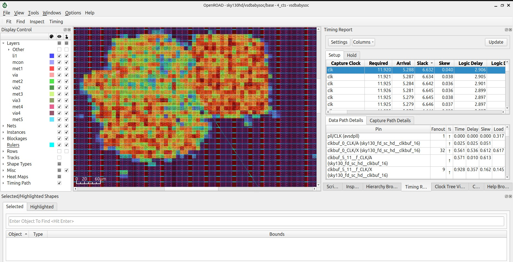
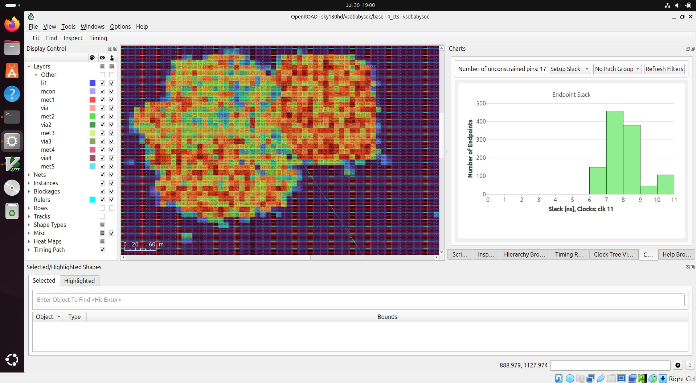
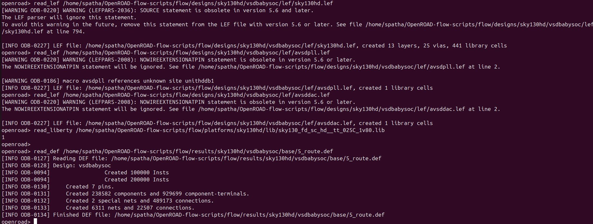
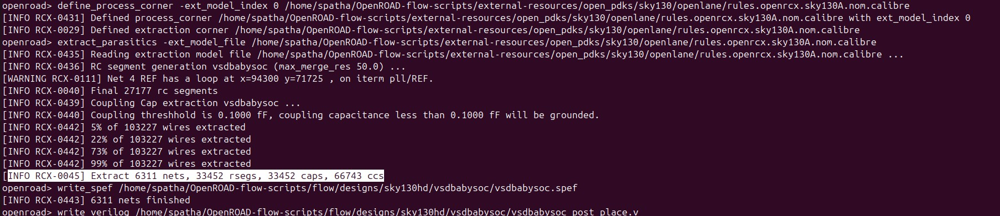
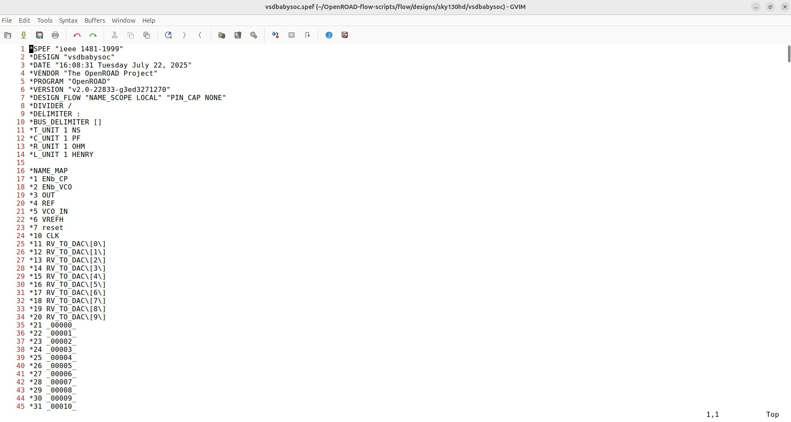

# VSD Hardware Design Program

## VSDBabySoC post_route SPEF generation

### 📚 Contents
 - [Step 1: Launch OpenROAD](#step-1-launch-openroad)
 - [Step 2: Load Design and Technology Files](#step-2-load-design-and-technology-files)
 - [Step 3: RC Extraction and Output Generation](#step-3-rc-extraction-and-output-generation)
    - [1. Define Process Corner](#-1-define-process-corner)
    - [2. Extract Parasitics](#-2-extract-parasitics)
    - [3. Write SPEF File](#-3-write-spef-file)
    - [4. Write Post-Placement Verilog Netlist](#-4-write-post-placement-verilog-netlist)


### run cts

```shell
make DESIGN_CONFIG=./designs/sky130hd/vsdbabysoc/config.mk cts
```


```shell
make DESIGN_CONFIG=./designs/sky130hd/vsdbabysoc/config.mk gui_cts
```





This section covers the step-by-step procedure to generate the **post-route Standard Parasitic Exchange Format (SPEF)** and **post-placement Verilog netlist** for the `VSDBabySoC` design using OpenROAD. These outputs are essential for accurate timing analysis and signoff after the routing stage. The SPEF file captures parasitic RC effects from the physical layout, while the updated Verilog reflects the final net connections post-placement and routing.

### `Step 1: Launch OpenROAD`

Before starting OpenROAD, set up the environment and navigate to the flow directory:

```bash
cd ~/OpenROAD-flow-scripts
source env.sh
cd flow/
openroad
```


### `Step 2: Load Design and Technology Files`

Once inside the OpenROAD shell, run the following commands in sequence to load the required design and technology data for VSDBabySoC:

These files describe the physical dimensions and metal/via layers for standard cells and macros:
```shell
read_lef /home/spatha/OpenROAD-flow-scripts/flow/designs/sky130hd/vsdbabysoc/lef/sky130hd.lef
read_lef /home/spatha/OpenROAD-flow-scripts/flow/designs/sky130hd/vsdbabysoc/lef/avsdpll.lef
read_lef /home/spatha/OpenROAD-flow-scripts/flow/designs/sky130hd/vsdbabysoc/lef/avsddac.lef
```

This file contains timing and power data for the standard cells:
```shell
read_liberty /home/spatha/OpenROAD-flow-scripts/flow/platforms/sky130hd/lib/sky130_fd_sc_hd__tt_025C_1v80.lib
```

The DEF file represents the post-route physical layout of the design:
```shell
read_def /home/spatha/OpenROAD-flow-scripts/flow/results/sky130hd/vsdbabysoc/base/5_route.def
```



### `Step 3: RC Extraction and Output Generation`

After loading the LEF, Liberty, and DEF files, run the following commands to define the process corner and extract parasitics using the available `.calibre`-format model:

#### 🔹 1. Define Process Corner
Set the process corner using the available Calibre-based extraction rules file:

```tcl
define_process_corner -ext_model_index 0 /home/spatha/OpenROAD-flow-scripts/external-resources/open_pdks/sky130/openlane/rules.openrcx.sky130A.nom.calibre
```

#### 🔹 2. Extract Parasitics

Run parasitic extraction using the same file:

```shell
extract_parasitics -ext_model_file /home/spatha/OpenROAD-flow-scripts/external-resources/open_pdks/sky130/openlane/rules.openrcx.sky130A.nom.calibre
```

#### 🔹 3. Write SPEF File
Save the extracted parasitics:

```shell
write_spef /home/spatha/OpenROAD-flow-scripts/flow/designs/sky130hd/vsdbabysoc/vsdbabysoc.spef
```

#### 🔹 4. Write Post-Placement Verilog Netlist
Save the netlist after placement and routing:

```shell
write_verilog /home/spatha/OpenROAD-flow-scripts/flow/designs/sky130hd/vsdbabysoc/vsdbabysoc_post_place.v
```



The Standard Parasitic Exchange Format (SPEF) file captures the resistance and capacitance (RC) parasitics of interconnects extracted from the routed layout. This file is essential for accurate post-route static timing analysis (STA) as it models real-world wire delays caused by metal layers and vias. Tools like OpenSTA read the SPEF file to compute timing paths that reflect true physical behavior after routing. Generating and inspecting the SPEF ensures that your design is signoff-ready with precise timing estimates.

```shell
gvim /home/spatha/OpenROAD-flow-scripts/flow/designs/sky130hd/vsdbabysoc/vsdbabysoc.spef
```



The post-placement Verilog netlist represents the logical connectivity of the design after placement and routing have been completed. This version of the netlist includes any modifications made by optimization or physical synthesis during the backend flow and ensures consistency with the final layout. It is used in downstream verification flows and enables correlation between logical simulation and physical implementation. Writing this netlist is crucial for timing closure and for validating the final connectivity of the design.

```shell
gvim /home/spatha/OpenROAD-flow-scripts/flow/designs/sky130hd/vsdbabysoc/vsdbabysoc_post_place.v
```


