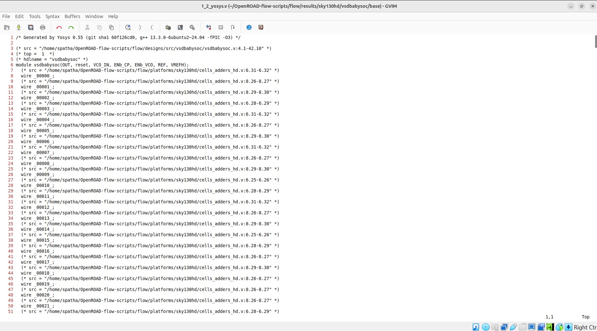
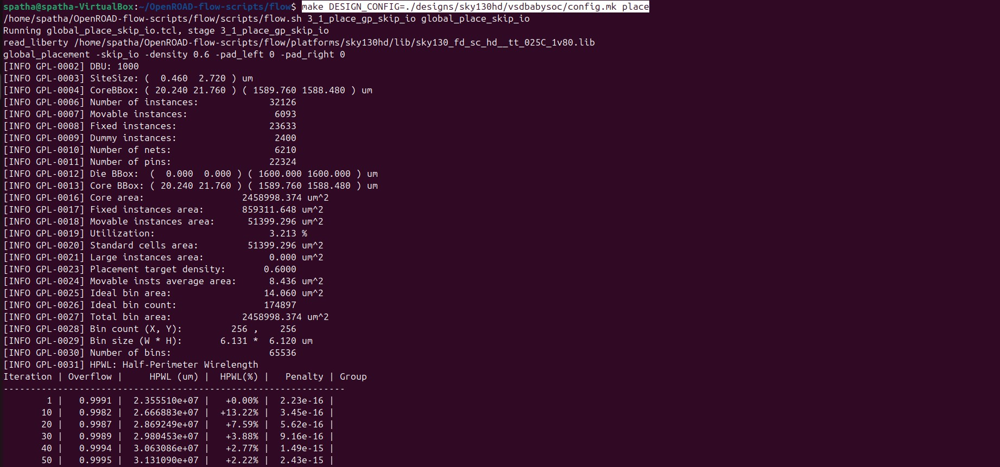
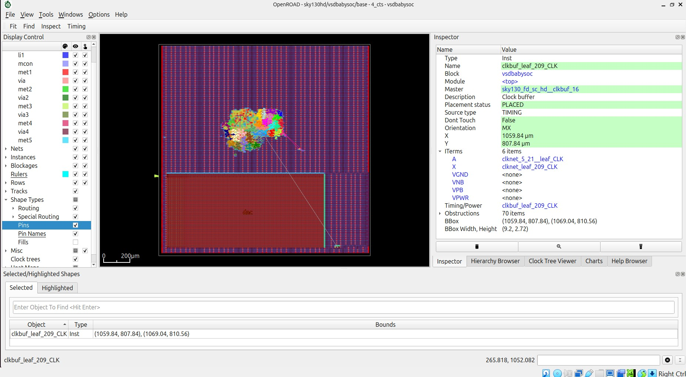
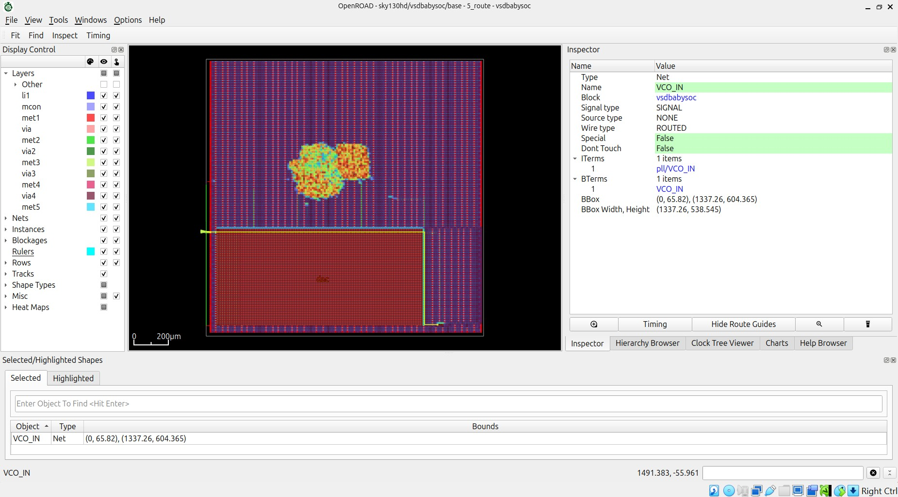

# VSD Hardware Design Program

## OpenROAD-Flow-Scripts: Physical Design, Post-Route SPEF and Verilog Netlist Generation for VSDBabySoC

### 📚 Contents
- [Issue: Floorplan Step Fails with Macro Placement Error](#️-issue-floorplan-step-fails-with-macro-placement-error)
- [Fix: Use Fresh Design Files](#-fix-use-fresh-design-files)
- [Synthesis to Route of VSDBabySoC Design](#synthesis-to-route-of-vsdbabysoc-design)
  - [Run Synthesis](#run-synthesis)
  - [Run Floorplan](#run-floorplan)
  - [Run Placement](#run-placement)
  - [Run CTS](#run-cts)
  - [Run Routing](#run-routing)
  - [🔄 Convert `.odb` to `.def` in OpenROAD](#-convert-odb-to-def-in-openroad)
- [VSDBabySoC post_route SPEF generation](#vsdbabysoc-post_route-spef-generation)
 - [Step 1: Launch OpenROAD](#step-1-launch-openroad)
 - [Step 2: Load Design and Technology Files](#step-2-load-design-and-technology-files)
 - [Step 3: RC Extraction and Output Generation](#step-3-rc-extraction-and-output-generation)
    - [1. Define Process Corner](#-1-define-process-corner)
    - [2. Extract Parasitics](#-2-extract-parasitics)
    - [3. Write SPEF File](#-3-write-spef-file)
    - [4. Write Post-Placement Verilog Netlist](#-4-write-post-placement-verilog-netlist)

### ⚠️ `Issue: Floorplan Step Fails with Macro Placement Error`

Earlier, we successfully ran the Floorplan and Placement stages for the VSDBabySoC design.

However, with the updated OpenROAD version `v2.0-23132-g814048c9f3`, these steps fail during the macro placement stage with the following error:


### ✅ `Fix: Use Fresh Design Files`

To resolve this issue:

Copy the clean design directories

- [flow_designs_sky130hd_vsdbabysoc](./flow_designs_sky130hd_vsdbabysoc) → `OpenROAD-flow-scripts/flow/designs/sky130hd/vsdbabysoc`
- [flow_designs_src_vsdbabysoc](./flow_designs_src_vsdbabysoc) → `OpenROAD-flow-scripts/flow/designs/src/vsdbabysoc`

### <ins>contents of config.mk</ins>

<details> <summary><strong>config.mk</strong></summary>

```
export DESIGN_NICKNAME = vsdbabysoc
export DESIGN_NAME = vsdbabysoc
export PLATFORM    = sky130hd
export DESIGN_HOME = /home/spatha/OpenROAD-flow-scripts/flow/designs
# export VERILOG_FILES_BLACKBOX = $(DESIGN_HOME)/src/$(DESIGN_NICKNAME)/IPs/*.v
# export VERILOG_FILES = $(sort $(wildcard $(DESIGN_HOME)/src/$(DESIGN_NICKNAME)/*.v))
# Explicitly list the Verilog files for synthesis
export VERILOG_FILES = $(DESIGN_HOME)/src/$(DESIGN_NICKNAME)/vsdbabysoc.v \
                       $(DESIGN_HOME)/src/$(DESIGN_NICKNAME)/rvmyth.v \
                       $(DESIGN_HOME)/src/$(DESIGN_NICKNAME)/clk_gate.v

export SDC_FILE      = $(DESIGN_HOME)/$(PLATFORM)/$(DESIGN_NICKNAME)/vsdbabysoc_synthesis.sdc

export vsdbabysoc_DIR = $(DESIGN_HOME)/$(PLATFORM)/$(DESIGN_NICKNAME)

export VERILOG_INCLUDE_DIRS = $(wildcard $(vsdbabysoc_DIR)/include/)

export ADDITIONAL_GDS = $(wildcard $(vsdbabysoc_DIR)/gds/*.gds)
export ADDITIONAL_LEFS = $(wildcard $(vsdbabysoc_DIR)/lef/*.lef)
#export ADDITIONAL_LIBS = $(wildcard $(vsdbabysoc_DIR)/lib/*.lib)
# export PDN_TCL = $(DESIGN_HOME)/$(PLATFORM)/$(DESIGN_NICKNAME)/pdn.tcl


# Clock Configuration
#export CLOCK_PERIOD = 11.00
export CLOCK_PORT = CLK
export CLOCK_NET  = $(CLOCK_PORT)


# Pin Order and Macro Placement Configurations
export FP_PIN_ORDER_CFG = $(vsdbabysoc_DIR)/pin_order.cfg
export MACRO_PLACEMENT_CFG = $(vsdbabysoc_DIR)/macro.cfg

# Floorplanning Configuration
export DIE_AREA   = 0 0 1600 1600
export CORE_AREA  = 20 20 1590 1590

# Placement Configuration
export PLACE_PINS_ARGS = -exclude left:0-600 -exclude left:1000-1600 -exclude right:* -exclude top:* -exclude bottom:*

# Tuning for Timing and Buffers
export TNS_END_PERCENT     = 100
export REMOVE_ABC_BUFFERS  = 1

# CTS tuning
export CTS_BUF_DISTANCE = 600
export SKIP_GATE_CLONING = 1

# Magic Tool Configuration
export MAGIC_ZEROIZE_ORIGIN = 0
export MAGIC_EXT_USE_GDS    = 1

# export CORE_UTILIZATION=0.1  # Reduce this value to allow more whitespace for routing.
```
</details>

### `Synthesis to Route of VSDBabySoC Design`

### `run synthesis`

Before running the updated flow, make sure to remove any previously generated results, logs, and intermediate files. Use the following command:

```shell

cd OpenROAD-flow-scripts/flow
make DESIGN_CONFIG=./designs/sky130hd/vsdbabysoc/config.mk clean_all
```

```shell
make DESIGN_CONFIG=./designs/sky130hd/vsdbabysoc/config.mk synth
```


**Synthesis Stats**

```shell
gvim reports/sky130hd/vsdbabysoc/base/synth_stat.txt
```


**Synthesis netlist**

```shell
gvim results/sky130hd/vsdbabysoc/base/1_2_yosys.v
```


**Synthesis Check**

```shell
gvim reports/sky130hd/vsdbabysoc/base/synth_check.txt
```


### `run floorplan`

```shell
make DESIGN_CONFIG=./designs/sky130hd/vsdbabysoc/config.mk floorplan
```


**Floorplan Result (GUI)**

```shell
make DESIGN_CONFIG=./designs/sky130hd/vsdbabysoc/config.mk gui_floorplan
```


### `run placement`

```shell
make DESIGN_CONFIG=./designs/sky130hd/vsdbabysoc/config.mk place
```




**Placement Result (GUI)**

```shell
make DESIGN_CONFIG=./designs/sky130hd/vsdbabysoc/config.mk gui_place
```

This image shows the design during the **placement stage** in OpenROAD. Standard cells have been placed, and connectivity visualization is active.


This image shows the **Placement Density Heatmap** after the placement stage in OpenROAD.  
- **Red regions** indicate areas with higher cell density, approaching 100%.
- **Green and blue regions** indicate moderate to low cell density.
- The highlighted row (`ROW_343`) displays details such as origin coordinates, site count, site spacing, and bounding box dimensions.

❗**Note:** In the floorplan stage, you do not see any placement density heat maps because standard cells have not yet been placed. The heat map will only appear after the placement step.


The placement density percentage is calculated as:

**Placement Density (%) = (Area Occupied by Cells ÷ Total Placement Area) × 100**

### `run cts`

```shell
make DESIGN_CONFIG=./designs/sky130hd/vsdbabysoc/config.mk cts
```


**CTS Result (GUI)**

```shell
make DESIGN_CONFIG=./designs/sky130hd/vsdbabysoc/config.mk gui_cts
```

This image shows the **Clock Tree Synthesis (CTS) stage** in OpenROAD, highlighting a placed clock buffer (`clkbuf_leaf_209_CLK`) with its properties displayed in the Inspector, including **position, orientation, and connectivity details**.



This image shows the **Clock Tree Viewer** after CTS in OpenROAD, illustrating the **clock buffer distribution on the layout** and a **histogram of clock insertion delays**, indicating **balanced clock skew across the sinks**.


This image shows the **Setup Timing Report** in OpenROAD, presenting a list of timing paths with key metrics such as:
- **Required Time**
- **Arrival Time**
- **Slack**
- **Skew**
- **Logic Delay**
- **Logic Depth**
- **Fanout**

All paths have **positive slack**, confirming that the design meets **setup timing requirements**.


This image displays the **Hold Timing Report** in OpenROAD, showing timing paths with details such as:
- **Required Time**
- **Arrival Time**
- **Slack**
- **Skew**
- **Logic Delay**
- **Fanout**

All paths listed have **positive slack**, indicating that the design meets **hold timing requirements** and is free from hold violations.


This image shows the **Setup Slack Histogram** after CTS in OpenROAD. The histogram represents the distribution of endpoint slack values, all of which are **positive**, indicating that there are **no setup timing violations**.


This image shows the **Hold Slack Histogram** after CTS in OpenROAD. The histogram represents the distribution of hold slack values for all endpoints. All values are **positive**, confirming that the design meets **hold timing requirements** without any violations.


Zoomed-in view of the design after CTS, showing inserted clock buffers and routing connections.


**CTS final report:**

```shell
gvim /home/spatha/OpenROAD-flow-scripts/flow/reports/sky130hd/vsdbabysoc/base/4_cts_final.rpt
```

<details> <summary><strong>4_cts_final.rpt</strong></summary>

```

==========================================================================
cts final report_tns
--------------------------------------------------------------------------
tns max 0.00

==========================================================================
cts final report_wns
--------------------------------------------------------------------------
wns max 0.00

==========================================================================
cts final report_worst_slack
--------------------------------------------------------------------------
worst slack max 6.63

==========================================================================
cts final report_clock_skew
--------------------------------------------------------------------------
Clock clk
   1.11 source latency core.CPU_result_a4[0]$_DFF_P_/CLK ^
  -0.89 target latency core.CPU_Dmem_value_a5[2][21]$_SDFFE_PP0P_/CLK ^
   0.00 CRPR
--------------
   0.22 setup skew


==========================================================================
cts final report_checks -path_delay min
--------------------------------------------------------------------------
Startpoint: core.CPU_src2_value_a3[26]$_DFF_P_
            (rising edge-triggered flip-flop clocked by clk)
Endpoint: core.CPU_src2_value_a4[26]$_DFF_P_
          (rising edge-triggered flip-flop clocked by clk)
Path Group: clk
Path Type: min

Fanout     Cap    Slew   Delay    Time   Description
-----------------------------------------------------------------------------
                          0.00    0.00   clock clk (rise edge)
                          0.00    0.00   clock source latency
     1    0.32    0.00    0.00    0.00 ^ pll/CLK (avsdpll)
                                         CLK (net)
                  0.05    0.03    0.03 ^ clkbuf_0_CLK/A (sky130_fd_sc_hd__clkbuf_16)
    32    0.62    0.61    0.54    0.56 ^ clkbuf_0_CLK/X (sky130_fd_sc_hd__clkbuf_16)
                                         clknet_0_CLK (net)
                  0.61    0.00    0.56 ^ clkbuf_5_24__f_CLK/A (sky130_fd_sc_hd__clkbuf_16)
    10    0.13    0.15    0.35    0.91 ^ clkbuf_5_24__f_CLK/X (sky130_fd_sc_hd__clkbuf_16)
                                         clknet_5_24__leaf_CLK (net)
                  0.15    0.00    0.91 ^ core.CPU_src2_value_a3[26]$_DFF_P_/CLK (sky130_fd_sc_hd__dfxtp_1)
     3    0.02    0.11    0.40    1.32 v core.CPU_src2_value_a3[26]$_DFF_P_/Q (sky130_fd_sc_hd__dfxtp_1)
                                         core.CPU_src2_value_a3[26] (net)
                  0.11    0.00    1.32 v core.CPU_src2_value_a4[26]$_DFF_P_/D (sky130_fd_sc_hd__dfxtp_1)
                                  1.32   data arrival time

                          0.00    0.00   clock clk (rise edge)
                          0.00    0.00   clock source latency
     1    0.32    0.00    0.00    0.00 ^ pll/CLK (avsdpll)
                                         CLK (net)
                  0.05    0.03    0.03 ^ clkbuf_0_CLK/A (sky130_fd_sc_hd__clkbuf_16)
    32    0.62    0.61    0.54    0.56 ^ clkbuf_0_CLK/X (sky130_fd_sc_hd__clkbuf_16)
                                         clknet_0_CLK (net)
                  0.61    0.00    0.56 ^ clkbuf_5_26__f_CLK/A (sky130_fd_sc_hd__clkbuf_16)
    10    0.14    0.16    0.35    0.92 ^ clkbuf_5_26__f_CLK/X (sky130_fd_sc_hd__clkbuf_16)
                                         clknet_5_26__leaf_CLK (net)
                  0.16    0.00    0.92 ^ clkbuf_leaf_92_CLK/A (sky130_fd_sc_hd__clkbuf_16)
     8    0.03    0.05    0.17    1.09 ^ clkbuf_leaf_92_CLK/X (sky130_fd_sc_hd__clkbuf_16)
                                         clknet_leaf_92_CLK (net)
                  0.05    0.00    1.09 ^ core.CPU_src2_value_a4[26]$_DFF_P_/CLK (sky130_fd_sc_hd__dfxtp_1)
                          0.00    1.09   clock reconvergence pessimism
                         -0.08    1.01   library hold time
                                  1.01   data required time
-----------------------------------------------------------------------------
                                  1.01   data required time
                                 -1.32   data arrival time
-----------------------------------------------------------------------------
                                  0.31   slack (MET)


==========================================================================
cts final report_checks -path_delay max
--------------------------------------------------------------------------
Startpoint: core.CPU_is_slli_a3$_DFF_P_
            (rising edge-triggered flip-flop clocked by clk)
Endpoint: core.CPU_Xreg_value_a4[16][30]$_SDFFE_PP0P_
          (rising edge-triggered flip-flop clocked by clk)
Path Group: clk
Path Type: max

Fanout     Cap    Slew   Delay    Time   Description
-----------------------------------------------------------------------------
                          0.00    0.00   clock clk (rise edge)
                          0.00    0.00   clock source latency
     1    0.32    0.00    0.00    0.00 ^ pll/CLK (avsdpll)
                                         CLK (net)
                  0.05    0.03    0.03 ^ clkbuf_0_CLK/A (sky130_fd_sc_hd__clkbuf_16)
    32    0.62    0.61    0.54    0.56 ^ clkbuf_0_CLK/X (sky130_fd_sc_hd__clkbuf_16)
                                         clknet_0_CLK (net)
                  0.61    0.01    0.57 ^ clkbuf_5_11__f_CLK/A (sky130_fd_sc_hd__clkbuf_16)
     9    0.14    0.16    0.36    0.93 ^ clkbuf_5_11__f_CLK/X (sky130_fd_sc_hd__clkbuf_16)
                                         clknet_5_11__leaf_CLK (net)
                  0.16    0.00    0.93 ^ clkbuf_leaf_77_CLK/A (sky130_fd_sc_hd__clkbuf_16)
     5    0.02    0.04    0.16    1.09 ^ clkbuf_leaf_77_CLK/X (sky130_fd_sc_hd__clkbuf_16)
                                         clknet_leaf_77_CLK (net)
                  0.04    0.00    1.09 ^ core.CPU_is_slli_a3$_DFF_P_/CLK (sky130_fd_sc_hd__dfxtp_1)
    10    0.06    0.58    0.68    1.78 ^ core.CPU_is_slli_a3$_DFF_P_/Q (sky130_fd_sc_hd__dfxtp_1)
                                         core.CPU_is_slli_a3 (net)
                  0.58    0.00    1.78 ^ place540/A (sky130_fd_sc_hd__buf_1)
     8    0.08    0.87    0.72    2.50 ^ place540/X (sky130_fd_sc_hd__buf_1)
                                         net544 (net)
                  0.87    0.00    2.50 ^ _07555_/A (sky130_fd_sc_hd__nand2_2)
     1    0.01    0.18    0.16    2.66 v _07555_/Y (sky130_fd_sc_hd__nand2_2)
                                         _02538_ (net)
                  0.18    0.00    2.66 v _07556_/B1 (sky130_fd_sc_hd__o21ai_4)
    18    0.09    0.62    0.29    2.95 ^ _07556_/Y (sky130_fd_sc_hd__o21ai_4)
                                         _02539_ (net)
                  0.62    0.00    2.95 ^ place456/A (sky130_fd_sc_hd__buf_1)
    11    0.06    0.64    0.57    3.52 ^ place456/X (sky130_fd_sc_hd__buf_1)
                                         net460 (net)
                  0.64    0.00    3.52 ^ _07557_/C (sky130_fd_sc_hd__nor3_4)
     5    0.03    0.15    0.13    3.65 v _07557_/Y (sky130_fd_sc_hd__nor3_4)
                                         _02540_ (net)
                  0.15    0.00    3.65 v _08630_/A1 (sky130_fd_sc_hd__a22oi_1)
     1    0.01    0.24    0.27    3.92 ^ _08630_/Y (sky130_fd_sc_hd__a22oi_1)
                                         _03589_ (net)
                  0.24    0.00    3.92 ^ _08631_/B1 (sky130_fd_sc_hd__o311ai_2)
     1    0.01    0.17    0.19    4.11 v _08631_/Y (sky130_fd_sc_hd__o311ai_2)
                                         _03590_ (net)
                  0.17    0.00    4.11 v _08635_/C1 (sky130_fd_sc_hd__a2111o_1)
     1    0.01    0.09    0.42    4.53 v _08635_/X (sky130_fd_sc_hd__a2111o_1)
                                         _03594_ (net)
                  0.09    0.00    4.53 v _08643_/A (sky130_fd_sc_hd__and3_4)
     2    0.01    0.04    0.18    4.71 v _08643_/X (sky130_fd_sc_hd__and3_4)
                                         _03602_ (net)
                  0.04    0.00    4.71 v _08661_/A1 (sky130_fd_sc_hd__a21oi_4)
    11    0.07    0.51    0.43    5.14 ^ _08661_/Y (sky130_fd_sc_hd__a21oi_4)
                                         _03620_ (net)
                  0.51    0.01    5.15 ^ _09042_/A2 (sky130_fd_sc_hd__o31ai_1)
     1    0.00    0.09    0.14    5.29 v _09042_/Y (sky130_fd_sc_hd__o31ai_1)
                                         _00847_ (net)
                  0.09    0.00    5.29 v core.CPU_Xreg_value_a4[16][30]$_SDFFE_PP0P_/D (sky130_fd_sc_hd__dfxtp_1)
                                  5.29   data arrival time

                         11.00   11.00   clock clk (rise edge)
                          0.00   11.00   clock source latency
     1    0.32    0.00    0.00   11.00 ^ pll/CLK (avsdpll)
                                         CLK (net)
                  0.05    0.03   11.03 ^ clkbuf_0_CLK/A (sky130_fd_sc_hd__clkbuf_16)
    32    0.62    0.61    0.54   11.56 ^ clkbuf_0_CLK/X (sky130_fd_sc_hd__clkbuf_16)
                                         clknet_0_CLK (net)
                  0.61    0.01   11.57 ^ clkbuf_5_1__f_CLK/A (sky130_fd_sc_hd__clkbuf_16)
     8    0.11    0.13    0.33   11.90 ^ clkbuf_5_1__f_CLK/X (sky130_fd_sc_hd__clkbuf_16)
                                         clknet_5_1__leaf_CLK (net)
                  0.13    0.00   11.90 ^ clkbuf_leaf_238_CLK/A (sky130_fd_sc_hd__clkbuf_16)
     6    0.02    0.04    0.15   12.05 ^ clkbuf_leaf_238_CLK/X (sky130_fd_sc_hd__clkbuf_16)
                                         clknet_leaf_238_CLK (net)
                  0.04    0.00   12.05 ^ core.CPU_Xreg_value_a4[16][30]$_SDFFE_PP0P_/CLK (sky130_fd_sc_hd__dfxtp_1)
                          0.00   12.05   clock reconvergence pessimism
                         -0.13   11.92   library setup time
                                 11.92   data required time
-----------------------------------------------------------------------------
                                 11.92   data required time
                                 -5.29   data arrival time
-----------------------------------------------------------------------------
                                  6.63   slack (MET)


==========================================================================
cts final report_checks -unconstrained
--------------------------------------------------------------------------
Startpoint: core.CPU_is_slli_a3$_DFF_P_
            (rising edge-triggered flip-flop clocked by clk)
Endpoint: core.CPU_Xreg_value_a4[16][30]$_SDFFE_PP0P_
          (rising edge-triggered flip-flop clocked by clk)
Path Group: clk
Path Type: max

Fanout     Cap    Slew   Delay    Time   Description
-----------------------------------------------------------------------------
                          0.00    0.00   clock clk (rise edge)
                          0.00    0.00   clock source latency
     1    0.32    0.00    0.00    0.00 ^ pll/CLK (avsdpll)
                                         CLK (net)
                  0.05    0.03    0.03 ^ clkbuf_0_CLK/A (sky130_fd_sc_hd__clkbuf_16)
    32    0.62    0.61    0.54    0.56 ^ clkbuf_0_CLK/X (sky130_fd_sc_hd__clkbuf_16)
                                         clknet_0_CLK (net)
                  0.61    0.01    0.57 ^ clkbuf_5_11__f_CLK/A (sky130_fd_sc_hd__clkbuf_16)
     9    0.14    0.16    0.36    0.93 ^ clkbuf_5_11__f_CLK/X (sky130_fd_sc_hd__clkbuf_16)
                                         clknet_5_11__leaf_CLK (net)
                  0.16    0.00    0.93 ^ clkbuf_leaf_77_CLK/A (sky130_fd_sc_hd__clkbuf_16)
     5    0.02    0.04    0.16    1.09 ^ clkbuf_leaf_77_CLK/X (sky130_fd_sc_hd__clkbuf_16)
                                         clknet_leaf_77_CLK (net)
                  0.04    0.00    1.09 ^ core.CPU_is_slli_a3$_DFF_P_/CLK (sky130_fd_sc_hd__dfxtp_1)
    10    0.06    0.58    0.68    1.78 ^ core.CPU_is_slli_a3$_DFF_P_/Q (sky130_fd_sc_hd__dfxtp_1)
                                         core.CPU_is_slli_a3 (net)
                  0.58    0.00    1.78 ^ place540/A (sky130_fd_sc_hd__buf_1)
     8    0.08    0.87    0.72    2.50 ^ place540/X (sky130_fd_sc_hd__buf_1)
                                         net544 (net)
                  0.87    0.00    2.50 ^ _07555_/A (sky130_fd_sc_hd__nand2_2)
     1    0.01    0.18    0.16    2.66 v _07555_/Y (sky130_fd_sc_hd__nand2_2)
                                         _02538_ (net)
                  0.18    0.00    2.66 v _07556_/B1 (sky130_fd_sc_hd__o21ai_4)
    18    0.09    0.62    0.29    2.95 ^ _07556_/Y (sky130_fd_sc_hd__o21ai_4)
                                         _02539_ (net)
                  0.62    0.00    2.95 ^ place456/A (sky130_fd_sc_hd__buf_1)
    11    0.06    0.64    0.57    3.52 ^ place456/X (sky130_fd_sc_hd__buf_1)
                                         net460 (net)
                  0.64    0.00    3.52 ^ _07557_/C (sky130_fd_sc_hd__nor3_4)
     5    0.03    0.15    0.13    3.65 v _07557_/Y (sky130_fd_sc_hd__nor3_4)
                                         _02540_ (net)
                  0.15    0.00    3.65 v _08630_/A1 (sky130_fd_sc_hd__a22oi_1)
     1    0.01    0.24    0.27    3.92 ^ _08630_/Y (sky130_fd_sc_hd__a22oi_1)
                                         _03589_ (net)
                  0.24    0.00    3.92 ^ _08631_/B1 (sky130_fd_sc_hd__o311ai_2)
     1    0.01    0.17    0.19    4.11 v _08631_/Y (sky130_fd_sc_hd__o311ai_2)
                                         _03590_ (net)
                  0.17    0.00    4.11 v _08635_/C1 (sky130_fd_sc_hd__a2111o_1)
     1    0.01    0.09    0.42    4.53 v _08635_/X (sky130_fd_sc_hd__a2111o_1)
                                         _03594_ (net)
                  0.09    0.00    4.53 v _08643_/A (sky130_fd_sc_hd__and3_4)
     2    0.01    0.04    0.18    4.71 v _08643_/X (sky130_fd_sc_hd__and3_4)
                                         _03602_ (net)
                  0.04    0.00    4.71 v _08661_/A1 (sky130_fd_sc_hd__a21oi_4)
    11    0.07    0.51    0.43    5.14 ^ _08661_/Y (sky130_fd_sc_hd__a21oi_4)
                                         _03620_ (net)
                  0.51    0.01    5.15 ^ _09042_/A2 (sky130_fd_sc_hd__o31ai_1)
     1    0.00    0.09    0.14    5.29 v _09042_/Y (sky130_fd_sc_hd__o31ai_1)
                                         _00847_ (net)
                  0.09    0.00    5.29 v core.CPU_Xreg_value_a4[16][30]$_SDFFE_PP0P_/D (sky130_fd_sc_hd__dfxtp_1)
                                  5.29   data arrival time

                         11.00   11.00   clock clk (rise edge)
                          0.00   11.00   clock source latency
     1    0.32    0.00    0.00   11.00 ^ pll/CLK (avsdpll)
                                         CLK (net)
                  0.05    0.03   11.03 ^ clkbuf_0_CLK/A (sky130_fd_sc_hd__clkbuf_16)
    32    0.62    0.61    0.54   11.56 ^ clkbuf_0_CLK/X (sky130_fd_sc_hd__clkbuf_16)
                                         clknet_0_CLK (net)
                  0.61    0.01   11.57 ^ clkbuf_5_1__f_CLK/A (sky130_fd_sc_hd__clkbuf_16)
     8    0.11    0.13    0.33   11.90 ^ clkbuf_5_1__f_CLK/X (sky130_fd_sc_hd__clkbuf_16)
                                         clknet_5_1__leaf_CLK (net)
                  0.13    0.00   11.90 ^ clkbuf_leaf_238_CLK/A (sky130_fd_sc_hd__clkbuf_16)
     6    0.02    0.04    0.15   12.05 ^ clkbuf_leaf_238_CLK/X (sky130_fd_sc_hd__clkbuf_16)
                                         clknet_leaf_238_CLK (net)
                  0.04    0.00   12.05 ^ core.CPU_Xreg_value_a4[16][30]$_SDFFE_PP0P_/CLK (sky130_fd_sc_hd__dfxtp_1)
                          0.00   12.05   clock reconvergence pessimism
                         -0.13   11.92   library setup time
                                 11.92   data required time
-----------------------------------------------------------------------------
                                 11.92   data required time
                                 -5.29   data arrival time
-----------------------------------------------------------------------------
                                  6.63   slack (MET)


==========================================================================
cts final report_check_types -max_slew -max_cap -max_fanout -violators
--------------------------------------------------------------------------

==========================================================================
cts final max_slew_check_slack
--------------------------------------------------------------------------
0.07318645715713501

==========================================================================
cts final max_slew_check_limit
--------------------------------------------------------------------------
1.4979510307312012

==========================================================================
cts final max_slew_check_slack_limit
--------------------------------------------------------------------------
0.0489

==========================================================================
cts final max_fanout_check_slack
--------------------------------------------------------------------------
1.0000000150474662e+30

==========================================================================
cts final max_fanout_check_limit
--------------------------------------------------------------------------
1.0000000150474662e+30

==========================================================================
cts final max_capacitance_check_slack
--------------------------------------------------------------------------
0.006848945748060942

==========================================================================
cts final max_capacitance_check_limit
--------------------------------------------------------------------------
0.1620579957962036

==========================================================================
cts final max_capacitance_check_slack_limit
--------------------------------------------------------------------------
0.0423

==========================================================================
cts final max_slew_violation_count
--------------------------------------------------------------------------
max slew violation count 0

==========================================================================
cts final max_fanout_violation_count
--------------------------------------------------------------------------
max fanout violation count 0

==========================================================================
cts final max_cap_violation_count
--------------------------------------------------------------------------
max cap violation count 0

==========================================================================
cts final setup_violation_count
--------------------------------------------------------------------------
setup violation count 0

==========================================================================
cts final hold_violation_count
--------------------------------------------------------------------------
hold violation count 0

==========================================================================
cts final report_checks -path_delay max reg to reg
--------------------------------------------------------------------------
Startpoint: core.CPU_is_slli_a3$_DFF_P_
            (rising edge-triggered flip-flop clocked by clk)
Endpoint: core.CPU_Xreg_value_a4[16][30]$_SDFFE_PP0P_
          (rising edge-triggered flip-flop clocked by clk)
Path Group: clk
Path Type: max

  Delay    Time   Description
---------------------------------------------------------
   0.00    0.00   clock clk (rise edge)
   0.00    0.00   clock source latency
   0.00    0.00 ^ pll/CLK (avsdpll)
   0.56    0.56 ^ clkbuf_0_CLK/X (sky130_fd_sc_hd__clkbuf_16)
   0.37    0.93 ^ clkbuf_5_11__f_CLK/X (sky130_fd_sc_hd__clkbuf_16)
   0.16    1.09 ^ clkbuf_leaf_77_CLK/X (sky130_fd_sc_hd__clkbuf_16)
   0.00    1.09 ^ core.CPU_is_slli_a3$_DFF_P_/CLK (sky130_fd_sc_hd__dfxtp_1)
   0.68    1.78 ^ core.CPU_is_slli_a3$_DFF_P_/Q (sky130_fd_sc_hd__dfxtp_1)
   0.72    2.50 ^ place540/X (sky130_fd_sc_hd__buf_1)
   0.16    2.66 v _07555_/Y (sky130_fd_sc_hd__nand2_2)
   0.29    2.95 ^ _07556_/Y (sky130_fd_sc_hd__o21ai_4)
   0.57    3.52 ^ place456/X (sky130_fd_sc_hd__buf_1)
   0.13    3.65 v _07557_/Y (sky130_fd_sc_hd__nor3_4)
   0.27    3.92 ^ _08630_/Y (sky130_fd_sc_hd__a22oi_1)
   0.19    4.11 v _08631_/Y (sky130_fd_sc_hd__o311ai_2)
   0.42    4.53 v _08635_/X (sky130_fd_sc_hd__a2111o_1)
   0.18    4.71 v _08643_/X (sky130_fd_sc_hd__and3_4)
   0.43    5.14 ^ _08661_/Y (sky130_fd_sc_hd__a21oi_4)
   0.15    5.29 v _09042_/Y (sky130_fd_sc_hd__o31ai_1)
   0.00    5.29 v core.CPU_Xreg_value_a4[16][30]$_SDFFE_PP0P_/D (sky130_fd_sc_hd__dfxtp_1)
           5.29   data arrival time

  11.00   11.00   clock clk (rise edge)
   0.00   11.00   clock source latency
   0.00   11.00 ^ pll/CLK (avsdpll)
   0.56   11.56 ^ clkbuf_0_CLK/X (sky130_fd_sc_hd__clkbuf_16)
   0.34   11.90 ^ clkbuf_5_1__f_CLK/X (sky130_fd_sc_hd__clkbuf_16)
   0.15   12.05 ^ clkbuf_leaf_238_CLK/X (sky130_fd_sc_hd__clkbuf_16)
   0.00   12.05 ^ core.CPU_Xreg_value_a4[16][30]$_SDFFE_PP0P_/CLK (sky130_fd_sc_hd__dfxtp_1)
   0.00   12.05   clock reconvergence pessimism
  -0.13   11.92   library setup time
          11.92   data required time
---------------------------------------------------------
          11.92   data required time
          -5.29   data arrival time
---------------------------------------------------------
           6.63   slack (MET)


==========================================================================
cts final report_checks -path_delay min reg to reg
--------------------------------------------------------------------------
Startpoint: core.CPU_src2_value_a3[26]$_DFF_P_
            (rising edge-triggered flip-flop clocked by clk)
Endpoint: core.CPU_src2_value_a4[26]$_DFF_P_
          (rising edge-triggered flip-flop clocked by clk)
Path Group: clk
Path Type: min

  Delay    Time   Description
---------------------------------------------------------
   0.00    0.00   clock clk (rise edge)
   0.00    0.00   clock source latency
   0.00    0.00 ^ pll/CLK (avsdpll)
   0.56    0.56 ^ clkbuf_0_CLK/X (sky130_fd_sc_hd__clkbuf_16)
   0.35    0.91 ^ clkbuf_5_24__f_CLK/X (sky130_fd_sc_hd__clkbuf_16)
   0.00    0.91 ^ core.CPU_src2_value_a3[26]$_DFF_P_/CLK (sky130_fd_sc_hd__dfxtp_1)
   0.40    1.32 v core.CPU_src2_value_a3[26]$_DFF_P_/Q (sky130_fd_sc_hd__dfxtp_1)
   0.00    1.32 v core.CPU_src2_value_a4[26]$_DFF_P_/D (sky130_fd_sc_hd__dfxtp_1)
           1.32   data arrival time

   0.00    0.00   clock clk (rise edge)
   0.00    0.00   clock source latency
   0.00    0.00 ^ pll/CLK (avsdpll)
   0.56    0.56 ^ clkbuf_0_CLK/X (sky130_fd_sc_hd__clkbuf_16)
   0.36    0.92 ^ clkbuf_5_26__f_CLK/X (sky130_fd_sc_hd__clkbuf_16)
   0.17    1.09 ^ clkbuf_leaf_92_CLK/X (sky130_fd_sc_hd__clkbuf_16)
   0.00    1.09 ^ core.CPU_src2_value_a4[26]$_DFF_P_/CLK (sky130_fd_sc_hd__dfxtp_1)
   0.00    1.09   clock reconvergence pessimism
  -0.08    1.01   library hold time
           1.01   data required time
---------------------------------------------------------
           1.01   data required time
          -1.32   data arrival time
---------------------------------------------------------
           0.31   slack (MET)


==========================================================================
cts final critical path target clock latency max path
--------------------------------------------------------------------------
0

==========================================================================
cts final critical path target clock latency min path
--------------------------------------------------------------------------
0

==========================================================================
cts final critical path source clock latency min path
--------------------------------------------------------------------------
0

==========================================================================
cts final critical path delay
--------------------------------------------------------------------------
5.2882

==========================================================================
cts final critical path slack
--------------------------------------------------------------------------
6.6316

==========================================================================
cts final slack div critical path delay
--------------------------------------------------------------------------
125.403729

==========================================================================
cts final report_power
--------------------------------------------------------------------------
Group                  Internal  Switching    Leakage      Total
                          Power      Power      Power      Power (Watts)
----------------------------------------------------------------
Sequential             4.41e-03   5.76e-04   9.26e-09   4.99e-03  29.3%
Combinational          1.32e-03   2.37e-03   1.04e-08   3.69e-03  21.7%
Clock                  5.54e-03   2.78e-03   4.76e-09   8.32e-03  49.0%
Macro                  0.00e+00   0.00e+00   0.00e+00   0.00e+00   0.0%
Pad                    0.00e+00   0.00e+00   0.00e+00   0.00e+00   0.0%
----------------------------------------------------------------
Total                  1.13e-02   5.72e-03   2.44e-08   1.70e-02 100.0%
                          66.3%      33.7%       0.0%
```
</details>


### `run routing`

```shell
make DESIGN_CONFIG=./designs/sky130hd/vsdbabysoc/config.mk route
```


**Routing Result (GUI)**

```shell
make DESIGN_CONFIG=./designs/sky130hd/vsdbabysoc/config.mk gui_route
```
This image shows the **post-routing stage** in OpenROAD. The highlighted net `VCO_IN` is fully routed, with its details such as signal type, wire type, and bounding box displayed in the Inspector.




This image shows the **Routing Congestion Heatmap** after the routing stage in OpenROAD. Areas with higher congestion are highlighted in **red**, while green regions indicate lower congestion. The highlighted net `_01595_` is fully routed, and its properties such as bounding box and connectivity details are shown in the Inspector.


This image shows the **clock net (`clknet_0_CLK`) routing** overlaid on the **routing congestion heatmap** in OpenROAD. 
- **Red regions** indicate areas of high routing congestion.
- The highlighted yellow path represents the clock distribution network across the design.
- Inspector details show net properties like type (`CLOCK`), routing status (`ROUTED`), and bounding box coordinates.
  


This image shows the **routing congestion heatmap** in OpenROAD after the routing stage, with utilization values (%) displayed in each grid.  
- **Red cells** represent high congestion (close to 100% utilization).
- A **filler cell** (`FILLER_349_1316`) is highlighted, with details like coordinates, bounding box, and obstructions shown in the Inspector.

#### Formula for Congestion:

The routing congestion percentage is calculated as:

**Congestion (%) = (Used Routing Tracks ÷ Available Routing Tracks) × 100**

Where:
- **Used Routing Tracks** = Number of tracks occupied by wires in a specific region.
- **Available Routing Tracks** = Total routing capacity of that region.


**Timing Report after Routing**

After completing routing, run the following in the OpenROAD GUI → Scripting window:

```shell
report_checks
```

This command provides a detailed timing analysis of critical paths.

In the example below, the design meets timing with Slack = 6.41 ns (MET)


### 🔄 Convert `.odb` to `.def` in OpenROAD

Follow the steps below to export a DEF file from an existing OpenDB (`.odb`) database.

```shell
cd ~/OpenROAD-flow-scripts
source env.sh
cd flow
openroad
# Load the .odb database file
read_db /home/spatha/OpenROAD-flow-scripts/flow/results/sky130hd/vsdbabysoc/base/5_2_route.odb
# Write out the DEF file
write_def /home/spatha/OpenROAD-flow-scripts/flow/results/sky130hd/vsdbabysoc/base/5_2_route.def
```


```shell
gvim /home/spatha/OpenROAD-flow-scripts/flow/results/sky130hd/vsdbabysoc/base/5_2_route.def
```


### `VSDBabySoC post_route SPEF generation`

This section covers the step-by-step procedure to generate the **post-route Standard Parasitic Exchange Format (SPEF)** and **post-placement Verilog netlist** for the `VSDBabySoC` design using OpenROAD. These outputs are essential for accurate timing analysis and signoff after the routing stage. The SPEF file captures parasitic RC effects from the physical layout, while the updated Verilog reflects the final net connections post-placement and routing.

### `Step 1: Launch OpenROAD`

Before starting OpenROAD, set up the environment and navigate to the flow directory:

```bash
cd ~/OpenROAD-flow-scripts
source env.sh
cd flow/
openroad
```


### `Step 2: Load Design and Technology Files`

Once inside the OpenROAD shell, run the following commands in sequence to load the required design and technology data for VSDBabySoC:

These files describe the physical dimensions and metal/via layers for standard cells and macros:
```shell
read_lef /home/spatha/OpenROAD-flow-scripts/flow/designs/sky130hd/vsdbabysoc/lef/sky130hd.lef
read_lef /home/spatha/OpenROAD-flow-scripts/flow/designs/sky130hd/vsdbabysoc/lef/avsdpll.lef
read_lef /home/spatha/OpenROAD-flow-scripts/flow/designs/sky130hd/vsdbabysoc/lef/avsddac.lef
```

This file contains timing and power data for the standard cells:
```shell
read_liberty /home/spatha/OpenROAD-flow-scripts/flow/platforms/sky130hd/lib/sky130_fd_sc_hd__tt_025C_1v80.lib
```

The DEF file represents the post-route physical layout of the design:
```shell
read_def /home/spatha/OpenROAD-flow-scripts/flow/results/sky130hd/vsdbabysoc/base/5_2_route.def
```


### `Step 3: RC Extraction and Output Generation`

After loading the LEF, Liberty, and DEF files, run the following commands to define the process corner and extract parasitics using the available `.calibre`-format model:

#### 🔹 1. Define Process Corner
Set the process corner using the available Calibre-based extraction rules file:

```tcl
define_process_corner -ext_model_index 0 /home/spatha/OpenROAD-flow-scripts/external-resources/open_pdks/sky130/openlane/rules.openrcx.sky130A.nom.calibre
```

#### 🔹 2. Extract Parasitics

Run parasitic extraction using the same file:

```shell
extract_parasitics -ext_model_file /home/spatha/OpenROAD-flow-scripts/external-resources/open_pdks/sky130/openlane/rules.openrcx.sky130A.nom.calibre
```

#### 🔹 3. Write SPEF File
Save the extracted parasitics:

```shell
write_spef /home/spatha/OpenROAD-flow-scripts/flow/designs/sky130hd/vsdbabysoc/vsdbabysoc.spef
```

#### 🔹 4. Write Post-Placement Verilog Netlist
Save the netlist after placement and routing:

```shell
write_verilog /home/spatha/OpenROAD-flow-scripts/flow/designs/sky130hd/vsdbabysoc/vsdbabysoc_post_place.v
```


The Standard Parasitic Exchange Format (SPEF) file captures the resistance and capacitance (RC) parasitics of interconnects extracted from the routed layout. This file is essential for accurate post-route static timing analysis (STA) as it models real-world wire delays caused by metal layers and vias. Tools like OpenSTA read the SPEF file to compute timing paths that reflect true physical behavior after routing. Generating and inspecting the SPEF ensures that your design is signoff-ready with precise timing estimates.

```shell
gvim /home/spatha/OpenROAD-flow-scripts/flow/designs/sky130hd/vsdbabysoc/vsdbabysoc.spef
```


The post-placement Verilog netlist represents the logical connectivity of the design after placement and routing have been completed. This version of the netlist includes any modifications made by optimization or physical synthesis during the backend flow and ensures consistency with the final layout. It is used in downstream verification flows and enables correlation between logical simulation and physical implementation. Writing this netlist is crucial for timing closure and for validating the final connectivity of the design.

```shell
gvim /home/spatha/OpenROAD-flow-scripts/flow/designs/sky130hd/vsdbabysoc/vsdbabysoc_post_place.v
```


