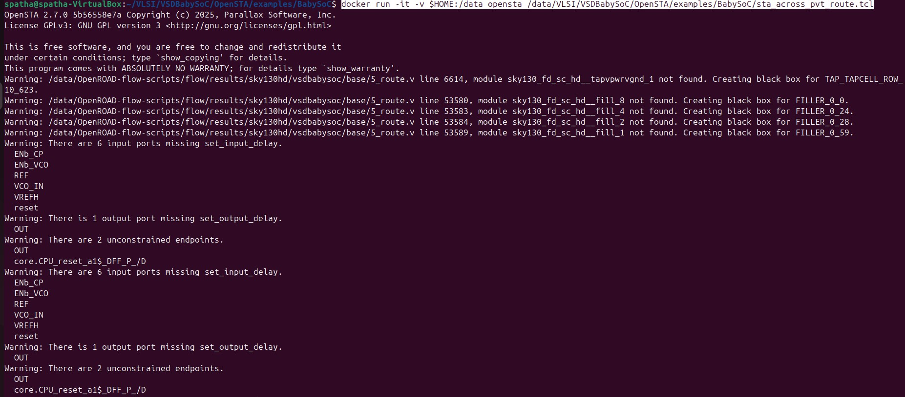
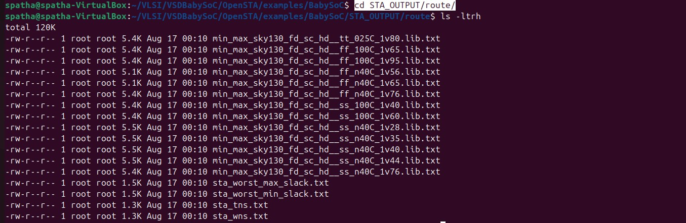
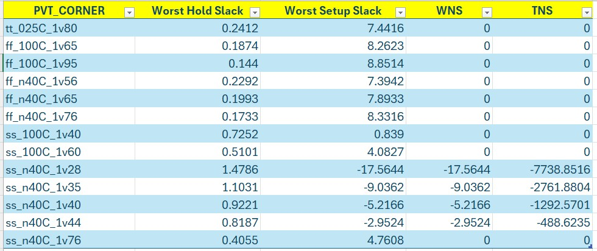
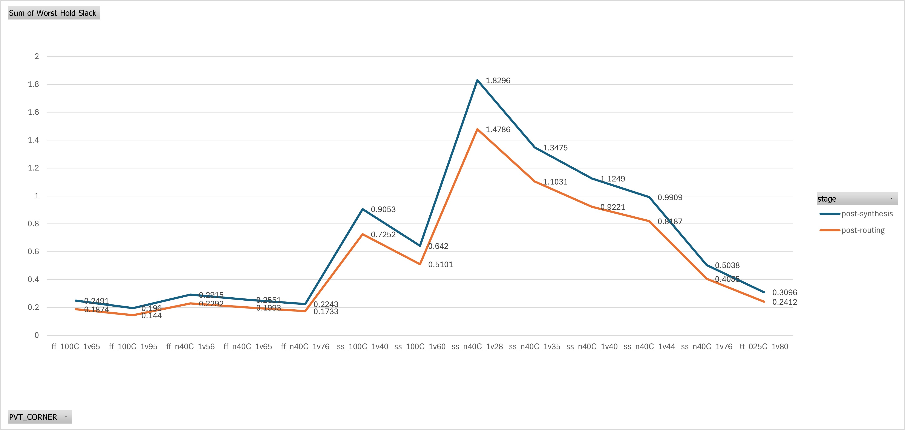
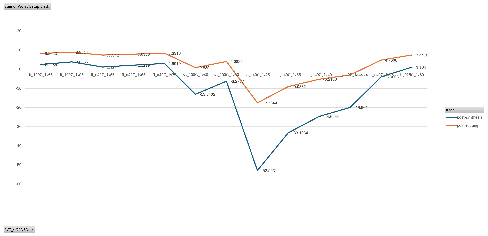
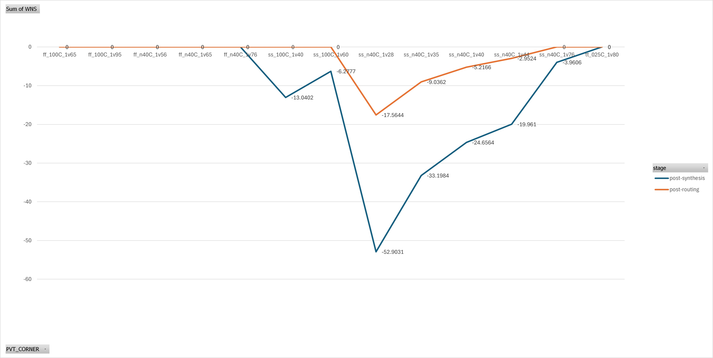
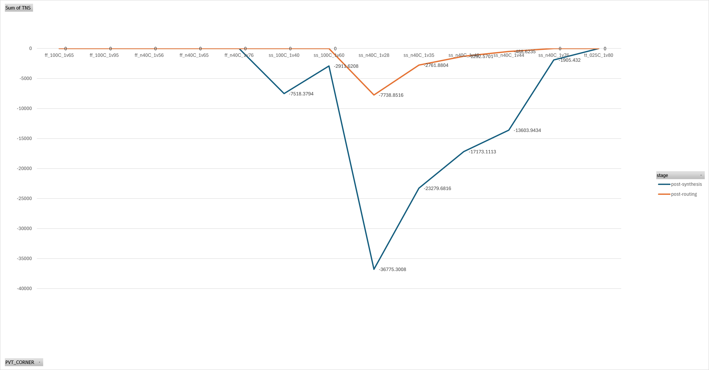

# VSD Hardware Design Program

## Post-Routing STA analysis of VSDBabySoC Design

### 📚 Contents
- [Key Files](#key-files)
- [Running STA](#running-sta)
- [Post-Routing Results Summary](#post-routing-results-summary)
- [📈 Comparison Graphs](#-comparison-graphs)
  
### `Key Files`

To perform reliable timing verification of the BabySoC design after routing, we use OpenSTA with a dedicated TCL script and a post-CTS constraints file.

The `sta_across_pvt_route.tcl` script automates static timing analysis across multiple process, voltage, and temperature (PVT) corners, while the `vsdbabysoc_post_cts.sdc` file provides the design-specific timing constraints generated after clock tree synthesis. Together, these files ensure that STA is run under the correct operating conditions and that reports such as setup/hold slack, WNS, and TNS are captured for each library corner.

<details> <summary><strong>sta_across_pvt_route.tcl</strong></summary>

```
 set list_of_lib_files(1) "sky130_fd_sc_hd__tt_025C_1v80.lib"
 set list_of_lib_files(2) "sky130_fd_sc_hd__ff_100C_1v65.lib"
 set list_of_lib_files(3) "sky130_fd_sc_hd__ff_100C_1v95.lib"
 set list_of_lib_files(4) "sky130_fd_sc_hd__ff_n40C_1v56.lib"
 set list_of_lib_files(5) "sky130_fd_sc_hd__ff_n40C_1v65.lib"
 set list_of_lib_files(6) "sky130_fd_sc_hd__ff_n40C_1v76.lib"
 set list_of_lib_files(7) "sky130_fd_sc_hd__ss_100C_1v40.lib"
 set list_of_lib_files(8) "sky130_fd_sc_hd__ss_100C_1v60.lib"
 set list_of_lib_files(9) "sky130_fd_sc_hd__ss_n40C_1v28.lib"
 set list_of_lib_files(10) "sky130_fd_sc_hd__ss_n40C_1v35.lib"
 set list_of_lib_files(11) "sky130_fd_sc_hd__ss_n40C_1v40.lib"
 set list_of_lib_files(12) "sky130_fd_sc_hd__ss_n40C_1v44.lib"
 set list_of_lib_files(13) "sky130_fd_sc_hd__ss_n40C_1v76.lib"

 read_liberty /data/VLSI/VSDBabySoC/OpenSTA/examples/timing_libs/avsdpll.lib
 read_liberty /data/VLSI/VSDBabySoC/OpenSTA/examples/timing_libs/avsddac.lib

 for {set i 1} {$i <= [array size list_of_lib_files]} {incr i} {
 read_liberty /data/VLSI/VSDBabySoC/OpenSTA/examples/timing_libs/$list_of_lib_files($i)
 read_verilog /data/OpenROAD-flow-scripts/flow/results/sky130hd/vsdbabysoc/base/5_route.v
 link_design vsdbabysoc
 current_design
 read_sdc /data/VLSI/VSDBabySoC/OpenSTA/examples/BabySoC/vsdbabysoc_post_cts.sdc
 check_setup -verbose
 report_checks -path_delay min_max -fields {nets cap slew input_pins fanout} -digits {4} > /data/VLSI/VSDBabySoC/OpenSTA/examples/BabySoC/STA_OUTPUT/route/min_max_$list_of_lib_files($i).txt

 exec echo "$list_of_lib_files($i)" >> /data/VLSI/VSDBabySoC/OpenSTA/examples/BabySoC/STA_OUTPUT/route/sta_worst_max_slack.txt
 report_worst_slack -max -digits {4} >> /data/VLSI/VSDBabySoC/OpenSTA/examples/BabySoC/STA_OUTPUT/route/sta_worst_max_slack.txt

 exec echo "$list_of_lib_files($i)" >> /data/VLSI/VSDBabySoC/OpenSTA/examples/BabySoC/STA_OUTPUT/route/sta_worst_min_slack.txt
 report_worst_slack -min -digits {4} >> /data/VLSI/VSDBabySoC/OpenSTA/examples/BabySoC/STA_OUTPUT/route/sta_worst_min_slack.txt

 exec echo "$list_of_lib_files($i)" >> /data/VLSI/VSDBabySoC/OpenSTA/examples/BabySoC/STA_OUTPUT/route/sta_tns.txt
 report_tns -digits {4} >> /data/VLSI/VSDBabySoC/OpenSTA/examples/BabySoC/STA_OUTPUT/route/sta_tns.txt

 exec echo "$list_of_lib_files($i)" >> /data/VLSI/VSDBabySoC/OpenSTA/examples/BabySoC/STA_OUTPUT/route/sta_wns.txt
 report_wns -digits {4} >> /data/VLSI/VSDBabySoC/OpenSTA/examples/BabySoC/STA_OUTPUT/route/sta_wns.txt
 }
```
</details>

This `vsdbabysoc_post_cts.sdc` file is an auto-generated SDC created after clock tree synthesis. It sets the current design to `vsdbabysoc` and defines the basic timing environment. The file specifies a clock named `clk` with an `11 ns` period, driven from the pin `pll/CLK`, and marks it as a propagated clock for STA. Sections for environment and design rules are also included for adding further constraints if needed.

```shell
###############################################################################
# Created by write_sdc
###############################################################################
current_design vsdbabysoc
###############################################################################
# Timing Constraints
###############################################################################
create_clock -name clk -period 11.0000 [get_pins {pll/CLK}]
set_propagated_clock [get_clocks {clk}]
###############################################################################
# Environment
###############################################################################
###############################################################################
# Design Rules
###############################################################################
```

### `Running STA`

To run the post-route STA using Docker, follow these steps to execute the `sta_across_pvt_route.tcl` script. Launch a Docker container with your local directory mounted, run the script inside the container, and it will generate all timing reports such as setup/hold slack, WNS, and TNS in the mounted `/data` folder. Using Docker ensures a consistent and reproducible environment for performing the analysis.

```shell
docker run -it -v $HOME:/data opensta /data/VLSI/VSDBabySoC/OpenSTA/examples/BabySoC/sta_across_pvt_route.tcl
```



After running the STA script, you can navigate to the `STA_OUTPUT/route/` directory to see all the generated timing reports. This includes detailed path delay reports for each library corner (`min_max_*.txt`), worst setup and hold slack summaries (`sta_worst_max_slack.txt and sta_worst_min_slack.txt`), as well as total negative slack (sta_tns.txt) and worst negative slack (`sta_wns.txt`). These files provide a complete overview of the BabySoC design’s timing performance after routing.



### `Post-routing Results Summary`

Here is a tabulated view of the key timing results generated by the STA script.



### 📈 Comparison Graphs

Here is a graph showing the comparison of `worst-case hold slack` post-synthesis vs post-routing for the BabySoC design.



Here is a graph showing the comparison of `worst-case setup slack` post-synthesis vs post-routing for the BabySoC design.



Here is a graph showing the comparison of `WNS` post-synthesis vs post-routing for the BabySoC design.



Here is a graph showing the comparison of `TNS` post-synthesis vs post-routing for the BabySoC design.


