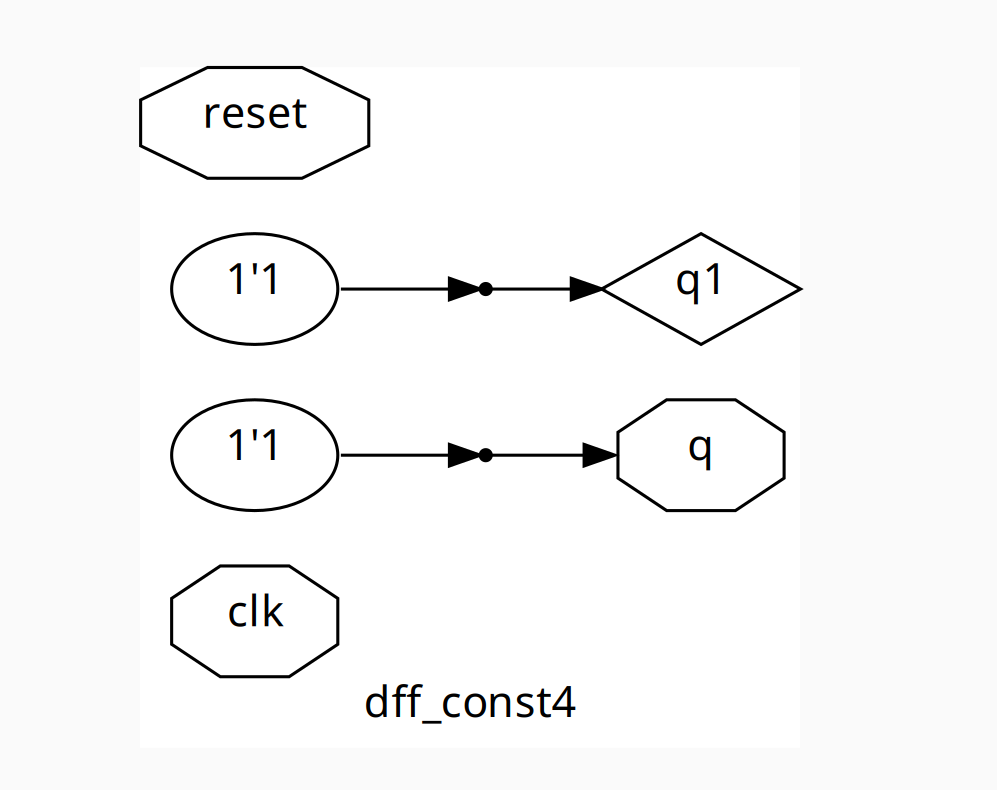

# VSD Hardware Design Program

## Combinational and sequential optmizations

## 📚 Contents

- [Combinational Logic Optimization](#Combinational-Logic-Optimization)
- [Sequential Logic Optimization](#Sequential-Logic-Optimization)
- [Combinational Logic Optimization-labs](#Combinational-Logic-Optimization-examples)
- [Sequential-Logic-Optimization-labs](#Sequential-Logic-Optimization-examples)

### Combinational Logic Optimization

#### Objective:
Squeeze and simplify logic to get the most optimized design in terms of **area** and **power**.

#### Techniques:

- **Constant Propagation**
  - Replaces logic blocks with constants when input values are fixed.
  - **Example:**
    ```
    Y = ((A·B) + C)' 
    If A = 0 → Y = (0 + C)' = C'
    ```
  - **Result:** Complex gate logic (6 MOS transistors) simplifies to a single inverter (2 MOS transistors).

- **Boolean Logic Optimization**
  - Simplify Boolean expressions using:
    - Karnaugh Map (K-Map)
    - Quine McCluskey Method
  - **Example Verilog:**
    ```verilog
    assign y = a ? (b ? c : (c ? a : 0)) : (!c);
    ```
    - Optimized expression:  
      ```
      y = a ⊕ c
      ```
**Note:**  
  - The command to perform logic optimization in Yosys is `opt_clean`.  
  - Additionally, for a hierarchical design involving multiple sub-modules, the design must be flattened by running the `flatten` command before executing the `opt_clean` command.

```shell
USAGE:
After the synth -top <module_name> command is executed, do:
    opt_clean -purge

This command identifies wires and cells that are unused and removes them.
The additional switch, purge also removes the internal nets if they have a public name.
```
---

### Sequential Logic Optimization

#### Basic:
- **Sequential Constant Propagation**  
  - Propagates known constant values through flip-flops during synthesis.

#### Advanced :
- **State Optimization**
  - Reduces the number of states in FSMs to optimize area and transitions.
- **Retiming**
  - Moves registers across logic boundaries to balance delay and improve timing.
- **Sequential Logic Cloning**
  - Duplicates logic in floorplan-aware synthesis to meet timing and congestion goals.
    
## Combinational Logic Optimization examples
## lab1


```bash
yosys
read_liberty -lib ../lib/sky130_fd_sc_hd__tt_025C_1v80.lib
read_verilog opt_check.v 
synth -top opt_check
opt_clean -purge # Removes unused or redundant logic #
abc -liberty ../lib/sky130_fd_sc_hd__tt_025C_1v80.lib
show
```


## lab2


```bash
yosys
read_liberty -lib ../lib/sky130_fd_sc_hd__tt_025C_1v80.lib
read_verilog opt_check2.v 
synth -top opt_check2
opt_clean -purge
abc -liberty ../lib/sky130_fd_sc_hd__tt_025C_1v80.lib
show
```


## lab3


```bash
yosys
read_liberty -lib ../lib/sky130_fd_sc_hd__tt_025C_1v80.lib
read_verilog opt_check3.v 
synth -top opt_check3
opt_clean -purge
abc -liberty ../lib/sky130_fd_sc_hd__tt_025C_1v80.lib
show
```


## lab4


```bash
yosys
read_liberty -lib ../lib/sky130_fd_sc_hd__tt_025C_1v80.lib
read_verilog opt_check4.v 
synth -top opt_check4
opt_clean -purge
abc -liberty ../lib/sky130_fd_sc_hd__tt_025C_1v80.lib
show
```


## lab5 - multiple_module_opt1


```bash
# --------Phase 1: Flatten the hierarchical RTL design---------------

# Invoke yosys
yosys

# Load standard cell library (Liberty format)
read_liberty -lib ../lib/sky130_fd_sc_hd__tt_025C_1v80.lib

# Read hierarchical RTL design
read_verilog multiple_module_opt.v

# Synthesize top module
synth -top multiple_module_opt

# Map to standard cells using ABC
abc -liberty ../lib/sky130_fd_sc_hd__tt_025C_1v80.lib

# Flatten design hierarchy 
# 🔸Essential before performing optimization on multi-module RTLs
flatten

# Write out the flattened netlist
write_verilog -noattr multiple_module_opt_flat.v
```
```bash

# ----------Phase 2: Optimize the flattened netlist-------------

# Invoke yosys
yosys

# Load standard cell library (Liberty format)
read_liberty -lib ../lib/sky130_fd_sc_hd__tt_025C_1v80.lib

# Read the flattened netlist for further optimization
read_verilog multiple_module_opt_flat.v

# Synthesize top module
synth -top multiple_module_opt

# Remove unused logic and clean netlist
opt_clean -purge   # Cleans up redundant gates and wires after flattening

# Map to standard cells using ABC
abc -liberty ../lib/sky130_fd_sc_hd__tt_025C_1v80.lib

# Visualize optimized gate-level netlist
show
```


>One AND2 gate (a & 1)
>One A21O gate ((a & b) | c)

## lab6 - multiple_module_opt2


```bash
# --------Phase 1: Flatten the hierarchical RTL design---------------

# Invoke yosys
yosys

# Load standard cell library (Liberty format)
read_liberty -lib ../lib/sky130_fd_sc_hd__tt_025C_1v80.lib

# Read hierarchical RTL design
read_verilog multiple_module_opt2.v

# Synthesize top module
synth -top multiple_module_opt2

# Map to standard cells using ABC
abc -liberty ../lib/sky130_fd_sc_hd__tt_025C_1v80.lib

# Flatten design hierarchy 
# 🔸Essential before performing optimization on multi-module RTLs
flatten

# Write out the flattened netlist
write_verilog -noattr multiple_module_opt2_flat.v
```
```bash

# ----------Phase 2: Optimize the flattened netlist-------------

# Invoke yosys
yosys

# Load standard cell library (Liberty format)
read_liberty -lib ../lib/sky130_fd_sc_hd__tt_025C_1v80.lib

# Read the flattened netlist for further optimization
read_verilog multiple_module_opt2_flat.v

# Synthesize top module
synth -top multiple_module_opt2

# Remove unused logic and clean netlist
opt_clean -purge   # Cleans up redundant gates and wires after flattening

# Map to standard cells using ABC
abc -liberty ../lib/sky130_fd_sc_hd__tt_025C_1v80.lib

# Visualize optimized gate-level netlist
show
```


## Sequential Logic Optimization examples

## lab1

Here, we can see value of q does not change as soon as reset=0,but q takes the value of 1’b0 at next clock edge,hence here no sequential logic optimization will occur and DFF will be inferred.


```bash
yosys
read_liberty -lib ../lib/sky130_fd_sc_hd__tt_025C_1v80.lib
read_verilog dff_const1.v
synth -top dff_const1
dfflibmap -liberty ../lib/sky130_fd_sc_hd__tt_025C_1v80.lib
abc -liberty ../lib/sky130_fd_sc_hd__tt_025C_1v80.lib
show
```


## lab2

Here,we can observe the value of q=1'b1 independent of reset input,so upon synthesis, a DFF will not be inferred upon synthesis.


```bash
yosys
read_liberty -lib ../lib/sky130_fd_sc_hd__tt_025C_1v80.lib
read_verilog dff_const2.v
synth -top dff_const2
dfflibmap -liberty ../lib/sky130_fd_sc_hd__tt_025C_1v80.lib
abc -liberty ../lib/sky130_fd_sc_hd__tt_025C_1v80.lib
show
```


## lab3

Here,Two DFFs will be inferred with a set flip-flop with q output and reset flip-flop with q1 output and both flip-flops will be connected back to back.

Here,the logic will be retained as the value of q depends upon the state of q1,as seen in the waveform.


```bash
yosys
read_liberty -lib ../lib/sky130_fd_sc_hd__tt_025C_1v80.lib
read_verilog dff_const3.v
synth -top dff_const3
dfflibmap -liberty ../lib/sky130_fd_sc_hd__tt_025C_1v80.lib
abc -liberty ../lib/sky130_fd_sc_hd__tt_025C_1v80.lib
show
```


## lab4

Here,the value of q1 and q are independent of reset input,hence no DFF will be inferred upon synthesis.


```bash
yosys
read_liberty -lib ../lib/sky130_fd_sc_hd__tt_025C_1v80.lib
read_verilog dff_const4.v
synth -top dff_const4
dfflibmap -liberty ../lib/sky130_fd_sc_hd__tt_025C_1v80.lib
abc -liberty ../lib/sky130_fd_sc_hd__tt_025C_1v80.lib
show
```



## lab5

Here,after reset is deasserted,q1 is set to 1’b1 at next rising edge of clock,and we see q samples value of q1=1’b1 at the further clk edge,hence q depends upon value of q1,so even if q1 value remains constant,two DFFs will be inferred,as seen in the waveform.


```bash
yosys
read_liberty -lib ../lib/sky130_fd_sc_hd__tt_025C_1v80.lib
read_verilog dff_const5.v
synth -top dff_const5
dfflibmap -liberty ../lib/sky130_fd_sc_hd__tt_025C_1v80.lib
abc -liberty ../lib/sky130_fd_sc_hd__tt_025C_1v80.lib
show
```


## lab6 - unused outputs


This design demonstrates sequential logic optimization in scenarios where only a portion of a multi-bit register is utilized.

Although the RTL describes a 3-bit up counter (count[2:0]), only the least significant bit (count[0]) is used to drive the output q.

Since count[0] toggles on every clock cycle, the synthesis tool recognizes that only a single bit is functionally relevant. As a result, it optimizes the logic by eliminating the unused flip-flops and associated increment logic, reducing the design to a single flip-flop implementation.

#### Synthesis Result w/o opt_clean switch
```shell
yosys
read_liberty -lib ../lib/sky130_fd_sc_hd__tt_025C_1v80.lib
read_verilog counter_opt.v
synth -top counter_opt
dfflibmap -liberty ../lib/sky130_fd_sc_hd__tt_025C_1v80.lib
abc -liberty ../lib/sky130_fd_sc_hd__tt_025C_1v80.lib
show
```


#### Synthesis Result with opt_clean switch
```shell
yosys
read_liberty -lib ../lib/sky130_fd_sc_hd__tt_025C_1v80.lib
read_verilog counter_opt.v
synth -top counter_opt
dfflibmap -liberty ../lib/sky130_fd_sc_hd__tt_025C_1v80.lib
opt_clean -purge
abc -liberty ../lib/sky130_fd_sc_hd__tt_025C_1v80.lib
show
```


## lab7 


In this design, we have a 3-bit up counter and all the bits in the counter state value, count[2:0] are used for generating the output signal, q.
q = 1, when count[2:0] = 3'b100

So when this design is synthesized, we expect 3 DFF instantiations to be present along with the count incrementing logic and the logic to generate, q.

```shell
yosys
read_liberty -lib ../lib/sky130_fd_sc_hd__tt_025C_1v80.lib
read_verilog counter_opt2.v
synth -top counter_opt
dfflibmap -liberty ../lib/sky130_fd_sc_hd__tt_025C_1v80.lib
abc -liberty ../lib/sky130_fd_sc_hd__tt_025C_1v80.lib
show
```


