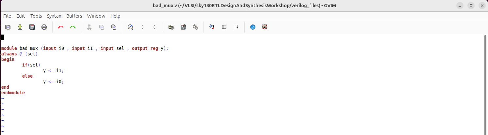
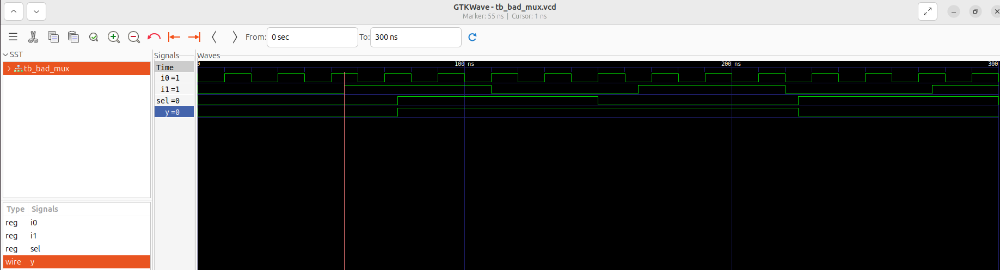
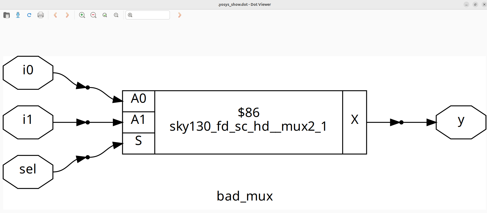
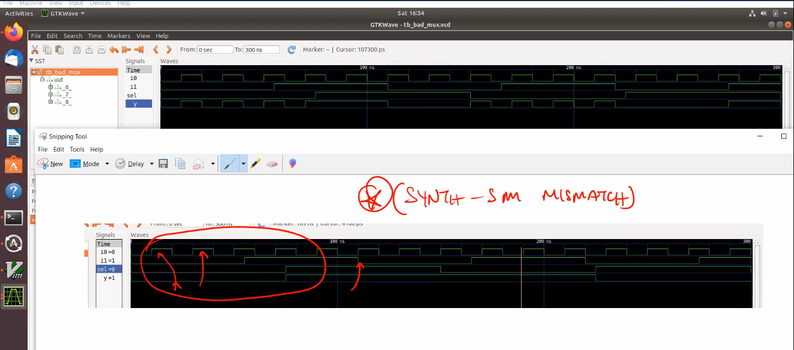
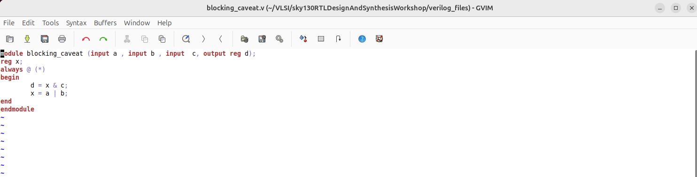
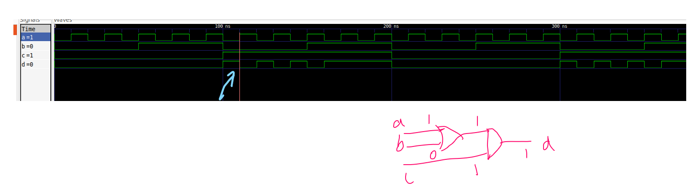
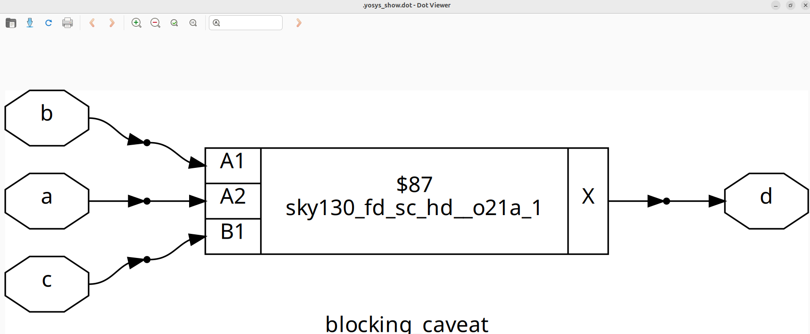
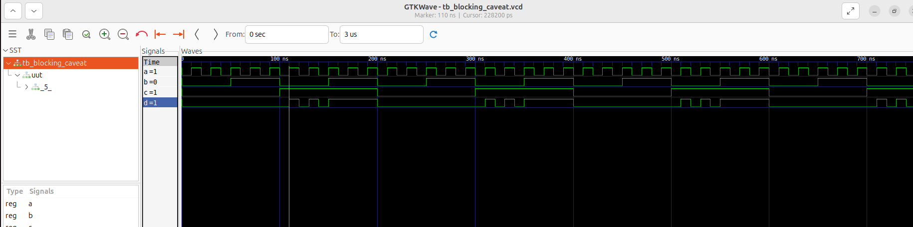
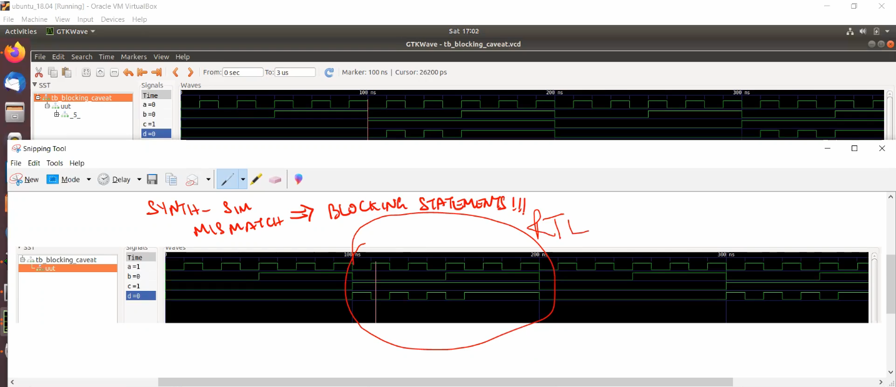

# VSD Hardware Design Program

## Day 4 : GLS, blocking vs non-blocking and Synthesis-Simulation mismatch

## 📚 Table of Contents

## 📚 Table of Contents

1. [Day 4 Overview](#vsd-hardware-design-program)  
2. [Synthesis of Ternary Operator MUX](#synthesis-of-ternary-operator-mux)  
3. [GLS (Gate Level Simulation) of Ternary Operator MUX](#gls-gate-level-simulation-of-ternary-operator-mux)  
4. [Synthesis of Bad MUX design](#synthesis-of-bad-mux-design)  
5. [GLS of Bad MUX design](#gls-of-bad-mux-design)  
6. [Synthesis-Simulation Mismatch of Bad MUX design](#synthesis-simulation-mismatch-of-bad-mux-design)  
7. [Synthesis of blocking_caveat design](#synthesis-of-blocking_caveat-design)  
8. [GLS of blocking_caveat design](#gls-of-blocking_caveat-design)  
9. [Synthesis-Simulation Mismatch of blocking_caveat design](#synthesis-simulation-mismatch-of-blocking_caveat-design)

   


## Synthesis of Ternary Operator MUX

This module implements a 2:1 multiplexer using a ternary (conditional) operator.


### `RTL simulation`

```bash
iverilog ternary_operator_mux.v tb_ternary_operator_mux.v
./a.out
gtkwave tb_ternary_operator_mux.vcd
```


```bash
# Launch Yosys
yosys

# Step 1: Read Sky130 Liberty File
read_liberty -lib ../lib/sky130_fd_sc_hd__tt_025C_1v80.lib

# Step 2: Read Verilog RTL Design
read_verilog ternary_operator_mux.v

# Step 3: Synthesize the design with the given top module
synth -top ternary_operator_mux

# Step 4: Technology Mapping using ABC
abc -liberty ../lib/sky130_fd_sc_hd__tt_025C_1v80.lib

# Step 5: View the schematic
show

# Step 6: Export the gate-level netlist
write_verilog -noattr ternary_operator_mux_net.v
```


## GLS (Gate level simulation) of Ternary Operator MUX

Gate-Level Simulation is performed using the synthesized netlist (ternary_operator_mux_net.v) instead of RTL. This helps verify the functional correctness of the design after synthesis, using the actual standard cells and any delays (if modeled)

```bash
# Compile the gate-level netlist and testbench
iverilog ../my_lib/verilog_model/primitives.v  ../my_lib/verilog_model/sky130_fd_sc_hd.v ternary_operator_mux_net.v tb_ternary_operator_mux.v

# Run the simulation binary
./a.out

# View the waveform
gtkwave tb_ternary_operator_mux.vcd
```


## Synthesis of Bad MUX design

This bad_mux uses a blocking sensitivity list (@ (sel)) without including data inputs (i0, i1), leading to a simulation-synthesis mismatch due to incomplete sensitivity.



### `RTL simulation`

```bash
iverilog bad_mux.v tb_bad_mux.v
./a.out
gtkwave tb_bad_mux.vcd
```


```bash
# Launch Yosys
yosys

# Step 1: Read Sky130 Liberty File
read_liberty -lib ../lib/sky130_fd_sc_hd__tt_025C_1v80.lib

# Step 2: Read Verilog RTL Design
read_verilog bad_mux.v

# Step 3: Synthesize the design with the given top module
synth -top bad_mux

# Step 4: Technology Mapping using ABC
abc -liberty ../lib/sky130_fd_sc_hd__tt_025C_1v80.lib

# Step 5: View the schematic
show

# Step 6: Export the gate-level netlist
write_verilog -noattr bad_mux_net.v
```


## GLS of Bad MUX design

```bash
iverilog ../my_lib/verilog_model/primitives.v  ../my_lib/verilog_model/sky130_fd_sc_hd.v bad_mux_net.v tb_bad_mux.v
./a.out
gtkwave tb_bad_mux.vcd
```


## Synthesis-Simulation Mismatch of Bad MUX design

The waveform illustrates a `synthesis vs. simulation mismatch` caused by the RTL not including i0 and i1 in the sensitivity list.



## Synthesis of blocking_caveat design



### RTL simulation

```bash
iverilog blocking_caveat.v tb_blocking_caveat.v
./a.out
gtkwave tb_blocking_caveat.vcd
```


```bash
# Launch Yosys
yosys

# Step 1: Read Sky130 Liberty File
read_liberty -lib ../lib/sky130_fd_sc_hd__tt_025C_1v80.lib

# Step 2: Read Verilog RTL Design
read_verilog blocking_caveat.v

# Step 3: Synthesize the design with the given top module
synth -top blocking_caveat

# Step 4: Technology Mapping using ABC
abc -liberty ../lib/sky130_fd_sc_hd__tt_025C_1v80.lib

# Step 5: View the schematic
show

# Step 6: Export the gate-level netlist
write_verilog -noattr blocking_caveat_net.v
```


## GLS of blocking_caveat design

```bash
iverilog ../my_lib/verilog_model/primitives.v  ../my_lib/verilog_model/sky130_fd_sc_hd.v blocking_caveat_net.v tb_blocking_caveat.v
./a.out
gtkwave tb_blocking_caveat.vcd
```


## Synthesis-Simulation Mismatch of blocking_caveat design


