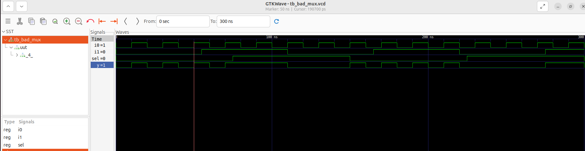

# VSD Hardware Design Program

## Day 4 : GLS, blocking vs non-blocking and Synthesis-Simulation mismatch

## 📚 Contents

- [Overview](#vsd-hardware-design-program)  
- [Synthesis of Ternary Operator MUX](#synthesis-of-ternary-operator-mux)  
- [GLS of Ternary Operator MUX](#gls-of-ternary-operator-mux)  
- [Synthesis of Bad MUX design](#synthesis-of-bad-mux-design)  
- [GLS of Bad MUX design](#gls-of-bad-mux-design)  
- [Synthesis-Simulation Mismatch of Bad MUX design](#synthesis-simulation-mismatch-of-bad-mux-design)  
- [Synthesis of blocking_caveat design](#synthesis-of-blocking_caveat-design)  
- [GLS of blocking_caveat design](#gls-of-blocking_caveat-design)  
- [Synthesis-Simulation Mismatch of blocking_caveat design](#synthesis-simulation-mismatch-of-blocking_caveat-design)

### Gate Level Simulation (GLS)
  * _Gate Level_ refers to the netlist view of a design after the synthesis has been performed.
  * RTL simulations are pre-synthesis, while GLS is post-synthesis - i.e., in RTL simulations, the Device Under Test (DUT) is the RTL design itself while in GLS, the DUT is the netlist generated after synthesis.
  * The RTL code and the generated netlist are logically equivalent (well, supposed to be!)  and hence the same testbenches can be used to verify both.
  * Although it is expected that the generated netlist has the same logical correctness as the RTL design, there can sometimes be mismatches between the RTL-level simulation and the sythesized design (Synthesis - Simulation mismatch) and thus arises the need to run GLS to help identify such scenarios and fix them to ensure the logical correctness post-synthesis as well.

To run GLS, we need to provide the Gate level netlist, the testbench and the Gate Level verilog models to the simulator.  
GLS can be run in different delay modes:
   1. Functional validation (zero delay similar to RTL sim): if the Gate Level verilog models do not have the timing information for various corners, we can only verify the functional correctness of the design by running GLS.
   2. Full Timing validation: if the Gate level verilog models have the necessary timing information, both the functional correctness and the timing behaviour can be verified by GLS.
   


### GLS using iverilog
The following block diagram shows the GLS flow using iverilog: 


The Gate level verilog model(s) need to be provided as shown below to do GLS using iverilog:
```shell
Syntax:
    iverilog <path-to-gate-level-verilog-model(s)> <netlist_file.v> <tb_top.v>
```

### Synthesis - Simulation mismatch
Some of the common reasons for Synthesis - Simulation mismatch (mismatch between pre- and post-synthesis simulations) :  
  * Incomplete sensitivity list
  * Use of blocking assignments inside always block vs. non-blocking assignments
    * Blocking assignments ("=") inside always block are executed sequentially by the simulator.
    * The RHS of non-blocking assignments ("<=") are evaluated first and then assigned to the LHS at the same simulation clock tick by the simulator. 
    * Synthesis will yield the same circuit with blocking and non-blocking assignments, with the synthesis output being that of the non-blocking case for both.
    * Hence, if the RTL was written assuming one functionality using blocking assignments, a simulation mismatch can occur in GLS.
  * Non-standard verilog coding
    


For ex: As seen in the screenshot below, in the left column,always block is evaluated only when sel is changing. So output y is not reflecting changes in input i1 and i0 when sel is not changing. Rather it acts like a
latch. 

The code on the right side represents the correct design coding for mux. In this case always is evaluated for any signal changes.


## Synthesis of Ternary Operator MUX

### `RTL simulation`

```bash
iverilog ternary_operator_mux.v tb_ternary_operator_mux.v
./a.out
gtkwave tb_ternary_operator_mux.vcd
```


```bash
# Launch Yosys
yosys

# Step 1: Read Sky130 Liberty File
read_liberty -lib ../lib/sky130_fd_sc_hd__tt_025C_1v80.lib

# Step 2: Read Verilog RTL Design
read_verilog ternary_operator_mux.v

# Step 3: Synthesize the design with the given top module
synth -top ternary_operator_mux

# Step 4: Technology Mapping using ABC
abc -liberty ../lib/sky130_fd_sc_hd__tt_025C_1v80.lib

# Step 5: View the schematic
show

# Step 6: Export the gate-level netlist
write_verilog -noattr ternary_operator_mux_net.v
```


## GLS of Ternary Operator MUX

Gate-Level Simulation is performed using the synthesized netlist (ternary_operator_mux_net.v) instead of RTL. This helps verify the functional correctness of the design after synthesis, using the actual standard cells and any delays (if modeled)

```bash
# Compile the gate-level netlist and testbench
iverilog ../my_lib/verilog_model/primitives.v  ../my_lib/verilog_model/sky130_fd_sc_hd.v ternary_operator_mux_net.v tb_ternary_operator_mux.v

# Run the simulation binary
./a.out

# View the waveform
gtkwave tb_ternary_operator_mux.vcd
```


## Synthesis of Bad MUX design

This bad_mux uses a blocking sensitivity list (@ (sel)) without including data inputs (i0, i1), leading to a simulation-synthesis mismatch due to incomplete sensitivity.


### `RTL simulation`

```bash
iverilog bad_mux.v tb_bad_mux.v
./a.out
gtkwave tb_bad_mux.vcd
```


```bash
# Launch Yosys
yosys

# Step 1: Read Sky130 Liberty File
read_liberty -lib ../lib/sky130_fd_sc_hd__tt_025C_1v80.lib

# Step 2: Read Verilog RTL Design
read_verilog bad_mux.v

# Step 3: Synthesize the design with the given top module
synth -top bad_mux

# Step 4: Technology Mapping using ABC
abc -liberty ../lib/sky130_fd_sc_hd__tt_025C_1v80.lib

# Step 5: View the schematic
show

# Step 6: Export the gate-level netlist
write_verilog -noattr bad_mux_net.v
```


## GLS of Bad MUX design

```bash
iverilog ../my_lib/verilog_model/primitives.v  ../my_lib/verilog_model/sky130_fd_sc_hd.v bad_mux_net.v tb_bad_mux.v
./a.out
gtkwave tb_bad_mux.vcd
```


## Synthesis-Simulation Mismatch of Bad MUX design

The waveform illustrates a `synthesis vs. simulation mismatch` caused by the RTL not including i0 and i1 in the sensitivity list.


## Synthesis of blocking_caveat design


### RTL simulation

```bash
iverilog blocking_caveat.v tb_blocking_caveat.v
./a.out
gtkwave tb_blocking_caveat.vcd
```


```bash
# Launch Yosys
yosys

# Step 1: Read Sky130 Liberty File
read_liberty -lib ../lib/sky130_fd_sc_hd__tt_025C_1v80.lib

# Step 2: Read Verilog RTL Design
read_verilog blocking_caveat.v

# Step 3: Synthesize the design with the given top module
synth -top blocking_caveat

# Step 4: Technology Mapping using ABC
abc -liberty ../lib/sky130_fd_sc_hd__tt_025C_1v80.lib

# Step 5: View the schematic
show

# Step 6: Export the gate-level netlist
write_verilog -noattr blocking_caveat_net.v
```


## GLS of blocking_caveat design

```bash
iverilog ../my_lib/verilog_model/primitives.v  ../my_lib/verilog_model/sky130_fd_sc_hd.v blocking_caveat_net.v tb_blocking_caveat.v
./a.out
gtkwave tb_blocking_caveat.vcd
```


## Synthesis-Simulation Mismatch of blocking_caveat design
In this case, there is a mismatch in the simulation results between pre and post-synthesis due to the use of blocking assignments.

