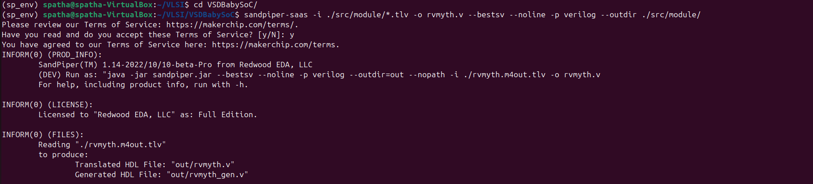

# VSD Hardware Design Program

## Day 5 : VSDBabySoC Design and Modeling

### 📚 Contents

1. [Introduction to the VSDBabySoC](#introduction-to-the-vsdbabysoc)  
2. [What is VSDBabySoC?](#what-is-vsdbabysoc)  
3. [Problem Statement](#problem-statement)  
4. [What is SoC](#what-is-soc)  
5. [What is RVMYTH](#what-is-rvmyth)  
6. [What is PLL](#what-is-pll)  
7. [What is DAC](#what-is-dac)  
8. [Project Structure](#project-structure)  
9. [Setup and Prepare Project Directory](#setup-and-prepare-project-directory)  
10. [🛠️ Cloning the Project](#️-cloning-the-project)  
11. [TLV to Verilog Conversion for RVMYTH](#tlv-to-verilog-conversion-for-rvmyth)  
12. [Simulation Steps](#simulation-steps)  
    - [Pre-Synthesis Simulation](#pre-synthesis-simulation)  
    - [Viewing Waveform in GTKWave](#viewing-waveform-in-gtkwave)
    - [Viewing DAC output in analog mode](#Viewing-DAC-output-in-analog-mode)
    - [Post-Synthesis Simulation](#post-synthesis-simulation)  
13. [Troubleshooting Tips](#Trouble-shooting-tips)

### Introduction to the VSDBabySoC
VSDBabySoC is a small yet powerful RISCV-based SoC. 

The main purpose of designing such a small SoC is to test three open-source IP cores together for the first time and calibrate the analog part of it. 

VSDBabySoC contains one RVMYTH microprocessor, an 8x-PLL to generate a stable clock, and a 10-bit DAC to communicate with other analog devices.

### What is VSDBabySoC?
  VSDBabySoC is a compact SoC featuring:
  - **RVMYTH**: A simple RISC-V-based CPU core.
  - **PLL**: An 8x Phase-Locked Loop for stable clock generation.
  - **DAC**: A 10-bit Digital-to-Analog Converter for interfacing with analog devices.

  Its primary purpose is to integrate and test these IPs collaboratively and calibrate the analog part of the SoC.

  

### Problem Statement
This project delves into designing a compact, open-source System on Chip (SoC) based on RVMYTH, a RISC-V-based processor core. The SoC integrates a Phase-Locked Loop (PLL) for precise clock generation and control, alongside a 10-bit Digital-to-Analog Converter (DAC) for interfacing with external analog systems. By converting digital signals into analog, this DAC allows BabySoC to communicate with devices that accept analog inputs, such as televisions and mobile phones, enabling output in the form of audio or video. Ultimately, this Sky130-technology-based SoC aims to provide a highly documented, educational platform for learning and experimentation in digital-analog interfacing.

### What is SoC
An SoC is a single-die chip that has some different IP cores on it. These IPs could vary from microprocessors (completely digital) to 5G broadband modems (completely analog).

### What is RVMYTH
The RVMYTH core is a simple RISC V-based CPU designed for educational purposes and small-scale applications. It provides a practical example of a RISC-V processor implementation.

### What is PLL
Phase-Locked Loop (PLL): A phase-locked loop or PLL is a control system that generates an output signal whose phase is related to the phase of an input signal. PLLs are widely used for synchronization purposes, including clock generation and distribution.

### What is DAC
Digital-to-Analog Converter (DAC): A DAC is a system that converts a digital signal into an analog signal. DACs are widely used in modern communication systems, enabling the generation of digitally-defined transmission signals.

### Project Structure
- src/include/ - Contains header files (*.vh) with necessary macros or parameter definitions.
- src/module/ - Contains Verilog files for each module in the SoC design.
- output/ - Directory where compiled outputs and simulation files will be generated.

### Setup and Prepare Project Directory
Clone or set up the directory structure as follows:
```txt
VSDBabySoC/
├── src/
│   ├── include/
│   │   ├── sandpiper.vh
│   │   └── other header files...
│   ├── module/
│   │   ├── vsdbabysoc.v      # Top-level module integrating all components
│   │   ├── rvmyth.v          # RISC-V core module
│   │   ├── avsdpll.v         # PLL module
│   │   ├── avsddac.v         # DAC module
│   │   └── testbench.v       # Testbench for simulation
└── output/
└── compiled_tlv/         # Holds compiled intermediate files if needed
```
### 🛠️ Cloning the Project

To begin, clone the VSDBabySoC repository using the following command:

```bash
cd ~/VLSI
git clone https://github.com/manili/VSDBabySoC.git
cd ~/VLSI/VSDBabySoC/
spatha@spatha-VirtualBox:~/VLSI$ ls VSDBabySoC/
images  LICENSE  Makefile  README.md  src
spatha@spatha-VirtualBox:~/VLSI$ ls VSDBabySoC/src/module/
avsddac.v  avsdpll.v  clk_gate.v  pseudo_rand_gen.sv  pseudo_rand.sv  rvmyth_gen.v  rvmyth.tlv  rvmyth.v  testbench.rvmyth.post-routing.v  testbench.v  vsdbabysoc.v
```
### TLV to Verilog Conversion for RVMYTH

Initially, you will see only the `rvmyth.tlv` file inside `src/module/`, since the RVMYTH core is written in TL-Verilog.

To convert it into a `.v` file for simulation, follow the steps below:

<strong>🔧 TLV to Verilog Conversion Steps</strong>

```bash
# Step 1: Install python3-venv (if not already installed)
sudo apt update
sudo apt install python3-venv python3-pip

# Step 2: Create and activate a virtual environment
cd VSDBabySoC
python3 -m venv sp_env
source sp_env/bin/activate

# Step 3: Install SandPiper-SaaS inside the virtual environment
pip install pyyaml click sandpiper-saas

# Step 4: Convert rvmyth.tlv to Verilog
sandpiper-saas -i ./src/module/*.tlv -o rvmyth.v --bestsv --noline -p verilog --outdir ./src/module/
```
 

✅ After running the above command, rvmyth.v will be generated in the src/module/ directory.

You can confirm this by listing the files:

```bash
spatha@spatha-VirtualBox:~$ cd VLSI/VSDBabySoC/
spatha@spatha-VirtualBox:~/VLSI/VSDBabySoC$ ls src/module/
avsddac.v  avsdpll.v  clk_gate.v  pseudo_rand_gen.sv  pseudo_rand.sv  rvmyth_gen.v  rvmyth.tlv  rvmyth.v  testbench.rvmyth.post-routing.v  testbench.v  vsdbabysoc.v
```

#### Note 
To use this environment in future sessions, always activate it first:
```bash
spatha@spatha-VirtualBox:~$ source sp_env/bin/activate
```
To exit:
```bash
spatha@spatha-VirtualBox:~$ deactivate
```

### Simulation Steps

#### <ins>Pre-Synthesis Simulation</ins>

Run the following command to perform a pre-synthesis simulation:

```bash
cd ~/VLSI/VSDBabySoC/

mkdir -p output/pre_synth_sim

iverilog -o output/pre_synth_sim/pre_synth_sim.out -DPRE_SYNTH_SIM \
  -I src/include -I src/module \
  src/module/testbench.v
```

Then run:
```bash
cd output/pre_synth_sim

./pre_synth_sim.out
```

Explanation:

- DPRE_SYNTH_SIM: Defines the PRE_SYNTH_SIM macro for conditional compilation in the testbench.
- The resulting pre_synth_sim.vcd file can be viewed in GTKWave.

#### Viewing Waveform in GTKWave

After running the simulation, open the VCD file in GTKWave: 

```bash

cd ~/VLSI/VSDBabySoC/

gtkwave output/pre_synth_sim/pre_synth_sim.vcd

```
Drag and drop the CLK, reset, OUT (DAC), and RV TO DAC [9:0] signals to their respective locations in the simulation tool

 

#### Viewing DAC output in analog mode

Drag and drop the CLK, reset, OUT (DAC) (as analog step), and RV TO DAC [9:0] signals to their respective locations in the simulation tool 


#### <ins>Post-Synthesis Simulation</ins>

To run a post-synthesis simulation, use:

```tcl
iverilog -o output/post_synth_sim/post_synth_sim.out -DPOST_SYNTH_SIM \
    -I src/include -I src/module \
    src/module/testbench.v output/synthesized/vsdbabysoc.synth.v

cd output/post_synth_sim

./post_synth_sim.out
```
### Trouble shooting tips

   - Module Redefinition: If you encounter redefinition errors, ensure modules are included only once, either in the testbench or in the command line.
   - Path Issues: Verify paths specified with -I are correct. Use full paths if relative paths cause errors.

## Why Pre-Synthesis and Post-Synthesis?

1. **Pre-Synthesis Simulation**: 
   - Focuses only on verifying functionality based on the RTL code.
   - Zero-delay environment, with events occurring on the active clock edge.

2. **Post-Synthesis Simulation (GLS)**:
   - Uses the synthesized netlist (gate-level) to simulate both functionality and timing.
   - Identifies timing violations and potential mismatches (e.g., unintended latches).
   - Helps verify dynamic circuit behavior that static methods may miss.
