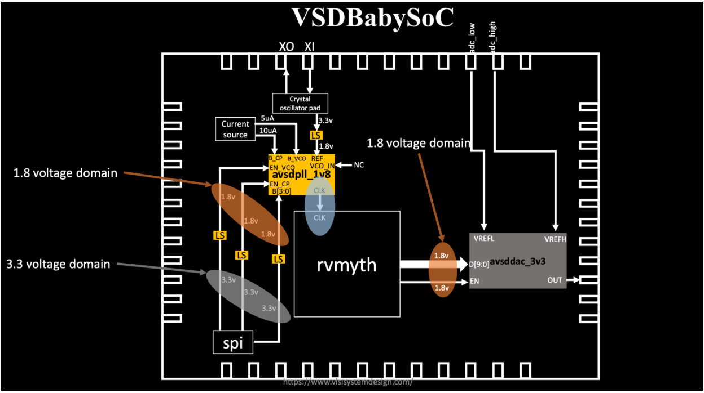

# VSD Hardware Design Program

## Day 5 : VSDBabySoC Design and Modeling

VSDBabySoC is a small SoC including PLL, DAC, and a RISCV-based processor named RVMYTH.

### Introduction to the VSDBabySoC
VSDBabySoC is a small yet powerful RISCV-based SoC. 

The main purpose of designing such a small SoC is to test three open-source IP cores together for the first time and calibrate the analog part of it. 

VSDBabySoC contains one RVMYTH microprocessor, an 8x-PLL to generate a stable clock, and a 10-bit DAC to communicate with other analog devices.

### What is VSDBabySoC?
  VSDBabySoC is a compact SoC featuring:
  - **RVMYTH**: A simple RISC-V-based CPU core.
  - **PLL**: An 8x Phase-Locked Loop for stable clock generation.
  - **DAC**: A 10-bit Digital-to-Analog Converter for interfacing with analog devices.

  Its primary purpose is to integrate and test these IPs collaboratively and calibrate the analog part of the SoC.

  

### Problem Statement
This project delves into designing a compact, open-source System on Chip (SoC) based on RVMYTH, a RISC-V-based processor core. The SoC integrates a Phase-Locked Loop (PLL) for precise clock generation and control, alongside a 10-bit Digital-to-Analog Converter (DAC) for interfacing with external analog systems. By converting digital signals into analog, this DAC allows BabySoC to communicate with devices that accept analog inputs, such as televisions and mobile phones, enabling output in the form of audio or video. Ultimately, this Sky130-technology-based SoC aims to provide a highly documented, educational platform for learning and experimentation in digital-analog interfacing.

### What is SoC
An SoC is a single-die chip that has some different IP cores on it. These IPs could vary from microprocessors (completely digital) to 5G broadband modems (completely analog).

### What is RVMYTH
The RVMYTH core is a simple RISC V-based CPU designed for educational purposes and small-scale applications. It provides a practical example of a RISC-V processor implementation.

### What is PLL
Phase-Locked Loop (PLL): A phase-locked loop or PLL is a control system that generates an output signal whose phase is related to the phase of an input signal. PLLs are widely used for synchronization purposes, including clock generation and distribution.

### What is DAC
Digital-to-Analog Converter (DAC): A DAC is a system that converts a digital signal into an analog signal. DACs are widely used in modern communication systems, enabling the generation of digitally-defined transmission signals.

### Project Structure
- src/include/ - Contains header files (*.vh) with necessary macros or parameter definitions.
- src/module/ - Contains Verilog files for each module in the SoC design.
- output/ - Directory where compiled outputs and simulation files will be generated.

### Setup and Prepare Project Directory
Clone or set up the directory structure as follows:
```txt
VSDBabySoC/
├── src/
│   ├── include/
│   │   ├── sandpiper.vh
│   │   └── other header files...
│   ├── module/
│   │   ├── vsdbabysoc.v      # Top-level module integrating all components
│   │   ├── rvmyth.v          # RISC-V core module
│   │   ├── avsdpll.v         # PLL module
│   │   ├── avsddac.v         # DAC module
│   │   └── testbench.v       # Testbench for simulation
└── output/
└── compiled_tlv/         # Holds compiled intermediate files if needed
```
### 🛠️ Cloning the Project

To begin, clone the VSDBabySoC repository using the following command:

```bash
cd ~/VLSI
git clone https://github.com/manili/VSDBabySoC.git
cd VSDBabySoC
spatha@spatha-VirtualBox:~/VLSI$ ls VSDBabySoC/
images  LICENSE  Makefile  README.md  src
spatha@spatha-VirtualBox:~/VLSI$ ls VSDBabySoC/src/module/
avsddac.v  avsdpll.v  clk_gate.v  pseudo_rand_gen.sv  pseudo_rand.sv  rvmyth_gen.v  rvmyth.tlv  rvmyth.v  testbench.rvmyth.post-routing.v  testbench.v  vsdbabysoc.v
```
