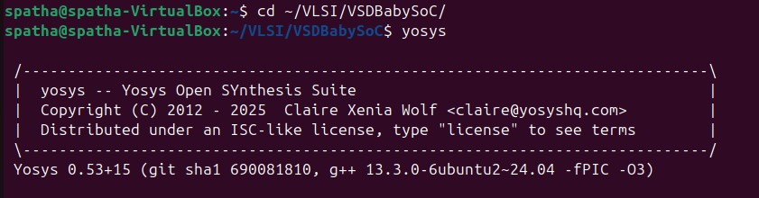
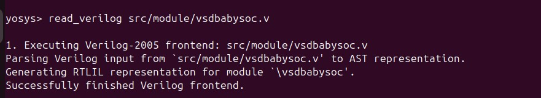
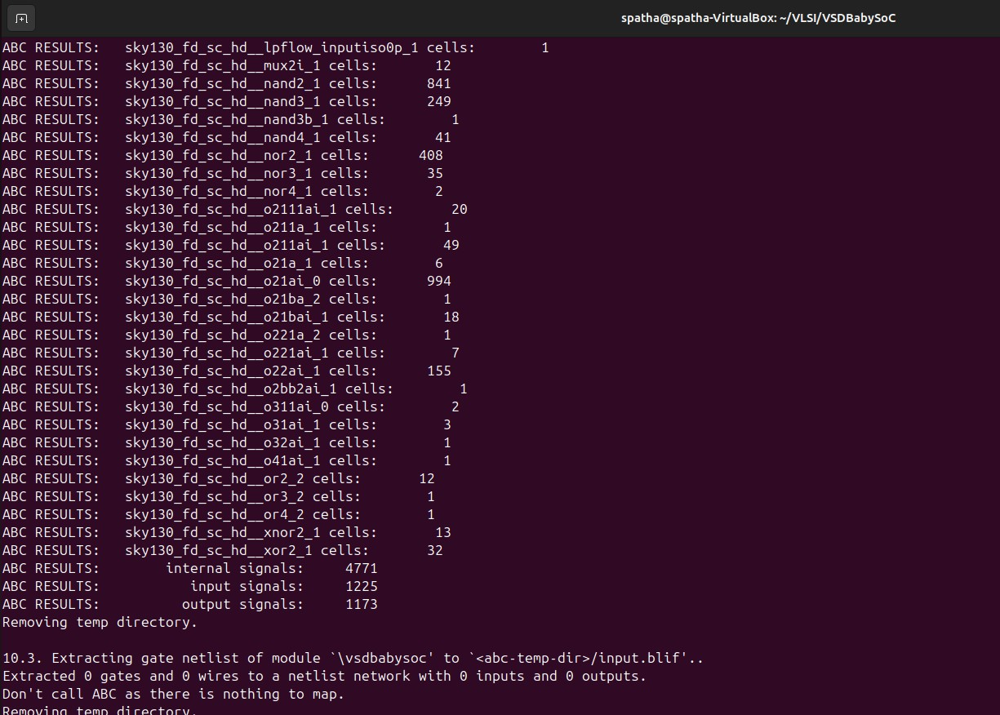
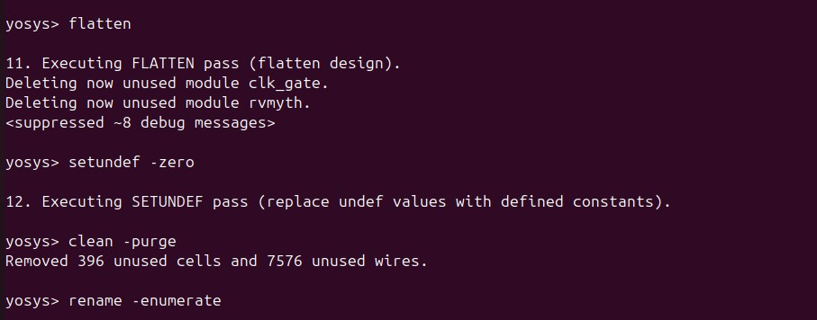
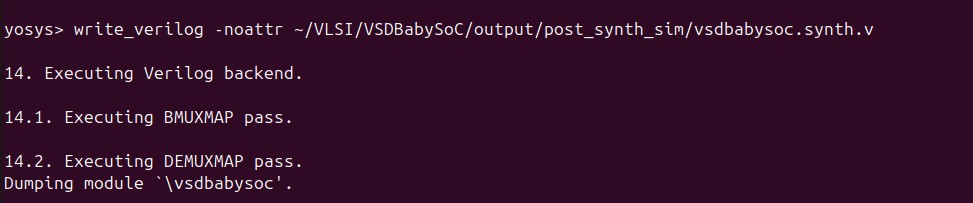
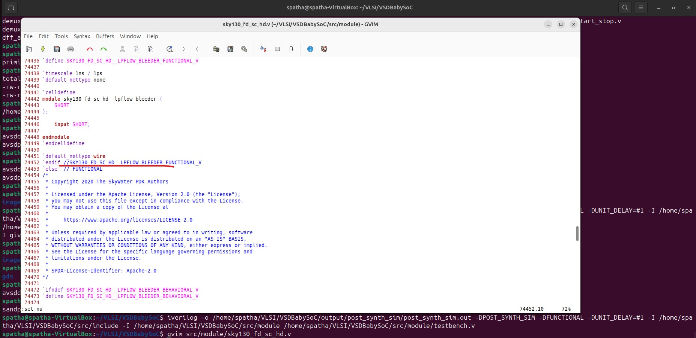
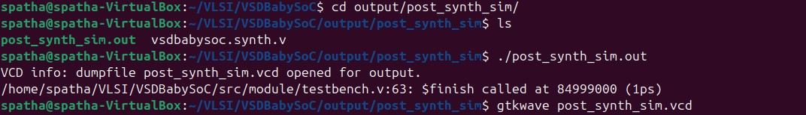
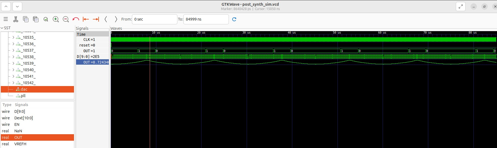

# VSD Hardware Design Program

### 📚 Contents

- [Day 6 : VSDBabySoC Post-Synthesis Simulation](#day-6--vsdbabysoc-post-synthesis-simulation)
- [Step 1: Load the Top-Level Design and Supporting Modules](#step-1-load-the-top-level-design-and-supporting-modules)
- [Step 2: Load the Liberty Files for Synthesis](#step-2-load-the-liberty-files-for-synthesis)
- [Step 3: Run Synthesis Targeting `vsdbabysoc`](#step-3-run-synthesis-targeting-vsdbabysoc)
- [Step 4: Map D Flip-Flops to Standard Cells](#step-4-map-d-flip-flops-to-standard-cells)
- [Step 5: Perform Optimization and Technology Mapping](#step-5-perform-optimization-and-technology-mapping)
- [Step 6: Perform Final Clean-Up and Renaming](#step-6-perform-final-clean-up-and-renaming)
- [Step 7: Check Statistics](#step-7-check-statistics)
- [Step 8: Write the Synthesized Netlist](#step-8-write-the-synthesized-netlist)
- [POST_SYNTHESIS SIMULATION AND WAVEFORMS](#post_synthesis-simulation-and-waveforms)
  - [Step 1: Compile the Testbench](#step-1-compile-the-testbench)
  - [Step 2: Navigate to the Post-Synthesis Simulation Output Directory](#step-2-navigate-to-the-post-synthesis-simulation-output-directory)
  - [Step 3: Run the Simulation](#step-3-run-the-simulation)
  - [Step 4: View the Waveforms in GTKWave](#step-4-view-the-waveforms-in-gtkwave)
    
## Day 6 : VSDBabySoC Post-Synthesis Simulation

First step in the design flow is to synthesize the generated RTL code and after that we will simulate the result. This way we can find more about our code and its bugs. So in this section we are going to synthesize our code then do a post-synthesis simulation to look for any issues. The post and pre (modeling section) synthesis results should be identical.

Here is the step-by-step execution plan for running the  commands manually:
---
### **Step 1: Load the Top-Level Design and Supporting Modules**
```bash
spatha@spatha-VirtualBox:~/VLSI/VSDBabySoC$ yosys
```
 

```bash
yosys> read_verilog src/module/vsdbabysoc.v 
```
 

The following cp commands copy essential header files from the src/include directory into the working directory. These include:

- sp_verilog.vh – contains Verilog definitions and macros

- sandpiper.vh – holds integration-related definitions for SandPiper

- sandpiper_gen.vh – may include auto-generated or tool-generated parameters

```bash
patha@spatha-VirtualBox:~$ cd ~/VLSI/VSDBabySoC
patha@spatha-VirtualBox:~/VLSI/VSDBabySoC$ cp -r src/include/sp_verilog.vh .
patha@spatha-VirtualBox:~/VLSI/VSDBabySoC$ cp -r src/include/sandpiper.vh 
patha@spatha-VirtualBox:~/VLSI/VSDBabySoC$ cp -r src/include/sandpiper_gen.vh .
patha@spatha-VirtualBox:~/VLSI/VSDBabySoC$ ls
images  LICENSE  Makefile  output  README.md  <strong>sandpiper_gen.vh</strong>   <strong>sandpiper.vh</strong>  sp_env   <strong>sp_verilog.vh</strong>  src
```

```bash
yosys> read_verilog -I ~/VLSI/VSDBabySoC/src/include/ ~/VLSI/VSDBabySoC/src/module/rvmyth.v
```
 

```bash
yosys> read_verilog -I ~/VLSI/VSDBabySoC/src/include/ ~/VLSI/VSDBabySoC/src/module/clk_gate.v
```
 

 ### **Step 2: Load the Liberty Files for Synthesis**
Inside the same Yosys shell, run:
```bash
yosys> read_liberty -lib ~/VLSI/VSDBabySoC/src/lib/avsdpll.lib 
yosys> read_liberty -lib ~/VLSI/VSDBabySoC/src/lib/avsddac.lib 
yosys> read_liberty -lib ~/VLSI/VSDBabySoC/src/lib/sky130_fd_sc_hd__tt_025C_1v80.lib
```


### **Step 3: Run Synthesis Targeting `vsdbabysoc`**
```bash
yosys> synth -top vsdbabysoc
```


### **Step 4: Map D Flip-Flops to Standard Cells**

```bash
yosys> dfflibmap -liberty ~/VLSI/VSDBabySoC/src/lib/sky130_fd_sc_hd__tt_025C_1v80.lib
```


### **Step 5: Perform Optimization and Technology Mapping**
```bash
yosys> opt
yosys> abc -liberty ~/VLSI/VSDBabySoC/src/lib/sky130_fd_sc_hd__tt_025C_1v80.lib -script +strash;scorr;ifraig;retime;{D};strash;dch,-f;map,-M,1,{D}
```




### **Step 6: Perform Final Clean-Up and Renaming**

```bash
yosys> flatten
yosys> setundef -zero
yosys> clean -purge
yosys> rename -enumerate
```


### **Step 7: Check Statistics**
```bash
yosys> stat
```
```bash
13. Printing statistics.

=== vsdbabysoc ===

   Number of wires:               4736
   Number of wire bits:           6210
   Number of public wires:        4736
   Number of public wire bits:    6210
   Number of ports:                  7
   Number of port bits:              7
   Number of memories:               0
   Number of memory bits:            0
   Number of processes:              0
   Number of cells:               5920
     $scopeinfo                      8
     avsddac                         1
     avsdpll                         1
     sky130_fd_sc_hd__a2111oi_0     10
     sky130_fd_sc_hd__a211o_2        1
     sky130_fd_sc_hd__a211oi_1      26
     sky130_fd_sc_hd__a21boi_0       4
     sky130_fd_sc_hd__a21o_2         1
     sky130_fd_sc_hd__a21oi_1      672
     sky130_fd_sc_hd__a221o_2        1
     sky130_fd_sc_hd__a221oi_1     163
     sky130_fd_sc_hd__a22o_2         4
     sky130_fd_sc_hd__a22oi_1      123
     sky130_fd_sc_hd__a311oi_1       4
     sky130_fd_sc_hd__a31o_2         1
     sky130_fd_sc_hd__a31oi_1      344
     sky130_fd_sc_hd__a32oi_1        2
     sky130_fd_sc_hd__a41oi_1       26
     sky130_fd_sc_hd__and2_2        12
     sky130_fd_sc_hd__and3_2         1
     sky130_fd_sc_hd__clkinv_1     597
     sky130_fd_sc_hd__dfxtp_1     1144
          sky130_fd_sc_hd__lpflow_inputiso0p_1      1
     sky130_fd_sc_hd__mux2i_1       12
     sky130_fd_sc_hd__nand2_1      839
     sky130_fd_sc_hd__nand3_1      249
     sky130_fd_sc_hd__nand3b_1       1
     sky130_fd_sc_hd__nand4_1       41
     sky130_fd_sc_hd__nor2_1       403
     sky130_fd_sc_hd__nor3_1        35
     sky130_fd_sc_hd__nor4_1         2
     sky130_fd_sc_hd__o2111ai_1     20
     sky130_fd_sc_hd__o211a_1        1
     sky130_fd_sc_hd__o211ai_1      49
     sky130_fd_sc_hd__o21a_1         6
     sky130_fd_sc_hd__o21ai_0      866
     sky130_fd_sc_hd__o21ba_2        1
     sky130_fd_sc_hd__o21bai_1      18
     sky130_fd_sc_hd__o221a_2        1
     sky130_fd_sc_hd__o221ai_1       7
     sky130_fd_sc_hd__o22ai_1      155
     sky130_fd_sc_hd__o2bb2ai_1      1
     sky130_fd_sc_hd__o311ai_0       2
     sky130_fd_sc_hd__o31ai_1        3
     sky130_fd_sc_hd__o32ai_1        1
     sky130_fd_sc_hd__o41ai_1        1
     sky130_fd_sc_hd__or2_2         12
     sky130_fd_sc_hd__or3_2          1
     sky130_fd_sc_hd__or4_2          1
     sky130_fd_sc_hd__xnor2_1       13
     sky130_fd_sc_hd__xor2_1        32
```

### **Step 8: Write the Synthesized Netlist**
```bash

yosys> write_verilog -noattr ~/VLSI/VSDBabySoC/output/post_synth_sim/vsdbabysoc.synth.v
```


## POST_SYNTHESIS SIMULATION AND WAVEFORMS
---

### **Step 1: Compile the Testbench**

Before running the iverilog command, copy the necessary standard cell and primitive models:
These files must be present in the same directory as the testbench (src/module) to resolve all module references during compilation.

```bash
spatha@spatha-VirtualBox:~/VLSI/VSDBabySoC/src/module$ cp -r ~/VLSI/sky130RTLDesignAndSynthesisWorkshop/my_lib/verilog_model/sky130_fd_sc_hd.v .
spatha@spatha-VirtualBox:~/VLSI/VSDBabySoC/src/module$ cp -r ~/VLSI/sky130RTLDesignAndSynthesisWorkshop/my_lib/verilog_model/primitives.v .
```
Run the following `iverilog` command to compile the testbench:
```bash
spatha@spatha-VirtualBox:~/VLSI/VSDBabySoC$ iverilog -o /home/spatha/VLSI/VSDBabySoC/output/post_synth_sim/post_synth_sim.out -DPOST_SYNTH_SIM -DFUNCTIONAL -DUNIT_DELAY=#1 -I /home/spatha/VLSI/VSDBabySoC/src/include -I /home/spatha/VLSI/VSDBabySoC/src/module /home/spatha/VLSI/VSDBabySoC/src/module/testbench.v
```

##### Note - You may encounter this error:
```bash
spatha@spatha-VirtualBox:~/VLSI/VSDBabySoC$ iverilog -o /home/spatha/VLSI/VSDBabySoC/output/post_synth_sim/post_synth_sim.out -DPOST_SYNTH_SIM -DFUNCTIONAL -DUNIT_DELAY=#1 -I /home/spatha/VLSI/VSDBabySoC/src/include -I /home/spatha/VLSI/VSDBabySoC/src/module /home/spatha/VLSI/VSDBabySoC/src/module/testbench.v
/home/spatha/VLSI/VSDBabySoC/src/module/sky130_fd_sc_hd.v:74452: syntax error
I give up.
```
Update the syntax in the file sky130_fd_sc_hd.v at or around line 74452.

###### Change:
```bash
`endif SKY130_FD_SC_HD__LPFLOW_BLEEDER_FUNCTIONAL_V
```
###### To:
```bash
`endif // SKY130_FD_SC_HD__LPFLOW_BLEEDER_FUNCTIONAL_V
```


---
### **Step 2: Navigate to the Post-Synthesis Simulation Output Directory**
```bash
cd output/post_synth_sim/
```
---
### **Step 3: Run the Simulation**

```bash
./post_synth_sim.out
```
---
### **Step 4: View the Waveforms in GTKWave**

```bash
gtkwave post_synth_sim.vcd
```
---



