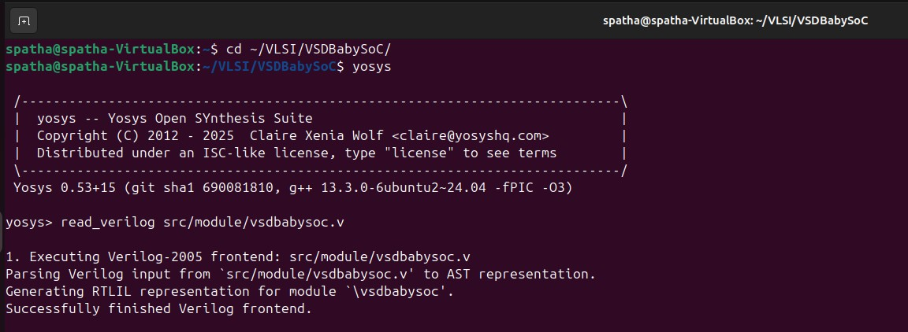
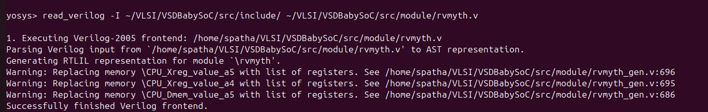
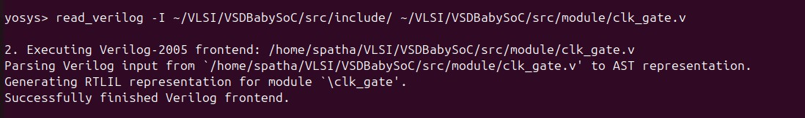
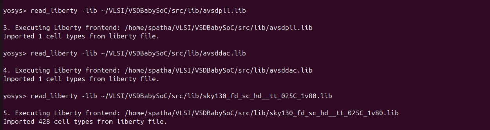
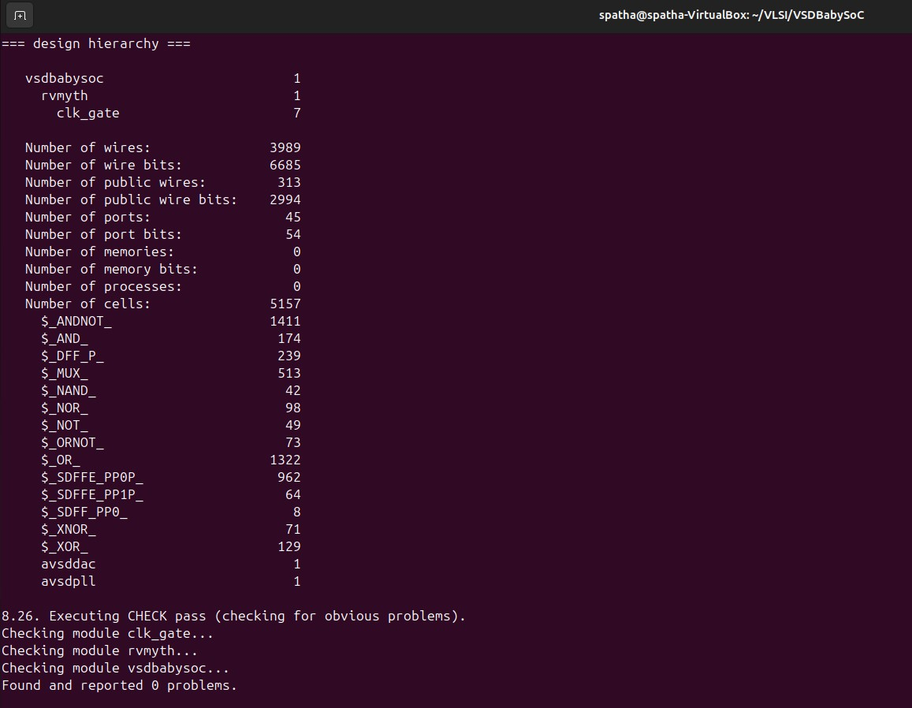
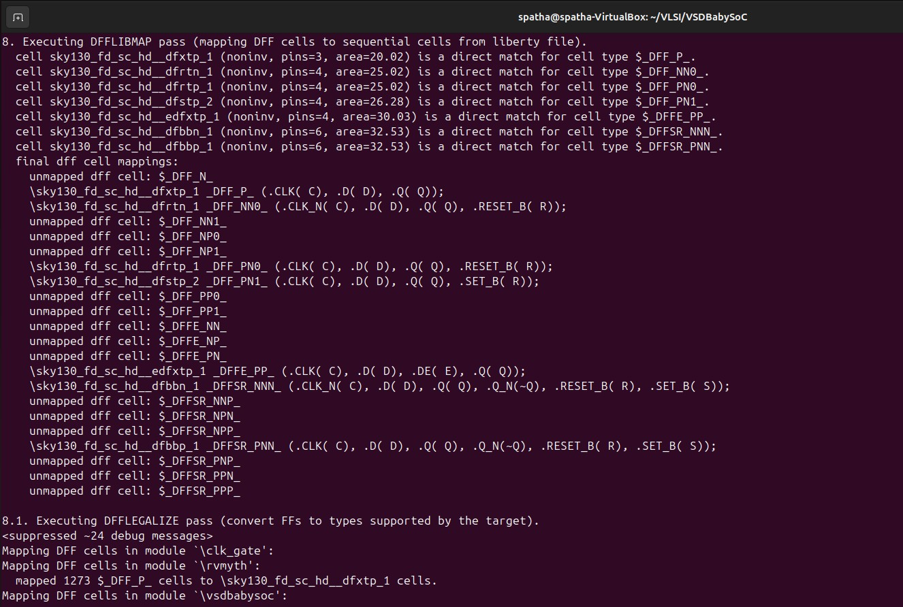
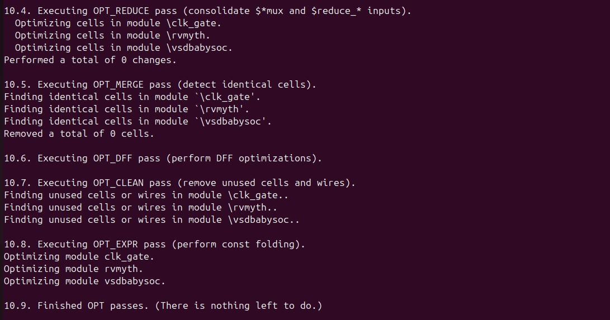
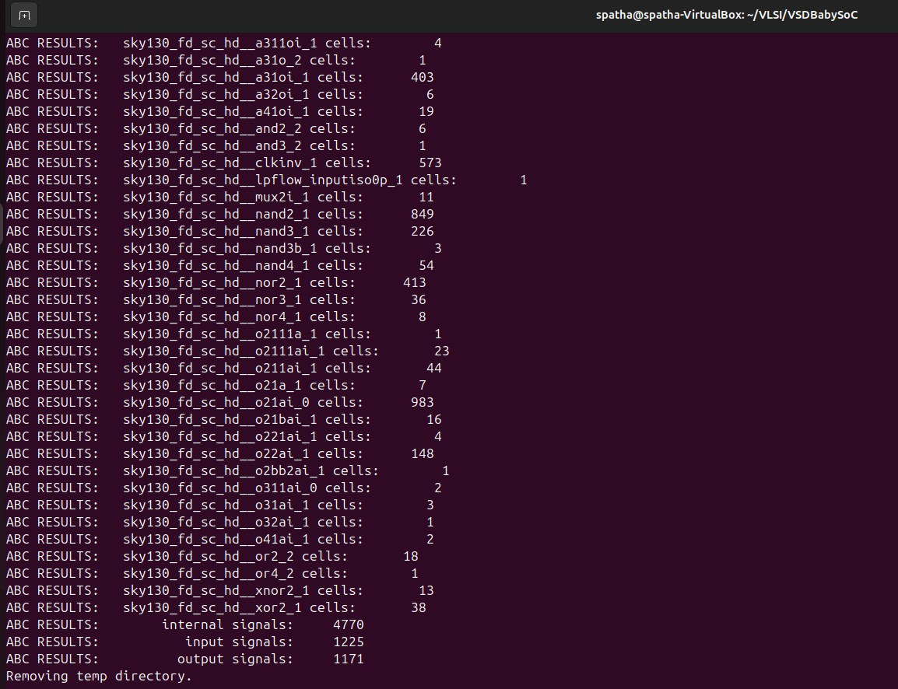
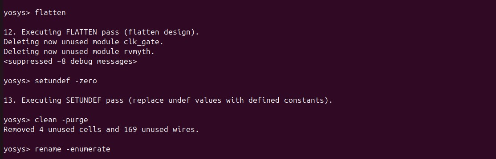
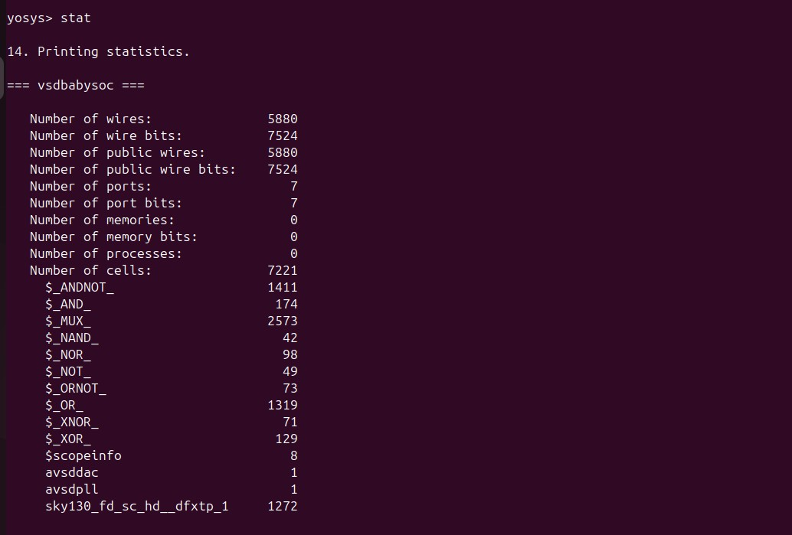

# VSD Hardware Design Program

## Day 6 : VSDBabySoC Post-Synthesis Simulation

First step in the design flow is to synthesize the generated RTL code and after that we will simulate the result. This way we can find more about our code and its bugs. So in this section we are going to synthesize our code then do a post-synthesis simulation to look for any issues. The post and pre (modeling section) synthesis results should be identical.

Here is the step-by-step execution plan for running the  commands manually:
---
### **Step 1: Load the Top-Level Design and Supporting Modules**
```bash
spatha@spatha-VirtualBox:~/VLSI/VSDBabySoC$ yosys
yosys> read_verilog src/module/vsdbabysoc.v 
```

 

```bash
spatha@spatha-VirtualBox:~/VLSI/VSDBabySoC$ cp -r src/include/sp_verilog.vh .

patha@spatha-VirtualBox:~/VLSI/VSDBabySoC$ cp -r src/include/sandpiper.vh .

spatha@spatha-VirtualBox:~/VLSI/VSDBabySoC$ cp -r src/include/sandpiper_gen.vh .
```

```bash
yosys> read_verilog -I ~/VLSI/VSDBabySoC/src/include/ ~/VLSI/VSDBabySoC/src/module/rvmyth.v
```
 

```bash
yosys> read_verilog -I ~/VLSI/VSDBabySoC/src/include/ ~/VLSI/VSDBabySoC/src/module/clk_gate.v
```
 

 ### **Step 2: Load the Liberty Files for Synthesis**
Inside the same Yosys shell, run:
```bash
yosys> read_liberty -lib ~/VLSI/VSDBabySoC/src/lib/avsdpll.lib 
yosys> read_liberty -lib ~/VLSI/VSDBabySoC/src/lib/avsddac.lib 
yosys> read_liberty -lib ~/VLSI/VSDBabySoC/src/lib/sky130_fd_sc_hd__tt_025C_1v80.lib
```


### **Step 3: Run Synthesis Targeting `vsdbabysoc`**
```bash
yosys> synth -top vsdbabysoc
```


### **Step 4: Map D Flip-Flops to Standard Cells**

```bash
yosys> dfflibmap -liberty ~/VLSI/VSDBabySoC/src/lib/sky130_fd_sc_hd__tt_025C_1v80.lib
```


### **Step 5: Perform Optimization and Technology Mapping**
```bash
yosys> opt
yosys> abc -liberty ~/VLSI/VSDBabySoC/src/lib/sky130_fd_sc_hd__tt_025C_1v80.lib -script +strash;scorr;ifraig;retime;{D};strash;dch,-f;map,-M,1,{D}
```





### **Step 6: Perform Final Clean-Up and Renaming**

```bash
yosys> flatten
yosys> setundef -zero
yosys> clean -purge
yosys> rename -enumerate
```


### **Step 7: Check Statistics**
```bash
yosys> stat
```


