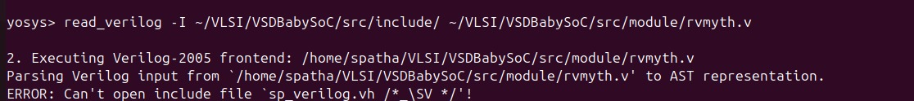
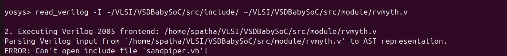
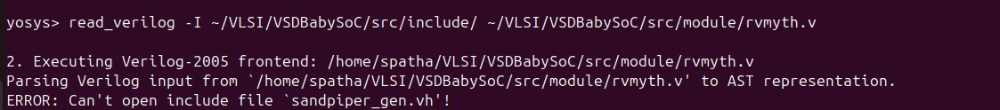
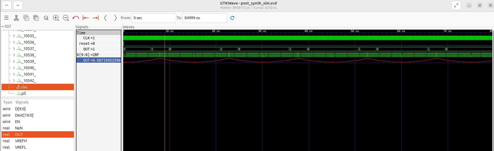

# VSD Hardware Design Program

## Day 6 : VSDBabySoC Post-Synthesis Simulation

### 📚 Contents

- [Day 6 : Overview](#day-6--vsdbabysoc-post-synthesis-simulation)
- [Step 1: Load the Top-Level Design and Supporting Modules](#step-1-load-the-top-level-design-and-supporting-modules)
- [Step 2: Load the Liberty Files for Synthesis](#step-2-load-the-liberty-files-for-synthesis)
- [Step 3: Run Synthesis Targeting `vsdbabysoc`](#step-3-run-synthesis-targeting-vsdbabysoc)
- [Step 4: Map D Flip-Flops to Standard Cells](#step-4-map-d-flip-flops-to-standard-cells)
- [Step 5: Perform Optimization and Technology Mapping](#step-5-perform-optimization-and-technology-mapping)
- [Step 6: Perform Final Clean-Up and Renaming](#step-6-perform-final-clean-up-and-renaming)
- [Step 7: Check Statistics](#step-7-check-statistics)
- [Step 8: Write the Synthesized Netlist](#step-8-write-the-synthesized-netlist)
- [POST_SYNTHESIS SIMULATION AND WAVEFORMS](#post_synthesis-simulation-and-waveforms)
  - [Step 1: Compile the Testbench](#step-1-compile-the-testbench)
  - [Step 2: Navigate to the Post-Synthesis Simulation Output Directory](#step-2-navigate-to-the-post-synthesis-simulation-output-directory)
  - [Step 3: Run the Simulation](#step-3-run-the-simulation)
  - [Step 4: View the Waveforms in GTKWave](#step-4-view-the-waveforms-in-gtkwave)
- [Comparing Pre-Synthesis and Post-Synthesis Output](#comparing-pre-synthesis-and-post-synthesis-output)
    

Post-synthesis simulation is a critical step in the digital design flow, providing insights into both the functionality and timing of the synthesized design. 

Unlike pre-synthesis simulation, which focuses solely on verifying the functionality based on the RTL code, post-synthesis simulation uses the synthesized netlist to ensure that the design behaves correctly in terms of both logic and timing.

Key aspects of post-synthesis simulation include:

**Functionality and Timing Verification**: It checks the design's functionality and timing using the gate-level netlist, helping identify timing violations and potential mismatches such as unintended latches.

**Dynamic Circuit Behavior**: Post-synthesis simulation can reveal dynamic circuit behaviors that static methods might miss, ensuring the design operates correctly under real-world conditions.

**Identifying Issues**: It helps in identifying issues that may not be apparent in pre-synthesis simulations, such as glitches or race conditions due to the actual gate delays.

The first step in the design flow is to synthesize the generated RTL code, followed by simulating the result. This process helps uncover more about the code and its potential bugs. In this section, we will synthesize our code and then perform a post-synthesis simulation to look for any issues. Ideally, the post-synthesis and pre-synthesis (modeling section) results should be identical, confirming that the synthesis process has not altered the original design behavior.

#### Why do pre-synthesis simulation? Why not just do post-synthesis simulation?
Pre-synthesis simulation is crucial for verifying the logical functionality of a digital design before it undergoes synthesis. It allows designers to detect and correct logical errors, such as incorrect operator usage or unintended latch inference, early in the development process. This type of simulation focuses solely on the high-level behavior of the design, enabling faster iterations and design exploration without the constraints of gate-level details. On the other hand, post-synthesis simulation, or gate-level simulation, is essential for timing verification and ensuring that the synthesized design meets real-world performance requirements. It accounts for gate delays and helps identify any synthesis-induced issues, providing a final validation of both functionality and timing before the design is implemented in hardware. Together, these simulations ensure a robust and reliable digital design.

Here is the step-by-step execution plan for running the  commands manually:
---
### **Step 1: Load the Top-Level Design and Supporting Modules**
- Launch the Yosys synthesis tool from your working directory.
```bash
spatha@spatha-VirtualBox:~/VLSI/VSDBabySoC$ yosys
```
 
 
- Read the main vsdbabysoc.v RTL file into the Yosys environment.
```bash
yosys> read_verilog src/module/vsdbabysoc.v 
```
 

The following cp commands copy essential header files from the src/include directory into the working directory. These include:

- sp_verilog.vh – contains Verilog definitions and macros

- sandpiper.vh – holds integration-related definitions for SandPiper

- sandpiper_gen.vh – may include auto-generated or tool-generated parameters

```bash
patha@spatha-VirtualBox:~$ cd ~/VLSI/VSDBabySoC
patha@spatha-VirtualBox:~/VLSI/VSDBabySoC$ cp -r src/include/sp_verilog.vh .
patha@spatha-VirtualBox:~/VLSI/VSDBabySoC$ cp -r src/include/sandpiper.vh .
patha@spatha-VirtualBox:~/VLSI/VSDBabySoC$ cp -r src/include/sandpiper_gen.vh .
patha@spatha-VirtualBox:~/VLSI/VSDBabySoC$ ls
images  LICENSE  Makefile  output  README.md  sandpiper_gen.vh  sandpiper.vh  sp_env  sp_verilog.vh  src
```

- Read the rvmyth.v file with the include path using -I option.
```bash
yosys> read_verilog -I ~/VLSI/VSDBabySoC/src/include/ ~/VLSI/VSDBabySoC/src/module/rvmyth.v
```
 

#### Note:
If you try to read the rvmyth.v file using yosys without copying the necessary header files first, you may encounter errors like:







To avoid these errors, first copy the required include files into your working directory!!

- Read the clk_gate.v file with the include path using -I option.
```bash
yosys> read_verilog -I ~/VLSI/VSDBabySoC/src/include/ ~/VLSI/VSDBabySoC/src/module/clk_gate.v
```
 

 ### **Step 2: Load the Liberty Files for Synthesis**
Inside the same Yosys shell, run:
```bash
yosys> read_liberty -lib ~/VLSI/VSDBabySoC/src/lib/avsdpll.lib 
yosys> read_liberty -lib ~/VLSI/VSDBabySoC/src/lib/avsddac.lib 
yosys> read_liberty -lib ~/VLSI/VSDBabySoC/src/lib/sky130_fd_sc_hd__tt_025C_1v80.lib
```


### **Step 3: Run Synthesis Targeting `vsdbabysoc`**
```bash
yosys> synth -top vsdbabysoc
```


### **Step 4: Map D Flip-Flops to Standard Cells**

```bash
yosys> dfflibmap -liberty ~/VLSI/VSDBabySoC/src/lib/sky130_fd_sc_hd__tt_025C_1v80.lib
```


### **Step 5: Perform Optimization and Technology Mapping**
```bash
yosys> opt
yosys> abc -liberty ~/VLSI/VSDBabySoC/src/lib/sky130_fd_sc_hd__tt_025C_1v80.lib -script +strash;scorr;ifraig;retime;{D};strash;dch,-f;map,-M,1,{D}
```

| Step           | Purpose                                                              |
| -------------- | -------------------------------------------------------------------- |
| `strash`       | Structural hashing (reduces logic redundancy)                        |
| `scorr`        | Sequential sweeping for redundancy removal                           |
| `ifraig`       | Incremental FRAIGing (logic equivalence checking and optimization)   |
| `retime;{D}`   | Move registers across combinational logic to optimize timing         |
| `strash`       | Re-run structural hashing after retiming                             |
| `dch,-f`       | Delay-aware combinational optimization with fast mode                |
| `map,-M,1,{D}` | Map logic to gates minimizing area (`-M,1`) and retime-aware (`{D}`) |


### **Step 6: Perform Final Clean-Up and Renaming**

```bash
yosys> flatten
yosys> setundef -zero
yosys> clean -purge
yosys> rename -enumerate
```
| **Command**         | **Purpose / Usage**                                                                    |
| ------------------- | -------------------------------------------------------------------------------------- |
| `flatten`           | Flattens the entire design hierarchy into a single-level netlist.                      |
| `setundef -zero`    | Replaces all undefined (`x`) logic values with logical `0` to avoid simulation issues. |
| `clean -purge`      | Removes all unused wires, cells, and modules; `-purge` makes it more aggressive.       |
| `rename -enumerate` | Renames internal wires and cells to unique, numbered names for consistency.            |


### **Step 7: Check Statistics**
```bash
yosys> stat
```

13. Printing statistics.
```shell
=== vsdbabysoc ===

   Number of wires:               4736
   Number of wire bits:           6210
   Number of public wires:        4736
   Number of public wire bits:    6210
   Number of ports:                  7
   Number of port bits:              7
   Number of memories:               0
   Number of memory bits:            0
   Number of processes:              0
   Number of cells:               5920
     $scopeinfo                      8
     avsddac                         1
     avsdpll                         1
     sky130_fd_sc_hd__a2111oi_0     10
     sky130_fd_sc_hd__a211o_2        1
     sky130_fd_sc_hd__a211oi_1      26
     sky130_fd_sc_hd__a21boi_0       4
     sky130_fd_sc_hd__a21o_2         1
     sky130_fd_sc_hd__a21oi_1      672
     sky130_fd_sc_hd__a221o_2        1
     sky130_fd_sc_hd__a221oi_1     163
     sky130_fd_sc_hd__a22o_2         4
     sky130_fd_sc_hd__a22oi_1      123
     sky130_fd_sc_hd__a311oi_1       4
     sky130_fd_sc_hd__a31o_2         1
     sky130_fd_sc_hd__a31oi_1      344
     sky130_fd_sc_hd__a32oi_1        2
     sky130_fd_sc_hd__a41oi_1       26
     sky130_fd_sc_hd__and2_2        12
     sky130_fd_sc_hd__and3_2         1
     sky130_fd_sc_hd__clkinv_1     597
     sky130_fd_sc_hd__dfxtp_1     1144
     sky130_fd_sc_hd__lpflow_inputiso0p_1      1
     sky130_fd_sc_hd__mux2i_1       12
     sky130_fd_sc_hd__nand2_1      839
     sky130_fd_sc_hd__nand3_1      249
     sky130_fd_sc_hd__nand3b_1       1
     sky130_fd_sc_hd__nand4_1       41
     sky130_fd_sc_hd__nor2_1       403
     sky130_fd_sc_hd__nor3_1        35
     sky130_fd_sc_hd__nor4_1         2
     sky130_fd_sc_hd__o2111ai_1     20
     sky130_fd_sc_hd__o211a_1        1
     sky130_fd_sc_hd__o211ai_1      49
     sky130_fd_sc_hd__o21a_1         6
     sky130_fd_sc_hd__o21ai_0      866
     sky130_fd_sc_hd__o21ba_2        1
     sky130_fd_sc_hd__o21bai_1      18
     sky130_fd_sc_hd__o221a_2        1
     sky130_fd_sc_hd__o221ai_1       7
     sky130_fd_sc_hd__o22ai_1      155
     sky130_fd_sc_hd__o2bb2ai_1      1
     sky130_fd_sc_hd__o311ai_0       2
     sky130_fd_sc_hd__o31ai_1        3
     sky130_fd_sc_hd__o32ai_1        1
     sky130_fd_sc_hd__o41ai_1        1
     sky130_fd_sc_hd__or2_2         12
     sky130_fd_sc_hd__or3_2          1
     sky130_fd_sc_hd__or4_2          1
     sky130_fd_sc_hd__xnor2_1       13
     sky130_fd_sc_hd__xor2_1        32
```

### **Step 8: Write the Synthesized Netlist**
```bash

yosys> write_verilog -noattr ~/VLSI/VSDBabySoC/output/post_synth_sim/vsdbabysoc.synth.v
```


## POST_SYNTHESIS SIMULATION AND WAVEFORMS
---

### **Step 1: Compile the Testbench**

Before running the iverilog command, copy the necessary standard cell and primitive models:
These files must be present in the same directory as the testbench (src/module) to resolve all module references during compilation.

```bash
spatha@spatha-VirtualBox:~/VLSI/VSDBabySoC/src/module$ cp -r ~/VLSI/sky130RTLDesignAndSynthesisWorkshop/my_lib/verilog_model/sky130_fd_sc_hd.v .
spatha@spatha-VirtualBox:~/VLSI/VSDBabySoC/src/module$ cp -r ~/VLSI/sky130RTLDesignAndSynthesisWorkshop/my_lib/verilog_model/primitives.v .
```
Run the following `iverilog` command to compile the testbench:
```bash
spatha@spatha-VirtualBox:~/VLSI/VSDBabySoC$ iverilog -o /home/spatha/VLSI/VSDBabySoC/output/post_synth_sim/post_synth_sim.out -DPOST_SYNTH_SIM -DFUNCTIONAL -DUNIT_DELAY=#1 -I /home/spatha/VLSI/VSDBabySoC/src/include -I /home/spatha/VLSI/VSDBabySoC/src/module /home/spatha/VLSI/VSDBabySoC/src/module/testbench.v
```
| **Option / Argument**                                                      | **Purpose / Description**                                                            |
| -------------------------------------------------------------------------- | ------------------------------------------------------------------------------------ |
| `iverilog`                                                                 | Icarus Verilog compiler used to compile Verilog files into a simulation executable.  |
| `-o /home/spatha/VLSI/VSDBabySoC/output/post_synth_sim/post_synth_sim.out` | Specifies the output binary file for simulation.                                     |
| `-DPOST_SYNTH_SIM`                                                         | Defines the macro `POST_SYNTH_SIM` (used in testbench to switch simulation modes).   |
| `-DFUNCTIONAL`                                                             | Defines `FUNCTIONAL` to use behavioral models instead of detailed gate-level timing. |
| `-DUNIT_DELAY=#1`                                                          | Assigns a unit delay of `#1` to all gates for post-synthesis simulation.             |
| `-I /home/spatha/VLSI/VSDBabySoC/src/include`                              | Adds the `include` directory to the search path for `\`include\` directives.         |
| `-I /home/spatha/VLSI/VSDBabySoC/src/module`                               | Adds the `module` directory to the include path for additional module references.    |
| `/home/spatha/VLSI/VSDBabySoC/src/module/testbench.v`                      | Specifies the testbench file as the top-level design for simulation.                 |

#### Note - You may encounter this error:
```bash
spatha@spatha-VirtualBox:~/VLSI/VSDBabySoC$ iverilog -o /home/spatha/VLSI/VSDBabySoC/output/post_synth_sim/post_synth_sim.out -DPOST_SYNTH_SIM -DFUNCTIONAL -DUNIT_DELAY=#1 -I /home/spatha/VLSI/VSDBabySoC/src/include -I /home/spatha/VLSI/VSDBabySoC/src/module /home/spatha/VLSI/VSDBabySoC/src/module/testbench.v
/home/spatha/VLSI/VSDBabySoC/src/module/sky130_fd_sc_hd.v:74452: syntax error
I give up.
```
To resolve this : Update the syntax in the file sky130_fd_sc_hd.v at or around line 74452.

###### Change:
```bash
`endif SKY130_FD_SC_HD__LPFLOW_BLEEDER_FUNCTIONAL_V
```
###### To:
```bash
`endif // SKY130_FD_SC_HD__LPFLOW_BLEEDER_FUNCTIONAL_V
```


---
### **Step 2: Navigate to the Post-Synthesis Simulation Output Directory**
```bash
cd output/post_synth_sim/
```
---
### **Step 3: Run the Simulation**

```bash
./post_synth_sim.out
```
---
### **Step 4: View the Waveforms in GTKWave**

```bash
gtkwave post_synth_sim.vcd
```
---



## Comparing Pre-Synthesis and Post-Synthesis Output

To ensure that the synthesis process did not alter the original design behavior, the output from the pre-synthesis simulation was compared with the post-synthesis simulation.

Both simulations were run using GTKWave, and the resulting waveforms were observed.


✔️ The outputs match exactly, confirming that the functionality is preserved across the synthesis flow.

This validates that the synthesized netlist is functionally equivalent to the RTL design.

