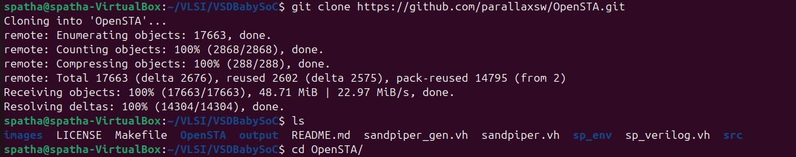
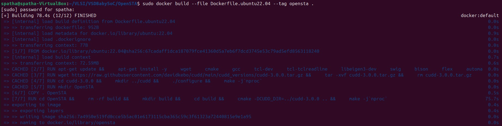
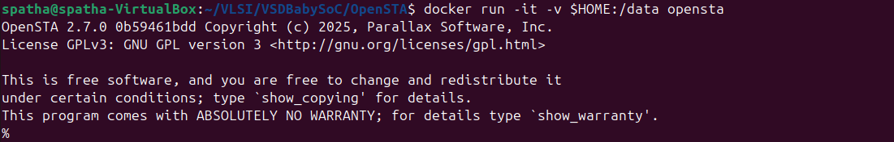
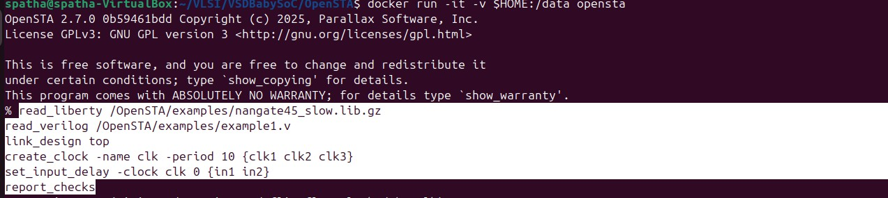
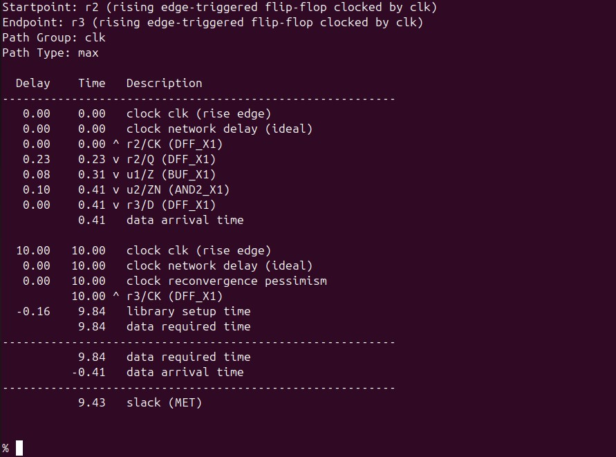
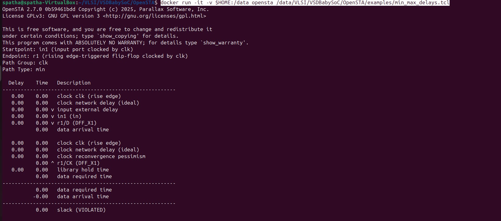
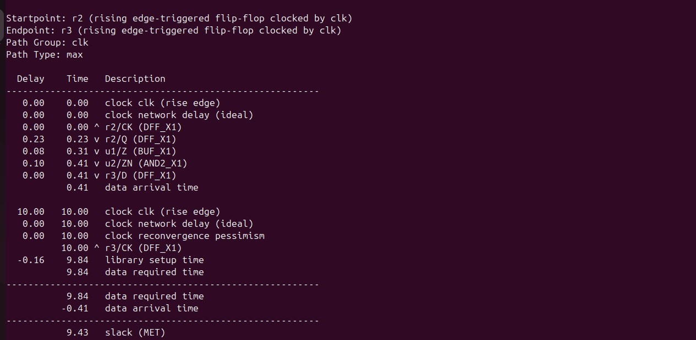
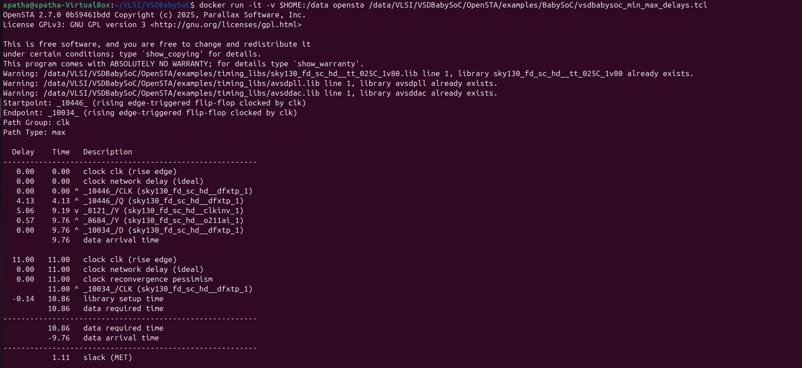

# VSD Hardware Design Program

## Day 7 : Timing Graphs using openSTA

### 📚 Contents

- [Installation of OpenSTA](#installation-of-opensta)
  - [Step 1: Clone the Repository](#step-1-clone-the-repository)
  - [Step 2: Build the Docker Image](#step-2-build-the-docker-image)
  - [Step 3: Run the OpenSTA Container](#step-3-run-the-opensta-container)
- [Timing Analysis Using Inline Commands](#timing-analysis-using-inline-commands)
- [Timing Analysis Using a TCL Script](#timing-analysis-using-a-tcl-script)
  - [Sample Script: min_max_delays.tcl](#sample-script-min_max-delaystcl)
  - [Run the Script Using Docker](#run-the-script-using-docker)
- [VSDBabySoC basic timing analysis](#vsdbabysoc-basic-timing-analysis)
    
OpenSTA(Open Static Timing Analyzer) is a gate level static timing verifier. As a stand-alone executable it can be used to verify the timing of a design using standard file formats.

* Verilog netlist
* Liberty library
* SDC timing constraints
* SDF delay annotation
* SPEF parasitics
* VCD power acitivies
* SAIF power acitivies

OpenSTA uses a TCL command interpreter to read the design, specify timing constraints and print timing reports.

##### Clocks
* Generated
* Latency
* Source latency (insertion delay)
* Uncertainty
* Propagated/Ideal
* Gated clock checks
* Multiple frequency clocks

##### Exception paths
* False path
* Multicycle path
* Min/Max path delay
* Exception points

   -from clock/pin/instance -through pin/net -to clock/pin/instance
*  Edge specific exception points

   -rise_from/-fall_from, -rise_through/-fall_through, -rise_to/-fall_to

##### Delay calculation
* Integrated Dartu/Menezes/Pileggi RC effective capacitance algorithm
* External delay calculator API

##### Analysis
* Report timing checks -from, -through, -to, multiple paths to endpoint
* Report delay calculation
* Check timing setup

## Installation of OpenSTA

#### Step 1: Clone the Repository

```bash
git clone https://github.com/parallaxsw/OpenSTA.git
cd OpenSTA
```



#### Step 2: Build the Docker Image
```bash
docker build --file Dockerfile.ubuntu22.04 --tag opensta .
```
This builds a Docker image named opensta using the provided Ubuntu 22.04 Dockerfile. All dependencies are installed during this step.



#### Step 3: Run the OpenSTA Container
To run a docker container using the OpenSTA image, use the -v option to docker to mount direcories with data to use and -i to run interactively.
```bash
docker run -i -v $HOME:/data opensta
```


You now have OpenSTA installed and running inside a Docker container. After successful installation, you will see the % prompt—this indicates that the OpenSTA interactive shell is ready for use.

### Timing Ananlysis Using inline Commands

Once inside the OpenSTA shell (% prompt), you can perform a basic static timing analysis using the following inline commands:
```shell
read_liberty /OpenSTA/examples/nangate45_slow.lib.gz
read_verilog /OpenSTA/examples/example1.v
link_design top
create_clock -name clk -period 10 {clk1 clk2 clk3}
set_input_delay -clock clk 0 {in1 in2}
report_checks
```
These commands will:

- Load the standard cell library
- Read the synthesized gate-level Verilog netlist
- Link the design with top module top
- Define a clock with a 10ns period for multiple clock inputs
- Apply input delay constraints
- Generate a timing report showing setup/hold analysis results
  
_This flow is useful for quick testing and debugging without writing a full TCL script._





### Timing Analysis Using a TCL Script

To automate the timing flow, you can write the commands into a .tcl script and execute it from the OpenSTA shell.

#### <ins>sample script: min_max_delays.tcl</ins>

```shell
# Load liberty files for max and min analysis
read_liberty -max /data/VLSI/VSDBabySoC/OpenSTA/examples/nangate45_slow.lib.gz
read_liberty -min /data/VLSI/VSDBabySoC/OpenSTA/examples/nangate45_fast.lib.gz

# Read the gate-level Verilog netlist
read_verilog /data/VLSI/VSDBabySoC/OpenSTA/examples/example1.v

# Link the top-level design
link_design top

# Define clocks and input delays
create_clock -name clk -period 10 {clk1 clk2 clk3}
set_input_delay -clock clk 0 {in1 in2}

# Generate a full min/max timing report
report_checks -path_delay min_max
```

#### Run the Script Using Docker

To run this script non-interactively using Docker:

```shell
docker run -it -v $HOME:/data opensta /data/VLSI/VSDBabySoC/OpenSTA/examples/min_max_delays.tcl
```

🤔**Why use the full path?**

Inside the Docker container, your $HOME directory from the host system is mounted as /data.

_So a file located at $HOME/VLSI/VSDBabySoC/OpenSTA/examples/min_max_delays.tcl on your machine becomes accessible at /data/VLSI/VSDBabySoC/OpenSTA/examples/min_max_delays.tcl inside the container._

This absolute path ensures that OpenSTA can locate and execute the script correctly within the container's file system.

This method ensures repeatability and makes it easy to maintain reusable timing analysis setups for your designs.





### VSDBabySoC basic timing analysis

#### Prepare Required Files

Create a directory and copy all necessary files into it:

```bash
spatha@spatha-VirtualBox:~/VLSI/VSDBabySoC/OpenSTA$ mkdir -p examples/timing_libs/
spatha@spatha-VirtualBox:~/VLSI/VSDBabySoC/OpenSTA/examples$ ls timing_libs/
avsddac.lib  avsdpll.lib  sky130_fd_sc_hd__tt_025C_1v80.lib

spatha@spatha-VirtualBox:~/VLSI/VSDBabySoC/OpenSTA$ mkdir -p examples/BabySOC
spatha@spatha-VirtualBox:~/VLSI/VSDBabySoC/OpenSTA/examples$ ls BabySOC/
gcd_sky130hd.sdc vsdbabysoc_synthesis.sdc  vsdbabysoc.synth.v
```
These files include:

- Standard cell library: sky130_fd_sc_hd__tt_025C_1v80.lib

- IP-specific Liberty libraries: avsdpll.lib, avsddac.lib

- Synthesized gate-level netlist: vsdbabysoc.synth.v

- Timing constraints: vsdbabysoc_synthesis.sdc

**<ins>Below is a TCL script to run complete min/max timing checks on the SoC:</ins>**
```shell
# Load Liberty Libraries (standard cell + IPs)
read_liberty -min /data/VLSI/VSDBabySoC/OpenSTA/examples/timing_libs/sky130_fd_sc_hd__tt_025C_1v80.lib
read_liberty -max /data/VLSI/VSDBabySoC/OpenSTA/examples/timing_libs/sky130_fd_sc_hd__tt_025C_1v80.lib

read_liberty -min /data/VLSI/VSDBabySoC/OpenSTA/examples/timing_libs/avsdpll.lib
read_liberty -max /data/VLSI/VSDBabySoC/OpenSTA/examples/timing_libs/avsdpll.lib

read_liberty -min /data/VLSI/VSDBabySoC/OpenSTA/examples/timing_libs/avsddac.lib
read_liberty -max /data/VLSI/VSDBabySoC/OpenSTA/examples/timing_libs/avsddac.lib

# Read Synthesized Netlist
read_verilog /data/VLSI/VSDBabySoC/OpenSTA/examples/BabySoC/vsdbabysoc.synth.v

# Link the Top-Level Design
link_design vsdbabysoc

# Apply SDC Constraints
read_sdc /data/VLSI/VSDBabySoC/OpenSTA/examples/BabySoC/vsdbabysoc_synthesis.sdc

# Generate Timing Report
report_checks
```

Save the above script as **_vsdbabysoc_min_max_delays.tcl_**, then execute it inside the Docker container with:

```shell
docker run -it -v $HOME:/data opensta /data/VLSI/VSDBabySoC/OpenSTA/examples/BabySoC/vsdbabysoc_min_max_delays.tcl
```
⚠️ **Possible Error Alert**

You may encounter the following error when running the script:

```shell
Warning: /data/VLSI/VSDBabySoC/OpenSTA/examples/timing_libs/sky130_fd_sc_hd__tt_025C_1v80.lib line 23, default_fanout_load is 0.0.
Warning: /data/VLSI/VSDBabySoC/OpenSTA/examples/timing_libs/sky130_fd_sc_hd__tt_025C_1v80.lib line 1, library sky130_fd_sc_hd__tt_025C_1v80 already exists.
Warning: /data/VLSI/VSDBabySoC/OpenSTA/examples/timing_libs/sky130_fd_sc_hd__tt_025C_1v80.lib line 23, default_fanout_load is 0.0.
Error: /data/VLSI/VSDBabySoC/OpenSTA/examples/timing_libs/avsdpll.lib line 54, syntax error
```

✅ **Fix:**

This error is due to the use of // for comments in Liberty files, which is not supported. Replace all // comments with C-style /* ... */ comments or remove them entirely. Specifically, check around _line 54 of avsdpll.lib_ and correct any syntax issues such as:

```shell
//pin (GND#2) {
//  direction : input;
//  max_transition : 2.5;
//  capacitance : 0.001;
//}
```
✔️ **Replace with:**
```shell
/*
pin (GND#2) {
  direction : input;
  max_transition : 2.5;
  capacitance : 0.001;
}
*/
```
This should allow OpenSTA to parse the Liberty file without throwing syntax errors.

After fixing the Liberty file comment syntax as shown above, you can rerun the script to perform complete timing analysis for VSDBabySoC:



