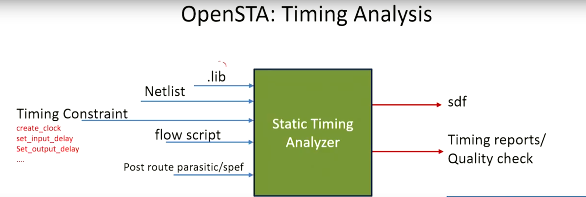
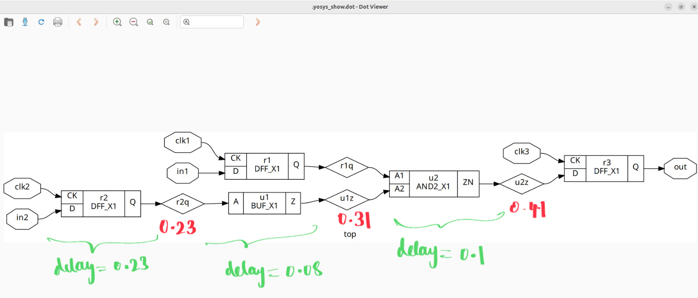
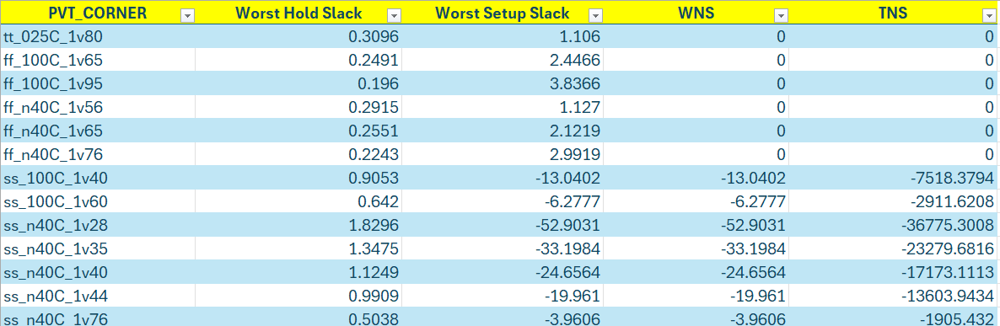
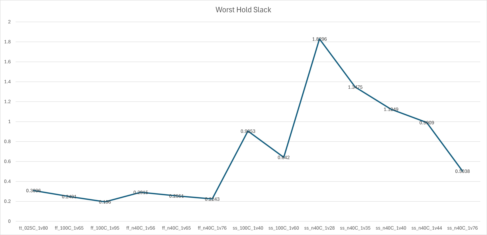
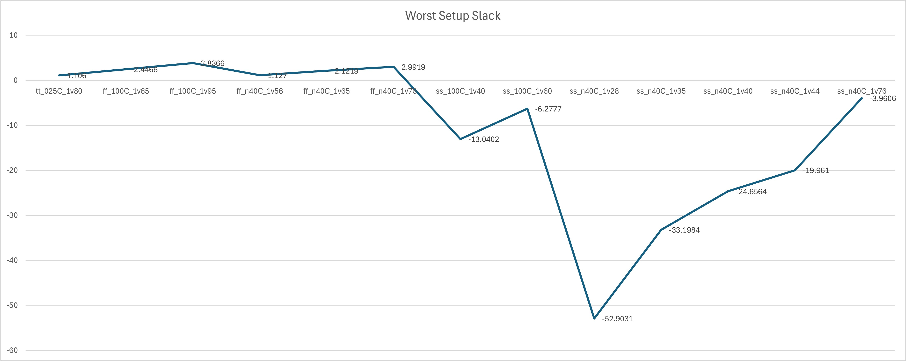
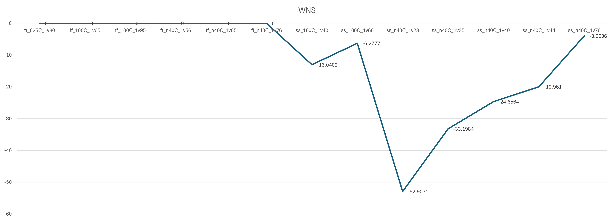
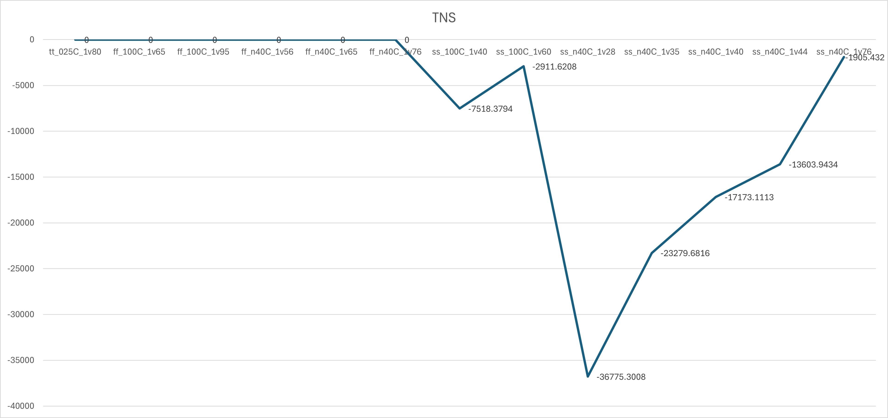

# VSD Hardware Design Program

## Timing Graphs using openSTA

### 📚 Contents

- [Installation of OpenSTA](#installation-of-opensta)
  - [Step 1: Clone the Repository](#step-1-clone-the-repository)
  - [Step 2: Build the Docker Image](#step-2-build-the-docker-image)
  - [Step 3: Run the OpenSTA Container](#step-3-run-the-opensta-container)
- [Timing Analysis Using Inline Commands](#timing-analysis-using-inline-commands)
  - [Analyzing report outcomes](#analyzing-report-outcomes)
- [Timing Analysis Using a TCL Script](#timing-analysis-using-a-tcl-script)
- [VSDBabySoC basic timing analysis](#vsdbabysoc-basic-timing-analysis)
- [VSDBabySoC PVT Corner Analysis (Post-Synthesis Timing)](#vsdbabysoc-pvt-corner-analysis-post-synthesis-timing)
- [Timing Summary Across PVT Corners (Post-Synthesis STA Results)](#timing-summary-across-pvt-corners-post-synthesis-sta-results)
- [Timing Plots Across PVT Corners](#timing-plots-across-pvt-corners)
    
OpenSTA is an open source static timing analyzer (STA) tool used in digital design. It is utilized to analyze and verify the timing performance of digital circuits at the gate level.

  * Verilog netlist
  * Liberty library
  * SDC timing constraints
  * SDF delay annotation
  * SPEF parasitics
  * VCD power acitivies
  * SAIF power acitivies

OpenSTA uses a TCL command interpreter to read the design, specify timing constraints and print timing reports.



##### Clocks
  * Generated
  * Latency
  * Source latency (insertion delay)
  * Uncertainty
  * Propagated/Ideal
  * Gated clock checks
  * Multiple frequency clocks

##### Exception paths
  * False path
  * Multicycle path
  * Min/Max path delay
  * Exception points

    `-from clock/pin/instance -through pin/net -to clock/pin/instance`
    
  *  Edge specific exception points

     `-rise_from/-fall_from, -rise_through/-fall_through, -rise_to/-fall_to`

##### Delay calculation
  * Integrated Dartu/Menezes/Pileggi RC effective capacitance algorithm
  * External delay calculator API

##### Analysis
  * Report timing checks -from, -through, -to, multiple paths to endpoint
  * Report delay calculation
  * Check timing setup

## Installation of OpenSTA

#### Step 1: Clone the Repository

```bash
git clone https://github.com/parallaxsw/OpenSTA.git
cd OpenSTA
```


#### Step 2: Build the Docker Image
```bash
docker build --file Dockerfile.ubuntu22.04 --tag opensta .
```
This builds a Docker image named opensta using the provided Ubuntu 22.04 Dockerfile. All dependencies are installed during this step.


#### Step 3: Run the OpenSTA Container
To run a docker container using the OpenSTA image, use the -v option to docker to mount direcories with data to use and -i to run interactively.
```bash
docker run -i -v $HOME:/data opensta
```


You now have OpenSTA installed and running inside a Docker container. After successful installation, you will see the % prompt—this indicates that the OpenSTA interactive shell is ready for use.

### Timing Analysis Using Inline Commands

Once inside the OpenSTA shell (% prompt), you can perform a basic static timing analysis using the following inline commands:
```shell
# Instructs OpenSTA to read and load the Liberty file "nangate45_slow.lib.gz".
read_liberty /OpenSTA/examples/nangate45_slow.lib.gz
# Intructs OpenSTA to read and load the Verilog file (gate level verilog netlist) "example1.v"
read_verilog /OpenSTA/examples/example1.v 
# Using "top," which stands for the main module, links the Verilog code with the Liberty timing cells.
link_design top
# Create a 10ns clock named 'clk' for clk1, clk2, and clk3 inputs 
create_clock -name clk -period 10 {clk1 clk2 clk3}
# Set 0ns input delay for inputs in1 and in2 relative to clock 'clk'
set_input_delay -clock clk 0 {in1 in2}
# Report of the timing checks for the design 
report_checks 
```
  
_This flow is useful for quick testing and debugging without writing a full TCL script._


⚠️ **Note:** We used report_checks here because only the slow liberty file (nangate45_slow.lib.gz) is loaded. 

This represents a setup (max delay) corner, so the analysis focuses on setup timing by default.

🤔**Why Does report_checks Show Only Max (Setup) Paths?**

By default, report_checks reports -path_delay max (i.e., setup checks).

OpenSTA interprets report_checks without arguments as:
```shell
report_checks -path_delay max
```
This reports only max path delays, i.e., setup timing checks.

✅ How to Also Get Hold (min) Paths:

If you want both setup and hold timing checks (i.e., both max and min path delays), use:
```shell
report_checks -path_delay min_max
```
(Or) if you want to see only hold checks (min path delays):
```shell
report_checks -path_delay min
```
#### Analyzing report outcomes

*Verilog Netlist: example1.v*
```shell
module top (in1, in2, clk1, clk2, clk3, out);
  input in1, in2, clk1, clk2, clk3;
  output out;
  wire r1q, r2q, u1z, u2z;

  DFF_X1 r1 (.D(in1), .CK(clk1), .Q(r1q));
  DFF_X1 r2 (.D(in2), .CK(clk2), .Q(r2q));
  BUF_X1 u1 (.A(r2q), .Z(u1z));
  AND2_X1 u2 (.A1(r1q), .A2(u1z), .ZN(u2z));
  DFF_X1 r3 (.D(u2z), .CK(clk3), .Q(out));
endmodule
```

Below is the *netlist diagram* automatically generated using Yosys.

The datapath has been annotated with delay values at each stage for easier understanding:



### Timing Analysis Using a TCL Script

To automate the timing flow, you can write the commands into a .tcl script and execute it from the OpenSTA shell.

🔽**sample script: min_max_delays.tcl**

```shell
# Load liberty files for max and min analysis
read_liberty -max /data/VLSI/VSDBabySoC/OpenSTA/examples/nangate45_slow.lib.gz
read_liberty -min /data/VLSI/VSDBabySoC/OpenSTA/examples/nangate45_fast.lib.gz

# Read the gate-level Verilog netlist
read_verilog /data/VLSI/VSDBabySoC/OpenSTA/examples/example1.v

# Link the top-level design
link_design top

# Define clocks and input delays
create_clock -name clk -period 10 {clk1 clk2 clk3}
set_input_delay -clock clk 0 {in1 in2}

# Generate a full min/max timing report
report_checks -path_delay min_max
```

| **Line of Code**                                     | **Purpose**             | **Explanation**                                                                              |
| ---------------------------------------------------- | ----------------------- | -------------------------------------------------------------------------------------------- |
| `read_liberty -max nangate45_slow.lib.gz`            | Load max delay library  | Loads the **slow corner Liberty file** for **setup (max delay)** analysis.                   |
| `read_liberty -min nangate45_fast.lib.gz`            | Load min delay library  | Loads the **fast corner Liberty file** for **hold (min delay)** analysis.                    |
| `read_verilog example1.v`                            | Load gate-level netlist | Reads the synthesized **Verilog netlist** of the design.                                     |
| `link_design top`                                    | Link design             | Links the netlist using `top` as the **top-level module**, connecting it with Liberty cells. |
| `create_clock -name clk -period 10 {clk1 clk2 clk3}` | Create clock            | Defines a **clock named `clk`** with a 10 ns period on ports `clk1`, `clk2`, and `clk3`.     |
| `set_input_delay -clock clk 0 {in1 in2}`             | Set input delay         | Applies **0 ns input delay** relative to `clk` for inputs `in1` and `in2`.                   |
| `report_checks -path_delay min_max`                  | Run full STA            | Reports both **setup (max)** and **hold (min)** timing paths and checks.                     |

#### Run the Script Using Docker

To run this script non-interactively using Docker:

```shell
docker run -it -v $HOME:/data opensta /data/VLSI/VSDBabySoC/OpenSTA/examples/min_max_delays.tcl
```

🤔**Why use the full path?**

Inside the Docker container, your $HOME directory from the host system is mounted as /data.

_So a file located at $HOME/VLSI/VSDBabySoC/OpenSTA/examples/min_max_delays.tcl on your machine becomes accessible at /data/VLSI/VSDBabySoC/OpenSTA/examples/min_max_delays.tcl inside the container._

This absolute path ensures that OpenSTA can locate and execute the script correctly within the container's file system.

This method ensures repeatability and makes it easy to maintain reusable timing analysis setups for your designs.


### VSDBabySoC basic timing analysis

#### Prepare Required Files

To begin static timing analysis on the VSDBabySoC design, you must organize and prepare the required files in specific directories.

```bash
# Create a directory to store Liberty timing libraries
spatha@spatha-VirtualBox:~/VLSI/VSDBabySoC/OpenSTA$ mkdir -p examples/timing_libs/
spatha@spatha-VirtualBox:~/VLSI/VSDBabySoC/OpenSTA/examples$ ls timing_libs/
avsddac.lib  avsdpll.lib  sky130_fd_sc_hd__tt_025C_1v80.lib
# Create a directory to store synthesized netlist and constraint files
spatha@spatha-VirtualBox:~/VLSI/VSDBabySoC/OpenSTA$ mkdir -p examples/BabySOC
spatha@spatha-VirtualBox:~/VLSI/VSDBabySoC/OpenSTA/examples$ ls BabySOC/
gcd_sky130hd.sdc vsdbabysoc_synthesis.sdc  vsdbabysoc.synth.v
```
These files include:

- Standard cell library: sky130_fd_sc_hd__tt_025C_1v80.lib

- IP-specific Liberty libraries: avsdpll.lib, avsddac.lib

- Synthesized gate-level netlist: vsdbabysoc.synth.v

- Timing constraints: vsdbabysoc_synthesis.sdc

🔽**Below is a TCL script to run complete min/max timing checks on the SoC:**
```shell
# Load Liberty Libraries (standard cell + IPs)
read_liberty -min /data/VLSI/VSDBabySoC/OpenSTA/examples/timing_libs/sky130_fd_sc_hd__tt_025C_1v80.lib
read_liberty -max /data/VLSI/VSDBabySoC/OpenSTA/examples/timing_libs/sky130_fd_sc_hd__tt_025C_1v80.lib

read_liberty -min /data/VLSI/VSDBabySoC/OpenSTA/examples/timing_libs/avsdpll.lib
read_liberty -max /data/VLSI/VSDBabySoC/OpenSTA/examples/timing_libs/avsdpll.lib

read_liberty -min /data/VLSI/VSDBabySoC/OpenSTA/examples/timing_libs/avsddac.lib
read_liberty -max /data/VLSI/VSDBabySoC/OpenSTA/examples/timing_libs/avsddac.lib

# Read Synthesized Netlist
read_verilog /data/VLSI/VSDBabySoC/OpenSTA/examples/BabySoC/vsdbabysoc.synth.v

# Link the Top-Level Design
link_design vsdbabysoc

# Apply SDC Constraints
read_sdc /data/VLSI/VSDBabySoC/OpenSTA/examples/BabySoC/vsdbabysoc_synthesis.sdc

# Generate Timing Report
report_checks
```

| **Line of Code**                                       | **Purpose**                | **Explanation**                                                                                    |
| ------------------------------------------------------ | -------------------------- | -------------------------------------------------------------------------------------------------- |
| `read_liberty -min ...sky130...` & `-max ...sky130...` | Load standard cell library | Loads the **typical PVT corner** for both min (hold) and max (setup) timing analysis.              |
| `read_liberty -min/-max avsdpll.lib`                   | Load PLL IP Liberty        | Includes Liberty timing views of the **PLL IP** used in the design.                                |
| `read_liberty -min/-max avsddac.lib`                   | Load DAC IP Liberty        | Includes Liberty timing views of the **DAC IP** used in the design.                                |
| `read_verilog vsdbabysoc.synth.v`                      | Load synthesized netlist   | Loads the gate-level Verilog netlist of the **VSDBabySoC** design.                                 |
| `link_design vsdbabysoc`                               | Link top-level module      | Links the hierarchy using `vsdbabysoc` as the **top module** for timing analysis.                  |
| `read_sdc vsdbabysoc_synthesis.sdc`                    | Load constraints           | Loads SDC file specifying **clock definitions, input/output delays, and false paths**.             |
| `report_checks`                                        | Run timing analysis        | Generates a default **setup timing report**. Add `-path_delay min_max` to see both hold and setup. |

Save the above script as **_vsdbabysoc_min_max_delays.tcl_**, then execute it inside the Docker container with:

```shell
docker run -it -v $HOME:/data opensta /data/VLSI/VSDBabySoC/OpenSTA/examples/BabySoC/vsdbabysoc_min_max_delays.tcl
```
⚠️ **Possible Error Alert**

You may encounter the following error when running the script:

```shell
Warning: /data/VLSI/VSDBabySoC/OpenSTA/examples/timing_libs/sky130_fd_sc_hd__tt_025C_1v80.lib line 23, default_fanout_load is 0.0.
Warning: /data/VLSI/VSDBabySoC/OpenSTA/examples/timing_libs/sky130_fd_sc_hd__tt_025C_1v80.lib line 1, library sky130_fd_sc_hd__tt_025C_1v80 already exists.
Warning: /data/VLSI/VSDBabySoC/OpenSTA/examples/timing_libs/sky130_fd_sc_hd__tt_025C_1v80.lib line 23, default_fanout_load is 0.0.
Error: /data/VLSI/VSDBabySoC/OpenSTA/examples/timing_libs/avsdpll.lib line 54, syntax error
```

✅ **Fix:**

This error occurs because Liberty syntax does not support // for single-line comments, and more importantly, the { character appearing after // confuses the Liberty parser. Specifically, check around _line 54 of avsdpll.lib_ and correct any syntax issues such as:

```shell
//pin (GND#2) {
//  direction : input;
//  max_transition : 2.5;
//  capacitance : 0.001;
//}
```
✔️ **Replace with:**
```shell
/*
pin (GND#2) {
  direction : input;
  max_transition : 2.5;
  capacitance : 0.001;
}
*/
```
This should allow OpenSTA to parse the Liberty file without throwing syntax errors.

After fixing the Liberty file comment syntax as shown above, you can rerun the script to perform complete timing analysis for VSDBabySoC:


### VSDBabySoC PVT Corner Analysis (Post-Synthesis Timing)
Static Timing Analysis (STA) is performed across various **PVT (Process-Voltage-Temperature)** corners to ensure the design meets timing requirements under different conditions.

### Critical Timing Corners

**Worst Max Path (Setup-critical) Corners:**
- `ss_LowTemp_LowVolt`
- `ss_HighTemp_LowVolt`  
_These represent the **slowest** operating conditions._

**Worst Min Path (Hold-critical) Corners:**
- `ff_LowTemp_HighVolt`
- `ff_HighTemp_HighVolt`  
_These represent the **fastest** operating conditions._

 **Timing libraries** required for this analysis can be downloaded from:  
🔗 [Skywater PDK - sky130_fd_sc_hd Timing Libraries](https://github.com/efabless/skywater-pdk-libs-sky130_fd_sc_hd/tree/master/timing)

🔽 The below Tcl script _**sta_across_pvt.tcl**_ can be used to perform STA across the PVT corners for which the Sky130 Liberty files are available.

```shell
 set list_of_lib_files(1) "sky130_fd_sc_hd__tt_025C_1v80.lib"
 set list_of_lib_files(2) "sky130_fd_sc_hd__ff_100C_1v65.lib"
 set list_of_lib_files(3) "sky130_fd_sc_hd__ff_100C_1v95.lib"
 set list_of_lib_files(4) "sky130_fd_sc_hd__ff_n40C_1v56.lib"
 set list_of_lib_files(5) "sky130_fd_sc_hd__ff_n40C_1v65.lib"
 set list_of_lib_files(6) "sky130_fd_sc_hd__ff_n40C_1v76.lib"
 set list_of_lib_files(7) "sky130_fd_sc_hd__ss_100C_1v40.lib"
 set list_of_lib_files(8) "sky130_fd_sc_hd__ss_100C_1v60.lib"
 set list_of_lib_files(9) "sky130_fd_sc_hd__ss_n40C_1v28.lib"
 set list_of_lib_files(10) "sky130_fd_sc_hd__ss_n40C_1v35.lib"
 set list_of_lib_files(11) "sky130_fd_sc_hd__ss_n40C_1v40.lib"
 set list_of_lib_files(12) "sky130_fd_sc_hd__ss_n40C_1v44.lib"
 set list_of_lib_files(13) "sky130_fd_sc_hd__ss_n40C_1v76.lib"

 read_liberty /data/VLSI/VSDBabySoC/OpenSTA/examples/timing_libs/avsdpll.lib
 read_liberty /data/VLSI/VSDBabySoC/OpenSTA/examples/timing_libs/avsddac.lib

 for {set i 1} {$i <= [array size list_of_lib_files]} {incr i} {
 read_liberty /data/VLSI/VSDBabySoC/OpenSTA/examples/timing_libs/$list_of_lib_files($i)
 read_verilog /data/VLSI/VSDBabySoC/OpenSTA/examples/BabySoC/vsdbabysoc.synth.v
 link_design vsdbabysoc
 current_design
 read_sdc /data/VLSI/VSDBabySoC/OpenSTA/examples/BabySoC/vsdbabysoc_synthesis.sdc
 check_setup -verbose
 report_checks -path_delay min_max -fields {nets cap slew input_pins fanout} -digits {4} > /data/VLSI/VSDBabySoC/OpenSTA/examples/BabySoC/STA_OUTPUT/min_max_$list_of_lib_files($i).txt

 exec echo "$list_of_lib_files($i)" >> /data/VLSI/VSDBabySoC/OpenSTA/examples/BabySoC/STA_OUTPUT/sta_worst_max_slack.txt
 report_worst_slack -max -digits {4} >> /data/VLSI/VSDBabySoC/OpenSTA/examples/BabySoC/STA_OUTPUT/sta_worst_max_slack.txt

 exec echo "$list_of_lib_files($i)" >> /data/VLSI/VSDBabySoC/OpenSTA/examples/BabySoC/STA_OUTPUT/sta_worst_min_slack.txt
 report_worst_slack -min -digits {4} >> /data/VLSI/VSDBabySoC/OpenSTA/examples/BabySoC/STA_OUTPUT/sta_worst_min_slack.txt

 exec echo "$list_of_lib_files($i)" >> /data/VLSI/VSDBabySoC/OpenSTA/examples/BabySoC/STA_OUTPUT/sta_tns.txt
 report_tns -digits {4} >> /data/VLSI/VSDBabySoC/OpenSTA/examples/BabySoC/STA_OUTPUT/sta_tns.txt

 exec echo "$list_of_lib_files($i)" >> /data/VLSI/VSDBabySoC/OpenSTA/examples/BabySoC/STA_OUTPUT/sta_wns.txt
 report_wns -digits {4} >> /data/VLSI/VSDBabySoC/OpenSTA/examples/BabySoC/STA_OUTPUT/sta_wns.txt
 }
```

| **Command**               | **Purpose**                       | **Explanation**                                                                                                              |
| ------------------------- | --------------------------------- | ---------------------------------------------------------------------------------------------------------------------------- |
| `report_worst_slack -max` | Report Worst Setup Slack          | Outputs the **most negative setup slack** (WNS) in the design for the current PVT corner.                                    |
| `report_worst_slack -min` | Report Worst Hold Slack           | Outputs the **most negative hold slack** in the design for the current PVT corner.                                           |
| `report_tns`              | Report Total Negative Slack (TNS) | Prints the **sum of all negative slacks** (across all violating paths). Reflects how widespread timing violations are.       |
| `report_wns`              | Report Worst Negative Slack (WNS) | Prints the **single worst slack** (i.e., the most timing-violating path). Indicates severity of the critical path violation. |

Save the above script as **_sta_across_pvt.tcl_**, then execute it inside the Docker container with:

```shell
docker run -it -v $HOME:/data opensta /data/VLSI/VSDBabySoC/OpenSTA/examples/BabySoC/sta_across_pvt.tcl
```

After executing the above script, you can find the generated timing reports in the STA_OUTPUT directory:

```shell
spatha@spatha-VirtualBox:~/VLSI/VSDBabySoC/OpenSTA/examples/BabySoC/STA_OUTPUT$ ls
min_max_sky130_fd_sc_hd__ff_100C_1v65.lib.txt  min_max_sky130_fd_sc_hd__ss_100C_1v40.lib.txt  min_max_sky130_fd_sc_hd__ss_n40C_1v44.lib.txt  sta_worst_max_slack.txt
min_max_sky130_fd_sc_hd__ff_100C_1v95.lib.txt  min_max_sky130_fd_sc_hd__ss_100C_1v60.lib.txt  min_max_sky130_fd_sc_hd__ss_n40C_1v76.lib.txt  sta_worst_min_slack.txt
min_max_sky130_fd_sc_hd__ff_n40C_1v56.lib.txt  min_max_sky130_fd_sc_hd__ss_n40C_1v28.lib.txt  min_max_sky130_fd_sc_hd__tt_025C_1v80.lib.txt
min_max_sky130_fd_sc_hd__ff_n40C_1v65.lib.txt  min_max_sky130_fd_sc_hd__ss_n40C_1v35.lib.txt  sta_tns.txt
min_max_sky130_fd_sc_hd__ff_n40C_1v76.lib.txt  min_max_sky130_fd_sc_hd__ss_n40C_1v40.lib.txt  sta_wns.txt
```

| **File**                  | **Description**                                                     |
| ------------------------- | ------------------------------------------------------------------- |
| `min_max_<lib>.txt`       | Detailed timing report for setup and hold paths for each PVT corner |
| `sta_worst_max_slack.txt` | Worst setup slack values across all corners                         |
| `sta_worst_min_slack.txt` | Worst hold slack values across all corners                          |
| `sta_tns.txt`             | Total negative slack values across all corners                      |
| `sta_wns.txt`             | Worst negative slack values across all corners                      |


#### Timing Summary Across PVT Corners (Post-Synthesis STA Results)
The following timing summary table was collected by running STA across 13 PVT corners using OpenSTA. 

Metrics such as Worst Hold Slack, Worst Setup Slack, WNS, and TNS were extracted from the output reports.



#### 📈Timing Plots Across PVT Corners








