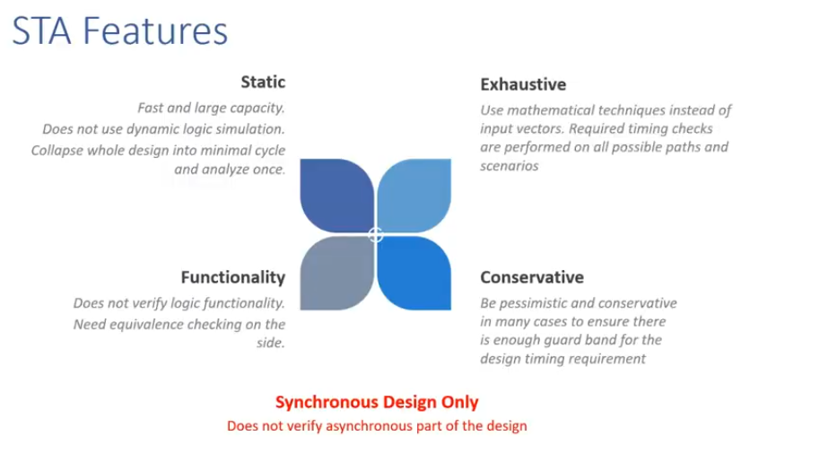
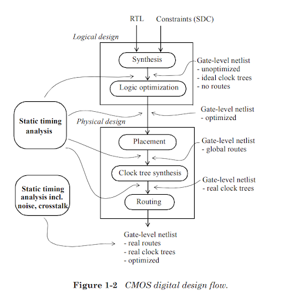
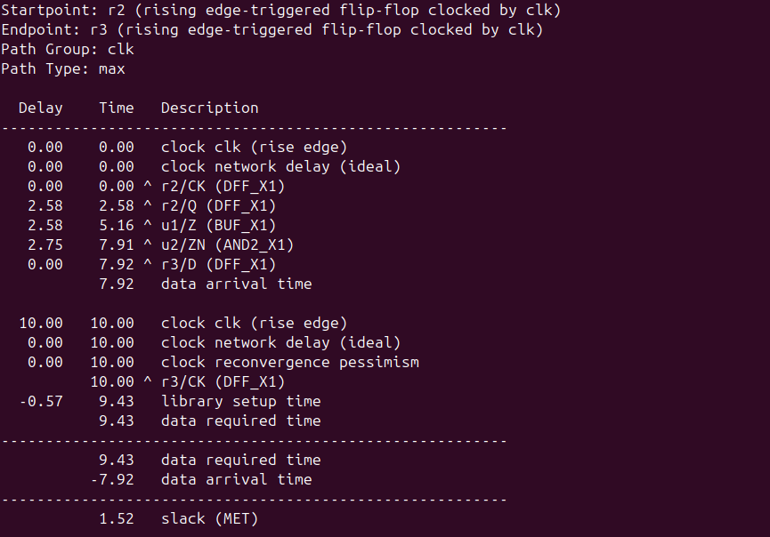

# VSD Hardware Design Program

## Timing Graphs using openSTA

### 📚 Contents

- [Introduction](#introduction)
-  [Installation of OpenSTA](#installation-of-opensta)
  - [Step 1: Clone the Repository](#step-1-clone-the-repository)
  - [Step 2: Build the Docker Image](#step-2-build-the-docker-image)
  - [Step 3: Run the OpenSTA Container](#step-3-run-the-opensta-container)
- [Timing Analysis Using Inline Commands](#timing-analysis-using-inline-commands)
  - [Analyzing report outcomes](#analyzing-report-outcomes)
  - [SPEF-Based Timing Analysis](#spef-based-timing-analysis)
  - [more options to explore](#more-options-to-explore)
- [Timing Analysis Using a TCL Script](#timing-analysis-using-a-tcl-script)
- [VSDBabySoC basic timing analysis](#vsdbabysoc-basic-timing-analysis)
- [VSDBabySoC PVT Corner Analysis (Post-Synthesis Timing)](#vsdbabysoc-pvt-corner-analysis-post-synthesis-timing)
- [Timing Summary Across PVT Corners (Post-Synthesis STA Results)](#timing-summary-across-pvt-corners-post-synthesis-sta-results)
- [Timing Plots Across PVT Corners](#timing-plots-across-pvt-corners)

## Introduction

**Static Timing Analysis** is one of the many techniques available to verify the timing of a digital design. 

An alternate approach used to verify the timing is the timing simulation which can verify the functionality as well as the timing of the design. 

The term timing analysis is used to refer to either of these two methods - static timing analysis, or the timing simulation. 

Thus, timing analysis simply refers to the analysis of the design for timing issues.

The STA is static since the analysis of the design is carried out statically and does not depend upon the data values being applied at the input pins. 

This is in contrast to simulation based timing analysis where a stimulus is applied on input signals, resulting behavior is observed and verified, then time is advanced with new input stimulus applied, and the new behavior is observed and verified and so on.



In a CMOS digital design flow, the static timing analysis can be performed at many different stages of the implementation. Figure below shows a typical flow.



**OpenSTA** is an open source static timing analyzer (STA) tool used in digital design. It is utilized to analyze and verify the timing performance of digital circuits at the gate level.

OpenSTA uses a TCL command interpreter to read the design, specify timing constraints and print timing reports.


#### Input Files

- `*.v`  : Gate-level Verilog Netlist  
- `*.lib` : Liberty Timing Libraries  
- `*.sdc` : Synopsys Design Constraints (clocks, delays, false paths)  
- `*.sdf` : Annotated Delay File (optional)  
- `*.spef`: Parasitics (RC extraction)  
- `*.vcd` / `*.saif` : Switching Activity for Power Analysis 

#### Clock Modeling Features

- `Generated Clocks`: Derived from existing clocks  
- `Latency`: Clock propagation delay  
- `Source Latency`: Insertion delay from clock source to input  
- `Uncertainty`: Jitter or skew margins  
- `Propagated vs. Ideal`: Real vs. ideal clock network modeling  
- `Gated Clock Checks`: Verifies clocks that are enabled conditionally  
- `Multi-Frequency Clocks`: Analyzes multiple domains  

#### Exception Paths

Timing exceptions refine analysis for real behavior:

- `set_false_path` — Ignores invalid functional paths  
- `set_multicycle_path` — Allows multiple clock cycles  
- `set_max_delay` / `set_min_delay` — Custom timing limits

#### Delay calculation

- `Integrated Dartu/Menezes/Pileggi RC effective capacitance algorithm`

Models effective capacitance for RC networks to compute realistic gate and net delays. It balances accuracy and runtime using an efficient algorithm developed for timing engines.

- `External delay calculator API`
    
Allows plugging in custom delay calculators for advanced or proprietary models (e.g., layout-aware or temperature-adaptive models). Useful for integrating tool flows beyond standard Liberty data.

#### Timing Analysis and Reporting

OpenSTA provides a rich set of commands for analyzing timing paths, delays, and setup/hold checks:

- `report_checks`  
  Reports timing violations across specified paths using options like `-from`, `-through`, and `-to`. Supports multi-path analysis to any endpoint.

  ```tcl
  report_checks -from [get_pins U1/Q] -to [get_pins U2/D]
  ```
#### Timing Paths 

`What do you mean by Timing Paths?`
* It Refer to the logical paths a signal takes through a digital circuit from its source to its destination, including sequential and combinational elements. STA analyzes timing paths to determine their delay, setup and hold times, and other timing parameters specified in the constraints. Timing paths are categorized into combinatorial and sequential, and the critical path is the longest path in the design with the maximum operating frequency.

#### Timing Path Elements
   
Timing path elements in STA are the start point, where a signal originates, the end point, where it terminates, and the combinational logic elements, such as gates, that the signal passes through. Timing paths are traced to determine the overall delay and timing performance of the digital circuit.

* Start Point: Is the point where the signal originates or enters the digital circuit. This point is typically an input port of the design, where the signal is first introduced to the circuit.
* End Point: Is the point where the signal terminates or leaves the digital circuit. This point is typically an output port of the design, where the signal is outputted from the circuit.
* Combinational Logic: Combinational logic elements are the building blocks of a digital circuit and are used to perform logic operations on the signals passing through the circuit. These elements do not store any information, and the output of a combinational logic element is solely determined by the input values at that moment.

#### Setup and Hold Checks

-> What is Setup Check?
* Is the minimum time that the data must be stable before the clock edge, and if this time is not met, it can lead to setup violations, resulting in incorrect data being stored in the sequential element. The setup check is essential to ensure correct timing behavior of a digital circuit and prevent data loss or other timing-related issues.
* The setup time of a flip-flop depends on the technology node, operating conditions, and other factors. The value of the setup time is usually provided in the logic libraries.

-> What is Hold Check?
* Is the minimum amount of time that the data must remain stable after the clock edge, and if this time is not met, it can lead to hold violations, resulting in incorrect data being stored in the sequential element. The hold check is necessary to prevent issues such as data corruption, metastability, and other timing-related problems in digital circuits.

#### Slack Calculation 

Setup and hold slack is defined as the difference between data required time and data arrivals time. 

>Setup slack = Data required time - Data arrival time

>Hold slack = Data arrival time - Data required time

-> What is Data Arrival Time?
* The time taken by the signal to travel from the start point to the end point of the digital circuit. 

-> What is Data Required Time? 
* The time for the clock to traverse through the clock path of the digital circuit. 

-> What is Slack? 
* It is difference between the desired arrival times and the actual arrival time for a signal. 
* Positive Slack indicates that the design is meeting the timing and still it can be improved. 
* Zero slack means that the design is critically working at the desired frequency. 
* Negative slack means, design has not achieved the specified timings at the specified frequency.
* Slack has to be positive always and negative slack indicates a violation in timing.
  
## Installation of OpenSTA

**Note:** Installation instructions are adapted from the official OpenSTA repository:
🔗 https://github.com/parallaxsw/OpenSTA

#### Step 1: Clone the Repository

```bash
git clone https://github.com/parallaxsw/OpenSTA.git
cd OpenSTA
```


#### Step 2: Build the Docker Image
```bash
docker build --file Dockerfile.ubuntu22.04 --tag opensta .
```
This builds a Docker image named opensta using the provided Ubuntu 22.04 Dockerfile. All dependencies are installed during this step.


#### Step 3: Run the OpenSTA Container
To run a docker container using the OpenSTA image, use the -v option to docker to mount direcories with data to use and -i to run interactively.
```bash
docker run -i -v $HOME:/data opensta
```


You now have OpenSTA installed and running inside a Docker container. After successful installation, you will see the % prompt—this indicates that the OpenSTA interactive shell is ready for use.

### Timing Analysis Using Inline Commands

Once inside the OpenSTA shell (% prompt), you can perform a basic static timing analysis using the following inline commands:
```shell
# Instructs OpenSTA to read and load the Liberty file "nangate45_slow.lib.gz".
read_liberty /OpenSTA/examples/nangate45_slow.lib.gz

# Intructs OpenSTA to read and load the Verilog file (gate level verilog netlist) "example1.v"
read_verilog /OpenSTA/examples/example1.v

# Using "top," which stands for the main module, links the Verilog code with the Liberty timing cells.
link_design top

# Create a 10ns clock named 'clk' for clk1, clk2, and clk3 inputs 
create_clock -name clk -period 10 {clk1 clk2 clk3}

# Set 0ns input delay for inputs in1 and in2 relative to clock 'clk'
set_input_delay -clock clk 0 {in1 in2}

# Report of the timing checks for the design 
report_checks 
```
  
_This flow is useful for quick testing and debugging without writing a full TCL script._


**Note:** We used report_checks here because only the slow liberty file (nangate45_slow.lib.gz) is loaded. 

This represents a setup (max delay) corner, so the analysis focuses on setup timing by default.

🤔**Why Does report_checks Show Only Max (Setup) Paths?**

By default, report_checks reports -path_delay max (i.e., setup checks).

OpenSTA interprets report_checks without arguments as:
```shell
report_checks -path_delay max
```
This reports only max path delays, i.e., setup timing checks.

✅**How to Also Get Hold (min) Paths:**

If you want both setup and hold timing checks (i.e., both max and min path delays), use:
```shell
report_checks -path_delay min_max
```
(Or) if you want to see only hold checks (min path delays):
```shell
report_checks -path_delay min
```
#### Analyzing report outcomes

*Verilog Netlist: example1.v*
```shell
module top (in1, in2, clk1, clk2, clk3, out);
  input in1, in2, clk1, clk2, clk3;
  output out;
  wire r1q, r2q, u1z, u2z;

  DFF_X1 r1 (.D(in1), .CK(clk1), .Q(r1q));
  DFF_X1 r2 (.D(in2), .CK(clk2), .Q(r2q));
  BUF_X1 u1 (.A(r2q), .Z(u1z));
  AND2_X1 u2 (.A1(r1q), .A2(u1z), .ZN(u2z));
  DFF_X1 r3 (.D(u2z), .CK(clk3), .Q(out));
endmodule
```
Here are the commands for Yosys synthesis for example1.v:

```shell
patha@spatha-VirtualBox:~$ cd ~/VLSI/VSDBabySoC/OpenSTA/examples/
patha@spatha-VirtualBox:~/VLSI/VSDBabySoC/OpenSTA/examples$ yosys
yosys> read_liberty -lib nangate45_slow.lib
yosys> read_verilog example1.v
yosys> synth -top top
3.25. Printing statistics.

=== top ===

   Number of wires:                 10
   Number of wire bits:             10
   Number of public wires:          10
   Number of public wire bits:      10
   Number of ports:                  6
   Number of port bits:              6
   Number of memories:               0
   Number of memory bits:            0
   Number of processes:              0
   Number of cells:                  5
     AND2_X1                         1
     BUF_X1                          1
     DFF_X1                          3

3.26. Executing CHECK pass (checking for obvious problems).
Checking module top...
Found and reported 0 problems.
yosys> show
```
Below is the *netlist diagram* generated using Yosys.

The datapath has been annotated with delay values at each stage for easier understanding:


#### SPEF-Based Timing Analysis

Here’s the same OpenSTA timing analysis flow with added SPEF-based parasitic modeling:

This enables **more realistic delay and slack computation** by including post-layout RC data, improving timing signoff precision.

```shell
docker run -i -v $HOME:/data opensta
```

```shell
read_liberty /OpenSTA/examples/nangate45_slow.lib.gz
read_verilog /OpenSTA/examples/example1.v
link_design top
read_spef /OpenSTA/examples/example1.dspef
create_clock -name clk -period 10 {clk1 clk2 clk3}
set_input_delay -clock clk 0 {in1 in2}
report_checks
```



#### more options to explore

**<ins>Report Capacitance per Stage</ins>**

Reports timing paths with 4-digit precision and shows the net capacitance at each stage, helping identify high-cap nodes that may affect delay.

```shell
% report_checks -digits 4 -fields capacitance
report_checks -digits 4 -fields capacitance
Startpoint: r2 (rising edge-triggered flip-flop clocked by clk)
Endpoint: r3 (rising edge-triggered flip-flop clocked by clk)
Path Group: clk
Path Type: max

      Cap     Delay      Time   Description
----------------------------------------------------------------------
             0.0000    0.0000   clock clk (rise edge)
             0.0000    0.0000   clock network delay (ideal)
             0.0000    0.0000 ^ r2/CK (DFF_X1)
 275.9346    2.5838    2.5838 ^ r2/Q (DFF_X1)
 275.9392    2.5778    5.1617 ^ u1/Z (BUF_X1)
 276.1091    2.7520    7.9137 ^ u2/ZN (AND2_X1)
             0.0013    7.9150 ^ r3/D (DFF_X1)
                       7.9150   data arrival time

            10.0000   10.0000   clock clk (rise edge)
             0.0000   10.0000   clock network delay (ideal)
             0.0000   10.0000   clock reconvergence pessimism
                      10.0000 ^ r3/CK (DFF_X1)
            -0.5697    9.4303   library setup time
                       9.4303   data required time
----------------------------------------------------------------------
                       9.4303   data required time
                      -7.9150   data arrival time
----------------------------------------------------------------------
                       1.5153   slack (MET)

```

**<ins>Report Timing with Capacitance, Slew, Input Pins, and Fanout</ins>**

Report timing with capacitance, slew, input pins, and fanout per stage.

```shell
% report_checks -digits 4 -fields [list capacitance slew input_pins fanout]
report_checks -digits 4 -fields [list capacitance slew input_pins fanout]
Startpoint: r2 (rising edge-triggered flip-flop clocked by clk)
Endpoint: r3 (rising edge-triggered flip-flop clocked by clk)
Path Group: clk
Path Type: max

Fanout       Cap      Slew     Delay      Time   Description
-------------------------------------------------------------------------------------
                    0.0000    0.0000    0.0000   clock clk (rise edge)
                              0.0000    0.0000   clock network delay (ideal)
                    0.0000    0.0000    0.0000 ^ r2/CK (DFF_X1)
     1  275.9346    2.1654    2.5838    2.5838 ^ r2/Q (DFF_X1)
                    2.1654    0.0013    2.5851 ^ u1/A (BUF_X1)
     1  275.9392    2.1393    2.5765    5.1617 ^ u1/Z (BUF_X1)
                    2.1393    0.0013    5.1630 ^ u2/A2 (AND2_X1)
     1  276.1091    2.1579    2.7507    7.9137 ^ u2/ZN (AND2_X1)
                    2.1579    0.0013    7.9150 ^ r3/D (DFF_X1)
                                        7.9150   data arrival time

                    0.0000   10.0000   10.0000   clock clk (rise edge)
                              0.0000   10.0000   clock network delay (ideal)
                              0.0000   10.0000   clock reconvergence pessimism
                                       10.0000 ^ r3/CK (DFF_X1)
                             -0.5697    9.4303   library setup time
                                        9.4303   data required time
-------------------------------------------------------------------------------------
                                        9.4303   data required time
                                       -7.9150   data arrival time
-------------------------------------------------------------------------------------
                                        1.5153   slack (MET)

```

**<ins>Report Total and Component Power</ins>**

The report_power command uses static power analysis based on propagated or annotated pin activities in the circuit using Liberty power models. 

The internal, switching, leakage and total power are reported. 

Design power is reported separately for combinational, sequential, macro and pad groups. Power values are reported in watts

```shell
% report_power
Group                  Internal  Switching    Leakage      Total
                          Power      Power      Power      Power (Watts)
----------------------------------------------------------------
Sequential             1.09e-06   3.73e-06   1.63e-07   4.99e-06  65.8%
Combinational          6.68e-08   2.49e-06   3.08e-08   2.59e-06  34.2%
Clock                  0.00e+00   0.00e+00   0.00e+00   0.00e+00   0.0%
Macro                  0.00e+00   0.00e+00   0.00e+00   0.00e+00   0.0%
Pad                    0.00e+00   0.00e+00   0.00e+00   0.00e+00   0.0%
----------------------------------------------------------------
Total                  1.16e-06   6.22e-06   1.94e-07   7.58e-06 100.0%
                          15.3%      82.1%       2.6%
```


**<ins>Report Pulse Width Checks</ins>**

The report_pulse_width_checks command reports min pulse width checks for pins in the clock network. 

If pins is not specified all clock network pins are reported

```shell
% report_pulse_width_checks
report_pulse_width_checks
                                     Required  Actual
Pin                                    Width   Width   Slack
------------------------------------------------------------
r1/CK (high)                            0.22    5.00    4.78 (MET)
r2/CK (high)                            0.22    5.00    4.78 (MET)
r3/CK (high)                            0.22    5.00    4.78 (MET)
r1/CK (low)                             0.19    5.00    4.81 (MET)
r2/CK (low)                             0.19    5.00    4.81 (MET)
r3/CK (low)                             0.19    5.00    4.81 (MET)

```

**<ins>Report Units </ins>**

Report the units used for command arguments and reporting.

```shell
% report_units
report_units
 time 1ns
 capacitance 1fF
 resistance 1kohm
 voltage 1v
 current 1mA
 power 1nW
 distance 1um
```

### Timing Analysis Using a TCL Script

To automate the timing flow, you can write the commands into a .tcl script and execute it from the OpenSTA shell.

<details>
<summary><strong>min_max_delays.tcl</strong></summary>

```shell
# Load liberty files for max and min analysis
read_liberty -max /data/VLSI/VSDBabySoC/OpenSTA/examples/nangate45_slow.lib.gz
read_liberty -min /data/VLSI/VSDBabySoC/OpenSTA/examples/nangate45_fast.lib.gz

# Read the gate-level Verilog netlist
read_verilog /data/VLSI/VSDBabySoC/OpenSTA/examples/example1.v

# Link the top-level design
link_design top

# Define clocks and input delays
create_clock -name clk -period 10 {clk1 clk2 clk3}
set_input_delay -clock clk 0 {in1 in2}

# Generate a full min/max timing report
report_checks -path_delay min_max
```
</details>

| **Line of Code**                                     | **Purpose**             | **Explanation**                                                                              |
| ---------------------------------------------------- | ----------------------- | -------------------------------------------------------------------------------------------- |
| `read_liberty -max nangate45_slow.lib.gz`            | Load max delay library  | Loads the **slow corner Liberty file** for **setup (max delay)** analysis.                   |
| `read_liberty -min nangate45_fast.lib.gz`            | Load min delay library  | Loads the **fast corner Liberty file** for **hold (min delay)** analysis.                    |
| `read_verilog example1.v`                            | Load gate-level netlist | Reads the synthesized **Verilog netlist** of the design.                                     |
| `link_design top`                                    | Link design             | Links the netlist using `top` as the **top-level module**, connecting it with Liberty cells. |
| `create_clock -name clk -period 10 {clk1 clk2 clk3}` | Create clock            | Defines a **clock named `clk`** with a 10 ns period on ports `clk1`, `clk2`, and `clk3`.     |
| `set_input_delay -clock clk 0 {in1 in2}`             | Set input delay         | Applies **0 ns input delay** relative to `clk` for inputs `in1` and `in2`.                   |
| `report_checks -path_delay min_max`                  | Run full STA            | Reports both **setup (max)** and **hold (min)** timing paths and checks.                     |

#### Run the Script Using Docker

To run this script non-interactively using Docker:

```shell
docker run -it -v $HOME:/data opensta /data/VLSI/VSDBabySoC/OpenSTA/examples/min_max_delays.tcl
```

🤔**Why use the full path?**

Inside the Docker container, your $HOME directory from the host system is mounted as /data.

_So a file located at `$HOME/VLSI/VSDBabySoC/OpenSTA/examples/min_max_delays.tcl` on your machine becomes accessible at `/data/VLSI/VSDBabySoC/OpenSTA/examples/min_max_delays.tcl` inside the container.

This absolute path ensures that OpenSTA can locate and execute the script correctly within the container's file system.

This method ensures repeatability and makes it easy to maintain reusable timing analysis setups for your designs.


### VSDBabySoC basic timing analysis

#### Prepare Required Files

To begin static timing analysis on the VSDBabySoC design, you must organize and prepare the required files in specific directories.

```bash
# Create a directory to store Liberty timing libraries
spatha@spatha-VirtualBox:~/VLSI/VSDBabySoC/OpenSTA$ mkdir -p examples/timing_libs/
spatha@spatha-VirtualBox:~/VLSI/VSDBabySoC/OpenSTA/examples$ ls timing_libs/
avsddac.lib  avsdpll.lib  sky130_fd_sc_hd__tt_025C_1v80.lib
# Create a directory to store synthesized netlist and constraint files
spatha@spatha-VirtualBox:~/VLSI/VSDBabySoC/OpenSTA$ mkdir -p examples/BabySOC
spatha@spatha-VirtualBox:~/VLSI/VSDBabySoC/OpenSTA/examples$ ls BabySOC/
gcd_sky130hd.sdc vsdbabysoc_synthesis.sdc  vsdbabysoc.synth.v
```
These files include:

- Standard cell library: sky130_fd_sc_hd__tt_025C_1v80.lib

- IP-specific Liberty libraries: avsdpll.lib, avsddac.lib

- Synthesized gate-level netlist: vsdbabysoc.synth.v

- Timing constraints: vsdbabysoc_synthesis.sdc

Below is the TCL script to run complete min/max timing checks on the SoC:

<details>
<summary><strong>vsdbabysoc_min_max_delays.tcl</strong></summary>
  
```shell
# Load Liberty Libraries (standard cell + IPs)
read_liberty -min /data/VLSI/VSDBabySoC/OpenSTA/examples/timing_libs/sky130_fd_sc_hd__tt_025C_1v80.lib
read_liberty -max /data/VLSI/VSDBabySoC/OpenSTA/examples/timing_libs/sky130_fd_sc_hd__tt_025C_1v80.lib

read_liberty -min /data/VLSI/VSDBabySoC/OpenSTA/examples/timing_libs/avsdpll.lib
read_liberty -max /data/VLSI/VSDBabySoC/OpenSTA/examples/timing_libs/avsdpll.lib

read_liberty -min /data/VLSI/VSDBabySoC/OpenSTA/examples/timing_libs/avsddac.lib
read_liberty -max /data/VLSI/VSDBabySoC/OpenSTA/examples/timing_libs/avsddac.lib

# Read Synthesized Netlist
read_verilog /data/VLSI/VSDBabySoC/OpenSTA/examples/BabySoC/vsdbabysoc.synth.v

# Link the Top-Level Design
link_design vsdbabysoc

# Apply SDC Constraints
read_sdc /data/VLSI/VSDBabySoC/OpenSTA/examples/BabySoC/vsdbabysoc_synthesis.sdc

# Generate Timing Report
report_checks
```

</details>

| **Line of Code**                                       | **Purpose**                | **Explanation**                                                                                    |
| ------------------------------------------------------ | -------------------------- | -------------------------------------------------------------------------------------------------- |
| `read_liberty -min ...sky130...` & `-max ...sky130...` | Load standard cell library | Loads the **typical PVT corner** for both min (hold) and max (setup) timing analysis.              |
| `read_liberty -min/-max avsdpll.lib`                   | Load PLL IP Liberty        | Includes Liberty timing views of the **PLL IP** used in the design.                                |
| `read_liberty -min/-max avsddac.lib`                   | Load DAC IP Liberty        | Includes Liberty timing views of the **DAC IP** used in the design.                                |
| `read_verilog vsdbabysoc.synth.v`                      | Load synthesized netlist   | Loads the gate-level Verilog netlist of the **VSDBabySoC** design.                                 |
| `link_design vsdbabysoc`                               | Link top-level module      | Links the hierarchy using `vsdbabysoc` as the **top module** for timing analysis.                  |
| `read_sdc vsdbabysoc_synthesis.sdc`                    | Load constraints           | Loads SDC file specifying **clock definitions, input/output delays, and false paths**.             |
| `report_checks`                                        | Run timing analysis        | Generates a default **setup timing report**. Add `-path_delay min_max` to see both hold and setup. |

execute it inside the Docker container:

```shell
docker run -it -v $HOME:/data opensta /data/VLSI/VSDBabySoC/OpenSTA/examples/BabySoC/vsdbabysoc_min_max_delays.tcl
```
⚠️ **Possible Error Alert**

You may encounter the following error when running the script:

```shell
Warning: /data/VLSI/VSDBabySoC/OpenSTA/examples/timing_libs/sky130_fd_sc_hd__tt_025C_1v80.lib line 23, default_fanout_load is 0.0.
Warning: /data/VLSI/VSDBabySoC/OpenSTA/examples/timing_libs/sky130_fd_sc_hd__tt_025C_1v80.lib line 1, library sky130_fd_sc_hd__tt_025C_1v80 already exists.
Warning: /data/VLSI/VSDBabySoC/OpenSTA/examples/timing_libs/sky130_fd_sc_hd__tt_025C_1v80.lib line 23, default_fanout_load is 0.0.
Error: /data/VLSI/VSDBabySoC/OpenSTA/examples/timing_libs/avsdpll.lib line 54, syntax error
```

✅ **Fix:**

This error occurs because Liberty syntax does not support // for single-line comments, and more importantly, the { character appearing after // confuses the Liberty parser. Specifically, check around _line 54 of avsdpll.lib_ and correct any syntax issues such as:

```shell
//pin (GND#2) {
//  direction : input;
//  max_transition : 2.5;
//  capacitance : 0.001;
//}
```
✔️ **Replace with:**
```shell
/*
pin (GND#2) {
  direction : input;
  max_transition : 2.5;
  capacitance : 0.001;
}
*/
```
This should allow OpenSTA to parse the Liberty file without throwing syntax errors.

After fixing the Liberty file comment syntax as shown above, you can rerun the script to perform complete timing analysis for VSDBabySoC:


### VSDBabySoC PVT Corner Analysis (Post-Synthesis Timing)
Static Timing Analysis (STA) is performed across various **PVT (Process-Voltage-Temperature)** corners to ensure the design meets timing requirements under different conditions.

### Critical Timing Corners

**Worst Max Path (Setup-critical) Corners:**
- `ss_LowTemp_LowVolt`
- `ss_HighTemp_LowVolt`  
_These represent the **slowest** operating conditions._

**Worst Min Path (Hold-critical) Corners:**
- `ff_LowTemp_HighVolt`
- `ff_HighTemp_HighVolt`  
_These represent the **fastest** operating conditions._

 **Timing libraries** required for this analysis can be downloaded from:  
🔗 [Skywater PDK - sky130_fd_sc_hd Timing Libraries](https://github.com/efabless/skywater-pdk-libs-sky130_fd_sc_hd/tree/master/timing)

Below is the script that can be used to perform STA across the PVT corners for which the Sky130 Liberty files are available.

<details>
<summary><strong>sta_across_pvt.tcl</strong></summary>

```shell
 set list_of_lib_files(1) "sky130_fd_sc_hd__tt_025C_1v80.lib"
 set list_of_lib_files(2) "sky130_fd_sc_hd__ff_100C_1v65.lib"
 set list_of_lib_files(3) "sky130_fd_sc_hd__ff_100C_1v95.lib"
 set list_of_lib_files(4) "sky130_fd_sc_hd__ff_n40C_1v56.lib"
 set list_of_lib_files(5) "sky130_fd_sc_hd__ff_n40C_1v65.lib"
 set list_of_lib_files(6) "sky130_fd_sc_hd__ff_n40C_1v76.lib"
 set list_of_lib_files(7) "sky130_fd_sc_hd__ss_100C_1v40.lib"
 set list_of_lib_files(8) "sky130_fd_sc_hd__ss_100C_1v60.lib"
 set list_of_lib_files(9) "sky130_fd_sc_hd__ss_n40C_1v28.lib"
 set list_of_lib_files(10) "sky130_fd_sc_hd__ss_n40C_1v35.lib"
 set list_of_lib_files(11) "sky130_fd_sc_hd__ss_n40C_1v40.lib"
 set list_of_lib_files(12) "sky130_fd_sc_hd__ss_n40C_1v44.lib"
 set list_of_lib_files(13) "sky130_fd_sc_hd__ss_n40C_1v76.lib"

 read_liberty /data/VLSI/VSDBabySoC/OpenSTA/examples/timing_libs/avsdpll.lib
 read_liberty /data/VLSI/VSDBabySoC/OpenSTA/examples/timing_libs/avsddac.lib

 for {set i 1} {$i <= [array size list_of_lib_files]} {incr i} {
 read_liberty /data/VLSI/VSDBabySoC/OpenSTA/examples/timing_libs/$list_of_lib_files($i)
 read_verilog /data/VLSI/VSDBabySoC/OpenSTA/examples/BabySoC/vsdbabysoc.synth.v
 link_design vsdbabysoc
 current_design
 read_sdc /data/VLSI/VSDBabySoC/OpenSTA/examples/BabySoC/vsdbabysoc_synthesis.sdc
 check_setup -verbose
 report_checks -path_delay min_max -fields {nets cap slew input_pins fanout} -digits {4} > /data/VLSI/VSDBabySoC/OpenSTA/examples/BabySoC/STA_OUTPUT/min_max_$list_of_lib_files($i).txt

 exec echo "$list_of_lib_files($i)" >> /data/VLSI/VSDBabySoC/OpenSTA/examples/BabySoC/STA_OUTPUT/sta_worst_max_slack.txt
 report_worst_slack -max -digits {4} >> /data/VLSI/VSDBabySoC/OpenSTA/examples/BabySoC/STA_OUTPUT/sta_worst_max_slack.txt

 exec echo "$list_of_lib_files($i)" >> /data/VLSI/VSDBabySoC/OpenSTA/examples/BabySoC/STA_OUTPUT/sta_worst_min_slack.txt
 report_worst_slack -min -digits {4} >> /data/VLSI/VSDBabySoC/OpenSTA/examples/BabySoC/STA_OUTPUT/sta_worst_min_slack.txt

 exec echo "$list_of_lib_files($i)" >> /data/VLSI/VSDBabySoC/OpenSTA/examples/BabySoC/STA_OUTPUT/sta_tns.txt
 report_tns -digits {4} >> /data/VLSI/VSDBabySoC/OpenSTA/examples/BabySoC/STA_OUTPUT/sta_tns.txt

 exec echo "$list_of_lib_files($i)" >> /data/VLSI/VSDBabySoC/OpenSTA/examples/BabySoC/STA_OUTPUT/sta_wns.txt
 report_wns -digits {4} >> /data/VLSI/VSDBabySoC/OpenSTA/examples/BabySoC/STA_OUTPUT/sta_wns.txt
 }
```

</details>

| **Command**               | **Purpose**                       | **Explanation**                                                                                                              |
| ------------------------- | --------------------------------- | ---------------------------------------------------------------------------------------------------------------------------- |
| `report_worst_slack -max` | Report Worst Setup Slack          | Outputs the **most negative setup slack** (WNS) in the design for the current PVT corner.                                    |
| `report_worst_slack -min` | Report Worst Hold Slack           | Outputs the **most negative hold slack** in the design for the current PVT corner.                                           |
| `report_tns`              | Report Total Negative Slack (TNS) | Prints the **sum of all negative slacks** (across all violating paths). Reflects how widespread timing violations are.       |
| `report_wns`              | Report Worst Negative Slack (WNS) | Prints the **single worst slack** (i.e., the most timing-violating path). Indicates severity of the critical path violation. |

execute it inside the Docker container:

```shell
docker run -it -v $HOME:/data opensta /data/VLSI/VSDBabySoC/OpenSTA/examples/BabySoC/sta_across_pvt.tcl
```

After executing the above script, you can find the generated timing reports in the STA_OUTPUT directory:

```shell
spatha@spatha-VirtualBox:~/VLSI/VSDBabySoC/OpenSTA/examples/BabySoC/STA_OUTPUT$ ls
min_max_sky130_fd_sc_hd__ff_100C_1v65.lib.txt  min_max_sky130_fd_sc_hd__ss_100C_1v40.lib.txt  min_max_sky130_fd_sc_hd__ss_n40C_1v44.lib.txt  sta_worst_max_slack.txt
min_max_sky130_fd_sc_hd__ff_100C_1v95.lib.txt  min_max_sky130_fd_sc_hd__ss_100C_1v60.lib.txt  min_max_sky130_fd_sc_hd__ss_n40C_1v76.lib.txt  sta_worst_min_slack.txt
min_max_sky130_fd_sc_hd__ff_n40C_1v56.lib.txt  min_max_sky130_fd_sc_hd__ss_n40C_1v28.lib.txt  min_max_sky130_fd_sc_hd__tt_025C_1v80.lib.txt
min_max_sky130_fd_sc_hd__ff_n40C_1v65.lib.txt  min_max_sky130_fd_sc_hd__ss_n40C_1v35.lib.txt  sta_tns.txt
min_max_sky130_fd_sc_hd__ff_n40C_1v76.lib.txt  min_max_sky130_fd_sc_hd__ss_n40C_1v40.lib.txt  sta_wns.txt
```

| **File**                  | **Description**                                                     |
| ------------------------- | ------------------------------------------------------------------- |
| `min_max_<lib>.txt`       | Detailed timing report for setup and hold paths for each PVT corner |
| `sta_worst_max_slack.txt` | Worst setup slack values across all corners                         |
| `sta_worst_min_slack.txt` | Worst hold slack values across all corners                          |
| `sta_tns.txt`             | Total negative slack values across all corners                      |
| `sta_wns.txt`             | Worst negative slack values across all corners                      |


#### Timing Summary Across PVT Corners (Post-Synthesis STA Results)
The following timing summary table was collected by running STA across 13 PVT corners using OpenSTA. 

Metrics such as Worst Hold Slack, Worst Setup Slack, WNS, and TNS were extracted from the output reports.


#### 📈Timing Plots Across PVT Corners


