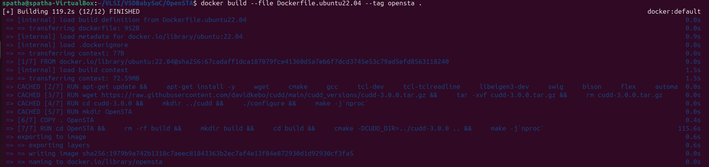

# VSD Hardware Design Program

## Day 7 : Timing Graphs using openSTA
OpenSTA(Open Static Timing Analyzer) is a gate level static timing verifier. As a stand-alone executable it can be used to verify the timing of a design using standard file formats.

* Verilog netlist
* Liberty library
* SDC timing constraints
* SDF delay annotation
* SPEF parasitics
* VCD power acitivies
* SAIF power acitivies

OpenSTA uses a TCL command interpreter to read the design, specify timing constraints and print timing reports.

##### Clocks
* Generated
* Latency
* Source latency (insertion delay)
* Uncertainty
* Propagated/Ideal
* Gated clock checks
* Multiple frequency clocks

##### Exception paths
* False path
* Multicycle path
* Min/Max path delay
* Exception points

   -from clock/pin/instance -through pin/net -to clock/pin/instance
*  Edge specific exception points

   -rise_from/-fall_from, -rise_through/-fall_through, -rise_to/-fall_to

##### Delay calculation
* Integrated Dartu/Menezes/Pileggi RC effective capacitance algorithm
* External delay calculator API

##### Analysis
* Report timing checks -from, -through, -to, multiple paths to endpoint
* Report delay calculation
* Check timing setup

## Installation of OpenSTA

#### Step 1: Clone the Repository

```bash
git clone https://github.com/parallaxsw/OpenSTA.git
cd OpenSTA
```


#### Step 2: Build the Docker Image
```bash
docker build --file Dockerfile.ubuntu22.04 --tag opensta .
```
This builds a Docker image named opensta using the provided Ubuntu 22.04 Dockerfile. All dependencies are installed during this step.



#### Step 3: Run the OpenSTA Container
To run a docker container using the OpenSTA image, use the -v option to docker to mount direcories with data to use and -i to run interactively.
```bash
docker run -i -v $HOME:/data opensta
```

