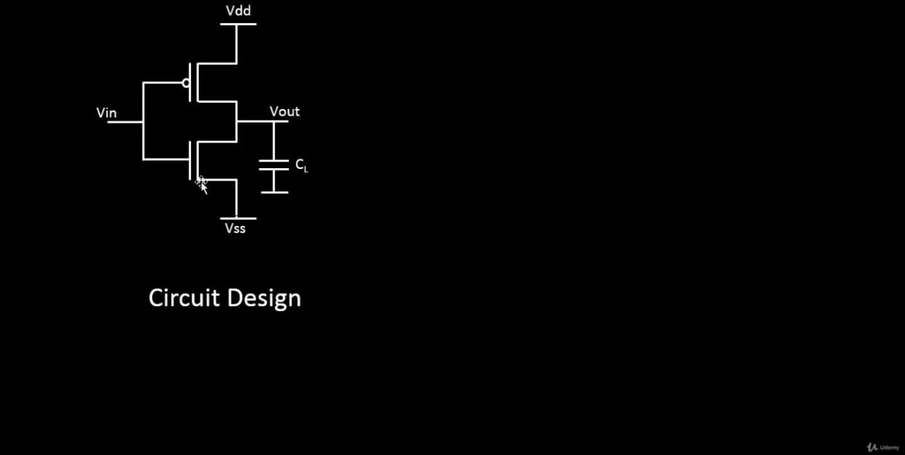
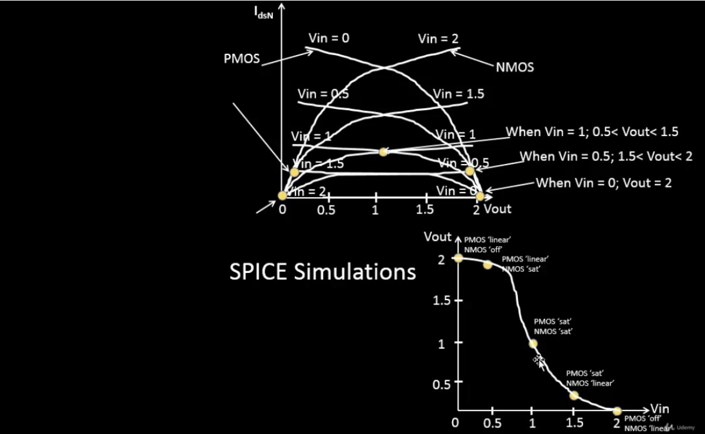
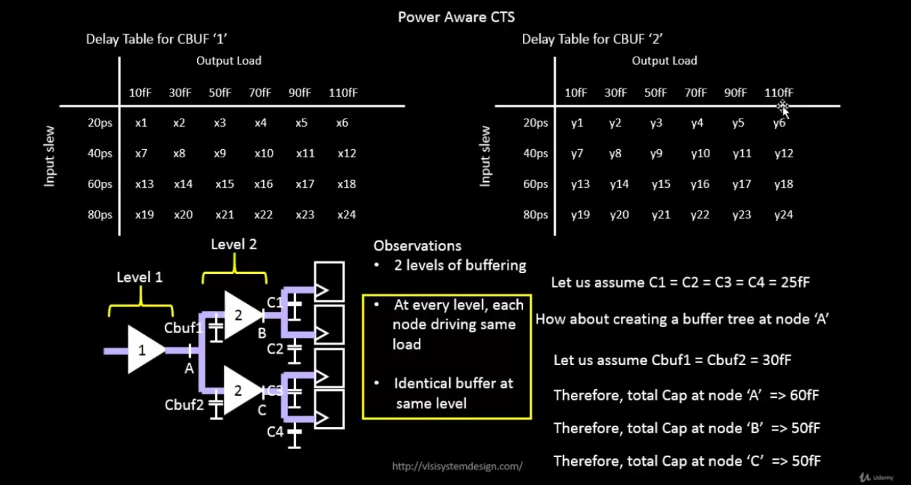

# VSD Hardware Design Program

## CMOS Circuit Design

### SPICE Simulations in Electronic Circuit Design

SPICE (Simulation Program with Integrated Circuit Emphasis) simulations are a vital tool in electronic circuit design. They allow us to test and verify circuits before building them, ensuring they function correctly and efficiently.

### Why Use SPICE Simulations?

1. **Verify Circuit Functionality:**
   - Ensure that circuits, like logic gates, perform as expected.

2. **Analyze Performance:**
   - Check speed and signal delays to confirm the circuit meets timing requirements.

3. **Evaluate Power Consumption:**
   - Assess how much power the circuit uses and optimize for energy efficiency.

4. **Optimize Design:**
   - Experiment with different configurations to improve circuit performance.

### Example: Inverter Circuit

An inverter is a simple circuit that reverses the input signal:

- **Setup:**
  - Uses two transistors: PMOS and NMOS.
  - PMOS connects to the power supply (VDD), NMOS connects to ground (GND).
  - Both transistors have their gates connected to the input and their drains connected to the output.

- **Operation:**
  - When the input is high, the NMOS transistor conducts, making the output low.
  - When the input is low, the PMOS transistor conducts, making the output high.

### Role of SPICE in Inverter Design

- **Functionality Check:**
  - Verify that the inverter correctly flips the input signal.

- **Timing Analysis:**
  - Measure how quickly the inverter responds to changes in the input.

- **Power Analysis:**
  - Determine the power usage of the inverter during operation.

SPICE simulations are essential for designing circuits that are reliable and efficient. They help identify issues early and allow for optimization before the physical circuit is built.

#### CMOS Inverter Circuit Diagram

This schematic shows a standard **CMOS inverter**:
- **Vin** is applied to both PMOS and NMOS gates.
- **Vout** is taken at the common drain node.
- **PMOS** connects from **VDD** to the output.
- **NMOS** connects from the output to **VSS (GND)**.
- **CL** represents the load capacitance, mimicking the next stage or parasitic load.

#### Operation Summary

| Vin       | PMOS State | NMOS State | Vout     |
|-----------|------------|------------|----------|
| Low (0 V) | ON         | OFF        | High (VDD) |
| High (VDD)| OFF        | ON         | Low (GND)  |

This forms the basis of digital NOT gates used in logic families.

#### SPICE Simulation Results

The `top graph` indicates the current-voltage `(I-V) characteristics` of a CMOS inverter. It shows the relationship between the drain-source current (Ids) and the output voltage (Vout) for various input voltages (Vin).

The `bottom graph` indicates the `voltage transfer characteristics (VTC)` of a CMOS inverter, showing how the output voltage (Vout) varies with the input voltage (Vin) to analyze the inverter's switching behavior and logic levels.

### Power-Aware CTS: Understanding Delay Tables & Buffer Insertion

In digital timing analysis, **cell delay** is not a fixed number—it depends on two main factors:
- **Input Slew (transition time of the input signal)**
- **Output Load (capacitive load at the output)**

The delay values are stored in **2D LUTs (Lookup Tables)** as shown below.

**Delay Table Structure:**

Each buffer cell (CBUF) has a delay table indexed by:
- Rows → Input Slew (e.g., 20ps, 40ps, 60ps, 80ps)
- Columns → Output Load (e.g., 10fF to 110fF)

Example tables shown:
- **CBUF1:** Delay values `x1–x24`
- **CBUF2:** Delay values `y1–y24`

This table helps STA tools interpolate the **actual delay** for a cell based on current slew and load.

**Total Capacitance Calculation:**

If a cell output pin drives multiple fanout cells, the total capacitance on the output pin of the cell is the sum of all the input capacitances of the cells that it is driving plus the sum of the capacitance of all the wire segments that comprise the net plus the output capacitance of the driving cell. Note that in a CMOS cell, the inputs to the cell present a capacitive load only.

| Node | What It Drives            | Capacitance Calculation | Total Cap |
| ---- | ------------------------- | ----------------------- | --------- |
| A    | 2 CBUF's                 | 30fF + 30fF             | 60fF      |
| B    | Load capacitors C1 and C2 | 25fF + 25fF             | 50fF      |
| C    | Load capacitors C3 and C4 | 25fF + 25fF             | 50fF      |
