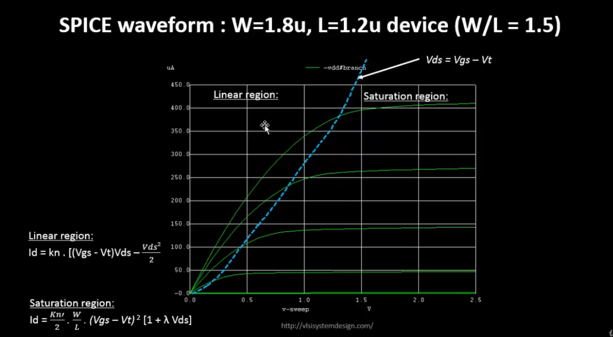
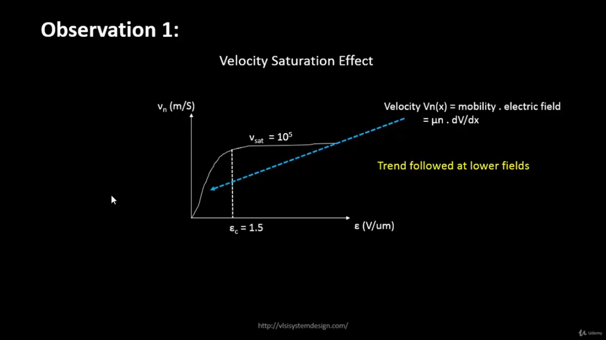
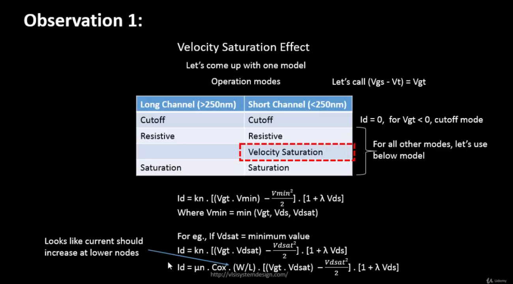
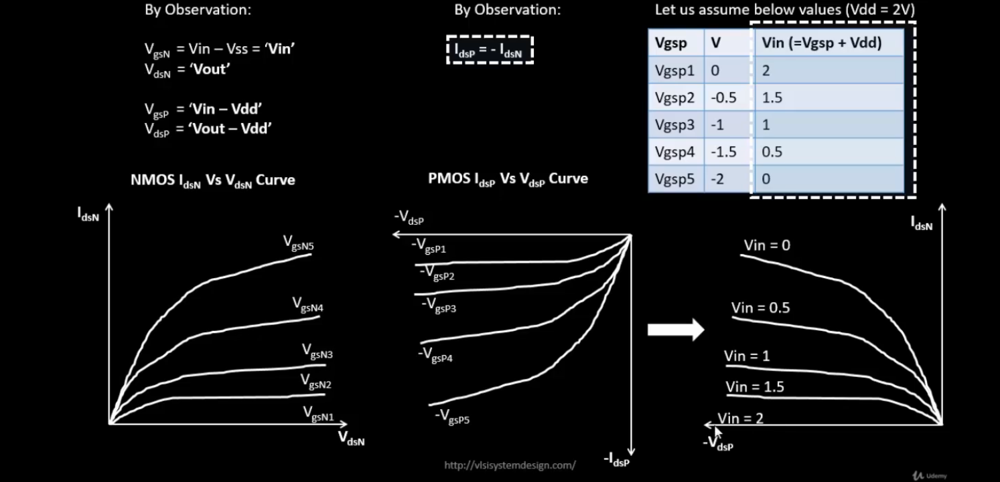
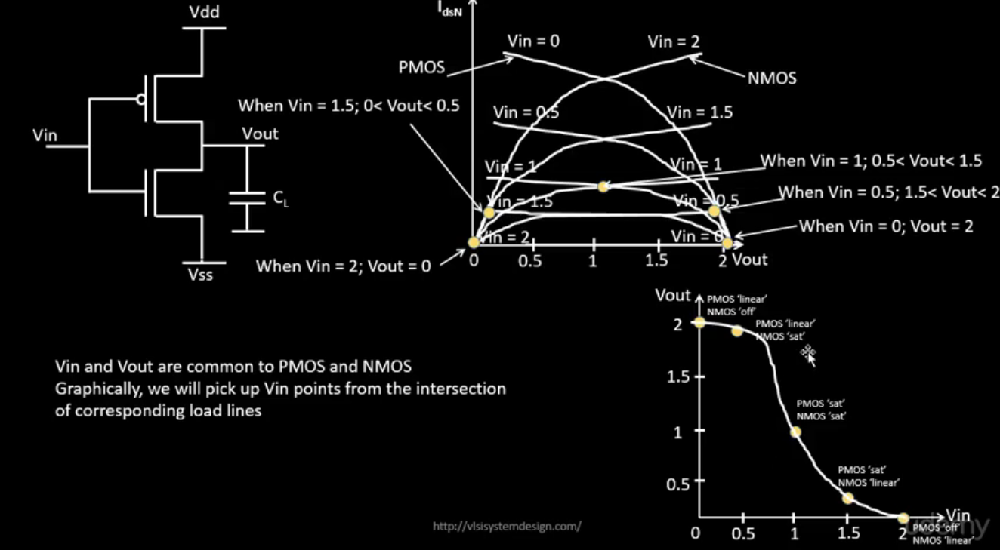

# VSD Hardware Design Program

## Velocity Saturation and basics of CMOS inverter VTC

### SPICE simulation for lower nodes

The plot below shows the output characteristics of an NMOS device with W=1.8μm, L=1.2μm (W/L = 1.5).



- **Linear Region:**  
  The drain current (Id) is a linear function of Vds in this region.  
  It is defined for Vds < (Vgs - Vt).

- **Saturation Region:**  
  The drain current (Id) depends on channel length modulation and Vds.  
  It is defined for Vds ≥ (Vgs - Vt).

**Explanation:**  
- The region **before** Vds = Vgs - Vt is the **Linear Region**, where Id varies linearly with Vds.  
- The region **after** Vds = Vgs - Vt is the **Saturation Region**, where Id is influenced by channel length modulation and Vds.

**Formulas:**  
**Linear region:**  
_Id = kn ⋅ [(Vgs - Vt)Vds - (Vds² / 2)]_

**Saturation region:**  
_Id = (kn / 2) ⋅ (W/L) ⋅ (Vgs - Vt)² ⋅ [1 + λVds]_

---

#### Observation 1: Long Channel vs. Short Channel NMOS Characteristics

The plot below compares NMOS output characteristics for long channel and short channel devices with **same W/L ratio**:


In this figure:

- **Left Plot**: W = 1.8μm, L = 1.2μm device → Long channel device
- **Right Plot**: W = 0.375μm, L = 0.25μm device → Short channel device  
  (Since channel length < 0.25μm, it is considered a short channel device)

- Both devices have the **same W/L ratio**, but different Width (W) and Length (L).
- **Id behavior:**
  - For the **long channel device**:  
    Id is a **quadratic function of Vgs**.
  - For the **short channel device**:  
    Id is **quadratic at low Vgs**, but becomes more **linear at high Vgs**.

To observe this behavior, we apply a constant Vds and sweep Vgs:

- In long channel devices, Id follows the ideal quadratic dependence on Vgs.
- In short channel devices:
  - At **low Vgs**, the device behaves similarly to long channel — quadratic Id-Vgs.
  - At **high Vgs**, the Id-Vgs curve becomes linear due to **velocity saturation**.
    - This velocity saturation occurs because the carrier velocity reaches a maximum limit at high electric fields in short channel devices.

Thus, this plot demonstrates how **velocity saturation** affects Id in short channel devices — transitioning the behavior from quadratic to linear at high Vgs.


For long-channel devices, drain current shows a quadratic dependence on gate voltage.

For short-channel devices, it is quadratic at low gate voltage but becomes linear at higher voltages due to velocity saturation.


At lower electric fields, carrier velocity increases linearly with the electric field.

At higher electric fields, velocity saturates and becomes constant due to velocity saturation.




- For **Long Channel (> 250 nm)** devices:
  - Modes: Cutoff → Resistive → Saturation

- For **Short Channel (< 250 nm)** devices:
  - Modes: Cutoff → Resistive → **Velocity Saturation** → Saturation
  - An additional mode appears due to **velocity saturation** effects in short channel devices.



#### Observation 2: Peak Current Comparison — Long Channel vs Short Channel Devices

The figure below compares the **peak drain current (Id)** between a long-channel and short-channel NMOS device:


- **Left Plot**: W = 1.8μm, L = 1.2μm → **Long-channel device**
  - Peak current = **410 μA**
  
- **Right Plot**: W = 0.375μm, L = 0.25μm → **Short-channel device**
  - Peak current = **210 μA**

- Even though **short-channel devices** allow for faster switching and smaller sizes, their **peak drain current (Id)** is lower than long-channel devices.
- The reduction in peak current is due to **velocity saturation** — which limits carrier velocity in short-channel devices.
- In long-channel devices, carriers accelerate freely, giving higher Id.

 ### Labs Sky130 Id-Vgs

 <details> <summary><strong>day2_nfet_idvds_L015_W039.spice </strong></summary>

```
  *Model Description
  .param temp=27

  *Including sky130 library files
  .lib "sky130_fd_pr/models/sky130.lib.spice" tt

  *Netlist Description
   XM1 Vdd n1 0 0 sky130_fd_pr__nfet_01v8 w=0.39 l=0.15
   R1 n1 in 55
   Vdd vdd 0 1.8V
   Vin in 0 1.8V

  *simulation commands
   .op
   .dc Vdd 0 1.8 0.1 Vin 0 1.8 0.2

   .control

   run
   display
   setplot dc1
   .endc
   .end
```
</details>

📈**plot the waveforms in ngspice**

```shell
ngspice day2_nfet_idvds_L015_W039.spice 
plot -vdd#branch
```

**The plot of Ids vs Vds over constant Vgs:**


 <details> <summary><strong>day2_nfet_idvgs_L015_W039.spice </strong></summary>

```
    *Model Description
   .param temp=27

   *Including sky130 library files
   .lib "sky130_fd_pr/models/sky130.lib.spice" tt

   *Netlist Description
    XM1 Vdd n1 0 0 sky130_fd_pr__nfet_01v8 w=0.39 l=0.15
    R1 n1 in 55
    Vdd vdd 0 1.8V
    Vin in 0 1.8V

    *simulation commands
     .op
    .dc Vin 0 1.8 0.1 

    .control

     run
     display
     setplot dc1
     .endc
     .end
```
</details>

📈**plot the waveforms in ngspice**

```shell
ngspice day2_nfet_idvgs_L015_W039.spice
plot -vdd#branch
```

**The plot of Ids vs Vgs over constant Vds:**


### CMOS voltage Transfer Characteristics

**MOSFET as a Switch:**

- **OFF State:**  
  The MOSFET behaves as an **open switch** (infinite OFF resistance) when:  
  _|Vgs| < |Vth|_

- **ON State:**  
  The MOSFET behaves as a **closed switch** (finite ON resistance) when:  
  _|Vgs| > |Vth|_


### CMOS Inverter — Transistor-Level and Switch-Level View

The figure below shows the **CMOS inverter** in both **transistor-level** and **switch-level** representations:


**Left Diagram:** CMOS Inverter — Transistor View  
- **PMOS** connected to Vdd  
- **NMOS** connected to Vss  
- **Vin** is applied to both gates  
- **Vout** is taken from the common drain node  
- CL = load capacitance

**Middle Diagram:** Switch model when **Vin = Vdd**  
- NMOS is ON → acts as Rn resistor  
- PMOS is OFF → open switch  
- Output Vout = 0

**Right Diagram:** Switch model when **Vin = 0**  
- PMOS is ON → acts as Rp resistor  
- NMOS is OFF → open switch  
- Output Vout = Vdd

> When **Vin = Vdd → Vout = 0** (NMOS ON, PMOS OFF)

> When **Vin = 0 → Vout = Vdd** (PMOS ON, NMOS OFF)

This basic **CMOS inverter** behavior is the foundation of all CMOS logic circuits — demonstrating **low static power** and **sharp transitions** in the voltage transfer characteristics.

#### Load Line Curves for NMOS and PMOS

**Step 1:**  
Convert the **PMOS gate-source voltage (Vgsp)** into an equivalent **Vin**.  

Replace all internal node voltages with **Vin**, **Vdd**, **Vss**, and **Vout**.  



**Step 2 & Step 3:**

Convert PMOS and NMOS drain-source voltages to **Vout**.


**Step 4:**  

Merge the NMOS and PMOS load curves by equating their Ids characteristics with respect to Vout.  

Plot the **Voltage Transfer Characteristic (VTC)** by sweeping Vin and mapping the corresponding Vout, showing the inverter switching behavior from logic HIGH to LOW.


