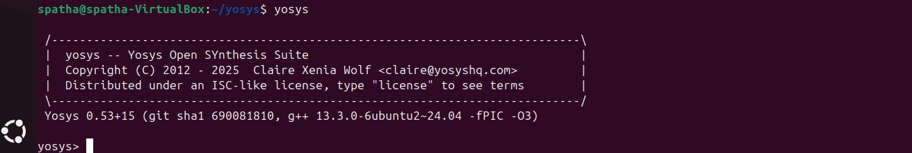
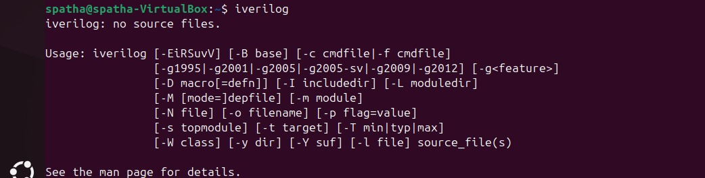
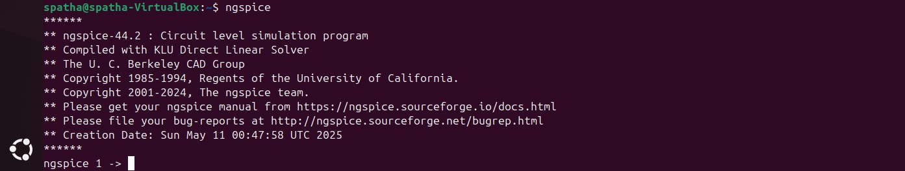
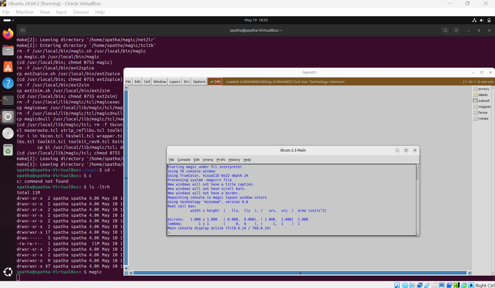
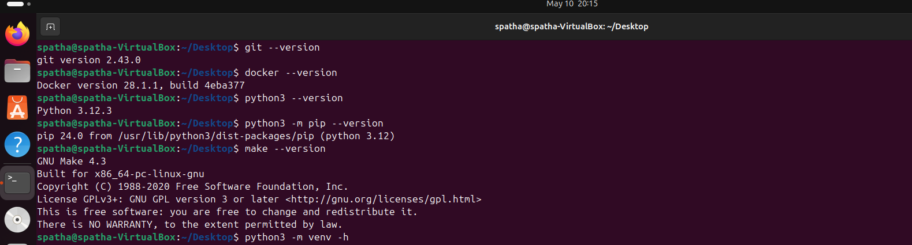

# VSD Hardware Design Program

## Week 0 - Day 0 : Tools Installation

All the instructions for installation of required tools can be found here:

### **System Requirements**
- 6 GB RAM
- 50 GB HDD
- Ubuntu 20.04 or higher
- 4 vCPU

### **Resizing the Ubuntu window to fit the screen**
```bash
$ sudo apt update
$ sudo apt install build-essential dkms linux-headers-$(uname -r)
$ cd /media/spatha/VBox_GAs_7.1.8/
$ ./autorun.sh
```

### **TOOL CHECK**

#### **Yosys**
```bash
$ sudo apt-get update
$ git clone https://github.com/YosysHQ/yosys.git
$ cd yosys
$ sudo apt install make               # If make is not installed
$ sudo apt-get install build-essential clang bison flex \
    libreadline-dev gawk tcl-dev libffi-dev git \
    graphviz xdot pkg-config python3 libboost-system-dev \
    libboost-python-dev libboost-filesystem-dev zlib1g-dev
$ make config-gcc
$ make 
$ sudo make install
```


#### **Iverilog**
```bash
$ sudo apt-get update
$ sudo apt-get install iverilog
```


#### **gtkwave**
```bash
$ sudo apt-get update
$ sudo apt install gtkwave
```


#### **ngspice**
```bash
$ tar -zxvf ngspice-37.tar.gz
$ cd ngspice-37
$ mkdir release
$ cd release
$ ../configure  --with-x --with-readline=yes --disable-debug
$ make
$ sudo make install
```


#### **magic**
```bash
$ sudo apt-get install m4
$ sudo apt-get install tcsh
$ sudo apt-get install csh
$ sudo apt-get install libx11-dev
$ sudo apt-get install tcl-dev tk-dev
$ sudo apt-get install libcairo2-dev
$ sudo apt-get install mesa-common-dev libglu1-mesa-dev
$ sudo apt-get install libncurses-dev
$ git clone https://github.com/RTimothyEdwards/magic
$ cd magic
$ ./configure
$ make
$ sudo make install
```


### **Tool Versions**
```bash
$ git --version
$ docker --version
$ python3 --version
$ python3 -m pip --version
$ make --version
```



 


